```mermaid
flowchart TD
    classDef phase fill:#dbeafe,stroke:#1e40af,stroke-width:1.5px,color:#1e3a8a
    classDef gate fill:#fef3c7,stroke:#a16207,stroke-width:1.5px,color:#713f12
    classDef milestone fill:#bbf7d0,stroke:#15803d,stroke-width:1.5px,color:#14532d
    classDef terminal fill:#fecaca,stroke:#b91c1c,stroke-width:1.5px,color:#7f1d1d
    classDef note fill:#f3f4f6,stroke:#6b7280,stroke-width:1px,color:#374151

    Start([Today · Wed 2026-05-20<br/>Day 1 of clean v8+VIX data]):::milestone

    Phase4[Phase 4 — Data Accumulation<br/>Mon-Fri × 6 weeks = 30 sessions<br/>· Auto-recorder captures ticks<br/>· Evening replay → features+targets<br/>· No training. v0 stays as reference only.]:::phase

    Day30{Day 30 reached<br/>Tue 2026-06-30}:::gate

    Retrain1[First Real Retrain<br/>Sat 2026-07-04 · 02:00 IST<br/>· 1,680 LightGBM fits<br/>· 128 isotonic calibration maps<br/>· CANDIDATE_HEADS staged]:::phase

    Review[Human Review<br/>Sun 2026-07-05<br/>· Trade-quality + drift + sim_pnl<br/>· Touch CANDIDATE_APPROVED]:::phase

    Promote{Pre-market check 08:50 IST<br/>Mon 2026-07-06<br/>7 green checks?}:::gate

    StayV0[Stay on v0<br/>Alert yow-partha<br/>Investigate before next Sat]:::terminal

    Phase7a[Phase 7a — Paper, Minimum Exits<br/>Mon 2026-07-06 09:15 IST onwards<br/>· Signals → ai-paper channel<br/>· Exits: TP / SL / trail / time / regime-flip<br/>· OI + exhaustion disabled]:::phase

    Gate7a{≥50 signals/inst AND<br/>WR within ±5pp of backtest?}:::gate

    Weekly([Weekly Saturday Retrain<br/>02:00 IST · always-on<br/>Trains on FULL accumulated history<br/>Each week grows by 5 sessions]):::milestone

    Phase7b[Phase 7b — OI Exits Enabled<br/>~Mon 2026-07-20<br/>· Adds 5-min + 60-min OI exit triggers]:::phase

    Gate7b{A/B vs 7a<br/>OI adds ≥3pp WR<br/>OR ≥15% DD reduction?}:::gate

    Drop7b[Leave OI exits<br/>permanently disabled<br/>in production config]:::terminal

    Phase7c[Phase 7c — Exhaustion Exits Enabled<br/>~Mon 2026-08-03<br/>· trend-tiring + premium-decel + volume-absorption]:::phase

    Gate7c{A/B vs 7b<br/>same ≥3pp / ≥15% gate?}:::gate

    Drop7c[Leave exhaustion<br/>exits disabled in<br/>production config]:::terminal

    Phase8[Phase 8 — AI-Live<br/>~Mid-to-late Aug 2026 onwards<br/>· Small capital first per §8.2<br/>· §8.3 scaling when paper vs live ≤5pp diverge]:::milestone

    Start --> Phase4
    Phase4 --> Day30
    Day30 --> Retrain1
    Retrain1 --> Review
    Review --> Promote
    Promote -->|RED| StayV0
    Promote -->|GREEN| Phase7a

    Phase7a --> Gate7a
    Phase7a -. feedback every Sat .-> Weekly
    Weekly -. improves .-> Phase7a

    Gate7a -->|PASS| Phase7b
    Phase7b --> Gate7b
    Gate7b -->|FAIL| Drop7b
    Gate7b -->|PASS| Phase7c
    Phase7c --> Gate7c
    Gate7c -->|FAIL| Drop7c
    Gate7c -->|PASS| Phase8
    Drop7b -.-> Phase7c
    Drop7c -.-> Phase8

    Weekly -. same loop .-> Phase7b
    Weekly -. same loop .-> Phase7c
    Weekly -. same loop .-> Phase8
```

# T3 — Training & Paper-Trade Timeline

End-to-end visual of the path from today (Day 1 of clean v8+VIX data) through Phase 8 AI-Live. Mermaid renders inline on GitHub, VS Code (Mermaid Preview extension), Obsidian, and most modern markdown viewers.

For the rules behind this timeline, see V2_MASTER_SPEC §9 D76, §6.1 (Saturday retrain cadence), and §8 (Phase 7 sub-phases + Phase 8 ramp).

---

---

## Quick reference

| Phase | Start (approx) | What's new | Exit gate to next phase |
|---|---|---|---|
| 4 — Accumulation | Wed 2026-05-20 | Recording + nightly replay only | 30 v8 sessions per instrument |
| First real retrain | Sat 2026-07-04 | LightGBM + calibration on 30 sessions | Sunday human review + Monday pre-market |
| 7a — Paper, min exits | Mon 2026-07-06 | TP/SL/trail/time/regime only | ≥50 signals/inst, WR ±5pp of backtest |
| 7b — Add OI exits | ~Mon 2026-07-20 | OI 5-min + 60-min triggers | A/B: ≥3pp WR or ≥15% DD lift |
| 7c — Add exhaustion | ~Mon 2026-08-03 | trend-tiring + premium-decel + volume-absorption | Same A/B gate vs 7b |
| 8 — AI-Live | ~Mid-to-late Aug 2026 | Small live capital, then scaled | Paper vs live within ±5pp |

## Key rule callouts

- **Feedback loop is the weekly Saturday retrain.** Each retrain uses the FULL accumulated dataset; no separate per-trade online learning is in scope today.
- **30-session gate is one-time only.** Once crossed, every Saturday cron fires unconditionally — the gate doesn't re-arm.
- **Phase 7 sub-phase gates are bidirectional**: if 7b or 7c A/B test fails, that exit class stays permanently disabled in production config — but training, sim_pnl, and 7c gating still run.
- **Holidays bump dates.** Each NSE/MCX holiday between today and day 30 pushes the milestone one trading day later. `config/market_holidays.json` is the source of truth; the dates above assume no holidays in the window.

## How to use this doc

- Cross-link from PROJECT_TODO T3 Phase 4 / 5 / 6 / 7 entries when describing what comes next.
- Update the date estimates above as actual holidays shift them.
- When phase 7b or 7c A/B compare runs, archive the comparison report into `docs/reports/exit_trigger_ab__<date>.md` per D73 and link it here.
- Replace estimated dates with actuals as each milestone hits (e.g., "Sat 2026-07-04" becomes "Sat 2026-07-04 ✓ promoted to LATEST_HEADS").
