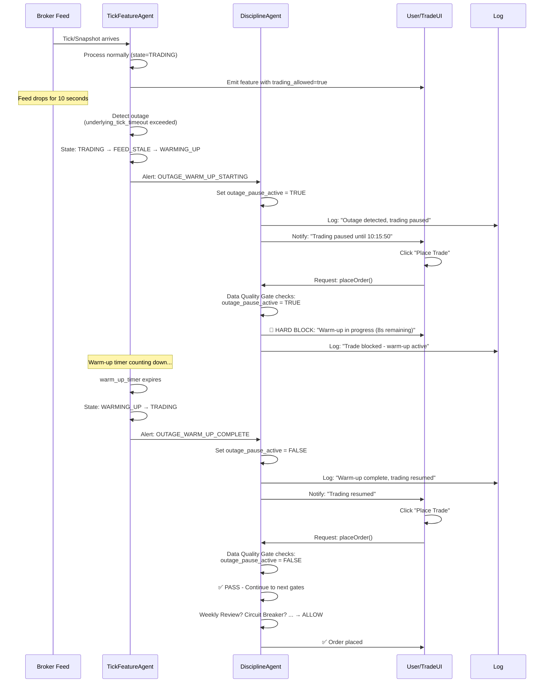

# TickFeatureAgent (TFA)
## Specification Document — Tick + Option Chain Feature Engineering System
**Version: 1.7** *(originally 1.0 — see changelog below)*

---

## Changelog

| Version | Summary |
|---------|---------|
| 1.0 | Initial specification |
| 1.1 | Output schema: `atm_window_strikes` typed (JSON array of 7 integers); `active_strikes` formal schema table added; column count corrected from 180 → 320 |
| 1.2 | State machine: dual-feed recovery rule (both feeds must be healthy for WARMING_UP); 14:30 boundary second-level floor; chain stale behavior (no pause, CHAIN_STALE once on transition); duplicate tick policy; rollover grace window (wall-clock timer); pre/post session tick handling |
| 1.3 | Configuration: Instrument Profile JSON schema (20 required fields); regime thresholds moved to config; target_windows_sec added; vol_session_median and historical_median_momentum 100-tick freeze rules; volume_drought_atm running session mean; DA handshake fire-and-forget protocol; ML consumer NDJSON+socket contract; clock skew ±2s tolerance |
| 1.4 | Null/zero guards: rolling_std=0, range_percent_20ticks median≤0, dead_market_score momentum term, bid_size null/zero, risk_reward_ratio null, premium_divergence null, zone pressure null rule; breakout_readiness 0.0 during warm-up; stagnation_duration_sec saturation/reset; median_velocity running median; tick_available=0 lifecycle; alert catalog: CLOCK_SKEW_DETECTED, CORRUPT_CHAIN_DATA, CONSUMER_OVERFLOW; operator escalation criteria |
| 1.5 | Column table expanded 320 → 322 (added `upside_percentile_30s` col 308, `avg_decay_per_strike_30s` col 309); `ltp_prev` defined as option tick buffer[-2]; `call_put_strength_diff` normalization formula explicit (divide by active_strike_count); `momentum_persistence_ticks` sign rule and first-tick edge case; `direction_30s_magnitude` zero-spot guard; `total_premium_decay_atm` ltp_prev source clarified (tick buffer, not snapshot); PERFORMANCE_DEGRADED latency defined as wall-clock; startup checklist expanded to all 20 profile fields |
| 1.7 | Column table expanded 336 → 369 (+33 new columns): OFI (trade direction + ofi_5/20/50), Realized Volatility (vol_5/20), Micro Aggregation (10-tick and 50-tick underlying aggregates, premium_momentum_10 per ATM ±3 strike × CE/PE), Multi-Horizon ratios (momentum/vol/ofi horizon comparison). Underlying buffer extended 20 → 50 ticks; option buffer extended 5 → 10 ticks. New sections 8.18–8.21 added. Warm-up table extended with 10-tick and 50-tick gates. Section 12 Future Development updated: OFI, Realized Vol, Multi-Horizon, and Micro Aggregation items removed (now implemented as §8.18–8.21); Regime Detection item removed (already existed as §8.10); Level 2 Depth remains the sole pending future item (§12.1). |
| 1.8 | Column table expanded 369 → 370 (+1): added `underlying_realized_vol_50` (col 20) for symmetry with realized_vol_5 and realized_vol_20. Underlying Extended group grows from 19 → 20 columns. All per-column indices from 20 onward incremented by 1. §8.19, §8.15 computation order, §8.16 null rules, and §9 JSON example updated. Stale "5-tick buffer" terminology fixed throughout spec; §8.17/§8.17.1 reordered to correct section sequence (now before §8.18). §9.2 ML Model Input Layer added: 7-step pipeline from 370-column TFA output to ~80–120 model features — row filtering, category drops, redundancy reduction, strike tier selection, active strike handling, variance pruning, importance pruning. Feature config file schema defined. |
| 1.9 | Added §15 Raw Data Recording, §16 Replay Mode, §17 Feature Quality Validation. TFA now records all input data (underlying ticks, option ticks, chain snapshots) to disk alongside live feature computation. Recorded data is replayable through TFA for model retraining and retesting without live market access. DataRecorder_Spec_v1.0.md infused into TFA spec — DataRecorder as a separate module is superseded. |
| 1.6 | Column table expanded 322 → 336: added 5 missing per-window target columns (`risk_reward_ratio_30s/60s`, `avg_decay_per_strike_60s`, `direction_60s`, `direction_60s_magnitude`) and 9 compression/time-to-move signals renumbered; `breakout_readiness_extended` algorithm defined; `stale_reason="BOTH"` upgrade logic added to state machine pseudocode; `trading_allowed` and `stale_reason` explicit initialization added to pseudocode; Instrument Profile startup validation edge cases (empty/duplicate `target_windows_sec`, `session_start==session_end`, missing contract); `CORRUPT_CHAIN_DATA` extended to cover zero-strike and <7-strike snapshots; option tick timeout clarified as data-quality only (not `trading_state` transition); `spread_tightening_atm` `chain_available` semantics clarified as session-level; `vol_session_median` independence from chain confirmed; ATM shift per-strike buffer retention explicit; `active_strikes` tiebreaker scope per-set before union; `strike_step` computed once on first snapshot |

---

## 0. Pre-Requisite Data

### 0.1 Real-Time Feed Data *(must be live before system starts)*

| Feed | Fields Required | Frequency | Source |
|------|----------------|-----------|--------|
| NIFTY Futures tick | `timestamp`, `ltp`, `bid`, `ask`, `volume` | Per trade event | Broker WebSocket |
| Option tick (full current expiry chain) | `timestamp`, `strike`, `option_type`, `ltp`, `bid`, `ask`, `bid_size`, `ask_size`, `volume` | Per trade event | Broker WebSocket |
| Option chain snapshot | `chain_timestamp` + per-strike: `strike`, `call_oi`, `put_oi`, `call_volume`, `put_volume`, `call_delta_oi`, `put_delta_oi` | Every 5 seconds | NSE / Broker REST API |

### 0.2 Reference / Static Data *(loaded once at startup)*

| Data | Used For |
|------|----------|
| NSE market holidays calendar | `is_market_open` flag |
| Market session hours (from Instrument Profile `session_start` / `session_end`) | `is_market_open` flag |

### 0.3 Runtime State *(maintained in-memory during session)*

| State | Size | Used For |
|-------|------|----------|
| Underlying tick history buffer | Last 50 ticks (price + timestamp) — serves all windows (5 / 10 / 20 / 50 ticks) | `return_5ticks`, `return_10ticks`, `return_20ticks`, `return_50ticks`, `momentum`, `velocity`, tick count features, OFI, realized vol, horizon ratios |
| Option tick history buffer (per strike) | Last 10 ticks per strike × CE/PE — maintained for **all subscribed chain strikes** — serves 5-tick and 10-tick windows | `premium_momentum` (last 5) and `premium_momentum_10` (all 10) per strike — buffers grow from session open, no resets |
| Current option chain snapshot | Full chain (all strikes) | PCR, OI features, active strike selection, strength normalization |
| Previous option chain snapshot | Full chain (all strikes) — **single snapshot, not a rolling window** | `call_vol_diff`, `put_vol_diff` computation. Stores exactly 1 previous snapshot (`vol_prev`). On each new snapshot arrival: compute vol_diff using `current - prev`, then replace `prev` with `current`. No history beyond 1 snapshot is retained. |
| Current ATM state | `atm_strike`, `atm_window_strikes`, `strike_step` | Feature window calculation only — does not drive subscriptions |
| Full chain subscription set | All strikes × CE+PE for current expiry | Subscribed once at startup; updated on expiry rollover or mid-session new strike detection |
| Buffer retention | All subscribed chain strikes | Buffers never cleared mid-session — accumulate from session open until expiry rollover |
| `chain_available` flag | Boolean | Quality flag — `false` until first snapshot received |
| `vol_diff_available` flag | Boolean | Quality flag — `false` until second snapshot received |

### 0.4 Infrastructure Prerequisites

| Requirement | Detail |
|-------------|--------|
| Broker API credentials | API key + access token for WebSocket and REST |
| WebSocket connection | Real-time tick subscriptions (underlying + options) — **direct to Dhan**, one connection per TFA process |
| REST / HTTP connection | Option chain polling every 5 seconds |
| Timezone | IST (UTC+5:30) — all timestamps and session logic |
| Clock synchronization | System clock must be accurate for `chain_timestamp <= tick_time` |

**Process model: one TFA process per instrument.**

Four isolated processes run in parallel — one for each of nifty50, banknifty, crudeoil, naturalgas. Each process:
- Opens its own direct Dhan WebSocket connection (`wss://api-feed.dhan.co`)
- Subscribes only to its own instrument's security IDs (~500 per instrument)
- Manages its own session gate, buffers, recording files, and feature output independently
- Crashes or restarts without affecting the other three instruments

**Dhan connection budget:**

| Process | Connections |
|---------|------------|
| BSA (web UI via `/ws/ticks`) | 1 |
| TFA — nifty50 | 1 |
| TFA — banknifty | 1 |
| TFA — crudeoil | 1 |
| TFA — naturalgas | 1 |
| **Total** | **5 (Dhan limit: 5)** |

**Connection safety rules:**
- Stagger TFA process starts by 5 seconds each (nifty50 → banknifty → crudeoil → naturalgas) to avoid simultaneous connection bursts
- On disconnect code 805 ("Too many connections"): log ERROR, wait 30s before reconnect attempt (give other connections time to stabilise)
- BSA is always started before TFA processes

### 0.4.1 Session Architecture

TFA operates as a **long-running stateful daemon** that resets all in-memory state at each `session_start` (IST time from Instrument Profile). The same process instance handles multiple trading sessions (days) via state reset — not process restart.

**`session_start` is implicit — not an external event.** TFA compares the current wall-clock time (IST) against the `session_start` field from the Instrument Profile (e.g., `"09:15"`) on every tick. No external signal or broker message is required. When the clock enters the session window (i.e., `current_time_ist >= session_start_time`), TFA performs the state reset below. The transition is edge-triggered: it fires exactly once per calendar day at the configured time. Pre-session ticks (arriving while `is_market_open = 0`) do not advance the session.

**At each `session_start` (e.g., 09:15 IST daily):**
- Underlying 50-tick buffer → cleared (empty)
- All option strike 10-tick buffers → cleared (empty)
- Running medians (`vol_session_median`, `historical_median_momentum`) → reset to bootstrapping state
- Session distribution for `upside_percentile_30s` → cleared (empty)
- `trading_state` → reset to `TRADING` (or `FEED_STALE` if feeds not yet connected)
- All accumulated feature state (stagnation timer, streak counters, velocity history) → reset

**Pre-session ticks** (arriving before `session_start`) are emitted with `is_market_open = 0` but do **not** pre-populate session buffers. Session-scoped medians and distributions start accumulating only from `session_start` onward. No state carries over from the previous session.

### 0.5 Startup Validation Checklist

Before the first tick is processed:

- [ ] Broker API connected and authenticated
- [ ] Instrument profile JSON loaded and **all 20 required fields validated**: `exchange`, `instrument_name`, `underlying_symbol`, `underlying_security_id`, `session_start`, `session_end`, `underlying_tick_timeout_sec`, `option_tick_timeout_sec`, `momentum_staleness_threshold_sec`, `warm_up_duration_sec`, all 9 `regime_*` threshold fields, `target_windows_sec` (array, each value in [5, 300], max 4 elements)
- [ ] Current near-month futures contract symbol resolved and confirmed active
- [ ] Option chain endpoint accessible and returning all required fields
- [ ] `bid_size` / `ask_size` confirmed available in option tick feed
- [ ] `call_delta_oi` / `put_delta_oi` confirmed in chain snapshot response
- [ ] Underlying tick feed confirmed to include `bid` and `ask` fields — required for OFI trade direction classification (§8.18)
- [ ] Option tick feed confirmed to include `volume` field per tick — required for OFI rolling window computation (§8.18)
- [ ] Full current expiry chain fetched — all strikes × CE+PE subscribed on WebSocket
- [ ] Strike count confirmed (log: `subscribed N instruments for expiry YYYY-MM-DD`)
- [ ] System clock timezone set to IST (UTC+5:30)

---

## 0.6 Instrument Profile

Loaded once at startup. Parametrizes all exchange-specific and instrument-specific values.

**Source:** The Instrument Profile is loaded from a **JSON file on disk**, path specified via the `--instrument-profile` CLI argument (or `INSTRUMENT_PROFILE_PATH` environment variable). The file must exist before TFA starts — TFA will halt with a `FATAL` error if the file is missing or unparseable.

**Schema (JSON file format — NIFTY example, all fields required):**
```json
{
  "exchange": "NSE",
  "instrument_name": "NIFTY",
  "underlying_symbol": "NIFTY25MAYFUT",
  "underlying_security_id": "13",
  "session_start": "09:15",
  "session_end": "15:30",
  "underlying_tick_timeout_sec": 5,
  "option_tick_timeout_sec": 30,
  "momentum_staleness_threshold_sec": 60,
  "warm_up_duration_sec": 15,
  "regime_trend_volatility_min": 0.6,
  "regime_trend_imbalance_min": 0.4,
  "regime_trend_momentum_min": 0.5,
  "regime_trend_activity_min": 0.3,
  "regime_range_volatility_max": 0.5,
  "regime_range_imbalance_max": 0.3,
  "regime_range_activity_min": 0.3,
  "regime_dead_activity_max": 0.15,
  "regime_dead_vol_drought_max": 0.02,
  "target_windows_sec": [30, 60]
}
```

**All four instrument profiles (one file per instrument):**

```json
// nifty50_profile.json
{
  "exchange": "NSE", "instrument_name": "NIFTY",
  "underlying_symbol": "NIFTY25MAYFUT", "underlying_security_id": "13",
  "session_start": "09:15", "session_end": "15:30",
  "underlying_tick_timeout_sec": 5, "option_tick_timeout_sec": 30,
  "momentum_staleness_threshold_sec": 60, "warm_up_duration_sec": 15,
  "regime_trend_volatility_min": 0.6, "regime_trend_imbalance_min": 0.4,
  "regime_trend_momentum_min": 0.5, "regime_trend_activity_min": 0.3,
  "regime_range_volatility_max": 0.5, "regime_range_imbalance_max": 0.3,
  "regime_range_activity_min": 0.3, "regime_dead_activity_max": 0.15,
  "regime_dead_vol_drought_max": 0.02, "target_windows_sec": [30, 60]
}

// banknifty_profile.json
{
  "exchange": "NSE", "instrument_name": "BANKNIFTY",
  "underlying_symbol": "BANKNIFTY25MAYFUT", "underlying_security_id": "25",
  "session_start": "09:15", "session_end": "15:30",
  "underlying_tick_timeout_sec": 5, "option_tick_timeout_sec": 30,
  "momentum_staleness_threshold_sec": 60, "warm_up_duration_sec": 15,
  "regime_trend_volatility_min": 0.6, "regime_trend_imbalance_min": 0.4,
  "regime_trend_momentum_min": 0.5, "regime_trend_activity_min": 0.3,
  "regime_range_volatility_max": 0.5, "regime_range_imbalance_max": 0.3,
  "regime_range_activity_min": 0.3, "regime_dead_activity_max": 0.15,
  "regime_dead_vol_drought_max": 0.02, "target_windows_sec": [30, 60]
}

// crudeoil_profile.json
{
  "exchange": "MCX", "instrument_name": "CRUDEOIL",
  "underlying_symbol": "CRUDEOIL25MAYFUT", "underlying_security_id": "486502",
  "session_start": "09:00", "session_end": "23:30",
  "underlying_tick_timeout_sec": 30, "option_tick_timeout_sec": 120,
  "momentum_staleness_threshold_sec": 120, "warm_up_duration_sec": 20,
  "regime_trend_volatility_min": 0.6, "regime_trend_imbalance_min": 0.4,
  "regime_trend_momentum_min": 0.5, "regime_trend_activity_min": 0.3,
  "regime_range_volatility_max": 0.5, "regime_range_imbalance_max": 0.3,
  "regime_range_activity_min": 0.3, "regime_dead_activity_max": 0.15,
  "regime_dead_vol_drought_max": 0.02, "target_windows_sec": [30, 60]
}

// naturalgas_profile.json
{
  "exchange": "MCX", "instrument_name": "NATURALGAS",
  "underlying_symbol": "NATURALGAS25MAYFUT", "underlying_security_id": "487465",
  "session_start": "09:00", "session_end": "23:30",
  "underlying_tick_timeout_sec": 30, "option_tick_timeout_sec": 120,
  "momentum_staleness_threshold_sec": 120, "warm_up_duration_sec": 30,
  "regime_trend_volatility_min": 0.6, "regime_trend_imbalance_min": 0.4,
  "regime_trend_momentum_min": 0.5, "regime_trend_activity_min": 0.3,
  "regime_range_volatility_max": 0.5, "regime_range_imbalance_max": 0.3,
  "regime_range_activity_min": 0.3, "regime_dead_activity_max": 0.15,
  "regime_dead_vol_drought_max": 0.02, "target_windows_sec": [30, 60]
}
```

Profile files live at `{project_root}/config/instrument_profiles/`. One file per instrument. Updated when the futures contract rolls over (monthly for NSE, varies for MCX).

All fields are **required**. Unknown fields are ignored. Validation errors (missing field, wrong type, invalid time format) cause startup halt with descriptive error message. The file is not re-read during the session — restart required for any changes.

| Parameter | Type | Description | Example (NIFTY) | Example (CRUDEOIL) | Example (NATURALGAS) |
|-----------|------|-------------|-----------------|---------------------|----------------------|
| `exchange` | string | Exchange name | `NSE` | `NSE` | `MCX` | `MCX` |
| `instrument_name` | string | Instrument identifier | `NIFTY` | `BANKNIFTY` | `CRUDEOIL` | `NATURALGAS` |
| `underlying_symbol` | string | Active futures contract symbol | `NIFTY25MAYFUT` | `BANKNIFTY25MAYFUT` | `CRUDEOIL25MAYFUT` | `NATURALGAS25MAYFUT` |
| `underlying_security_id` | string | Broker-assigned security ID for underlying | `13` | `25` | `486502` | `487465` |
| `session_start` | string | Market open time (IST, HH:MM) | `09:15` | `09:15` | `09:00` | `09:00` |
| `session_end` | string | Market close time (IST, HH:MM) | `15:30` | `15:30` | `23:30` | `23:30` |
| `underlying_tick_timeout_sec` | int | Max gap in underlying ticks before quality flag fires | `5` | `30` | `30` |
| `option_tick_timeout_sec` | int | **Per-strike timeout:** if ANY one of the 14 ATM ±3 (7 strikes × CE+PE) instruments has not received a tick within this many seconds of current wall-clock time, set `data_quality_flag = 0` and emit `WARN` log. Deep OTM strikes outside ATM ±3 window are not monitored. | `30` | `120` | `120` |
| `momentum_staleness_threshold_sec` | int | Max time span of 5-tick buffer for valid `premium_momentum` | `60` | `120` | `120` |
| `warm_up_duration_sec` | int | Duration (seconds) to wait after feed recovery before resuming trades — allows buffers to refill | `15` | `20` | `30` |
| `regime_trend_volatility_min` | float | TREND: min S_volatility signal | `0.6` | `0.6` | `0.6` |
| `regime_trend_imbalance_min` | float | TREND: min S_imbalance signal | `0.4` | `0.4` | `0.4` |
| `regime_trend_momentum_min` | float | TREND: min S_momentum signal | `0.5` | `0.5` | `0.5` |
| `regime_trend_activity_min` | float | TREND: min S_activity signal | `0.3` | `0.3` | `0.3` |
| `regime_range_volatility_max` | float | RANGE: max S_volatility signal | `0.5` | `0.5` | `0.5` |
| `regime_range_imbalance_max` | float | RANGE: max S_imbalance signal | `0.3` | `0.3` | `0.3` |
| `regime_range_activity_min` | float | RANGE: min S_activity signal | `0.3` | `0.3` | `0.3` |
| `regime_dead_activity_max` | float | DEAD: max S_activity signal | `0.15` | `0.15` | `0.15` |
| `regime_dead_vol_drought_max` | float | DEAD: max vol_drought_atm threshold | `0.02` | `0.02` | `0.02` |
| `target_windows_sec` | int[] | Lookahead windows (seconds) for target variable generation | `[30, 60]` | `[30, 60]` | `[30, 60]` |

> **Profile is read-only at runtime.** Changes take effect on next session startup. If a mismatch is detected mid-session (symbol, security ID, or session hours), TFA emits an `INSTRUMENT_PROFILE_MISMATCH` alert (WARN) and sets `data_quality_flag = 0`.

**Startup validation rules (FATAL halt if violated):**
- `session_end` must be strictly after `session_start` (same calendar day, IST). If `session_start == session_end` or `session_end < session_start`, TFA halts: `FATAL: session_end must be after session_start`.
- `target_windows_sec` must be a non-empty array with at least 1 element. An empty array `[]` is rejected: `FATAL: target_windows_sec must contain at least one window`. Maximum 4 elements; each value in [5, 300] seconds.
- All values in `target_windows_sec` must be unique. Duplicate values (e.g., `[30, 30]`) are rejected: `FATAL: target_windows_sec contains duplicate window values`.
- The underlying futures contract specified by `underlying_symbol` must be resolvable and active in the broker feed at startup. If not found: `FATAL: UNDERLYING_CONTRACT_NOT_FOUND — symbol {underlying_symbol} not available in broker feed`.
- All 9 `regime_*` threshold fields must be internally consistent: `regime_trend_volatility_min > regime_range_volatility_max` and `regime_trend_imbalance_min > regime_range_imbalance_max` (TREND thresholds must exceed RANGE thresholds). If violated, TFA halts with a descriptive FATAL error.

---

## 1. Purpose

Build a real-time data processing system that:

- Combines tick data and option chain data
- Extracts price, order flow, and positioning signals
- Generates structured feature output per tick

**Objective:** Create a high-quality feature dataset for:
- Short-term trading analysis
- Machine learning model input

**Target instruments:** NIFTY 50 options (NSE), BankNifty options (NSE), Crude Oil options (MCX), Natural Gas options (MCX)

---

## 2. Design Principles

| Use | Avoid |
|-----|-------|
| Real market price data | Greeks |
| Order flow (bid/ask, volume) | Implied volatility models |
| OI / volume data | |

---

## 3. Scope

**Included:**
- Data ingestion
- Data synchronization
- ATM detection
- Active strike detection
- Feature engineering
- JSON output generation

**Excluded:**
- Model training
- Trade execution
- Risk management

---

## 4. Data Requirements

### 4.1 Underlying Tick Data (near-month futures contract)

> **Note:** The underlying feed is the near-month futures contract for the configured instrument (from `underlying_symbol` in the Instrument Profile), not the spot index. Futures LTP is used as the spot price proxy for ATM calculation.
>
> **Rollover:** Managed externally by the feed/subscription layer. The feature engine always processes whichever futures symbol is currently active. TFA validates each incoming underlying tick's `security_id` against `underlying_security_id` in the Instrument Profile. On mismatch, TFA emits an `UNDERLYING_SYMBOL_MISMATCH` alert (WARN) and sets `data_quality_flag = 0` for that tick. Stale-symbol filtering is the feed layer's responsibility.

| Field | Description |
|-------|-------------|
| `timestamp` | Event time |
| `ltp` | Last traded price (used as spot price proxy) |
| `bid` | Best bid price |
| `ask` | Best ask price |
| `volume` | Per-tick traded quantity (quantity of this specific trade event) |

### 4.2 Option Tick Data (full current expiry chain)

> **Subscription strategy:** Subscribe all strikes × CE+PE for the current expiry at startup. This eliminates subscription churn on ATM shifts, ensures all buffers are warm regardless of spot movement, and provides tick data for active strikes anywhere in the chain.
>
> **Feature window:** Only ATM ±3 strikes (7 strikes) are included in option tick feature output. All other subscribed strikes maintain live 10-tick buffers but do not appear in ATM tick feature columns.
>
> **Active strikes:** Any active strike identified from the chain snapshot has its tick buffer already warm — no warm-up delay regardless of strike position.
>
> **Mid-session new strikes:** If the exchange adds new strikes during the session (detected via chain snapshot diff): (1) subscribe new strikes × CE+PE, (2) initialise empty tick buffers, (3) emit `NEW_STRIKES_DETECTED` alert.
>
> **Tick Atomicity & No Aggregation:** TFA treats each WebSocket tick event as a distinct, atomic unit. Each tick produces exactly **one feature row** in the output. No tick merging, batching, or aggregation occurs — even if the broker sends multiple ticks with the same timestamp.
>>
>> **Volume (`volume` field):** Reflects the quantity of this specific trade event as reported by broker. If broker sends 3 ticks at the same millisecond with volumes [5, 3, 7], TFA emits 3 rows with volumes [5, 3, 7] — no summing.
>>
>> **Burst handling:** During high-frequency bursts (e.g., 100+ ticks/sec), TFA emits one row per tick. This preserves market microstructure (burst patterns, volume distribution) for model training. Consumers can downsample post-hoc if needed (e.g., take every Nth row).
>
> **Expiry rollover:** Unsubscribe all current expiry strikes, subscribe all next expiry strikes, clear all option tick buffers. Emit `EXPIRY_ROLLOVER` alert.

| Field | Description |
|-------|-------------|
| `timestamp` | Event time |
| `strike` | Strike price |
| `option_type` | `CE` or `PE` |
| `ltp` | Last traded price |
| `bid` | Best bid price |
| `ask` | Best ask price |
| `bid_size` | Quantity available at best bid |
| `ask_size` | Quantity available at best ask |
| `volume` | Per-tick traded quantity (quantity of this specific trade event) |

**`bid_size` / `ask_size` validation:**

| Incoming value | Treatment |
|----------------|-----------|
| Positive integer | Normal — used in `bid_ask_imbalance` calculation |
| `0` (zero) | Valid — means empty book on that side. `bid_ask_imbalance = NaN` when `bid_size + ask_size = 0` (division by zero guard). Tick is still processed and emitted normally. |
| `null` / missing field | Treat as `0`. Do not reject the tick — emit a `WARN` log entry once per session per strike if this occurs frequently. `bid_ask_imbalance = NaN` for that row. |
| Negative value | Treat as `0` (data corruption). Emit `WARN` log entry. |

> **No tick is dropped** due to invalid `bid_size`/`ask_size`. All other fields are unaffected. The `data_quality_flag` is not lowered for this condition alone.

### 4.3 Option Chain Snapshot (Every 5 Seconds)

**Expiry rule:** Use the **nearest weekly expiry**. Expiry date is read directly from the broker's chain snapshot (per-instrument expiry date field) — no separate calendar required.

**Rollover detection algorithm:**
> On each chain snapshot arrival:
> ```
> # Truncate snapshot_time to whole seconds before comparison to avoid
> # sub-millisecond clock jitter at the 14:30:00 boundary.
> snapshot_time_sec = floor(snapshot_time_IST to second precision)
> if today == snapshot.expiry_date AND snapshot_time_sec >= 14:30:00 IST:
>     if not rolled_over_flag:
>         trigger_expiry_rollover()
>         rolled_over_flag = True   ← guard: fires once per session
> ```
> `rolled_over_flag` resets to `False` at each session open. All timestamps normalised to IST (UTC+5:30) on receipt.
>
> **Boundary guard:** The comparison uses **second-level truncation** (`floor` to whole seconds). A snapshot timestamped `14:29:59.999` is treated as `14:29:59` and does NOT trigger rollover. A snapshot at `14:30:00.001` is treated as `14:30:00` and triggers rollover. This eliminates 1ms ambiguity from sub-second precision. The `rolled_over_flag` prevents duplicate triggers if the first post-14:30 snapshot is processed more than once.

Must include **all strikes** for the current expiry.

**Snapshot-level field** (applies to the whole snapshot, not per-strike):

| Field | Description |
|-------|-------------|
| `chain_timestamp` | Timestamp of this option chain snapshot |

**Per-strike fields:**

| Field | Description |
|-------|-------------|
| `strike` | Strike price |
| `call_oi` | Call open interest |
| `put_oi` | Put open interest |
| `call_volume` | Cumulative daily call volume (use snapshot diff for activity signal) |
| `put_volume` | Cumulative daily put volume (use snapshot diff for activity signal) |
| `call_delta_oi` | Change in call OI per strike since the **previous 5s snapshot** — per-snapshot activity signal used by TFA for `call_vol_diff` computation |
| `put_delta_oi` | Change in put OI per strike since the **previous 5s snapshot** |
| `call_oi_from_open` | Cumulative change in call OI from **session open** (intraday ΔOI from 09:15/09:00) — day-level positioning signal |
| `put_oi_from_open` | Cumulative change in put OI from **session open** |

---

## 5. Data Synchronization

**Rule:** For each tick, `chain_timestamp <= tick_time`

- Attach the latest available option chain snapshot to each tick
- Never use future data (no lookahead)

**Clock skew tolerance:** In practice, system clock drift between the broker's chain snapshot timestamp and TFA's local tick receipt time can cause `chain_timestamp` to appear marginally greater than `tick_time` (i.e., the snapshot appears "in the future"). A tolerance of **±2 seconds** is permitted:

| Condition | Treatment |
|-----------|-----------|
| `chain_timestamp <= tick_time` | Normal — use this snapshot |
| `chain_timestamp > tick_time` by ≤ 2s | **Accepted** — treat as `chain_timestamp == tick_time` (clock skew, not real future data) |
| `chain_timestamp > tick_time` by > 2s | **Rejected** — do not extract features from this snapshot; do not update the chain cache. Emit `CLOCK_SKEW_DETECTED` WARN alert. Continue using the **previous valid snapshot** for all chain-derived features on this tick. `time_since_chain_sec` = `tick_time - previous_snapshot.timestamp` (age of the snapshot actually in use). If no previous valid snapshot exists, set `chain_available = false` and `time_since_chain_sec = null`. The rejected snapshot is discarded; the next non-skewed snapshot is used normally. |

> **Rationale:** Broker REST APIs and WebSocket feeds often have sub-second timestamp imprecision. A hard `<=` check would spuriously reject valid snapshots under NTP drift or broker timestamp rounding. The 2-second window is conservative — real-world clock drift is typically <100ms.

**Output per tick row:**
```
tick_data + option_chain_context (latest snapshot at or before tick_time + 2s tolerance)
```

---

## 6. Dynamic ATM Selection

**Strike step detection:** On option chain load, compute:
```
sorted_strikes = sort(chain_strikes, ascending)
strike_step = min(sorted_strikes[i+1] - sorted_strikes[i] for i in range(len-1))
```
Strikes must be sorted ascending before differencing to ensure all diffs are positive. `strike_step` is logged at startup and remains fixed for the session (does not update if chain expands mid-session).

> **Fatal condition:** If chain has fewer than 2 strikes at startup, TFA halts with error. There is no safe fallback — a wrong `strike_step` silently corrupts all ATM-zone features.

> **Non-uniform chain guard:** If the detected `strike_step` is unreasonably small (< 1.0), emit a `WARN` alert and log the detected value — this may indicate a corrupted chain or fractional-price feed. TFA does not halt but operators should investigate. Real NSE/MCX strike steps are always ≥ 50 for equity indices.

> **Identical-strike guard:** If `strike_step = 0` (all strikes have identical prices — corrupted chain data), TFA halts with a `FATAL` alert (`CORRUPT_CHAIN_DATA`) and does not attempt ATM calculation. Division by zero in `round(spot / strike_step)` must never occur. Condition to check: `if strike_step == 0: halt("CORRUPT_CHAIN_DATA", "all strikes identical — strike_step = 0")`.

**Logic:**
```
ATM = round(spot / strike_step) * strike_step
ATM window = ATM - 3×strike_step  to  ATM + 3×strike_step  (7 strikes total)
```

**Output:**
- `atm_strike`: the identified ATM strike
- `atm_window_strikes`: **JSON array of 7 integers**, ordered ascending `[ATM-3s … ATM+3s]` (where `s = strike_step`). Always exactly 7 elements — computed arithmetic prices, not confirmed traded instruments. Whether each strike has data is indicated by `tick_available` and `NaN` chain features.
- `strike_step`: detected step value (for traceability)

> **ATM change does not trigger subscription changes.** Full chain is already subscribed. ATM change updates the feature window pointer and triggers a **synchronous partial cache refresh (ATM-zone fields only, within the same tick's processing)**. The output row always reflects the **new** ATM window. Snapshot source on ATM shift: always the **most recent valid in-memory chain snapshot** (no fresh REST fetch is triggered). `vol_diff_available` flag does NOT reset on ATM shift — it retains its previous value (remains `true` once set). `option_tick_features` immediately reflects the new 7 strikes on the tick that causes the shift. There is no additional warm-up period after ATM shift. **Per-strike 10-tick buffers are NOT reset or cleared on ATM shift** — because the full chain was subscribed from session open, every strike (including newly-entering ATM ±3 strikes) already has a live, independently maintained 10-tick buffer. ATM shift only changes the pointer to which 7 strikes are included in the feature window output; it does not alter any strike's internal buffer state.

---

## 7. Active Strike Identification

**Source:** Option chain snapshot

**Selection criteria:**
1. **Volume set:** Top 3 strikes by `(call_vol_diff + put_vol_diff)`, **non-zero only** (strikes where `call_vol_diff + put_vol_diff = 0` are excluded from candidacy)
2. **ΔOI set:** Top 3 strikes by `abs(call_delta_oi) + abs(put_delta_oi)`, **non-zero only** (strikes where both deltas are 0 excluded)
3. **Union + dedup** → 0–6 strikes. Union can be smaller than 6 if both sets overlap (e.g., identical top-3) — this is valid. `active_strike_count` range: **[0, 6]**. No minimum guaranteed.

**Tiebreaker** (identical combined score): ascending `abs(strike - spot_price)` (closer to ATM wins); if still equal (i.e., two strikes equidistant from spot, e.g., spot+50 and spot-50), strike > spot preferred over strike < spot (OTM call side wins over OTM put side). Example: spot = 21850, strikes 21900 and 21800 both have `abs(strike-spot) = 50` — 21900 wins. This is a fully deterministic 2-level sort; no genuine ties remain after both levels. **Tiebreaker scope:** the tiebreaker is applied **independently within each set** (volume set and ΔOI set) **before** the union. Each set produces exactly ≤3 deterministic winners. The union is then formed from the two already-resolved sets — no second tiebreaker pass is needed after merging.

**Slot ordering:** Active strikes sorted by descending `(call_strength + put_strength) / 2` (combined strength), same tiebreaker as above. Slot 0 = highest combined strength.

**If zero strikes qualify for both criteria:** output `active_strikes = []` (valid market state, not a quality flag trigger)

**First snapshot edge case:** No `vol_prev` exists → `vol_diff_available = false`, set `call_vol_diff = put_vol_diff = 0` for all strikes. `data_quality_flag = 0`.

**Output:** `active_strikes` — **JSON array** of up to **6** objects (can be empty `[]`). Each strike appears **once** as a single object with nested `call` and `put` sub-objects — never as separate entries. Array is ordered by descending combined strength (slot 0 = strongest).

**Per-strike object schema:**

| Field | Type | Description |
|-------|------|-------------|
| `strike` | integer | Strike price |
| `distance_from_spot` | float | `strike - spot_price` (negative = below spot, positive = above) |
| `tick_available` | int (0/1) | `1` if CE or PE instrument has received ≥1 tick this session |
| `tick_age_sec` | float | Seconds since the **most recent** tick on this strike across either CE or PE — i.e., `min(time_since_last_call_tick, time_since_last_put_tick)`. "Fresher" = smaller age. Example: call last ticked at T−5s, put at T−2s → `tick_age_sec = 2`. `null` if `tick_available = 0` (neither side has ticked). |
| `call` | object | Call-side data (see sub-object schema below) |
| `put` | object | Put-side data (see sub-object schema below) |

**`call` / `put` sub-object schema:**

| Field | Type | Description |
|-------|------|-------------|
| `level_type` | string | Always `"resistance"` for call, `"support"` for put |
| `strength_volume` | float [0,1] | Min-max normalized volume activity |
| `strength_oi` | float [0,1] | Min-max normalized ΔOI activity |
| `strength` | float [0,1] | `(strength_volume + strength_oi) / 2` |
| `ltp` | float | Last traded price |
| `bid` | float | Best bid |
| `ask` | float | Best ask |
| `spread` | float | `ask - bid` |
| `volume` | int | Tick volume (per-event quantity from feed) |
| `bid_ask_imbalance` | float | `(bid - ask) / (bid + ask)` |
| `premium_momentum` | float \| null | Price change over last 5 ticks; `null` if < 5 ticks received |

> **Empty list encoding:** `"active_strikes": []` — all 6 flat vector slots (`active_0` → `active_5`) are filled with `NaN`. See Section 9 output example for a full populated payload.

---

## 8. Feature Reference: Source & Calculation

### 8.1 Root

| Property | Source | Calculation |
|----------|--------|-------------|
| `timestamp` | Underlying tick | Direct value from tick |

### 8.2 Underlying Features

| Property | Source | Calculation |
|----------|--------|-------------|
| `ltp` | Underlying tick | Last traded price |
| `bid` | Underlying tick | Best bid |
| `ask` | Underlying tick | Best ask |
| `spread` | Underlying tick | `ask - bid` |
| `return_5ticks` | Tick history | `(price_now - price_5_ticks_ago) / price_5_ticks_ago` — **Guard:** if `price_5_ticks_ago ≤ 0`, output `NaN` and emit `WARN` log (price ≤ 0 indicates feed error). `null` for ticks 1–4 (buffer not full). |
| `return_20ticks` | Tick history | `(price_now - price_20_ticks_ago) / price_20_ticks_ago` — **Guard:** if `price_20_ticks_ago ≤ 0`, output `NaN` and emit `WARN` log. `null` for ticks 1–19 (buffer not full). |
| `momentum` | Tick history | `price_now - price_5_ticks_ago` — `null` for ticks 1–4 (5-tick buffer not yet full). |
| `velocity` | Tick history | `(price_now - prev_price) / max(time_diff_seconds, 1.0)` — 1-second floor prevents extreme values from sub-millisecond ticks; `null` for tick 1 (no previous tick); on tick 2+: `null` if `time_diff <= 0` (duplicate/out-of-order — retains previous value, but previous was `null` on tick 1, so tick 2 duplicate also emits `null`); otherwise computed normally. |
| `tick_up_count_20` | Tick history | Count of ticks where `price_now > price_prev` in last 20 |
| `tick_down_count_20` | Tick history | Count of ticks where `price_now < price_prev` in last 20 |
| `tick_flat_count_20` | Tick history | Count of ticks where `price_now == price_prev` in last 20 |
| `tick_imbalance_20` | Tick history | `(up - down) / (up + down)` — The 20-tick rolling buffer stores **all** ticks (up, down, flat) and updates on every tick. Flat ticks are excluded from the denominator at computation time only. `NaN` if `up + down = 0` (no directional activity in the window) |

### 8.3 ATM Context

| Property | Source | Calculation |
|----------|--------|-------------|
| `spot_price` | Underlying tick | LTP |
| `atm_strike` | Calculated | `round(spot / strike_step) * strike_step` |
| `atm_window_strikes` | Calculated | **JSON array of 7 integers**, ordered ascending: `[ATM-3s, ATM-2s, ATM-1s, ATM, ATM+1s, ATM+2s, ATM+3s]` where `s = strike_step`. Values are computed arithmetic prices — not guaranteed to exist in the chain. Always exactly 7 elements. Example: `[21700, 21750, 21800, 21850, 21900, 21950, 22000]`. |
| `strike_step` | Detected | `min(diff between consecutive strikes)` — fatal if < 2 strikes |

### 8.4 Option Tick Features (ATM ±3 feature window, per strike)

> **Subscription vs feature window:** All chain strikes are subscribed and maintain live 10-tick buffers. Only the 7 strikes in the ATM ±3 feature window are included in this output group. Active strikes outside ATM ±3 have their tick features in Section 8.6.
>
> **`tick_age_sec` not tracked for ATM window strikes.** Use `tick_available` to detect unticked strikes and `time_since_chain_sec` for feed latency. ATM window strikes are the most liquid in the chain — staleness is better monitored at the feed level.

| Property | Source | Calculation |
|----------|--------|-------------|
| `tick_available` | System | `1` if this specific CE or PE instrument has received ≥1 tick since session open or last rollover; `0` if never ticked. Resets on expiry rollover. |
| `ltp` | Option tick | Last traded price; `NaN` if `tick_available = 0` |
| `bid` | Option tick | Best bid |
| `ask` | Option tick | Best ask |
| `spread` | Option tick | `ask - bid` |
| `volume` | Option tick | Direct |
| `bid_ask_imbalance` | Option tick | `(bid_size - ask_size) / (bid_size + ask_size)` — `NaN` if `bid_size + ask_size = 0` |
| `premium_momentum` | Option tick history | `current_ltp - ltp_5_ticks_ago`; `NaN` if strike buffer < 5 ticks OR time span between oldest and newest tick exceeds `momentum_staleness_threshold_sec`. **Check is per-tick:** evaluated each time a new tick arrives for this strike. If no new tick arrives for a long time, `premium_momentum` retains its last computed value in the output (it is NOT proactively set to `NaN`). The staleness check fires on the next incoming tick for that strike — at that point the buffer's time span is re-evaluated and `NaN` is emitted if it exceeds the threshold. |

### 8.5 Option Chain Features

**Naming convention:** `{metric}_{type}_{scope}` — no scope suffix = global (all strikes), `_atm` = ATM ±3 zone only.

> **Wire format prefix:** In the flat NDJSON output (Section 9.1), all option chain features carry the `chain_` prefix to avoid name collisions — e.g., `oi_change_call_atm` (internal/nested name) → `chain_oi_change_call_atm` (flat wire column name). This applies to all features in this section: `pcr_global` → `chain_pcr_global`, `oi_total_call` → `chain_oi_total_call`, etc. The short names without prefix are used throughout the spec body for readability.

| Property | Scope | Source | Calculation |
|----------|-------|--------|-------------|
| `pcr_global` | Global | Option chain (all strikes) | `sum(put_oi) / sum(call_oi)` — `null` if `sum(call_oi) = 0` (including when both call and put OI = 0). **Update timing:** recomputed only on new chain snapshot arrival. Never partially refreshed on ATM shift (global scope is unaffected by ATM window). |
| `pcr_atm` | ATM zone | ATM ±3 strikes | `sum(put_oi) / sum(call_oi)` for ATM ±3 — `null` if `sum(call_oi) = 0` (regardless of put_oi). **Update timing:** recomputed on new chain snapshot AND on ATM shift (ATM window changed → recompute from cached snapshot for new ±3 zone). |
| `oi_total_call` | Global | Option chain | `sum(call_oi)` across all strikes |
| `oi_total_put` | Global | Option chain | `sum(put_oi)` across all strikes |
| `oi_change_call` | Global | Option chain | `sum(call_delta_oi)` across all strikes |
| `oi_change_put` | Global | Option chain | `sum(put_delta_oi)` across all strikes |
| `oi_change_call_atm` | ATM zone | ATM ±3 strikes | `sum(call_delta_oi)` for ATM ±3 only |
| `oi_change_put_atm` | ATM zone | ATM ±3 strikes | `sum(put_delta_oi)` for ATM ±3 only |
| `oi_imbalance_atm` | ATM zone | ATM ±3 strikes | `(sum(put_oi) - sum(call_oi)) / (sum(put_oi) + sum(call_oi))` — `null` only if **both** sums are 0 (denominator = 0). If call_oi=0 but put_oi>0 → result = 1.0 (100% put bias, valid). If put_oi=0 but call_oi>0 → result = -1.0 (100% call bias, valid). Note: different null rule from `pcr_atm`. |

### 8.6 Active Strike Features (per strike)

Each active strike carries independent `call` and `put` sides. A strike can act as both resistance and support simultaneously.

Since the full chain is subscribed, every active strike has a live 10-tick buffer — tick features are always available with no warm-up delay (beyond the 10-tick buffer warm-up at session start).

**Chain-derived features (from option chain snapshot):**

| Property | Source | Calculation |
|----------|--------|-------------|
| `strike` | Option chain | Selected top strike |
| `distance_from_spot` | Calculated | `strike - spot_price` |
| `call.level_type` | Derived | Always `resistance` |
| `call.strength_volume` | Option chain | `(call_vol_diff - min) / (max - min)` — min/max across **all strikes in full chain snapshot**. **Edge cases:** if `max == min == 0` (all zero), `strength_volume = 0.0`; if `max == min > 0` (all equal, non-zero), `strength_volume = 1.0`. Implement as: `if max == min: return 1.0 if max > 0 else 0.0`. |
| `call.strength_oi` | Option chain | `(abs(call_delta_oi) - min) / (max - min)` — min/max across **all strikes in full chain snapshot**. Same edge case rules as `strength_volume`. |
| `call.strength` | Calculated | `0.5 × call.strength_volume + 0.5 × call.strength_oi` |
| `put.level_type` | Derived | Always `support` |
| `put.strength_volume` | Option chain | `(put_vol_diff - min) / (max - min)` — min/max across **all strikes in full chain snapshot**. Same edge case rules as call side. |
| `put.strength_oi` | Option chain | `(abs(put_delta_oi) - min) / (max - min)` — min/max across **all strikes in full chain snapshot**. Same edge case rules as call side. |
| `put.strength` | Calculated | `0.5 × put.strength_volume + 0.5 × put.strength_oi` |

**Tick-derived features (from live option tick feed):**

| Property | Source | Calculation |
|----------|--------|-------------|
| `call.ltp` | Option tick | Call last traded price |
| `call.bid` | Option tick | Call best bid |
| `call.ask` | Option tick | Call best ask |
| `call.spread` | Computed | `call.ask - call.bid` |
| `call.volume` | Option tick | Call per-tick traded quantity |
| `call.bid_ask_imbalance` | Computed | `(bid_size - ask_size) / (bid_size + ask_size)` — `null` if denominator = 0 or if either `bid_size` or `ask_size` is `null` (not provided by feed; treat field as absent, not as 0). Startup checklist confirms these fields are available, but a null value mid-session indicates a feed gap — propagate null rather than substituting 0. |
| `call.premium_momentum` | Tick history | `call.ltp_now - call.ltp_5_ticks_ago` — `NaN` if strike buffer has < 5 ticks OR **time span** (defined as `tick_buffer[4].timestamp - tick_buffer[0].timestamp`, i.e., newest minus oldest tick in the 5-entry buffer) exceeds `momentum_staleness_threshold_sec` (Instrument Profile). Time span is buffer-internal; does not depend on current wall-clock time. |
| `put.ltp` | Option tick | Put last traded price |
| `put.bid` | Option tick | Put best bid |
| `put.ask` | Option tick | Put best ask |
| `put.spread` | Computed | `put.ask - put.bid` |
| `put.volume` | Option tick | Put per-tick traded quantity |
| `put.bid_ask_imbalance` | Computed | `(bid_size - ask_size) / (bid_size + ask_size)` — `null` if denominator = 0 or if either `bid_size` or `ask_size` is `null` |
| `put.premium_momentum` | Tick history | `put.ltp_now - put.ltp_5_ticks_ago` — `NaN` if strike buffer has < 5 ticks OR time span (`tick_buffer[4].timestamp - tick_buffer[0].timestamp`) exceeds `momentum_staleness_threshold_sec` |
| `tick_available` | System | `1` if strike has received ≥1 tick since session open or last expiry rollover; `0` if not yet ticked. Resets to `0` on expiry rollover. |
| `tick_age_sec` | System | `min(time_since_last_call_tick, time_since_last_put_tick)` — uses the fresher of the two sides. Single value per strike — not split by call/put. `NaN` if `tick_available = 0` (neither side has ticked). |

**Normalization:** Min-max computed **per snapshot**, cross-sectional across **all strikes in the current snapshot**.

| Case | Behavior |
|------|----------|
| Normal (activity exists) | Min-max: `strength = (value - min) / (max - min)` → range [0, 1] |
| All zeros (no activity) | `strength_volume = 0.0`, `strength_oi = 0.0`, `strength = 0.0` for all strikes (NOT 0.5) |
| **All equal, non-zero** (max == min, but values > 0) | `strength = 1.0` for all strikes — when all strikes are identical and non-zero, every strike has maximal relative strength. **Do not set to 0.0** (that is reserved for zero-activity). Formula: `if max == min and max > 0: strength = 1.0` |
| Zero-activity result | `active_strikes = []` (empty list, valid state) |

**Rationale:** Zero activity should signal "nothing happening" (0.0), not "neutral" (0.5). Equal non-zero activity across all strikes (max == min > 0) means every strike is equally active — all receive `1.0`, signaling uniform participation. Clear distinction enables model to learn dead-market pattern.

**Strength interpretation:**
- `strength_volume` — current participation (activity, from snapshot vol diff)
- `strength_oi` — new position build-up (commitment, from abs ΔOI)
- `strength` — combined signal (activity + commitment)

**Null handling for tick features:** If `tick_available = 0` (strike has never ticked this session), all tick-derived fields for that strike = `null`.

---

### 8.7 Cross-Feature Intelligence — Call vs Put Dominance

**Purpose:** Encode structural imbalance between calls and puts — reveals directional bias and flow dominance.

**Computed per ATM snapshot:**

| Property | Source | Calculation |
|----------|--------|-------------|
| `call_put_strength_diff` | Active strikes + ATM chain | Raw: `Σ(call.strength) - Σ(put.strength)` across active strikes. Normalized to [-1, 1] by dividing by the number of active strikes: `raw / max(active_strike_count, 1)`. Since each `call.strength` and `put.strength` ∈ [0, 1], the raw sum is in `[-N, +N]` where N = active_strike_count (max 6). Dividing by N yields [-1, 1]. **Positive** = call dominance (resistance bias), **negative** = put dominance (support bias). `0.0` if `active_strike_count = 0`. |
| `call_put_volume_diff` | ATM zone (chain) | `call_vol_diff_atm - put_vol_diff_atm` (from ATM ±3 snapshot diff) — **positive** = call activity, **negative** = put activity. **Null handling:** `null` if `vol_diff_available = false` (first snapshot — no diff yet). If all 7 ATM ±3 strikes have zero volume diff, output `0.0` (valid: no activity, not missing data). Unticked strikes contribute `0.0` to both sums. |
| `call_put_oi_diff` | ATM zone (chain) | `call_delta_oi_atm - put_delta_oi_atm` (from ATM ±3 delta OI) — **positive** = call building, **negative** = put building |
| `premium_divergence` | Option tick history | `Σ(call.premium_momentum for active_strikes) - Σ(put.premium_momentum for active_strikes)` — tracks if calls weakening while puts strengthening (or vice versa), signals trend exhaustion or breakout. **Null handling:** `null` if `active_strike_count = 0` (empty list). If any individual strike has `premium_momentum = null` (buffer not full), treat that strike's contribution as `0.0` — do not propagate null to the sum. |

**Warm-up:** All features available once `vol_diff_available = 1` (after 2nd chain snapshot) and sufficient active strikes exist.

**Normalization:** 
- Strength diff: divide raw sum by `active_strike_count` → natural [-1, 1] bounds; if no active strikes, = 0.0
- Volume/OI diff: signed, no clipping (can exceed ±1.0 during imbalanced markets)
- Premium divergence: summed momentum, can be `NaN` if active strikes lack 10-tick buffers

---

### 8.8 Compression & Breakout Signals

**Purpose:** Encode low-volatility compression states that precede explosive moves — critical for entry timing.

**Computed from underlying tick buffer (last 20 ticks):**

| Property | Source | Calculation |
|----------|--------|-------------|
| `range_20ticks` | Underlying tick history | `max(price_20) - min(price_20)` — absolute price range over last 20 ticks |
| `range_percent_20ticks` | Underlying tick history | `range_20ticks / median(price_20)` — normalized range, % of mid-price. Identifies compression (small %) vs expansion (large %). **Guard:** if `median(price_20) ≤ 0`, output `NaN` and emit a `WARN` log entry (prices at or below zero indicate feed error). |
| `volatility_compression` | Underlying tick history | Rolling std of last 20 ticks — compared to session median volatility: `compression = vol_rolling / vol_session_median`. **< 0.5** = extreme compression (BUY setup), **> 1.5** = regime expansion. See `vol_session_median` warmup rules below. |
| `spread_tightening_atm` | Option tick (ATM ±3 calls) | `Σ(spread for ATM ±3 CE) / 7` (mean spread at ATM) — denominator is always 7 (fixed window); unticked strikes contribute `0.0`; `null` only if `chain_available = false`. **`chain_available` is a session-level boolean flag** (col 337): it is `0` before the first chain snapshot and `1` after. It is not a per-strike flag — once any snapshot arrives, all 7 ATM ±3 strikes are considered "available" (at minimum, their computed strike prices are known). If a snapshot has arrived (`chain_available = 1`) but some ATM ±3 strikes have not yet ticked, those unticked strikes contribute `0.0` to the sum — the denominator remains 7 and the feature is NOT null. **Tightening** = confidence building, **widening** = uncertainty or edge exhaustion |

**Warm-up:** 
- Available after 20th underlying tick (full 20-tick buffer)
- Always divides by 7; unticked CE strikes in ATM ±3 window contribute 0.0 to the sum (not excluded from denominator)

**`vol_session_median` — warmup and persistence rules:**

| Aspect | Specification |
|--------|---------------|
| **Warmup window** | `vol_session_median` is a **running median** of `rolling_std_20` computed from the **first 100 ticks of the session**. After tick 100 the median is frozen for the rest of the session. `volatility_compression = NaN` for ticks 1–20 (buffer not full) and ticks 21–99 (median still bootstrapping — output `NaN` until tick 100). **`vol_session_median` freezes at tick 100 regardless of whether the first option chain snapshot has arrived.** `vol_session_median` is computed from underlying `rolling_std_20` only (no chain dependency). If tick 100 arrives before the first chain snapshot, `vol_session_median` is frozen normally at tick 100; `volatility_compression` then becomes computable from tick 100 onward even before chain-derived features are available (`chain_available = 0`). |
| **Session-internal update** | No rolling update after tick 100 — the session median is fixed to prevent regime-adaptive drift that could mask true compression. |
| **Cross-session persistence** | **Not persisted across sessions.** Each session starts fresh. The prior session's median is discarded at session close. Rationale: overnight gaps, contract rolls, and macro events make prior-session volatility an unreliable baseline. |
| **Zero-volatility edge case** | If `vol_session_median = 0` (all ticks at identical price for first 100 ticks), set `volatility_compression = NaN` (division by zero guard) for all ticks 101–session_end. Emit `WARN` log entry once at freeze time. The frozen value (0.0) is retained in internal state and continues to produce `NaN` on every subsequent tick until session end — no further action needed. |

**Interpretation:**
- `range_20ticks` low + `volatility_compression` < 0.5 = **breakout loading** (BUY bias)
- `range_percent_20ticks` trending down + `spread_tightening_atm` tightening = **momentum exhaustion** imminent
- `volatility_compression` > 1.5 = **regime shift** (exit range-bound trades)

---

### 8.9 Decay & Dead Market Detection

**Purpose:** Identify premium exhaustion, stagnation, and dead-market conditions — critical for SELL edge and trade exit.

**Computed from option chain + tick buffers:**

| Property | Source | Calculation |
|----------|--------|-------------|
| `total_premium_decay_atm` | Option tick history (ATM ±3) | `Σ(ltp_prev - ltp_now for all ATM ±3 strikes, both sides) / count_contributing` — average absolute decay per contributing strike. **Positive** = calls/puts declining. **`ltp_prev` definition:** `tick_buffer[-2].ltp` (second-to-last tick received for this strike) — NOT a chain snapshot value. **Contribution rule:** a strike contributes if and only if it has ≥2 ticks in its buffer. Strikes with <2 ticks are excluded from BOTH the sum AND the denominator (`count_contributing`). If all 14 ATM ±3 CE+PE strikes have <2 ticks, the feature is `null`. A strike with exactly 1 tick (`tick_available=1`, buffer length=1) is excluded — it does NOT contribute 0.0. |
| `momentum_decay_20ticks_atm` | Option tick history (ATM ±3) | `Σ(abs(premium_momentum) for ATM ±3) / 7` — mean momentum magnitude. Denominator is always 7 (fixed). Strikes with `premium_momentum = NaN` (< 5 ticks or staleness exceeded) contribute `0.0` to the sum (not excluded from denominator). **Declining over time** = stagnation. Compare to previous snapshot's value to detect trend reversal. |
| `volume_drought_atm` | Option chain diff (ATM ±3) | `(call_vol_diff_atm + put_vol_diff_atm) / 2` — average per-snapshot volume activity at ATM ±3. **"< 5% of daily average"** threshold uses `session_volume_avg_atm`: the running mean of `volume_drought_atm` over all snapshots received since session open. Formula: `session_volume_avg_atm = cumulative_sum(volume_drought_atm) / snapshot_count`. **Initialization:** snapshot 1 produces `vol_diff = null` (no previous snapshot to diff against); snapshot 1 is excluded from the mean. `session_volume_avg_atm = null` until the second snapshot is received (at which point `snapshot_count = 1`, using snapshot 2's `volume_drought_atm` as the initial value). Signal interpretation: if `volume_drought_atm < 0.05 × session_volume_avg_atm` → strong dead-market signal. `NaN` until second snapshot (no diff available). |
| `active_strike_count` | System | Count of strikes in `active_strikes` list (0–6). **= 0** = dead market (no activity on volume OR OI), valid SELL setup |
| `dead_market_score` | Computed | Three multiplicative terms, each clamped to [0, 1] independently before multiplication, with a final clamp applied: `activity_term = 1.0 - min(active_strike_count / 6, 1.0)` (0 strikes → 1.0, 6+ strikes → 0.0); `momentum_term_val = 1.0 - min(momentum_decay / historical_median_momentum, 1.0)` if `historical_median_momentum > 0`, else `0.0` (guard: zero median = no dead signal); `volume_term = max(0.0, 1.0 - volume_drought_atm / 0.05)` (drought above threshold → 0.0). Final: `dead_market_score = max(0.0, min(1.0, activity_term × momentum_term_val × volume_term))`. Result is guaranteed [0, 1]. **> 0.7** = high dead-market confidence, **< 0.2** = live market. `NaN` until `historical_median_momentum` is available (first 100 ticks). |

**`historical_median_momentum` — definition:**

`historical_median_momentum` is the **session median** of `momentum_decay_20ticks_atm`, computed as a running median over the **first 100 ticks** of the session (same warmup window as `vol_session_median`). After tick 100 the value is frozen for the rest of the session. `dead_market_score = NaN` for ticks 1–100 while the median is bootstrapping. If `historical_median_momentum = 0` (no momentum observed in first 100 ticks), set the ratio term to `0` (treat as no decay, contributing 1.0 to the product) rather than dividing by zero.

**Warm-up:** 
- `total_premium_decay_atm` requires 2 snapshots (current vs previous); until then = `null`
- `dead_market_score` requires 100 ticks for `historical_median_momentum` baseline; `NaN` before that
- Others available when active strikes exist

**Null handling:** If no ATM ±3 strikes have ticked or no active strikes exist, decay metrics = `null`.

---

### 8.10 Regime Classification

**Purpose:** Classify market mode (TREND, RANGE, DEAD) — prevents mixing BUY and SELL logic.

**Logic:**

```
Input signals (normalized 0–1):
  S_volatility = volatility_compression  ← high = expansion (TREND), low = compression (RANGE)
  S_imbalance = abs(underlying_tick_imbalance_20)  ← high = directional (TREND), low = oscillating (RANGE)
  S_momentum = abs(price_now - price_20_ticks_ago) / rolling_std_20  ← 20-tick momentum, high = directional, low = mean-reverting
              # Uses the 20-tick price delta (NOT the 5-tick `momentum` feature from Section 8.2)
              # rolling_std_20 is the same std over last 20 ticks used in S_volatility / volatility_compression
              # Guard: if rolling_std_20 = 0 (flat market, all 20 ticks at same price), set S_momentum = 0.0
  S_activity = min(active_strike_count / 4, 1.0)  ← high = live (TREND/RANGE), low = dead (DEAD)

Thresholds (from Instrument Profile — see Section 0.6 for config schema):
  TREND threshold:  S_volatility > regime_trend_volatility_min
                    AND S_imbalance > regime_trend_imbalance_min
                    AND S_momentum  > regime_trend_momentum_min
                    AND S_activity  > regime_trend_activity_min
  RANGE threshold:  S_volatility < regime_range_volatility_max
                    AND S_imbalance < regime_range_imbalance_max
                    AND S_activity  > regime_range_activity_min
  DEAD threshold:   S_activity < regime_dead_activity_max
                    OR (vol_drought_atm < regime_dead_vol_drought_max AND active_strike_count = 0)

Regime assignment (priority order):
  IF DEAD threshold → regime = DEAD
  ELIF TREND threshold → regime = TREND  
  ELIF RANGE threshold → regime = RANGE
  ELSE → regime = NEUTRAL (transition state; use prior regime or RANGE as default)
```

**Output:**

| Property | Type | Values | Description |
|----------|------|--------|-------------|
| `regime` | string | `TREND` \| `RANGE` \| `DEAD` \| `NEUTRAL` | Current market mode |
| `regime_confidence` | float | [0, 1] | Mean of the signal scores for the winning regime branch. Exact formulas: **TREND** = `(S_volatility + S_imbalance + S_momentum + S_activity) / 4`; **RANGE** = `((1-S_volatility) + (1-S_imbalance) + S_activity) / 3` (the two range signals are inverted — low volatility and low imbalance = range-confirming — then averaged with activity); **DEAD** = `1 - S_activity` (activity is the primary gate signal; the secondary dead criterion `vol_drought_atm` acts as a gate, not as a confidence input); **NEUTRAL** = `0.5` fixed (no winning branch, undefined confidence). `NaN` during warm-up (see warm-up conditions in 8.16). |

**Interpretation:**
- **TREND:** Directional move in progress; favor long calls (calls > puts), breakout buys, directional spreads
- **RANGE:** Price oscillating between support/resistance; favor premium selling, strangles, iron condors
- **DEAD:** No structural activity; avoid trades, focus on exit and preservation
- **NEUTRAL:** Ambiguous signals; require additional confirmation before entry

**Warm-up:** `regime` and `regime_confidence` output `null` during the following periods (all three conditions must be met before either is computed):
1. **Session startup:** underlying 20-tick buffer not yet full (ticks 1–19)
2. **Session startup:** `vol_diff_available = false` (before 2nd chain snapshot)
3. **Feed outage recovery:** `trading_state = "WARMING_UP"` (until `warm_up_timer` expires)

Once all three conditions are satisfied, regime is computed on every tick. Output rows with `regime = null` should be filtered from model training. `breakout_readiness` outputs `0.0` (not null) during warm-up — see Section 8.11.

---

### 8.11 Time-to-Move Signals

**Purpose:** Avoid late entries after moves complete; identify breakout readiness windows.

**Computed from underlying tick history + regime:**

| Property | Source | Calculation |
|----------|--------|-------------|
| `time_since_last_big_move` | Underlying tick history | Seconds since last tick where `abs(velocity) > 2 × median_velocity` (sudden acceleration). **`median_velocity`** = running median of `abs(velocity)` across all session ticks so far (updated every tick, not frozen). Computed as: sort all historical velocity magnitudes, take the middle value. `NaN` for ticks 1–2 (velocity is null on tick 1; only 1 value on tick 2 — median defined from tick 3). If `median_velocity = 0` (all ticks at zero velocity), no threshold exists — `time_since_last_big_move = null`. **Ticks 1–2:** `time_since_last_big_move = null` (cannot evaluate without `median_velocity`). **Tick 3+, pre-first-big-move:** `null` (no big move has ever occurred in session). **After first big move:** seconds elapsed since that tick. |
| `stagnation_duration_sec` | Underlying tick history | Seconds since last price change > 0.1% of LTP (micro-moves ignored). Low = active, high = stuck. **Cap at 300 sec** (saturates — does not reset periodically). **Reset to 0** only when a price move > 0.1% of LTP is detected on an incoming tick. **Tick 1 value:** `0.0` (no prior tick; no delta computable; session just opened). **Tick 2 onward:** compare `price_now` to `price_prev`; if `abs(price_now - price_prev) / price_prev > 0.001` → reset to 0.0; else increment by `time_diff`. Never `null`. |
| `momentum_persistence_ticks` | Underlying tick history | Count of the longest consecutive same-direction run **ending at the current tick** within the last 20 ticks. **Direction rule:** tick direction = `sign(price_now - price_prev)` → `+1` (up), `-1` (down), `0` (flat). **Flat ticks are excluded** — they neither extend nor break the streak (carry forward unchanged). **State machine:** internal state = `{direction, length}`. Tick 1: no predecessor → state = `{direction: UNDEFINED, length: 1}`, output = 1. Tick 2+: if flat (direction=0) → carry forward (state unchanged, output = state.length); elif state.direction = UNDEFINED → set `{direction: direction_now, length: 2}`, output = 2 (tick 1's "undefined" transitions to the first real direction); elif direction_now = state.direction → increment length, output = length; else → `{direction: direction_now, length: 1}`, output = 1. `null` never — always outputs integer ≥ 1. **Example (flat ticks):** prices `[100, 101, 101, 101, 102, 100]` → directions `[-, UP, FLAT, FLAT, UP, DOWN]` → states `[{UNDEF,1}, {UP,2}, {UP,2}, {UP,2}, {UP,3}, {DOWN,1}]` → outputs `[1, 2, 2, 2, 3, 1]`. Flat ticks carry the state forward unchanged. **All-flat prefix:** If the first N ticks are all flat (direction=0 on ticks 2+), state remains `{UNDEFINED,1}` and output remains 1 for all those ticks; the first non-flat tick sets the first real direction. |
| `breakout_readiness` | Computed | Binary flag; always 0.0 or 1.0, never `null`. **Thresholds are hardcoded spec constants (not configurable via Instrument Profile):** `COMPRESSION_THRESHOLD = 0.4`, `STAGNATION_THRESHOLD_SEC = 10`, `MOMENTUM_PERSISTENCE_THRESHOLD = 3`. **Pseudocode (language-agnostic):** `if regime is null or isNaN(volatility_compression): return 0.0; if regime == "RANGE" and volatility_compression < 0.4 and stagnation_duration_sec > 10 and momentum_persistence_ticks > 3: return 1.0; else: return 0.0`. Use explicit null/NaN guards in language-native form (e.g., Python `math.isnan()`, Java `Double.isNaN()`, C++ `std::isnan()`) — do NOT rely on comparison operators to handle null/NaN implicitly. |
| `breakout_readiness_extended` | Computed | Enhanced binary flag; always 0.0 or 1.0, never `null`. A superset of `breakout_readiness` that fires in RANGE and NEUTRAL regimes and adds zone pressure as confirmation. **Algorithm:** All of the following must be true: (1) `regime in ["RANGE", "NEUTRAL"]` (fires in compression regimes; does NOT fire in TREND or DEAD); (2) `volatility_compression < 0.4` (same compression threshold as basic flag); (3) `stagnation_duration_sec > 10` (same stagnation threshold); (4) `max(atm_zone_call_pressure, atm_zone_put_pressure) > 0.3` (at least one zone side shows institutional interest building — zone is alive even if compressed); (5) `dead_market_score < 0.5` (market is not dying). **Hardcoded thresholds:** `ZONE_PRESSURE_MIN = 0.3`, `DEAD_SCORE_MAX = 0.5`. **Pseudocode:** `if regime is null or isNaN(volatility_compression) or isNaN(atm_zone_call_pressure) or isNaN(dead_market_score): return 0.0; if regime in ["RANGE","NEUTRAL"] and volatility_compression < 0.4 and stagnation_duration_sec > 10 and max(atm_zone_call_pressure, atm_zone_put_pressure) > 0.3 and dead_market_score < 0.5: return 1.0; else: return 0.0`. **Difference from `breakout_readiness`:** fires in NEUTRAL regime, requires zone confirmation but not persistence. Use when you want a wider breakout net with zone evidence. |

**Interpretation:**
- `time_since_last_big_move` < 5 sec = **too early**, move may continue, avoid re-entry
- `time_since_last_big_move` > 30 sec = **cold**, new setup developing
- `stagnation_duration_sec` > 60 sec AND `volatility_compression` < 0.4 = **compression loading**, ready to explode
- `breakout_readiness = 1` = **enter on next active strike strength spike**

---

### 8.12 Strike-Level Aggregation & Zone Pressure

**Purpose:** Model sees structural zone behavior, not just individual noise.

**Computed from ATM ±3 + active strikes:**

| Property | Source | Calculation |
|----------|--------|-------------|
| `atm_zone_call_pressure` | ATM ±3 chain | `Σ(call.strength for ATM ±3) / 7` — mean call strength in ATM zone. Range [0, 1]. High = strong resistance above. **Null handling:** if a strike in ATM ±3 has `tick_available = 0` or no chain data, treat `call.strength = 0.0` (not null) — always divide by 7. This means pressure is dampened by unticked strikes, which correctly signals weaker zone activity. |
| `atm_zone_put_pressure` | ATM ±3 chain | `Σ(put.strength for ATM ±3) / 7` — mean put strength in ATM zone. Range [0, 1]. High = strong support below. Same null handling as `atm_zone_call_pressure`: missing strike strength = 0.0, denominator always 7. |
| `atm_zone_net_pressure` | Computed | `call_pressure - put_pressure` — range [-1, 1]. **Positive** = bullish bias, **negative** = bearish bias |
| `active_zone_call_count` | Active strikes | Count of active strikes where `call.strength > put.strength` (strict greater-than; ties excluded from both counts) |
| `active_zone_put_count` | Active strikes | Count of active strikes where `put.strength > call.strength` (strict greater-than; ties excluded from both counts) |
| `active_zone_dominance` | Computed | `(call_count - put_count) / max(call_count + put_count, 1)` — range [-1, 1]. Note: `call_count + put_count ≤ active_strike_count` (tied strikes contribute to neither count). If `active_strike_count = 0`, both counts = 0 and dominance = 0.0. |
| `zone_activity_score` | Computed | `(atm_zone_call_pressure + atm_zone_put_pressure) / 2` — mean absolute pressure. High = zone alive, low = quiet. **Warm-up:** `null` until `chain_available = 1` (first snapshot). No additional warm-up period after ATM shift — uses cached snapshot immediately. |

**Warm-up:** Available once `chain_available = 1` (first snapshot received). No warm-up after ATM shift.

**Null handling:** `atm_zone_call_pressure` and `atm_zone_put_pressure` are `null` only if `chain_available = false` (no snapshot received yet, or immediately post-rollover). "No chain data" means the chain snapshot itself is unavailable — it does NOT include unticked strikes. If the chain snapshot is available (`chain_available = 1`) but a specific ATM ±3 strike has `tick_available = 0` (no live ticks yet), that strike still has snapshot-derived OI and volume data — its `call.strength` is computed from the chain snapshot (using 0.0 for vol_diff if first snapshot) and contributes to the pressure sum. Result is 0.0/7 = 0.0 for a fully-unticked-but-chain-available zone — this is correct (low pressure, not null). `atm_zone_net_pressure`, `zone_activity_score` follow the same rule — `null` only if both pressure fields are `null`. `active_zone_*` features are `0` (not null) if `active_strike_count = 0`.

---

### 8.13 Target Variables — **CRITICAL FOR MODEL TRAINING**

**Purpose:** Connects raw features to profit → enables supervised learning.

> **No leakage rule:** Target variables are computed using ONLY data available at `tick_time` or earlier. Never use future tick/chain data. Enforce `chain_timestamp <= tick_time` strictly.

**Computation window:** For each tick at time `T`, look forward `X` seconds and compute targets. The set of target windows is specified in the Instrument Profile via the `target_windows_sec` field (JSON array of integers). Default: `[30, 60]`. Each window generates one set of target columns (e.g., `max_upside_30s`, `max_upside_60s`).

**Instrument Profile field:**
```json
"target_windows_sec": [30, 60]
```
Valid range: 5–300 seconds per window. Maximum 4 windows. Windows > 300s produce excessive null-tail at session end and are rejected at startup. The column table in Section 9.1 is generated from this config — adding a new window adds a new group of target columns.

#### 8.13.1 Upside Target (`max_upside_Xs` — e.g., `max_upside_30s`)

**Definition:** Maximum profit available if you bought calls at `tick_time` and held for `X` seconds.

**Calculation per active strike (CE only):**

```
future_prices = [price at T+1s, T+2s, ..., T+Xs]
max_upside = max(future_prices) - current_strike_ltp
```

**Aggregated target (for trade selection):**

| Property | Source | Calculation |
|----------|--------|-------------|
| `max_upside_30s` | Future ticks (30 sec ahead) | Maximum premium gain across all active strike calls in next 30 sec |
| `max_upside_60s` | Future ticks (60 sec ahead) | Maximum premium gain across all active strike calls in next 60 sec |
| `upside_percentile_30s` | Computed | Percentile of `max_upside_30s` vs **session distribution**. **Update timing (critical):** `max_upside_30s` at tick T is a lookahead value requiring ticks [T+1s … T+30s]. In real-time streaming, this value is **finalized at tick T+30s** (when all lookahead ticks are available). The session distribution is updated **when the value is finalized** (at T+30s), not at tick T. `upside_percentile_30s` emitted at tick T reflects the session history of all `max_upside_30s` values finalized prior to T (i.e., values from ticks [session_start … T-30s]). **Session distribution:** cumulative sorted list of finalized non-null `max_upside_30s` values; never rolled — grows all session. **Percentile method:** rank-based — `percentile = count_of_values_le_current / total_count × 100`; ties: all tied values get the same count-of-≤. Example: history = [1, 5, 5, 10], current = 5 → rank = 3 → percentile = 75. **Null handling:** If `max_upside_30s = null` (no active strikes or last 30s of session), output `null` — do not update session list. **Warm-up:** `null` until at least 10 non-null values finalized. |

**Warm-up:** Unavailable until tick `T` where `T + X ≤ session_end`. Typically available all session but **last X seconds produce `null`** (insufficient lookahead).

**Null handling:** If no active strikes with calls ticked, = `null`.

#### 8.13.2 Drawdown Target (`max_drawdown_Xs`)

**Definition:** Maximum loss (downside move) in next `X` seconds if position held.

**Calculation:**

```
future_prices = [price at T+1s, T+2s, ..., T+Xs]
max_drawdown = current_strike_ltp - min(future_prices)  ← positive = loss, negative = impossible (min < current)
```

**Aggregated:**

| Property | Source | Calculation |
|----------|--------|-------------|
| `max_drawdown_30s` | Future ticks (30 sec ahead) | Maximum downside move across all active strikes in next 30 sec |
| `max_drawdown_60s` | Future ticks (60 sec ahead) | Maximum downside move across all active strikes in next 60 sec |
| `risk_reward_ratio_30s` | Computed | `max_upside_30s / max(max_drawdown_30s, 0.01)` — **> 2.0** = favorable, **< 0.5** = unfavorable. **Null guard:** `null` if either `max_upside_30s` or `max_drawdown_30s` is `null` (last 30s of session or no active strikes). Never divide when either operand is null. |
| `risk_reward_ratio_60s` | Computed | `max_upside_60s / max(max_drawdown_60s, 0.01)` — same formula as 30s version applied to 60s targets. `null` if either `max_upside_60s` or `max_drawdown_60s` is `null`. |

**Interpretation:** High upside + low drawdown = **green light**; low upside + high drawdown = **avoid**.

#### 8.13.3 Premium Decay Target (`premium_decay_Xs`)

**Definition:** How much premium expires in next `X` seconds across all active strikes.

**Calculation per strike:**

```
decay_per_strike = (call_ltp_now + put_ltp_now) - (call_ltp_T+X + put_ltp_T+X)
```

**Aggregated:**

| Property | Source | Calculation |
|----------|--------|-------------|
| `total_premium_decay_30s` | Future option ticks | Sum of premium decay across all active strikes in 30 sec |
| `total_premium_decay_60s` | Future option ticks | Sum of premium decay across all active strikes in 60 sec |
| `avg_decay_per_strike_30s` | Computed | `total_premium_decay_30s / active_strike_count` — per-strike average. **Null handling:** `null` if `active_strike_count = 0` (division by zero) OR if `total_premium_decay_30s = null` (insufficient lookahead or no active strikes). If `total = 0.0` and `active_strike_count > 0`, output `0.0`. Always divide by `active_strike_count`, not by the count of strikes with decay data. **High decay** = time working for sellers |
| `avg_decay_per_strike_60s` | Computed | `total_premium_decay_60s / active_strike_count` — same formula applied to 60s target. `null` if `active_strike_count = 0` OR if `total_premium_decay_60s = null`. |

**SELL Edge:** High `total_premium_decay_60s` + DEAD regime = **premium seller's paradise**.

#### 8.13.4 Directional Target (`direction_30s`)

**Definition:** Binary classification — did spot move up or down in next `X` seconds?

**Calculation:**

```
future_spot = underlying_ltp at T+Xs
direction = 1 if future_spot > current_spot, else 0  ← 1 = bullish move, 0 = bearish/flat
```

**Output:**

| Property | Source | Calculation |
|----------|--------|-------------|
| `direction_30s` | Future underlying ticks | 1 if future underlying > current, 0 otherwise |
| `direction_30s_magnitude` | Future underlying ticks | `abs(future_spot_30s - current_spot) / current_spot` — how much it moved. **Guard:** if `current_spot ≤ 0` (feed error), output `NaN` and emit a `WARN` log entry. In practice `current_spot` is a near-month futures LTP and will never be ≤ 0 for NSE/MCX instruments, but the guard prevents silent Inf/NaN propagation on corrupt data. |
| `direction_60s` | Future underlying ticks | 1 if underlying at T+60s > current, 0 otherwise. `null` if lookahead extends past `session_end`. |
| `direction_60s_magnitude` | Future underlying ticks | `abs(future_spot_60s - current_spot) / current_spot` — magnitude of move over 60s. Same `current_spot ≤ 0` guard applies. `null` if lookahead extends past `session_end`. |

**Use case:** Train model to predict direction; use call/put dominance features as predictors.

---

### 8.14 Meta Features

| Property | Source | Calculation |
|----------|--------|-------------|
| `exchange` | Instrument Profile | Exchange name: `NSE` / `MCX` |
| `instrument` | Instrument Profile | Instrument name: `NIFTY` / `CRUDEOIL` / `NATURALGAS` |
| `underlying_symbol` | Instrument Profile | Active futures contract symbol e.g. `NIFTY25MAYFUT` |
| `underlying_security_id` | Instrument Profile | Broker-assigned security ID for the underlying |
| `chain_timestamp` | Option chain | Snapshot timestamp — `null` if `chain_available = false` |
| `time_since_chain_sec` | Calculated | `tick_time - chain_timestamp` — `null` if `chain_available = false` |
| `chain_available` | System | `false` until first snapshot received, then `true` |
| `data_quality_flag` | System | `1` = valid, `0` = invalid (see conditions below) |
| `is_market_open` | System | `1` during `session_start`–`session_end` IST (from Instrument Profile), else `0` |

> **Pre-open / post-close tick handling:** Ticks arriving **before `session_start` or after `session_end`** are **processed and emitted** (not dropped or buffered). All features are computed normally. `is_market_open = 0` is set in the output row so ML consumers can filter these rows out during training (see Section 10 — filter on `is_market_open = 1`). Buffers continue to accumulate. This ensures: (a) no data is silently lost, (b) pre-open price discovery is captured for analysis, (c) the consumer decides what to exclude. Do NOT treat `is_market_open = 0` as a quality issue — `data_quality_flag` is independent of session hours.
>
> **Target variable null rule for session boundary:** If a target lookahead window (e.g., 30s) extends past `session_end`, output `null` for that target variable. Example: tick at 15:29:40 with 30s window → lookahead to 15:30:10 > 15:30:00 session_end → `max_upside_30s = null`. Applies to all `target_windows_sec`.
>
> **Daily buffer reset:** At each `session_start`, **all rolling buffers reset to empty**: underlying 50-tick buffer (serves 5/10/20/50-tick windows), per-strike 10-tick buffers (serves 5/10-tick windows), running medians (`vol_session_median`, `historical_median_momentum`), session distribution for `upside_percentile_30s`. TFA is a single-session process — no cross-day carry-over. Pre-open ticks (if any arrive before `session_start`) are discarded or treated as pre-session noise; they do not pre-populate session buffers.

**`data_quality_flag` 3-state progression:**

| State | `chain_available` | `vol_diff_available` | `data_quality_flag` |
|-------|------------------|---------------------|-------------------|
| Before first snapshot | `0` | `0` | `0` |
| After 1st snapshot, before 2nd | `1` | `0` | `0` |
| Normal operation (≥2 snapshots) | `1` | `1` | `1` (unless other condition fails) |

On expiry rollover, both flags reset to `0` — same progression as session startup.

**Post-rollover null emission (until first new-expiry snapshot arrives):** All chain-derived features immediately become `null` on rollover. Do NOT re-emit stale pre-rollover snapshot values. Specifically: `atm_zone_call_pressure`, `atm_zone_put_pressure`, `atm_zone_net_pressure`, `zone_activity_score`, `active_zone_call_count`, `active_zone_put_count`, `active_zone_dominance`, `oi_change_call_atm`, `oi_change_put_atm`, `pcr_atm`, `oi_imbalance_atm`, `active_strikes = []`, `active_strike_count = 0`. These resume normal values once the first new-expiry snapshot is received (`chain_available = 1`).

**`data_quality_flag = 0` when any of the following:**
- `chain_available = 0` (no snapshot received yet, or post-rollover before first new-expiry snapshot)
- `vol_diff_available = 0` (first snapshot received, no previous snapshot to diff against)
- 5-tick buffer not yet full (first 4 ticks of session)
- 20-tick buffer not yet full (first 19 ticks of session)
- `time_since_chain_sec > 30` (chain snapshot is stale)
- No underlying tick received within `underlying_tick_timeout_sec` (from Instrument Profile)
- ANY of the 14 ATM ±3 instruments (7 strikes × CE+PE) has not received a tick within `option_tick_timeout_sec` seconds of current wall-clock time (per-strike check; deep OTM excluded). **Note:** This condition sets `data_quality_flag = 0` only — it does NOT transition `trading_state` to `FEED_STALE`. Only the underlying tick timeout triggers a `trading_state` transition. Option tick timeout is a data-quality signal, not an outage.
- `UNDERLYING_SYMBOL_MISMATCH` detected on incoming tick
- `INSTRUMENT_PROFILE_MISMATCH` detected mid-session

**50-tick buffer warm-up does NOT gate `data_quality_flag`:** The 50-tick dependent features (`return_50ticks`, `tick_imbalance_50`, `ofi_50`, horizon ratios) independently emit `null` for ticks 1–49. `data_quality_flag` remains gated on the 20-tick buffer (ticks 1–19). This preserves existing behavior — consumers use the feature-level null to detect 50-tick warm-up, not the quality flag.

**`data_quality_flag` and `trading_allowed` are independent:** `data_quality_flag` reflects buffer/feed readiness only. `trading_allowed` reflects state machine gating only. During `WARMING_UP`, buffers may fill and `data_quality_flag` can transition to `1` before `trading_allowed` returns to `1` (which happens only at warm-up end). Consumers must check both flags independently — `data_quality_flag = 1` and `trading_allowed = 0` is a valid combination during recovery.

---

### 8.15 Implementation Notes — Derived Feature Computation

**New feature availability (warm-up):**

| Feature Group | Earliest Availability | Dependency |
|---|---|---|
| OFI trade direction (`underlying_trade_direction`) | Tick 1 | No warm-up — per-tick computation |
| OFI rolling 5-tick (`underlying_ofi_5`) | After tick 5 | 5-tick buffer entries |
| Realized vol 5-tick (`underlying_realized_vol_5`) | After tick 5 | 5-tick buffer entries |
| Option 10-tick momentum (`premium_momentum_10`) | After 10 ticks per strike | 10-tick option buffer per strike |
| OFI rolling 10-tick aggregates | After tick 10 | 10-tick buffer |
| Cross-feature intelligence (call/put diffs) | After 2nd chain snapshot | `vol_diff_available = 1` + ≥1 active strike |
| Compression signals (range, volatility) | After 20th underlying tick | Full 20-tick buffer |
| OFI rolling 20-tick / Realized vol 20-tick | After tick 20 | Full 20-tick buffer |
| Decay detection | After 2nd snapshot | Previous chain snapshot for delta calculation |
| Regime classification | After 20 ticks + 2 snapshots | All regime signals must be computable |
| Time-to-move signals | After 20 ticks + 2 snapshots | Full buffers + regime available |
| Zone aggregation (ATM pressure) | After ≥1 chain snapshot | ATM ±3 chain data + ≥1 active strike |
| 50-tick aggregates / OFI-50 / realized vol 50 / horizon ratios | After tick 50 | Full 50-tick buffer |
| Target variables (max_upside, decay) | All ticks except last X seconds | Future tick data; `null` during warm-up |

**Computation order per tick:**

```
1. Update tick buffers (underlying 50-tick + option 10-tick)
2. Compute ATM context
3. Compute base underlying features (ltp, spread, momentum, velocity)
4. Compute base option features (tick_available, bid_ask_imbalance, premium_momentum)
5. Compute OFI trade direction (per-tick, no warm-up)
6. [If ≥5 ticks] Compute ofi_5, realized_vol_5, return_5ticks (already exists)
7. [If ≥10 ticks] Compute 10-tick aggregates (return_10ticks, tick counts, tick_imbalance_10)
8. [If ≥10 option ticks per strike] Compute premium_momentum_10 per strike
9. [If ≥20 ticks] Compute ofi_20, realized_vol_20 and all existing 20-tick features
10. [If ≥50 ticks] Compute 50-tick aggregates (return_50ticks, tick counts, tick_imbalance_50, ofi_50, realized_vol_50) and horizon ratios
11. [On chain snapshot] Recompute all chain-derived features
12. [On chain snapshot] Compute compression signals (if 20-tick buffer full)
13. [On chain snapshot] Compute cross-feature intelligence (if vol_diff_available)
14. [On chain snapshot] Compute decay detection metrics
15. [After sufficient buffers] Compute regime classification
16. [After sufficient buffers] Compute time-to-move signals
17. [All buffers warm] Compute zone aggregation + dominance metrics
18. [If trained model available] Compute/include target variables in output
19. Assemble flat vector and emit
```

**Cache strategy:** Derived features are recomputed only on new chain snapshots (every ~5s) or when buffers become fully warm. Per-tick computation cost remains O(1) by reading from cache.

---

### 8.16 Implementation Notes — Original (Buffer Warm-up & Edge Cases)

| Note | Detail |
|------|--------|
| Rolling buffer warm-up (session start) | `velocity` → `null` for tick 1 only; `return_5ticks`, `momentum`, `premium_momentum`, `ofi_5`, `realized_vol_5` → `null` for ticks 1–4; `return_10ticks`, `tick_imbalance_10`, `tick_up/down/flat_count_10` → `null` for ticks 1–9; `return_20ticks`, `tick_imbalance_20`, `tick_up_count_20`, `tick_down_count_20`, `tick_flat_count_20`, `ofi_20`, `realized_vol_20` → `null` for ticks 1–19; `return_50ticks`, `tick_imbalance_50`, `tick_up/down/flat_count_50`, `ofi_50`, `realized_vol_50`, `horizon_momentum_ratio`, `horizon_ofi_ratio` → `null` for ticks 1–49; `horizon_vol_ratio` → `null` for ticks 1–19 (depends on `realized_vol_20`); `underlying_trade_direction` → available from tick 1, no null |
| Rolling buffer warm-up (option strikes) | Full chain subscribed from session open — all strike 10-tick buffers accumulate from session open. `premium_momentum_10` → `null` until a strike has received ≥10 ticks this session. `premium_momentum` (5-tick) follows existing rule: `null` if buffer < 5 or span > threshold. Exception: deep OTM strikes that never trade have `tick_available = 0` all session |
| `tick_available = 0` strike lifecycle | A strike with `tick_available = 0` is **never dropped** from the subscription or from the ATM window output. It remains in the active subscription and in `option_tick_features` (14 entries always present) with all tick fields = `null`. It stays in this state until a tick is received — at which point `tick_available` transitions to `1` and stays `1` for the rest of the session (or until expiry rollover resets it). There is no mechanism to evict a zero-tick strike mid-session. Its absence from `active_strikes` is expected and valid. |
| No chain at startup | Output `null` for all chain features; set `data_quality_flag = 0`, `chain_available = false` |
| First chain snapshot | No `vol_prev` exists → `vol_diff = 0` for all strikes; `data_quality_flag = 0`. **Volume top-3 selection on snapshot 1:** All strikes have `vol_diff = 0`, so none qualify as "non-zero" candidates → **volume set = empty**. Active strikes on snapshot 1 = **OI top-3 only** (0–3 strikes). `active_strike_count` range on first snapshot: [0, 3]. From snapshot 2 onward, volume set is populated and range returns to [0, 6]. **OI features ARE available from the first snapshot**: `call_delta_oi` / `put_delta_oi` are NSE-provided cumulative day-start deltas (fields in the snapshot payload, not diffs). Therefore: `oi_change_call`, `oi_change_put`, `oi_change_call_atm`, `oi_change_put_atm`, `oi_imbalance_atm`, `active strike OI-based strength` — all available from snapshot 1. |
| Quality flag | Set `data_quality_flag = 0` when: `chain_available = false`, `vol_diff_available = false` (first snapshot), **20-tick underlying buffer not full** (ticks 1–19), or `time_since_chain_sec > 30`. NOTE: the 50-tick buffer NOT being full does not lower `data_quality_flag` — 50-tick features (`ofi_50`, `return_50ticks`, horizon ratios) emit `null` independently for ticks 1–49 without affecting the flag. |
| Missing ATM strikes | `option_tick_features` always contains exactly 14 entries (7 `atm_window_strikes` × CE + PE). If a strike has never ticked, its entry is present with all tick fields = `null` and `tick_available = 0`. `atm_window_strikes` lists all 7 computed prices regardless of chain existence. **Non-existent strikes** (computed ATM ±3 strike not listed in the chain at all) are treated **identically to unticked strikes**: `tick_available = 0`, all tick fields = `null`. No subscription is attempted for non-existent strikes (broker would reject it); this is a valid state, not an error. |
| PCR / OI imbalance | `pcr_global`, `pcr_atm` → `null` if `sum(call_oi) = 0`; `oi_imbalance_atm` → `null` if both OI totals are 0 |
| `time_since_last_big_move` initialization | `null` for ticks 1–2 (no `median_velocity` yet). `null` for all subsequent ticks until the first tick where `abs(velocity) > 2 × median_velocity` is detected in session. After first big move detected, counts elapsed wall-clock seconds since that tick. Never outputs `0.0` for "no big move yet" — only `null`. |
| Velocity unit | `tick_timestamp - prev_tick_timestamp` in seconds with 1-second floor; skip update on zero/negative delta (duplicate or out-of-order tick). Note: `time_diff` is an internal computation variable, not an output column. |
| Duplicate / out-of-order ticks | If `tick_timestamp - prev_tick_timestamp <= 0` (same or earlier timestamp as previous tick): **tick is processed and emitted** (not dropped). All features except `velocity` are computed normally using the tick's price/volume. `velocity` retains its previous value (no update) — specifically, the value emitted in the immediately preceding output row. On consecutive duplicate timestamps (e.g., [T, T, T]), each duplicate retains the same velocity: the last computed value before the duplicate sequence began. Rolling buffers (50-tick underlying, 10-tick per-strike) **are updated** with the new price. Return features (`momentum`, `return_5ticks`) are computed normally from updated buffers — prices are real even if timestamp is repeated. The tick appears in output as a normal row — **consumer can identify duplicate ticks by comparing the `tick_time` field of adjacent rows** (equal timestamps = duplicate/out-of-order). Do **not** flag `data_quality_flag = 0` for this condition alone. |
| `time_since_chain_sec` as staleness indicator | When `time_since_chain_sec > 30`, chain features are stale. Model uses this column to learn staleness sensitivity. No separate stale column needed. |
| Volume signal | `call_vol_diff = call_volume_now - call_volume_prev`; `put_vol_diff = put_volume_now - put_volume_prev` (snapshot diff); raw `call_volume`/`put_volume` from feed is cumulative daily |
| ATM-zone volume aggregates | `call_vol_diff_atm = Σ(call_vol_diff for ATM ±3 strikes)` (sum across 7 strikes, calls only); `put_vol_diff_atm = Σ(put_vol_diff for ATM ±3 strikes)` (sum across 7 strikes, puts only). Both are sums — not averages. Unticked strikes contribute 0.0 to the sum. Both are `null` if `vol_diff_available = false` (first snapshot). These are intermediate values used by `call_put_volume_diff` (diff) and `volume_drought_atm` (average). |
| ΔOI ranking | Use `abs(call_delta_oi) + abs(put_delta_oi)` for active strike selection (magnitude, not signed) |
| Strength normalization | Min-max across all strikes in full chain snapshot. **Zero-activity case:** If all strikes have zero volume AND zero ΔOI, set all strength values to 0.0 (not 0.5). Result: `active_strikes = []` (empty list). Model learns dead-market pattern. |
| Chain staleness | Threshold = 30 seconds; flag but still output chain-derived features |
| No leakage | Never use future tick or chain data — enforce `chain_timestamp <= tick_time` strictly. **Also applies to target variables:** Use only ticks at T and earlier; lookahead window [T+1, T+Xs] is separate computation for model training labels, not real-time feature output. |
| **Tick atomicity** | **Each WebSocket tick event = 1 output row, no aggregation.** If broker sends 3 ticks at same millisecond, TFA emits 3 rows. No merging, batching, or combining. Volume field passed as-is (per-tick quantity). High-frequency bursts (100+ ticks/sec) produce burst of rows — consumer can downsample post-hoc if needed. |
---

### 8.17 Computation Model

**Three independent triggers:**

| Trigger | Frequency | Action |
|---------|-----------|--------|
| **New tick** (underlying or option) | Sub-second | Update buffer · compute tick features · assemble output |
| **New chain snapshot** | Every ~5 seconds | Recompute all chain-derived features · update cache |
| **Subscription event** (startup / rollover / new strike) | Once or rarely | Manage WebSocket subscriptions · emit alerts |

**Subscription lifecycle:**

```
on_startup():
    retry_count = 0
    while retry_count < 12:          ← retry every 5s, up to 60s total
        snapshot = fetch_chain_snapshot()
        if snapshot is valid: break
        retry_count += 1
        sleep(5)
    if snapshot is None:
        emit alert: CHAIN_UNAVAILABLE (CRITICAL)
        halt()
    if len(snapshot.strikes) < 2:
        halt("Fatal: chain has fewer than 2 strikes — cannot detect strike_step")
    strike_step = detect_strike_step(snapshot)
    subscribe all strikes × CE+PE for current expiry    ← full chain
    log: "subscribed N instruments for expiry YYYY-MM-DD"

on_chain_snapshot(snapshot):
    new_strikes = snapshot.strikes - subscribed_strikes
    if new_strikes:
        subscribe(new_strikes)                          ← subscribe first
        initialise_buffers(new_strikes)                 ← then init buffers
        emit alert: NEW_STRIKES_DETECTED                ← then alert
    check_expiry_rollover(snapshot)

on_expiry_rollover():
    old_security_ids = current_subscribed_security_ids  ← retain for grace window
    unsubscribe all current expiry strikes
    clear all option tick buffers
    reset chain_available = False
    reset vol_diff_available = False
    reset tick_available = 0 for all strikes
    subscribe all next expiry strikes × CE+PE
    start_grace_timer(old_security_ids, duration=5s)    ← discard late old-expiry ticks
    emit alert: EXPIRY_ROLLOVER
    ← State machine: always force FEED_STALE regardless of current state
    ← Rationale: chain is unavailable until first new-expiry snapshot; buffers are cleared.
    ← Even if currently WARMING_UP, abort the warm-up — buffers are empty post-rollover.
    if trading_state in ("TRADING", "WARMING_UP"):
        trading_state = "FEED_STALE"
        trading_allowed = False
        warm_up_timer = None                            ← abort any in-progress warm-up
    ← DA will receive EXPIRY_ROLLOVER alert; resume requires on_feed_recovered() after both feeds healthy

on_grace_timer_expired(old_security_ids):
    release old_security_ids set from memory

on_option_tick(tick):
    if tick.security_id in grace_window_old_ids:
        discard silently                                ← late old-expiry tick
        return
```

> **Grace window semantics:** The 5-second grace window is a **wall-clock timer** — ALL old-expiry ticks received within the 5s window are discarded, not just the first one. There is no "first-in-wins" shortcut. The window exists purely to absorb in-flight ticks that were queued before unsubscription was acknowledged by the broker. After 5s, the old security ID set is released from memory; any ticks from old security IDs arriving after that point are silently ignored (they will not match any known security ID in the new expiry subscription set).

**Chain cache:**

Chain-derived features are computed once on snapshot arrival. Every tick reads from cache — no chain recomputation per tick.

```
on_chain_snapshot(snapshot):
    chain_cache.pcr_global          = compute_pcr_global(snapshot)
    chain_cache.pcr_atm             = compute_pcr_atm(snapshot, atm_strike)
    chain_cache.oi_total_call       = sum(snapshot.call_oi)
    chain_cache.oi_total_put        = sum(snapshot.put_oi)
    chain_cache.oi_change_call      = sum(snapshot.call_delta_oi)
    chain_cache.oi_change_put       = sum(snapshot.put_delta_oi)
    chain_cache.oi_change_call_atm  = sum(snapshot.call_delta_oi for ATM ±3)
    chain_cache.oi_change_put_atm   = sum(snapshot.put_delta_oi for ATM ±3)
    chain_cache.oi_imbalance_atm    = compute_oi_imbalance_atm(snapshot, atm_strike)
    chain_cache.active_strikes      = select_active_strikes(snapshot)
    chain_cache.strength            = compute_strength(snapshot)
    chain_cache.timestamp           = snapshot.chain_timestamp

on_tick(tick):
    update_buffer(tick)                               ← O(1)
    atm_strike = compute_atm(tick.ltp)               ← O(1), no subscription change
    if atm_strike changed:
        ← partial refresh: re-derive ATM-zone fields from stored snapshot
        chain_cache.pcr_atm            = compute_pcr_atm(stored_snapshot, new_atm)
        chain_cache.oi_change_call_atm = sum(stored_snapshot.call_delta_oi for new ATM ±3)
        chain_cache.oi_change_put_atm  = sum(stored_snapshot.put_delta_oi for new ATM ±3)
        chain_cache.oi_imbalance_atm   = compute_oi_imbalance_atm(stored_snapshot, new_atm)
        chain_cache.active_strikes     = select_active_strikes(stored_snapshot)
        chain_cache.strength           = compute_strength(stored_snapshot)
        ← global fields unchanged: pcr_global, oi_total_call/put, oi_change_call/put
    tick_features = compute_tick_features(tick)      ← O(1)
    output = assemble_flat_vector(tick_features, chain_cache)
    emit(output)
```

**Buffer retention policy:**

Option tick buffers are maintained for all subscribed strikes. Buffers are never cleared mid-session except on expiry rollover. Deep OTM strikes that never trade retain empty buffers (`tick_available = 0`) — this is a valid state.

| Condition | Buffer action |
|-----------|--------------|
| Strike subscribed (session open) | Buffer initialised, accumulates from first tick |
| ATM shifts — strike exits feature window | Buffer retained — full chain still subscribed |
| Active strikes change | Buffer retained — full chain subscribed, no cleanup mid-session |
| Expiry rollover | All option tick buffers cleared |

**Performance budget per tick (Python):**

| Step | Cost |
|------|------|
| Buffer update (underlying + option) | ~10 µs |
| ATM detection | ~1 µs |
| Flat vector assembly from cache | ~10 µs |
| **Total per tick** | **~20 µs** |
| Chain cache recompute (every 5s) | ~200 µs (one-time) |
| Subscription management (startup) | ~500 ms (one-time) |

> **Budget is a design target, not a hard constraint.** TFA never drops ticks due to processing time. If rolling 1000-tick average latency exceeds the budget, emit `PERFORMANCE_DEGRADED` alert (WARN) with `{avg_tick_latency_ms, budget_ms}` payload. Measurement checked every 100 ticks.
>
> **Memory footprint:** All tick buffers are fixed-size circular — 50 ticks for underlying, 10 ticks per strike × CE/PE for options. For NIFTY (~200 strikes): `200 × 2 × 10 ticks × ~16 bytes ≈ 64 KB`. Memory is constant regardless of session duration or tick rate.

**Large chain scaling (MCX instruments with 500+ strikes):**

| Instrument | Typical strikes | Tick buffer memory | Strength normalization cost |
|------------|----------------|-------------------|----------------------------|
| NIFTY (NSE) | ~200 | ~32 KB | O(200) per snapshot — negligible |
| CRUDEOIL (MCX) | ~300–400 | ~50–65 KB | O(400) per snapshot — negligible |
| NATURALGAS (MCX) | ~400–600 | ~65–97 KB | O(600) per snapshot — <1 ms |

> **Normalization at 600 strikes:** Min-max across 600 strikes × 2 values (vol_diff + ΔOI) = 1200 comparisons. At ~5 ns/comparison this is ~6 µs — well within the 200 µs chain recompute budget. No special handling needed for large chains.
>
> **Option tick subscription at 600 strikes:** 600 × 2 (CE+PE) = 1200 WebSocket instruments. Broker-side subscription limits apply. If broker enforces a hard limit (e.g., 500 instruments max), TFA must subscribe to the nearest N strikes around ATM and re-subscribe on ATM shifts. This is a **broker-specific constraint** — the Instrument Profile must include `max_subscription_count` (optional field, default = unlimited). If set, TFA will use a sliding window subscription strategy instead of full chain subscription.

**Burst / overflow policy:**

| Scenario | Behavior |
|----------|----------|
| High-frequency burst (100–500 ticks/sec) | All ticks processed in order. TFA's internal receive queue is unbounded — no ticks are dropped at the TFA layer. Processing is fast enough (~20 µs/tick) to sustain 50,000 ticks/sec before falling behind. |
| Broker WebSocket inbound queue | Managed by the WebSocket library's receive buffer. TFA reads from it synchronously in a single-threaded event loop. No overflow policy needed at this layer for normal market conditions. |
| Extreme burst (broker reconnect flood or corrupt feed) | If the broker send rate causes TFA's internal event loop queue to grow unbounded, emit `PERFORMANCE_DEGRADED` and continue processing. **TFA never drops ticks to protect throughput** — all received ticks produce output rows. Consumer-side downsampling is the recommended approach for ML training data reduction. |
| Internal rolling buffers (50-tick underlying, 10-tick per-strike) | **Fixed-size circular buffers** — oldest entry is overwritten when full. No overflow, no blocking, no dynamic resizing. Buffer state is always valid regardless of tick rate. |

---

### 8.17.1 Feed Outage Recovery & Warm-up State Machine

**Problem:** If a feed (underlying ticks or chain snapshots) goes stale and recovers, buffers contain stale data or gaps. The system must wait for buffers to refill before resuming trading.

**Solution:** Implement a 4-state warm-up machine that signals DisciplineAgent to pause trades during recovery.

#### Warm-up State Machine

```
State Diagram:

┌─────────────┐
│   TRADING   │ ← Normal operation, buffers warm, quality flag = 1
└──────┬──────┘
       │ Feed stale detected
       │ (underlying_tick_timeout OR chain > 30s)
       ↓
┌─────────────────┐
│  FEED_STALE     │ ← Buffers going stale, emit OUTAGE_WARM_UP_STARTING
│ quality_flag=0  │ ← Signal DA: trading_allowed = FALSE
└────────┬────────┘
         │ Feed recovers (tick/snapshot arrives)
         ↓
┌──────────────────────────────────────┐
│  WARMING_UP                          │ ← Buffers refilling
│  warm_up_timer = warm_up_duration_sec│ ← Countdown timer running
│  quality_flag = 0                    │ ← Still NO trading
│  trading_allowed = FALSE             │ ← DA enforces block
└──────────┬───────────────────────────┘
           │ Timer expires
           ↓
┌─────────────┐
│   TRADING   │ ← Buffers fully warmed, emit OUTAGE_WARM_UP_COMPLETE
│ quality_flag=1
│ trading_allowed = TRUE
└─────────────┘
```

**State transitions with details:**

| From | To | Trigger | Action | DA Signal |
|------|----|----|--------|-----------|
| TRADING | FEED_STALE | `now - last_tick_time > underlying_tick_timeout_sec` OR `now - last_chain_time > 30s` | Set `trading_state = FEED_STALE`, emit `OUTAGE_WARM_UP_STARTING` alert. **Buffers are NOT cleared** — rolling buffers (20-tick underlying, 5-tick per-strike) continue to hold their last valid data; they simply stop updating with fresh ticks during the outage. | `trading_allowed = FALSE` |
| FEED_STALE | WARMING_UP | **Both** feeds recovered: underlying tick received within `underlying_tick_timeout_sec` AND chain snapshot received within 30s | Start **fresh** `warm_up_timer = profile.warm_up_duration_sec` (always the full configured duration, regardless of how long FEED_STALE lasted). Timer is not reduced by time spent in FEED_STALE. | Still `FALSE` |
| WARMING_UP | TRADING | `warm_up_timer <= 0` | Set `trading_state = TRADING`, emit `OUTAGE_WARM_UP_COMPLETE` alert, reset `data_quality_flag = 1` | `trading_allowed = TRUE` |

**Implementation pseudocode:**

```python
# State tracking — initial values at process startup
trading_state = "TRADING"   # TRADING | FEED_STALE | WARMING_UP
trading_allowed = True       # starts True; set False on FEED_STALE, True on TRADING resume
stale_reason = None          # null during TRADING; set on first feed failure
warm_up_timer_sec = 0
last_underlying_tick_time = None
last_chain_snapshot_time = None

on_tick(tick):
    # Update state machine
    now = current_time()
    
    # Check for feed staleness
    if trading_state == "TRADING":
        if tick.type == "UNDERLYING":
            last_underlying_tick_time = now
        elif tick.type == "OPTION":
            # Option ticks less critical, but update timer if ATM zone
            pass
        
        # Detect underlying stale
        if last_underlying_tick_time is not None:
            if now - last_underlying_tick_time > profile.underlying_tick_timeout_sec:
                enter_feed_stale("UNDERLYING_STALE")
        
        # Detect chain stale (already handled in snapshot handler)
        if last_chain_snapshot_time is not None:
            if now - last_chain_snapshot_time > 30:
                enter_feed_stale("CHAIN_STALE")
    
    # Handle WARMING_UP countdown
    if trading_state == "WARMING_UP":
        warm_up_timer_sec -= time_since_last_tick
        if warm_up_timer_sec <= 0:
            exit_warm_up()  # Transition to TRADING

def enter_feed_stale(reason):
    """Transition TRADING → FEED_STALE, or upgrade stale_reason if already FEED_STALE.

    Called with "UNDERLYING_STALE" or "CHAIN_STALE".

    TRADING → FEED_STALE: Set stale_reason = reason, emit DA_PAUSE alert.
    FEED_STALE → FEED_STALE (second feed also stale): Upgrade stale_reason to "BOTH".
      - No new alert is emitted for the upgrade; only the column value changes.
      - Whichever feed is detected stale first wins; if both detected on the same tick
        (underlying check runs before chain check in pseudocode), stale_reason records
        "UNDERLYING_STALE" briefly then upgrades to "BOTH" within the same tick.
    """
    if trading_state == "FEED_STALE":
        # Already stale — upgrade reason if second feed just crossed threshold
        if stale_reason != "BOTH" and stale_reason != reason:
            stale_reason = "BOTH"
        return  # Stay in FEED_STALE; no new alert
    # First transition: TRADING → FEED_STALE
    trading_state = "FEED_STALE"
    trading_allowed = False
    stale_reason = reason
    emit alert: OUTAGE_WARM_UP_STARTING {
        reason: reason,  # "UNDERLYING_STALE" or "CHAIN_STALE"
        warm_up_duration_sec: profile.warm_up_duration_sec,
        warm_up_end_time: now + profile.warm_up_duration_sec,
        instruction: "DA_PAUSE_TRADES"
    }
    # DisciplineAgent receives alert and sets outage_pause_active = TRUE

def on_feed_recovered():
    """Transition FEED_STALE → WARMING_UP only when BOTH feeds are healthy.
    Priority rule: if underlying recovers but chain is still stale (or vice versa),
    remain in FEED_STALE. WARMING_UP starts only when BOTH conditions are clear:
      - underlying: last_underlying_tick_time within underlying_tick_timeout_sec
      - chain: last_chain_snapshot_time within 30s
    """
    if trading_state == "FEED_STALE":
        now = current_time()
        underlying_ok = (last_underlying_tick_time is not None and
                         now - last_underlying_tick_time <= profile.underlying_tick_timeout_sec)
        chain_ok = (last_chain_snapshot_time is not None and
                    now - last_chain_snapshot_time <= 30)
        if underlying_ok and chain_ok:
            trading_state = "WARMING_UP"
            warm_up_timer_sec = profile.warm_up_duration_sec

def exit_warm_up():
    """Transition WARMING_UP → TRADING"""
    trading_state = "TRADING"
    trading_allowed = True
    stale_reason = null  # Reset on successful recovery
    data_quality_flag = 1
    emit alert: OUTAGE_WARM_UP_COMPLETE {
        instruction: "DA_RESUME_TRADES",
        buffers_ready: true,
        duration_sec: time_in_warming_up
    }
    # DisciplineAgent receives alert and sets outage_pause_active = FALSE
```

**Warm-up Duration Defaults (per Instrument Profile):**

| Instrument | warm_up_duration_sec | Rationale |
|------------|---|---|
| NIFTY | 15 | High frequency, 5-tick buffer warm in ~1s, 20-tick in ~4s |
| CRUDEOIL | 20 | Medium frequency, 20-tick buffer warm in ~8s |
| NATURALGAS | 30 | Lower frequency, 20-tick buffer warm in ~20s |

---

### 8.18 Order Flow Imbalance (OFI)

**Purpose:** Classify each tick as aggressive buy, sell, or passive. Roll up into signed volume sums to measure directional order pressure over multiple horizons.

**Trade direction classification (per tick, no warm-up):**
```
if ltp >= ask:  trade_direction = +1   ← aggressive buy (taker hit the ask)
elif ltp <= bid: trade_direction = -1  ← aggressive sell (taker hit the bid)
else:            trade_direction = 0   ← passive (trade inside the spread)
```

**Rolling OFI:**
```
ofi_N = sum(trade_direction[i] × volume[i] for i in last N ticks)
```
Positive = net buy pressure, negative = net sell pressure over the window.

| Feature | Window | Null until |
|---|---|---|
| `underlying_trade_direction` | Per-tick | Never null |
| `underlying_ofi_5` | 5 ticks | Tick 5 |
| `underlying_ofi_20` | 20 ticks | Tick 20 |
| `underlying_ofi_50` | 50 ticks | Tick 50 |

**Null guard:** `ofi_N` emits `null` until N ticks are in the buffer. Once warm, always a valid float (can be 0.0 if balanced).

**Edge cases:**

| Condition | Behaviour |
|---|---|
| `ltp > ask` (trade above ask) | `trade_direction = +1` — aggressive buy |
| `ltp = ask` exactly | `trade_direction = +1` — first condition `ltp >= ask` fires; treated as aggressive buy |
| `ltp = bid` exactly | `trade_direction = -1` — second condition `ltp <= bid` fires; treated as aggressive sell |
| `ltp < bid` (trade below bid) | `trade_direction = -1` — aggressive sell |
| `bid = ask = ltp` (zero-width spread) | `trade_direction = +1` — first condition wins by design; zero spread means no passive zone |
| `bid` or `ask` is `null` / missing | `trade_direction = 0` — default to passive; do not reject the tick |

---

### 8.19 Realized Volatility

**Purpose:** Measure historical price volatility directly from tick returns — no implied vol or Greeks needed. Useful for stop-loss calibration and regime confirmation.

**Formula:**
```
log_returns_N = [log(ltp[t] / ltp[t-1]) for t in last N ticks]
realized_vol_N = std(log_returns_N)
```
Output is the raw rolling standard deviation of log returns (not annualized — ML model learns the scale from session context).

| Feature | Window | Null until |
|---|---|---|
| `underlying_realized_vol_5` | 5 ticks | Tick 5 |
| `underlying_realized_vol_20` | 20 ticks | Tick 20 |
| `underlying_realized_vol_50` | 50 ticks | Tick 50 |

**Null guard:** `realized_vol_N` emits `null` until N ticks are in the buffer. **`realized_vol_5 = 0.0`** if all 5 prices are identical (valid — zero volatility).

---

### 8.20 Multi-Horizon Features

**Purpose:** Compare short-term signals against medium-term baseline to detect momentum alignment vs divergence. A ratio > 1 means the short window is stronger than the medium window — useful for confirming or fading moves.

| Feature | Formula | Null when |
|---|---|---|
| `underlying_horizon_momentum_ratio` | `return_5ticks / return_50ticks` | Ticks 1–49 or `return_50ticks = 0` |
| `underlying_horizon_vol_ratio` | `realized_vol_5 / realized_vol_20` | Ticks 1–19 or `realized_vol_20 = 0` |
| `underlying_horizon_ofi_ratio` | `ofi_5 / ofi_50` | Ticks 1–49 or `ofi_50 = 0` |

**Null guard:** Output `null` (not 0.0 or NaN) when denominator is zero — zero denominator means no signal, not zero ratio.

**Interpretation guide:**
- `horizon_momentum_ratio > 1`: recent 5-tick move is proportionally larger than the 50-tick trend → momentum accelerating
- `horizon_momentum_ratio < 0`: short and medium horizons point in opposite directions → potential reversal
- `horizon_vol_ratio > 1.5`: short-term vol spiking relative to medium-term → breakout candidate
- `horizon_ofi_ratio >> 1`: recent order flow much stronger than session average → aggressive entry signal

---

### 8.21 Micro Aggregation

**Purpose:** Extend existing 5-tick and 20-tick features to 10-tick and 50-tick windows using the shared 50-tick underlying buffer and 10-tick option buffer. No new subscriptions or data sources required.

**Buffer indexing convention:**

All `ltp_Nago` references use negative circular buffer indexing by tick count — not by time:

| Symbol | Buffer index | Null when |
|---|---|---|
| `ltp_now` | `buffer[-1].ltp` | Never |
| `ltp_5ago` | `buffer[-5].ltp` | Buffer has < 5 entries |
| `ltp_10ago` | `buffer[-10].ltp` | Buffer has < 10 entries |
| `ltp_20ago` | `buffer[-20].ltp` | Buffer has < 20 entries |
| `ltp_50ago` | `buffer[-50].ltp` | Buffer has < 50 entries (i.e., ticks 1–49) |

Null is determined purely by tick count in the buffer, not wall-clock time. Duplicate timestamps do not bypass warm-up — each tick event increments the buffer count by 1 regardless of timestamp.

**Underlying 10-tick features:**
| Feature | Formula | Null until |
|---|---|---|
| `underlying_return_10ticks` | `(ltp_now − ltp_10ago) / ltp_10ago` | Tick 10 |
| `underlying_tick_up_count_10` | Count of up-ticks in last 10 | Tick 10 |
| `underlying_tick_down_count_10` | Count of down-ticks in last 10 | Tick 10 |
| `underlying_tick_flat_count_10` | `10 − up − down` | Tick 10 |
| `underlying_tick_imbalance_10` | `(up − down) / (up + down)`; NaN if `up + down = 0` | Tick 10 |

**Underlying 50-tick features:**
| Feature | Formula | Null until |
|---|---|---|
| `underlying_return_50ticks` | `(ltp_now − ltp_50ago) / ltp_50ago` | Tick 50 |
| `underlying_tick_up_count_50` | Count of up-ticks in last 50 | Tick 50 |
| `underlying_tick_down_count_50` | Count of down-ticks in last 50 | Tick 50 |
| `underlying_tick_flat_count_50` | `50 − up − down` | Tick 50 |
| `underlying_tick_imbalance_50` | `(up − down) / (up + down)`; NaN if `up + down = 0` | Tick 50 |

**Option 10-tick feature (per ATM ±3 strike × CE/PE = 14 columns):**
| Feature | Formula | Null when |
|---|---|---|
| `opt_[X]_[ce/pe]_premium_momentum_10` | `ltp_now − ltp_10ago` (absolute premium change) | Option buffer < 10 ticks |

**Buffer sharing — underlying:** All windows (5 / 10 / 20 / 50) read from the same single 50-tick underlying circular buffer using negative indexing: `buffer[-5]`, `buffer[-10]`, `buffer[-20]`, `buffer[-50]`. No additional memory structures required.

**Buffer sharing — option per strike:** A single 10-tick circular buffer per strike × CE/PE serves both `premium_momentum` (5-tick) and `premium_momentum_10` (10-tick):

| Feature | Formula | Source | Null when |
|---|---|---|---|
| `premium_momentum` | `buffer[-1].ltp − buffer[-5].ltp` | Last 5 entries of the 10-tick buffer | Buffer has < 5 ticks |
| `premium_momentum_10` | `buffer[-1].ltp − buffer[-10].ltp` | All 10 entries of the 10-tick buffer | Buffer has < 10 ticks |

No separate 5-tick buffer is maintained per strike. The 10-tick buffer supersedes the old 5-tick buffer entirely.

**Daily reset:** The 50-tick underlying buffer and 10-tick option buffers reset to empty at each `session_start` — same as existing buffers.


---

### 8.22 System Events & Alerts

TFA emits structured alert events alongside the feature stream. Alerts are not feature rows — they are operational notifications that the consumer or operator must handle.

#### Alert Schema

Every alert has the same envelope:

```json
{
  "event_type": "<string>",
  "severity":   "<INFO | WARN | CRITICAL>",
  "timestamp":  "<ISO8601>",
  "instrument": "<NIFTY | CRUDEOIL | NATURALGAS>",
  "exchange":   "<NSE | MCX>",
  "payload":    { }
}
```

#### Alert Events

**EXPIRY_ROLLOVER**

Emitted when TFA detects the active expiry has changed and executes rollover.

| Field | Severity | Trigger |
|-------|----------|---------|
| `EXPIRY_ROLLOVER` | `CRITICAL` | Current expiry date reached and rollover condition met (provided expiry list) |

```json
{
  "event_type": "EXPIRY_ROLLOVER",
  "severity":   "CRITICAL",
  "timestamp":  "2024-01-18T14:30:01.042Z",
  "instrument": "NIFTY",
  "exchange":   "NSE",
  "payload": {
    "old_expiry":          "2024-01-18",
    "new_expiry":          "2024-01-25",
    "unsubscribed_strikes": 98,
    "subscribed_strikes":   102,
    "buffers_cleared":      true
  }
}
```

> **Action required:** Operator must verify new expiry chain loaded correctly and `chain_available` returns to `true` before trusting feature output.

---

**OUTAGE_WARM_UP_STARTING**

Emitted when TFA detects a feed has gone stale (underlying ticks or chain snapshots). Signals DisciplineAgent to pause all trades during recovery period.

| Field | Severity | Trigger |
|-------|----------|---------|
| `OUTAGE_WARM_UP_STARTING` | `CRITICAL` | Feed stale detected: underlying tick gap > `underlying_tick_timeout_sec` OR chain snapshot gap > 30 seconds |

```json
{
  "event_type": "OUTAGE_WARM_UP_STARTING",
  "severity": "CRITICAL",
  "timestamp": "2024-01-15T10:15:35.000Z",
  "instrument": "NIFTY",
  "exchange": "NSE",
  "payload": {
    "reason": "UNDERLYING_STALE",
    "warm_up_duration_sec": 15,
    "warm_up_end_time": "2024-01-15T10:15:50.000Z",
    "instruction": "DA_PAUSE_TRADES",
    "last_tick_time": "2024-01-15T10:15:30.000Z"
  }
}
```

**Payload fields:**
- `reason`: `"UNDERLYING_STALE"` | `"CHAIN_STALE"` — the feed that triggered the TRADING→FEED_STALE transition. **Note:** `"BOTH"` is NOT a valid alert payload reason — the alert is emitted only once (on the first feed failure). If a second feed also goes stale while already in FEED_STALE, no new alert is emitted; the `stale_reason` output column silently upgrades to `"BOTH"` but the DA is not notified again (it is already paused).
- `warm_up_duration_sec`: Integer from Instrument Profile
- `warm_up_end_time`: ISO8601 timestamp when warm-up completes
- `instruction`: **`"DA_PAUSE_TRADES"`** — mandatory instruction to DisciplineAgent
- `last_tick_time`: ISO8601 of last successful tick/snapshot for the failing feed. For `"UNDERLYING_STALE"`: last underlying WebSocket tick time. For `"CHAIN_STALE"`: last option chain snapshot arrival time.

> **Action required — DisciplineAgent MUST:**
> 1. Receive this alert
> 2. Set flag: `outage_pause_active = TRUE`
> 3. Return HARD BLOCK for all trade attempts with reason: `"Data recovery warm-up in progress, trading paused until {warm_up_end_time}"`
> 4. Log this transition in trading_log
>
> **Handshake protocol:** TFA operates **fire-and-forget** — it emits the alert and assumes DA will act on it. There is no ACK mechanism or delivery confirmation from DA to TFA. TFA does not retry the alert. If DA crashes or fails to receive the alert, the safety guarantee relies on DA's own startup logic: DA must default to `outage_pause_active = TRUE` on startup and only transition to trading-allowed state upon receiving `OUTAGE_WARM_UP_COMPLETE`. This means DA is the "fail-safe" party — TFA cannot know whether DA acted. Operators must monitor DA's `outage_pause_active` flag via the operational dashboard to verify the signal was received. **No timeout or retry exists in TFA for this alert.**

---

**OUTAGE_WARM_UP_COMPLETE**

Emitted when the warm-up period ends and buffers are fully refilled. Signals DisciplineAgent to resume normal trading.

| Field | Severity | Trigger |
|-------|----------|---------|
| `OUTAGE_WARM_UP_COMPLETE` | `CRITICAL` | Warm-up timer expired; all buffers ready |

```json
{
  "event_type": "OUTAGE_WARM_UP_COMPLETE",
  "severity": "CRITICAL",
  "timestamp": "2024-01-15T10:15:50.000Z",
  "instrument": "NIFTY",
  "exchange": "NSE",
  "payload": {
    "instruction": "DA_RESUME_TRADES",
    "duration_sec": 15,
    "buffers_status": {
      "underlying_buffer_ticks": 20,
      "option_buffers_warm": true,
      "chain_age_sec": 2.5
    }
  }
}
```

**Payload fields:**
- `instruction`: **`"DA_RESUME_TRADES"`** — mandatory instruction to DisciplineAgent
- `duration_sec`: Actual warm-up duration spent (may differ slightly from `warm_up_duration_sec` due to timing)
- `buffers_status`: Debug info — state of buffers after warm-up

> **Action required — DisciplineAgent MUST:**
> 1. Receive this alert
> 2. Set flag: `outage_pause_active = FALSE`
> 3. Resume normal discipline gates
> 4. Log this transition in trading_log: `"Data recovery complete, trading resumed"`
>
> **Idempotency and ordering guarantees:**
> - TFA state machine guarantees `OUTAGE_WARM_UP_STARTING` is always emitted **before** `OUTAGE_WARM_UP_COMPLETE` (by definition — STARTING is emitted on FEED_STALE→WARMING_UP, COMPLETE on WARMING_UP→TRADING).
> - DA MUST implement idempotent pause/resume: receiving RESUME when already trading (no prior PAUSE) is a no-op. Receiving PAUSE when already paused is also a no-op.
> - If DA restarts and receives only OUTAGE_WARM_UP_COMPLETE (missed STARTING): DA defaults to `outage_pause_active = TRUE` at startup, so COMPLETE correctly transitions it to trading-allowed. The STARTING instruction is not needed for safety.
> - There is no ordering guarantee between TFA alerts and DA's processing — the fire-and-forget protocol plus idempotent state in DA provides the safety guarantee.

---

**NEW_STRIKES_DETECTED**

Emitted when a chain snapshot contains strikes not seen in previous snapshots — exchange added new strikes mid-session due to spot movement.

| Field | Severity | Trigger |
|-------|----------|---------|
| `NEW_STRIKES_DETECTED` | `WARN` | Chain snapshot contains strikes absent from current subscription set |

```json
{
  "event_type": "NEW_STRIKES_DETECTED",
  "severity":   "WARN",
  "timestamp":  "2024-01-15T11:42:03.210Z",
  "instrument": "NIFTY",
  "exchange":   "NSE",
  "payload": {
    "new_strikes":        [23100, 23150],
    "option_types":       ["CE", "PE"],
    "subscribed":         true,
    "chain_size_before":  98,
    "chain_size_after":   102
  }
}
```

> **Action required:** None mandatory — TFA auto-subscribes new strikes. Operator should note chain expansion for data pipeline awareness.

---

**CHAIN_STALE**

Emitted when no chain snapshot has been received within the staleness threshold (30 seconds).

| Field | Severity | Trigger |
|-------|----------|---------|
| `CHAIN_STALE` | `WARN` | `time_since_chain_sec > 30` |

> **Output behavior during chain staleness:** TFA **does NOT pause or halt** tick processing. Underlying ticks continue to be processed and one output row is emitted per tick as normal. Chain-derived features (`pcr_*`, `oi_*`, `active_strikes`, `strength_*`, etc.) retain the **last known snapshot values** — they are not set to `null`. `data_quality_flag = 0` and `time_since_chain_sec` signal the stale condition to downstream consumers. `CHAIN_STALE` is emitted **once** on transition (when the threshold is first crossed) and not repeated on every tick. If the chain recovers (new snapshot arrives), `DATA_QUALITY_CHANGE` is emitted and normal processing resumes.

```json
{
  "event_type": "CHAIN_STALE",
  "severity":   "WARN",
  "timestamp":  "2024-01-15T10:15:33.000Z",
  "instrument": "NIFTY",
  "exchange":   "NSE",
  "payload": {
    "last_chain_timestamp":  "2024-01-15T10:14:58.000Z",
    "time_since_chain_sec":  35.0,
    "data_quality_flag":     0
  }
}
```

---

**DATA_QUALITY_CHANGE**

Emitted when `data_quality_flag` transitions between `0` and `1`.

| Field | Severity | Trigger |
|-------|----------|---------|
| `DATA_QUALITY_CHANGE` | `INFO` (0→1) / `WARN` (1→0) | `data_quality_flag` value changes |

```json
{
  "event_type": "DATA_QUALITY_CHANGE",
  "severity":   "INFO",
  "timestamp":  "2024-01-15T09:15:45.120Z",
  "instrument": "NIFTY",
  "exchange":   "NSE",
  "payload": {
    "from": 0,
    "to":   1,
    "reason": "buffers_full"
  }
}
```

`reason` values: `buffers_full` · `chain_received` · `chain_stale` · `vol_diff_available` · `rollover_in_progress`

---

---

**UNDERLYING_SYMBOL_MISMATCH**

Emitted when an incoming underlying tick's `security_id` does not match `underlying_security_id` in the Instrument Profile.

| Field | Severity | Trigger |
|-------|----------|---------|
| `UNDERLYING_SYMBOL_MISMATCH` | `WARN` | Tick security ID ≠ Instrument Profile `underlying_security_id` |

> **Post-mismatch tick processing:** The mismatched tick is **rejected** (not processed, not emitted as an output row). TFA sets `data_quality_flag = 0` and emits the `UNDERLYING_SYMBOL_MISMATCH` alert **once per distinct mismatched security_id** (not once per tick — to avoid alert flood). Subsequent ticks with the correct `security_id` are processed normally — the mismatch does not persist across ticks. If the wrong-symbol ticks continue to arrive (i.e., the feed layer is sending the wrong contract), TFA continues to reject them silently (after the initial alert) and emits `data_quality_flag = 0` on each rejected tick's adjacent row. There is no automatic halt — operator must correct the feed configuration and restart if the mismatch persists.

---

**INSTRUMENT_PROFILE_MISMATCH**

Emitted when a runtime condition conflicts with the loaded Instrument Profile (e.g., session hours, symbol, or security ID discrepancy detected mid-session).

| Field | Severity | Trigger |
|-------|----------|---------|
| `INSTRUMENT_PROFILE_MISMATCH` | `WARN` | Runtime state conflicts with Instrument Profile values |

> `data_quality_flag = 0` until resolved. Profile changes require TFA restart.

---

**CHAIN_UNAVAILABLE**

Emitted when chain REST API fails to return a valid snapshot after all startup retries are exhausted.

| Field | Severity | Trigger |
|-------|----------|---------|
| `CHAIN_UNAVAILABLE` | `CRITICAL` | 12 consecutive snapshot fetch failures at startup (60 seconds) |

> TFA halts after emitting this alert. Operator must restore chain API connectivity and restart TFA.

---

**PERFORMANCE_DEGRADED**

Emitted when rolling 1000-tick average processing latency exceeds the per-tick budget.

**Latency measurement definition:** **Wall-clock time** from the moment TFA's WebSocket callback receives the tick bytes to the moment the flat vector row is written to the output socket/file. Includes: buffer update, ATM detection, cache read, feature assembly, and serialization. Excludes: OS scheduling jitter, network round-trip to broker. Measured using `time.perf_counter()` (Python) or equivalent monotonic high-resolution clock. The `avg_tick_latency_ms` in the alert payload is the mean over the last 1000 ticks (not CPU time — wall clock).

| Field | Severity | Trigger |
|-------|----------|---------|
| `PERFORMANCE_DEGRADED` | `WARN` | Rolling avg tick latency > 20 µs (checked every 100 ticks) |

```json
{
  "event_type": "PERFORMANCE_DEGRADED",
  "severity":   "WARN",
  "timestamp":  "2024-01-15T10:30:00.000Z",
  "instrument": "NIFTY",
  "exchange":   "NSE",
  "payload": {
    "avg_tick_latency_ms": 0.045,
    "budget_ms": 0.020
  }
}
```

---

#### Alert Summary

| Event | Severity | Auto-handled by TFA | DA action needed | Operator action needed |
|-------|----------|--------------------|----|-----------|
| `OUTAGE_WARM_UP_STARTING` | CRITICAL | Yes — enters warm-up state | **MUST** set `outage_pause_active = TRUE`, block all trades | Monitor outage reason, check feed health. **Escalation:** if warm-up duration exceeds `2 × warm_up_duration_sec` without `OUTAGE_WARM_UP_COMPLETE`, escalate to infrastructure team (feed connectivity issue). If a second `OUTAGE_WARM_UP_STARTING` arrives within 5 minutes of the previous `OUTAGE_WARM_UP_COMPLETE`, trigger manual review (flapping feed). |
| `OUTAGE_WARM_UP_COMPLETE` | CRITICAL | Yes — exits warm-up, resumes | **MUST** set `outage_pause_active = FALSE`, resume trading | Verify recovery complete |
| `EXPIRY_ROLLOVER` | CRITICAL | Yes — auto re-subscribes | None | Verify new chain loaded |
| `NEW_STRIKES_DETECTED` | WARN | Yes — auto subscribes new | None | Note chain expansion |
| `CHAIN_STALE` | WARN | No — continues with stale data | Monitor; may trigger warm-up if > 30s | Check REST API connectivity |
| `DATA_QUALITY_CHANGE` | INFO/WARN | Yes — flag set in output | None | Monitor transitions |
| `UNDERLYING_SYMBOL_MISMATCH` | WARN | Partial — sets quality flag | None | Check feed layer symbol config |
| `INSTRUMENT_PROFILE_MISMATCH` | WARN | Partial — sets quality flag | None | Restart TFA with corrected profile |
| `CHAIN_UNAVAILABLE` | CRITICAL | No — halts | None | Restore chain API, restart TFA |
| `PERFORMANCE_DEGRADED` | WARN | No — continues processing | None | Investigate tick processing bottleneck |
| `CLOCK_SKEW_DETECTED` | WARN | Yes — uses previous valid snapshot | None | Check NTP sync between TFA host and broker |
| `CORRUPT_CHAIN_DATA` | FATAL | No — halts immediately | None | Inspect chain snapshot source; restart TFA |
| `CONSUMER_OVERFLOW` | WARN | Yes — drops row, continues | None | Increase consumer read throughput or socket buffer size |

---

**`CLOCK_SKEW_DETECTED`** — Emitted when `chain_timestamp > tick_time` by more than 2 seconds.

```json
{
  "event_type": "CLOCK_SKEW_DETECTED",
  "severity":   "WARN",
  "timestamp":  "2024-01-15T09:32:01.123Z",
  "instrument": "NIFTY",
  "exchange":   "NSE",
  "payload": {
    "chain_timestamp":  "2024-01-15T09:32:05.000Z",
    "tick_time":        "2024-01-15T09:32:01.100Z",
    "skew_sec":         3.9,
    "action":           "rejected_snapshot_using_previous"
  }
}
```

> **Action:** TFA uses previous valid snapshot. Persistent skew > 2s indicates NTP misconfiguration or broker feed timestamp error.

---

**`CORRUPT_CHAIN_DATA`** — Emitted when chain validation fails fatally. Triggers that cause this alert and halt TFA:
- `strike_step = 0`: all strikes have identical prices (corrupted feed)
- `strike_count = 0`: chain snapshot contains zero strikes (empty/corrupt response)
- Any snapshot where `len(strikes) < 7`: fewer than 7 strikes available — impossible to form a valid ATM ±3 window

```json
{
  "event_type": "CORRUPT_CHAIN_DATA",
  "severity":   "FATAL",
  "timestamp":  "2024-01-15T09:15:01.000Z",
  "instrument": "NIFTY",
  "exchange":   "NSE",
  "payload": {
    "reason":      "strike_step_zero",
    "detail":      "All strikes identical — cannot compute ATM window",
    "strike_count": 5
  }
}
```

> **Action:** TFA halts immediately. Operator must verify chain data source integrity and restart.

---

**`CONSUMER_OVERFLOW`** — Emitted when the ML consumer socket send buffer is exhausted and a row is dropped.

```json
{
  "event_type":   "CONSUMER_OVERFLOW",
  "severity":     "WARN",
  "timestamp":    "2024-01-15T09:32:10.000Z",
  "instrument":   "NIFTY",
  "exchange":     "NSE",
  "payload": {
    "dropped_rows":       3,
    "since_timestamp":    "2024-01-15T09:32:09.800Z",
    "consumer_socket":    "tcp://localhost:7654"
  }
}
```

> **Action:** Consumer must increase read throughput. TFA continues processing — dropped rows are not replayed.

---

## 9. Output Format

Each tick produces one JSON object.

> **Note on `option_tick_features`:** Always contains exactly 14 entries — one per `atm_window_strikes` × CE + PE (7 strikes × 2). If a strike has never ticked, its entry is present with tick fields = `null` and `tick_available = 0`. **Key ordering is mandatory:** keys MUST be serialized in ascending strike order, and for each strike CE before PE (e.g., `"21700_CE"`, `"21700_PE"`, `"21750_CE"`, …, `"22000_CE"`, `"22000_PE"`). Do NOT rely on language-native dict/map iteration order — explicitly sort keys before serialization.

```json
{
  "timestamp": "2024-01-15T09:32:01.123Z",

  "underlying": {
    "ltp": 21850.5,
    "bid": 21849.0,
    "ask": 21852.0,
    "spread": 3.0,
    "return_5ticks": 0.0012,
    "return_20ticks": 0.0031,
    "momentum": 26.5,
    "velocity": 0.45,
    "tick_up_count_20": 13,
    "tick_down_count_20": 7,
    "tick_flat_count_20": 0,
    "tick_imbalance_20": 0.30,
    "trade_direction": 1,
    "ofi_5": 285.0,
    "ofi_20": -420.0,
    "ofi_50": 1150.0,
    "realized_vol_5": 0.00038,
    "realized_vol_20": 0.00052,
    "realized_vol_50": 0.00061,
    "return_10ticks": 0.0021,
    "tick_up_count_10": 7,
    "tick_down_count_10": 3,
    "tick_flat_count_10": 0,
    "tick_imbalance_10": 0.40,
    "return_50ticks": 0.0078,
    "tick_up_count_50": 31,
    "tick_down_count_50": 18,
    "tick_flat_count_50": 1,
    "tick_imbalance_50": 0.26,
    "horizon_momentum_ratio": 0.15,
    "horizon_vol_ratio": 0.73,
    "horizon_ofi_ratio": 0.25
  },

  "atm_context": {
    "spot_price": 21850.5,
    "atm_strike": 21850,
    "strike_step": 50,
    "atm_window_strikes": [21700, 21750, 21800, 21850, 21900, 21950, 22000]
  },

  "option_tick_features": {
    "21700_CE": { "tick_available": 1, "ltp": 45.0,  "bid": 44.5,  "ask": 45.5,  "spread": 1.0, "volume": 12, "bid_ask_imbalance":  0.05, "premium_momentum": -0.2,  "premium_momentum_10": -0.8  },
    "21700_PE": { "tick_available": 1, "ltp": 310.0, "bid": 309.5, "ask": 310.5, "spread": 1.0, "volume": 8,  "bid_ask_imbalance": -0.03, "premium_momentum":  0.4,  "premium_momentum_10":  1.5  },
    "21750_CE": { "tick_available": 0, "ltp": null,  "bid": null,  "ask": null,  "spread": null, "volume": null, "bid_ask_imbalance": null, "premium_momentum": null, "premium_momentum_10": null },
    "21750_PE": { "tick_available": 0, "ltp": null,  "bid": null,  "ask": null,  "spread": null, "volume": null, "bid_ask_imbalance": null, "premium_momentum": null, "premium_momentum_10": null },
    "21800_CE": { "tick_available": 0, "ltp": null,  "bid": null,  "ask": null,  "spread": null, "volume": null, "bid_ask_imbalance": null, "premium_momentum": null, "premium_momentum_10": null },
    "21800_PE": { "tick_available": 0, "ltp": null,  "bid": null,  "ask": null,  "spread": null, "volume": null, "bid_ask_imbalance": null, "premium_momentum": null, "premium_momentum_10": null },
    "21850_CE": { "tick_available": 1, "ltp": 112.5, "bid": 112.0, "ask": 113.0, "spread": 1.0, "volume": 45, "bid_ask_imbalance":  0.15, "premium_momentum": -0.5,  "premium_momentum_10": -2.1  },
    "21850_PE": { "tick_available": 1, "ltp": 98.0,  "bid": 97.5,  "ask": 98.5,  "spread": 1.0, "volume": 30, "bid_ask_imbalance": -0.08, "premium_momentum":  0.8,  "premium_momentum_10":  3.2  },
    "21900_CE": { "tick_available": 0, "ltp": null,  "bid": null,  "ask": null,  "spread": null, "volume": null, "bid_ask_imbalance": null, "premium_momentum": null, "premium_momentum_10": null },
    "21900_PE": { "tick_available": 0, "ltp": null,  "bid": null,  "ask": null,  "spread": null, "volume": null, "bid_ask_imbalance": null, "premium_momentum": null, "premium_momentum_10": null },
    "21950_CE": { "tick_available": 0, "ltp": null,  "bid": null,  "ask": null,  "spread": null, "volume": null, "bid_ask_imbalance": null, "premium_momentum": null, "premium_momentum_10": null },
    "21950_PE": { "tick_available": 0, "ltp": null,  "bid": null,  "ask": null,  "spread": null, "volume": null, "bid_ask_imbalance": null, "premium_momentum": null, "premium_momentum_10": null },
    "22000_CE": { "tick_available": 1, "ltp": 38.0,  "bid": 37.5,  "ask": 38.5,  "spread": 1.0, "volume": 22, "bid_ask_imbalance":  0.10, "premium_momentum": -0.3,  "premium_momentum_10": -1.1  },
    "22000_PE": { "tick_available": 1, "ltp": 285.0, "bid": 284.5, "ask": 285.5, "spread": 1.0, "volume": 18, "bid_ask_imbalance": -0.06, "premium_momentum":  0.5,  "premium_momentum_10":  2.0  }
  },

  "option_chain_features": {
    "pcr_global": 1.05,
    "pcr_atm": 1.12,
    "oi_total_call": 4820000,
    "oi_total_put": 5061000,
    "oi_change_call": -12400,
    "oi_change_put": 8700,
    "oi_change_call_atm": -3200,
    "oi_change_put_atm": 2100,
    "oi_imbalance_atm": 0.06
  },

  "active_strikes": [
    {
      "strike": 21800,
      "distance_from_spot": -50.5,
      "tick_available": 1,
      "tick_age_sec": 0.4,
      "call": {
        "level_type": "resistance",
        "strength_volume": 0.71,
        "strength_oi": 0.65,
        "strength": 0.68,
        "ltp": 145.5,
        "bid": 145.0,
        "ask": 146.0,
        "spread": 1.0,
        "volume": 38,
        "bid_ask_imbalance": 0.12,
        "premium_momentum": -1.5
      },
      "put": {
        "level_type": "support",
        "strength_volume": 0.92,
        "strength_oi": 0.81,
        "strength": 0.87,
        "ltp": 210.0,
        "bid": 209.5,
        "ask": 210.5,
        "spread": 1.0,
        "volume": 52,
        "bid_ask_imbalance": -0.09,
        "premium_momentum": 2.0
      }
    },
    {
      "strike": 22000,
      "distance_from_spot": 149.5,
      "tick_available": 1,
      "tick_age_sec": 1.2,
      "call": {
        "level_type": "resistance",
        "strength_volume": 0.68,
        "strength_oi": 0.80,
        "strength": 0.74,
        "ltp": 38.0,
        "bid": 37.5,
        "ask": 38.5,
        "spread": 1.0,
        "volume": 22,
        "bid_ask_imbalance": 0.10,
        "premium_momentum": -0.5
      },
      "put": {
        "level_type": "support",
        "strength_volume": 0.45,
        "strength_oi": 0.38,
        "strength": 0.42,
        "ltp": 285.0,
        "bid": 284.5,
        "ask": 285.5,
        "spread": 1.0,
        "volume": 18,
        "bid_ask_imbalance": -0.06,
        "premium_momentum": 0.8
      }
    }
  ],

  "trading_state": {
    "state": "TRADING",
    "trading_allowed": true,
    "warm_up_remaining_sec": 0.0,
    "stale_reason": null
  },

  "metadata": {
    "exchange": "NSE",
    "instrument": "NIFTY",
    "underlying_symbol": "NIFTY25MAYFUT",
    "underlying_security_id": "26000",
    "chain_timestamp": "2024-01-15T09:31:55.000Z",
    "time_since_chain_sec": 6.1,
    "chain_available": true,
    "data_quality_flag": 1,
    "is_market_open": 1
  }
}
```

---

### 9.1 Flat Feature Vector (ML Row Format)

Each tick JSON is flattened into a single ordered row for ML model consumption.

**ML Consumer Contract:**

| Aspect | Specification |
|--------|---------------|
| **Wire format** | **Newline-delimited JSON (NDJSON)** — one JSON object per line, one line per tick. Each line is the full **369-field flat row** (all fields present, NaN-encoded). This is the **canonical wire format**. The nested JSON example in Section 9 is a human-readable reference only — it is NOT the wire format. Do not emit the nested structure to the ML socket. |
| **Delivery** | **Real-time streaming** over a Unix domain socket (local) or TCP socket (remote). TFA writes to the socket as ticks arrive — no internal batching or buffering. Consumer must read continuously. |
| **Throughput** | Up to ~500 rows/sec during high-frequency bursts (NIFTY open). Each row is ~4–6 KB JSON. Peak sustained: ~3 MB/sec. |
| **Backpressure** | TFA uses a **non-blocking write**. If the consumer's read buffer is full (socket send buffer exhausted), TFA **drops the row and emits a `CONSUMER_OVERFLOW` WARN alert** (with dropped row count). TFA does not pause tick processing or buffer rows internally to wait for the consumer. |
| **Row ordering** | Strictly ordered: rows are emitted in the order ticks are received by TFA. No reordering. |
| **Session boundaries** | No special start/end-of-session markers in the stream. Consumer uses `is_market_open` and `data_quality_flag` columns to identify session state. |
| **Reconnect** | If consumer disconnects and reconnects, TFA resumes writing from the next tick — **no replay of missed rows**. Consumer must handle gaps via `timestamp` column. |
| **No consumer at startup** | TFA opens the socket and begins processing ticks immediately, regardless of whether a consumer is connected. Rows emitted with no active consumer connection are **silently dropped** (not buffered). No alert is raised for no-consumer condition; this is an operator concern. When a consumer first connects, it receives rows starting from the next tick after connection. |
| **Column ordering** | Fixed, as per the 369-column table in Section 9.1. Column order never changes within a spec version. |

> **File sink (alternative):** TFA also supports writing rows to a **rotating CSV file** (path via `--output-csv` CLI flag). Each row is a CSV line with the 370-column header on the first line. File rotates at session end. Both socket and CSV can be active simultaneously.

#### Naming Convention

| Rule | Detail |
|------|--------|
| Group prefix | All fields prefixed by group: `underlying_`, `opt_`, `chain_`, `active_` |
| Option tick offset | ATM-relative: `m3`=ATM-3, `m2`=ATM-2, `m1`=ATM-1, `0`=ATM, `p1`=ATM+1, `p2`=ATM+2, `p3`=ATM+3 |
| Option type suffix | `ce` = Call, `pe` = Put |
| Active strike slot | Fixed 6 slots: `active_0` to `active_5`, ordered by descending `strength` |

#### Encoding Rules

| Case | Encoding |
|------|----------|
| `null` / missing value | `NaN` (float columns), `""` (string columns) |
| `bool` (`chain_available`) | `1` / `0` |
| `level_type` | Omitted — constant (`call` = always resistance, `put` = always support) |
| `atm_window_strikes` | Omitted — redundant (encoded implicitly by `opt_m3` → `opt_p3` columns) |
| Active strike slot unfilled | If `active_strikes` has fewer than 6 entries (e.g., 2 strikes), unfilled slots (e.g., slots 2–5) have **all 24 columns set to `NaN`** (IEEE float NaN). If `active_strikes = []` (empty list), ALL 6 × 24 = 144 active-strike columns are `NaN`. Unfilled strike-level string fields (e.g., `level_type`) are encoded as `""` (empty string). Unfilled integer fields (e.g., `tick_available`) are encoded as `NaN` (not 0). Row shape is always exactly 370 columns — no variable-length rows. |

#### Complete Feature Vector — All 370 Columns (UPDATED)

> **Category key:** `feature` = fed to ML model · `filter` = used to filter rows before training, not fed to model · `identifier` = stored for traceability only, not fed to model · `target` = supervised learning labels only (future data)
> 
> **Major Update (Section 8.7–8.13):**
> 
> This specification now includes **7 new feature groups** addressing the 20% intelligence gap:
> - **Cross-Feature Intelligence (§8.7):** Call vs put dominance, premium divergence, OI/volume imbalance
> - **Compression & Breakout (§8.8):** Volatility compression, range tightening, liquidity tightness → breakout loading
> - **Decay & Dead Market (§8.9):** Premium decay, momentum stagnation, volume drought → SELL edge detection
> - **Regime Classification (§8.10):** TREND vs RANGE vs DEAD market mode → prevents logic mixing
> - **Time-to-Move (§8.11):** Time since last big move, stagnation duration, momentum persistence
> - **Zone Aggregation (§8.12):** ATM zone pressure (call+put), active zone dominance → structural behavior
> - **Target Variables (§8.13):** `max_upside_30s`, `max_drawdown_30s`, `premium_decay_60s`, `direction_30s` → supervised training labels
> 
> **Expanded from 290 → 370 columns** (290 original + 46 new signals across compression, time-to-move, targets, and metadata added across passes 11–17). All derived features follow strict no-leakage rules: computed only from data at tick_time or earlier (except target variables, which use [T+1, T+X] future window for training).


| No. | Source | Name | Type | Category | Description |
|-----|--------|------|------|----------|-------------|
| **— Index —** ||||||
| 1 | Tick | `timestamp` | datetime | identifier | Tick event timestamp |
| **— Underlying Base (12) —** ||||||
| 2 | Tick | `underlying_ltp` | float | feature | Last traded price of underlying futures |
| 3 | Tick | `underlying_bid` | float | feature | Best bid price of underlying futures |
| 4 | Tick | `underlying_ask` | float | feature | Best ask price of underlying futures |
| 5 | Computed | `underlying_spread` | float | feature | Ask − bid |
| 6 | Computed | `underlying_return_5ticks` | float | feature | (ltp_now − ltp_5ago) / ltp_5ago |
| 7 | Computed | `underlying_return_20ticks` | float | feature | (ltp_now − ltp_20ago) / ltp_20ago |
| 8 | Computed | `underlying_momentum` | float | feature | ltp_now − ltp_5ago (absolute price change) |
| 9 | Computed | `underlying_velocity` | float | feature | Price change per second over last 5 ticks |
| 10 | Computed | `underlying_tick_up_count_20` | int | feature | Up-tick count over last 20 ticks |
| 11 | Computed | `underlying_tick_down_count_20` | int | feature | Down-tick count over last 20 ticks |
| 12 | Computed | `underlying_tick_flat_count_20` | int | feature | Flat-tick count over last 20 ticks (= 20 − up − down; redundant for tree models) |
| 13 | Computed | `underlying_tick_imbalance_20` | float | feature | (up − down) / (up + down); 20-tick buffer stores all ticks, flat excluded from denominator only; NaN if up + down = 0 |
| **-- Underlying Extended -- OFI, Realized Vol & Multi-Window (20) --** ||||||
| 14 | Computed | `underlying_trade_direction` | int (-1/0/1) | feature | Per-tick trade direction: +1 = aggressive buy (ltp >= ask), -1 = aggressive sell (ltp <= bid), 0 = passive. No warm-up. |
| 15 | Computed | `underlying_ofi_5` | float | feature | Order flow imbalance: sum(trade_direction x volume) over last 5 ticks; null for ticks 1-4 |
| 16 | Computed | `underlying_ofi_20` | float | feature | Order flow imbalance: sum(trade_direction x volume) over last 20 ticks; null for ticks 1-19 |
| 17 | Computed | `underlying_ofi_50` | float | feature | Order flow imbalance: sum(trade_direction x volume) over last 50 ticks; null for ticks 1-49 |
| 18 | Computed | `underlying_realized_vol_5` | float | feature | Realized volatility: rolling std of log returns over last 5 ticks; null for ticks 1-4 |
| 19 | Computed | `underlying_realized_vol_20` | float | feature | Realized volatility: rolling std of log returns over last 20 ticks; null for ticks 1-19 |
| 20 | Computed | `underlying_realized_vol_50` | float | feature | Realized volatility: rolling std of log returns over last 50 ticks; null for ticks 1-49 |
| 21 | Computed | `underlying_return_10ticks` | float | feature | (ltp_now - ltp_10ago) / ltp_10ago; null for ticks 1-9 |
| 22 | Computed | `underlying_tick_up_count_10` | int | feature | Up-tick count over last 10 ticks; null for ticks 1-9 |
| 23 | Computed | `underlying_tick_down_count_10` | int | feature | Down-tick count over last 10 ticks; null for ticks 1-9 |
| 24 | Computed | `underlying_tick_flat_count_10` | int | feature | Flat-tick count over last 10 ticks; null for ticks 1-9 |
| 25 | Computed | `underlying_tick_imbalance_10` | float | feature | (up - down) / (up + down) over last 10 ticks; NaN if up + down = 0; null for ticks 1-9 |
| 26 | Computed | `underlying_return_50ticks` | float | feature | (ltp_now - ltp_50ago) / ltp_50ago; null for ticks 1-49 |
| 27 | Computed | `underlying_tick_up_count_50` | int | feature | Up-tick count over last 50 ticks; null for ticks 1-49 |
| 28 | Computed | `underlying_tick_down_count_50` | int | feature | Down-tick count over last 50 ticks; null for ticks 1-49 |
| 29 | Computed | `underlying_tick_flat_count_50` | int | feature | Flat-tick count over last 50 ticks; null for ticks 1-49 |
| 30 | Computed | `underlying_tick_imbalance_50` | float | feature | (up - down) / (up + down) over last 50 ticks; NaN if up + down = 0; null for ticks 1-49 |
| 31 | Computed | `underlying_horizon_momentum_ratio` | float | feature | return_5ticks / return_50ticks; >1 = short-term momentum stronger than medium-term; null ticks 1-49 or if return_50ticks = 0 |
| 32 | Computed | `underlying_horizon_vol_ratio` | float | feature | realized_vol_5 / realized_vol_20; >1 = vol expanding short-term; null ticks 1-19 or if realized_vol_20 = 0 |
| 33 | Computed | `underlying_horizon_ofi_ratio` | float | feature | ofi_5 / ofi_50; >1 = recent order flow stronger than medium-term; null ticks 1-49 or if ofi_50 = 0 |
| **— ATM Context (3) —** ||||||
| 34 | Tick | `spot_price` | float | feature | Futures LTP used as spot proxy for ATM calculation |
| 35 | Computed | `atm_strike` | float | feature | Nearest ATM strike: round(spot / strike_step) × strike_step |
| 36 | Computed | `strike_step` | float | feature | Auto-detected minimum interval between strikes in chain; computed once on first snapshot receipt and remains fixed for the session |
| **— Compression & Breakout Signals (5) —** ||||||
| 37 | Computed | `range_20ticks` | float | feature | Max − min of underlying over last 20 ticks (absolute price range) |
| 38 | Computed | `range_percent_20ticks` | float | feature | range_20ticks / median(price_20) — normalized compression indicator; NaN if median(price_20) ≤ 0 (feed error guard) |
| 39 | Computed | `volatility_compression` | float | feature | rolling_std / session_median_vol — < 0.5 = compression, > 1.5 = expansion |
| 40 | Computed | `spread_tightening_atm` | float | feature | Σ(bid-ask spread for ATM ±3 CE) / 7; unticked strikes = 0.0; null if chain_available=false for all 7 CE strikes |
| 41 | Computed | `breakout_readiness` | int (0/1) | feature | Binary flag: 1 if conditions ripe for breakout (compression + range + momentum stagnation) |
| **— Time-to-Move Signals (4) —** ||||||
| 42 | Computed | `time_since_last_big_move` | float | feature | Seconds since last tick where abs(velocity) > 2× median_velocity |
| 43 | Computed | `stagnation_duration_sec` | float | feature | Seconds since last price change > 0.1% of LTP (max 300s) |
| 44 | Computed | `momentum_persistence_ticks` | int | feature | Count of consecutive up/down ticks in last 20 (high = persistence) |
| 45 | Computed | `breakout_readiness_extended` | int (0/1) | feature | Enhanced breakout flag: combines volatility, range, stagnation thresholds |
| **— Option Tick — ATM-3 (17) —** ||||||
| 46 | System | `opt_m3_ce_tick_available` | int (0/1) | feature | 1 if ATM-3 call has received ≥1 tick this session; 0 if never ticked |
| 47 | Option Tick | `opt_m3_ce_ltp` | float | feature | Call LTP at ATM-3 strike |
| 48 | Option Tick | `opt_m3_ce_bid` | float | feature | Call best bid at ATM-3 |
| 49 | Option Tick | `opt_m3_ce_ask` | float | feature | Call best ask at ATM-3 |
| 50 | Computed | `opt_m3_ce_spread` | float | feature | Call bid-ask spread at ATM-3 |
| 51 | Option Tick | `opt_m3_ce_volume` | int | feature | Call per-tick traded quantity at ATM-3 |
| 52 | Computed | `opt_m3_ce_bid_ask_imbalance` | float | feature | (bid_size − ask_size) / (bid_size + ask_size) at ATM-3 call |
| 53 | Computed | `opt_m3_ce_premium_momentum` | float | feature | Call LTP change over last 5 ticks at ATM-3; NaN if buffer < 5 or span > threshold |
| 54 | Computed | `opt_m3_ce_premium_momentum_10` | float | feature | Call LTP change over last 10 ticks at ATM-3; null if option buffer < 10 |
| 55 | System | `opt_m3_pe_tick_available` | int (0/1) | feature | 1 if ATM-3 put has received ≥1 tick this session; 0 if never ticked |
| 56 | Option Tick | `opt_m3_pe_ltp` | float | feature | Put LTP at ATM-3 strike |
| 57 | Option Tick | `opt_m3_pe_bid` | float | feature | Put best bid at ATM-3 |
| 58 | Option Tick | `opt_m3_pe_ask` | float | feature | Put best ask at ATM-3 |
| 59 | Computed | `opt_m3_pe_spread` | float | feature | Put bid-ask spread at ATM-3 |
| 60 | Option Tick | `opt_m3_pe_volume` | int | feature | Put per-tick traded quantity at ATM-3 |
| 61 | Computed | `opt_m3_pe_bid_ask_imbalance` | float | feature | (bid_size − ask_size) / (bid_size + ask_size) at ATM-3 put |
| 62 | Computed | `opt_m3_pe_premium_momentum` | float | feature | Put LTP change over last 5 ticks at ATM-3; NaN if buffer < 5 or span > threshold |
| 63 | Computed | `opt_m3_pe_premium_momentum_10` | float | feature | Put LTP change over last 10 ticks at ATM-3; null if option buffer < 10 |
| **— Option Tick — ATM-2 (17) —** ||||||
| 64 | System | `opt_m2_ce_tick_available` | int (0/1) | feature | 1 if ATM-2 call has received ≥1 tick this session; 0 if never ticked |
| 65 | Option Tick | `opt_m2_ce_ltp` | float | feature | Call LTP at ATM-2 strike |
| 66 | Option Tick | `opt_m2_ce_bid` | float | feature | Call best bid at ATM-2 |
| 67 | Option Tick | `opt_m2_ce_ask` | float | feature | Call best ask at ATM-2 |
| 68 | Computed | `opt_m2_ce_spread` | float | feature | Call bid-ask spread at ATM-2 |
| 69 | Option Tick | `opt_m2_ce_volume` | int | feature | Call per-tick traded quantity at ATM-2 |
| 70 | Computed | `opt_m2_ce_bid_ask_imbalance` | float | feature | (bid_size − ask_size) / (bid_size + ask_size) at ATM-2 call |
| 71 | Computed | `opt_m2_ce_premium_momentum` | float | feature | Call LTP change over last 5 ticks at ATM-2; NaN if buffer < 5 or span > threshold |
| 72 | Computed | `opt_m2_ce_premium_momentum_10` | float | feature | Call LTP change over last 10 ticks at ATM-2; null if option buffer < 10 |
| 73 | System | `opt_m2_pe_tick_available` | int (0/1) | feature | 1 if ATM-2 put has received ≥1 tick this session; 0 if never ticked |
| 74 | Option Tick | `opt_m2_pe_ltp` | float | feature | Put LTP at ATM-2 strike |
| 75 | Option Tick | `opt_m2_pe_bid` | float | feature | Put best bid at ATM-2 |
| 76 | Option Tick | `opt_m2_pe_ask` | float | feature | Put best ask at ATM-2 |
| 77 | Computed | `opt_m2_pe_spread` | float | feature | Put bid-ask spread at ATM-2 |
| 78 | Option Tick | `opt_m2_pe_volume` | int | feature | Put per-tick traded quantity at ATM-2 |
| 79 | Computed | `opt_m2_pe_bid_ask_imbalance` | float | feature | (bid_size − ask_size) / (bid_size + ask_size) at ATM-2 put |
| 80 | Computed | `opt_m2_pe_premium_momentum` | float | feature | Put LTP change over last 5 ticks at ATM-2; NaN if buffer < 5 or span > threshold |
| 81 | Computed | `opt_m2_pe_premium_momentum_10` | float | feature | Put LTP change over last 10 ticks at ATM-2; null if option buffer < 10 |
| **— Option Tick — ATM-1 (17) —** ||||||
| 82 | System | `opt_m1_ce_tick_available` | int (0/1) | feature | 1 if ATM-1 call has received ≥1 tick this session; 0 if never ticked |
| 83 | Option Tick | `opt_m1_ce_ltp` | float | feature | Call LTP at ATM-1 strike |
| 84 | Option Tick | `opt_m1_ce_bid` | float | feature | Call best bid at ATM-1 |
| 85 | Option Tick | `opt_m1_ce_ask` | float | feature | Call best ask at ATM-1 |
| 86 | Computed | `opt_m1_ce_spread` | float | feature | Call bid-ask spread at ATM-1 |
| 87 | Option Tick | `opt_m1_ce_volume` | int | feature | Call per-tick traded quantity at ATM-1 |
| 88 | Computed | `opt_m1_ce_bid_ask_imbalance` | float | feature | (bid_size − ask_size) / (bid_size + ask_size) at ATM-1 call |
| 89 | Computed | `opt_m1_ce_premium_momentum` | float | feature | Call LTP change over last 5 ticks at ATM-1; NaN if buffer < 5 or span > threshold |
| 90 | Computed | `opt_m1_ce_premium_momentum_10` | float | feature | Call LTP change over last 10 ticks at ATM-1; null if option buffer < 10 |
| 91 | System | `opt_m1_pe_tick_available` | int (0/1) | feature | 1 if ATM-1 put has received ≥1 tick this session; 0 if never ticked |
| 92 | Option Tick | `opt_m1_pe_ltp` | float | feature | Put LTP at ATM-1 strike |
| 93 | Option Tick | `opt_m1_pe_bid` | float | feature | Put best bid at ATM-1 |
| 94 | Option Tick | `opt_m1_pe_ask` | float | feature | Put best ask at ATM-1 |
| 95 | Computed | `opt_m1_pe_spread` | float | feature | Put bid-ask spread at ATM-1 |
| 96 | Option Tick | `opt_m1_pe_volume` | int | feature | Put per-tick traded quantity at ATM-1 |
| 97 | Computed | `opt_m1_pe_bid_ask_imbalance` | float | feature | (bid_size − ask_size) / (bid_size + ask_size) at ATM-1 put |
| 98 | Computed | `opt_m1_pe_premium_momentum` | float | feature | Put LTP change over last 5 ticks at ATM-1; NaN if buffer < 5 or span > threshold |
| 99 | Computed | `opt_m1_pe_premium_momentum_10` | float | feature | Put LTP change over last 10 ticks at ATM-1; null if option buffer < 10 |
| **— Option Tick — ATM (17) —** ||||||
| 100 | System | `opt_0_ce_tick_available` | int (0/1) | feature | 1 if ATM call has received ≥1 tick this session; 0 if never ticked |
| 101 | Option Tick | `opt_0_ce_ltp` | float | feature | Call LTP at ATM strike |
| 102 | Option Tick | `opt_0_ce_bid` | float | feature | Call best bid at ATM |
| 103 | Option Tick | `opt_0_ce_ask` | float | feature | Call best ask at ATM |
| 104 | Computed | `opt_0_ce_spread` | float | feature | Call bid-ask spread at ATM |
| 105 | Option Tick | `opt_0_ce_volume` | int | feature | Call per-tick traded quantity at ATM |
| 106 | Computed | `opt_0_ce_bid_ask_imbalance` | float | feature | (bid_size − ask_size) / (bid_size + ask_size) at ATM call |
| 107 | Computed | `opt_0_ce_premium_momentum` | float | feature | Call LTP change over last 5 ticks at ATM; NaN if buffer < 5 or span > threshold |
| 108 | Computed | `opt_0_ce_premium_momentum_10` | float | feature | Call LTP change over last 10 ticks at ATM; null if option buffer < 10 |
| 109 | System | `opt_0_pe_tick_available` | int (0/1) | feature | 1 if ATM put has received ≥1 tick this session; 0 if never ticked |
| 110 | Option Tick | `opt_0_pe_ltp` | float | feature | Put LTP at ATM strike |
| 111 | Option Tick | `opt_0_pe_bid` | float | feature | Put best bid at ATM |
| 112 | Option Tick | `opt_0_pe_ask` | float | feature | Put best ask at ATM |
| 113 | Computed | `opt_0_pe_spread` | float | feature | Put bid-ask spread at ATM |
| 114 | Option Tick | `opt_0_pe_volume` | int | feature | Put per-tick traded quantity at ATM |
| 115 | Computed | `opt_0_pe_bid_ask_imbalance` | float | feature | (bid_size − ask_size) / (bid_size + ask_size) at ATM put |
| 116 | Computed | `opt_0_pe_premium_momentum` | float | feature | Put LTP change over last 5 ticks at ATM; NaN if buffer < 5 or span > threshold |
| 117 | Computed | `opt_0_pe_premium_momentum_10` | float | feature | Put LTP change over last 10 ticks at ATM; null if option buffer < 10 |
| **— Option Tick — ATM+1 (17) —** ||||||
| 118 | System | `opt_p1_ce_tick_available` | int (0/1) | feature | 1 if ATM+1 call has received ≥1 tick this session; 0 if never ticked |
| 119 | Option Tick | `opt_p1_ce_ltp` | float | feature | Call LTP at ATM+1 strike |
| 120 | Option Tick | `opt_p1_ce_bid` | float | feature | Call best bid at ATM+1 |
| 121 | Option Tick | `opt_p1_ce_ask` | float | feature | Call best ask at ATM+1 |
| 122 | Computed | `opt_p1_ce_spread` | float | feature | Call bid-ask spread at ATM+1 |
| 123 | Option Tick | `opt_p1_ce_volume` | int | feature | Call per-tick traded quantity at ATM+1 |
| 124 | Computed | `opt_p1_ce_bid_ask_imbalance` | float | feature | (bid_size − ask_size) / (bid_size + ask_size) at ATM+1 call |
| 125 | Computed | `opt_p1_ce_premium_momentum` | float | feature | Call LTP change over last 5 ticks at ATM+1; NaN if buffer < 5 or span > threshold |
| 126 | Computed | `opt_p1_ce_premium_momentum_10` | float | feature | Call LTP change over last 10 ticks at ATM+1; null if option buffer < 10 |
| 127 | System | `opt_p1_pe_tick_available` | int (0/1) | feature | 1 if ATM+1 put has received ≥1 tick this session; 0 if never ticked |
| 128 | Option Tick | `opt_p1_pe_ltp` | float | feature | Put LTP at ATM+1 strike |
| 129 | Option Tick | `opt_p1_pe_bid` | float | feature | Put best bid at ATM+1 |
| 130 | Option Tick | `opt_p1_pe_ask` | float | feature | Put best ask at ATM+1 |
| 131 | Computed | `opt_p1_pe_spread` | float | feature | Put bid-ask spread at ATM+1 |
| 132 | Option Tick | `opt_p1_pe_volume` | int | feature | Put per-tick traded quantity at ATM+1 |
| 133 | Computed | `opt_p1_pe_bid_ask_imbalance` | float | feature | (bid_size − ask_size) / (bid_size + ask_size) at ATM+1 put |
| 134 | Computed | `opt_p1_pe_premium_momentum` | float | feature | Put LTP change over last 5 ticks at ATM+1; NaN if buffer < 5 or span > threshold |
| 135 | Computed | `opt_p1_pe_premium_momentum_10` | float | feature | Put LTP change over last 10 ticks at ATM+1; null if option buffer < 10 |
| **— Option Tick — ATM+2 (17) —** ||||||
| 136 | System | `opt_p2_ce_tick_available` | int (0/1) | feature | 1 if ATM+2 call has received ≥1 tick this session; 0 if never ticked |
| 137 | Option Tick | `opt_p2_ce_ltp` | float | feature | Call LTP at ATM+2 strike |
| 138 | Option Tick | `opt_p2_ce_bid` | float | feature | Call best bid at ATM+2 |
| 139 | Option Tick | `opt_p2_ce_ask` | float | feature | Call best ask at ATM+2 |
| 140 | Computed | `opt_p2_ce_spread` | float | feature | Call bid-ask spread at ATM+2 |
| 141 | Option Tick | `opt_p2_ce_volume` | int | feature | Call per-tick traded quantity at ATM+2 |
| 142 | Computed | `opt_p2_ce_bid_ask_imbalance` | float | feature | (bid_size − ask_size) / (bid_size + ask_size) at ATM+2 call |
| 143 | Computed | `opt_p2_ce_premium_momentum` | float | feature | Call LTP change over last 5 ticks at ATM+2; NaN if buffer < 5 or span > threshold |
| 144 | Computed | `opt_p2_ce_premium_momentum_10` | float | feature | Call LTP change over last 10 ticks at ATM+2; null if option buffer < 10 |
| 145 | System | `opt_p2_pe_tick_available` | int (0/1) | feature | 1 if ATM+2 put has received ≥1 tick this session; 0 if never ticked |
| 146 | Option Tick | `opt_p2_pe_ltp` | float | feature | Put LTP at ATM+2 strike |
| 147 | Option Tick | `opt_p2_pe_bid` | float | feature | Put best bid at ATM+2 |
| 148 | Option Tick | `opt_p2_pe_ask` | float | feature | Put best ask at ATM+2 |
| 149 | Computed | `opt_p2_pe_spread` | float | feature | Put bid-ask spread at ATM+2 |
| 150 | Option Tick | `opt_p2_pe_volume` | int | feature | Put per-tick traded quantity at ATM+2 |
| 151 | Computed | `opt_p2_pe_bid_ask_imbalance` | float | feature | (bid_size − ask_size) / (bid_size + ask_size) at ATM+2 put |
| 152 | Computed | `opt_p2_pe_premium_momentum` | float | feature | Put LTP change over last 5 ticks at ATM+2; NaN if buffer < 5 or span > threshold |
| 153 | Computed | `opt_p2_pe_premium_momentum_10` | float | feature | Put LTP change over last 10 ticks at ATM+2; null if option buffer < 10 |
| **— Option Tick — ATM+3 (17) —** ||||||
| 154 | System | `opt_p3_ce_tick_available` | int (0/1) | feature | 1 if ATM+3 call has received ≥1 tick this session; 0 if never ticked |
| 155 | Option Tick | `opt_p3_ce_ltp` | float | feature | Call LTP at ATM+3 strike |
| 156 | Option Tick | `opt_p3_ce_bid` | float | feature | Call best bid at ATM+3 |
| 157 | Option Tick | `opt_p3_ce_ask` | float | feature | Call best ask at ATM+3 |
| 158 | Computed | `opt_p3_ce_spread` | float | feature | Call bid-ask spread at ATM+3 |
| 159 | Option Tick | `opt_p3_ce_volume` | int | feature | Call per-tick traded quantity at ATM+3 |
| 160 | Computed | `opt_p3_ce_bid_ask_imbalance` | float | feature | (bid_size − ask_size) / (bid_size + ask_size) at ATM+3 call |
| 161 | Computed | `opt_p3_ce_premium_momentum` | float | feature | Call LTP change over last 5 ticks at ATM+3; NaN if buffer < 5 or span > threshold |
| 162 | Computed | `opt_p3_ce_premium_momentum_10` | float | feature | Call LTP change over last 10 ticks at ATM+3; null if option buffer < 10 |
| 163 | System | `opt_p3_pe_tick_available` | int (0/1) | feature | 1 if ATM+3 put has received ≥1 tick this session; 0 if never ticked |
| 164 | Option Tick | `opt_p3_pe_ltp` | float | feature | Put LTP at ATM+3 strike |
| 165 | Option Tick | `opt_p3_pe_bid` | float | feature | Put best bid at ATM+3 |
| 166 | Option Tick | `opt_p3_pe_ask` | float | feature | Put best ask at ATM+3 |
| 167 | Computed | `opt_p3_pe_spread` | float | feature | Put bid-ask spread at ATM+3 |
| 168 | Option Tick | `opt_p3_pe_volume` | int | feature | Put per-tick traded quantity at ATM+3 |
| 169 | Computed | `opt_p3_pe_bid_ask_imbalance` | float | feature | (bid_size − ask_size) / (bid_size + ask_size) at ATM+3 put |
| 170 | Computed | `opt_p3_pe_premium_momentum` | float | feature | Put LTP change over last 5 ticks at ATM+3; NaN if buffer < 5 or span > threshold |
| 171 | Computed | `opt_p3_pe_premium_momentum_10` | float | feature | Put LTP change over last 10 ticks at ATM+3; null if option buffer < 10 |
| **— Option Chain (9) —** ||||||
| 172 | Chain | `chain_pcr_global` | float | feature | Put/Call OI ratio across all strikes; null if total call OI = 0 |
| 173 | Chain | `chain_pcr_atm` | float | feature | Put/Call OI ratio for ATM ±3 zone; null if zone call OI = 0 |
| 174 | Chain | `chain_oi_total_call` | int | feature | Sum of call OI across all strikes |
| 175 | Chain | `chain_oi_total_put` | int | feature | Sum of put OI across all strikes |
| 176 | Computed | `chain_oi_change_call` | int | feature | Global intraday call ΔOI — sum(call_delta_oi) all strikes |
| 177 | Computed | `chain_oi_change_put` | int | feature | Global intraday put ΔOI — sum(put_delta_oi) all strikes |
| 178 | Computed | `chain_oi_change_call_atm` | int | feature | Call ΔOI for ATM ±3 zone only |
| 179 | Computed | `chain_oi_change_put_atm` | int | feature | Put ΔOI for ATM ±3 zone only |
| 180 | Computed | `chain_oi_imbalance_atm` | float | feature | (put_oi − call_oi) / (put_oi + call_oi) for ATM zone; null if both 0 |
| **— Active Strikes — Slot 0 (24) —** ||||||
| 181 | Computed | `active_0_strike` | int | feature | Strike price of strongest active level (slot 0) |
| 182 | Computed | `active_0_distance_from_spot` | float | feature | strike − spot_price (slot 0) |
| 183 | System | `active_0_tick_available` | int (0/1) | feature | 1 if strike has received ≥1 tick since session open or last rollover |
| 184 | Computed | `active_0_call_strength_volume` | float | feature | Min-max normalised call vol diff (slot 0) |
| 185 | Computed | `active_0_call_strength_oi` | float | feature | Min-max normalised abs(call ΔOI) (slot 0) |
| 186 | Computed | `active_0_call_strength` | float | feature | 0.5×strength_volume + 0.5×strength_oi, call side (slot 0) |
| 187 | Option Tick | `active_0_call_ltp` | float | feature | Call last traded price (slot 0); NaN if tick_available=0 |
| 188 | Option Tick | `active_0_call_bid` | float | feature | Call best bid (slot 0) |
| 189 | Option Tick | `active_0_call_ask` | float | feature | Call best ask (slot 0) |
| 190 | Computed | `active_0_call_spread` | float | feature | Call ask − bid (slot 0) |
| 191 | Option Tick | `active_0_call_volume` | int | feature | Call per-tick traded quantity (slot 0) |
| 192 | Computed | `active_0_call_bid_ask_imbalance` | float | feature | (bid_size − ask_size) / (bid_size + ask_size), call (slot 0) |
| 193 | Computed | `active_0_call_premium_momentum` | float | feature | Call LTP change over last 5 ticks (slot 0); NaN if buffer < 5 or span > threshold |
| 194 | Computed | `active_0_put_strength_volume` | float | feature | Min-max normalised put vol diff (slot 0) |
| 195 | Computed | `active_0_put_strength_oi` | float | feature | Min-max normalised abs(put ΔOI) (slot 0) |
| 196 | Computed | `active_0_put_strength` | float | feature | 0.5×strength_volume + 0.5×strength_oi, put side (slot 0) |
| 197 | Option Tick | `active_0_put_ltp` | float | feature | Put last traded price (slot 0) |
| 198 | Option Tick | `active_0_put_bid` | float | feature | Put best bid (slot 0) |
| 199 | Option Tick | `active_0_put_ask` | float | feature | Put best ask (slot 0) |
| 200 | Computed | `active_0_put_spread` | float | feature | Put ask − bid (slot 0) |
| 201 | Option Tick | `active_0_put_volume` | int | feature | Put per-tick traded quantity (slot 0) |
| 202 | Computed | `active_0_put_bid_ask_imbalance` | float | feature | (bid_size − ask_size) / (bid_size + ask_size), put (slot 0) |
| 203 | Computed | `active_0_put_premium_momentum` | float | feature | Put LTP change over last 5 ticks (slot 0); NaN if buffer < 5 or span > threshold |
| 204 | System | `active_0_tick_age_sec` | float | feature | Seconds since last tick received for this strike; NaN if tick_available=0 |
| **— Active Strikes — Slot 1 (24) —** ||||||
| 205 | Computed | `active_1_strike` | int | feature | Strike price (slot 1) |
| 206 | Computed | `active_1_distance_from_spot` | float | feature | strike − spot_price (slot 1) |
| 207 | System | `active_1_tick_available` | int (0/1) | feature | 1 if strike has received ≥1 tick since session open or last rollover (slot 1) |
| 208 | Computed | `active_1_call_strength_volume` | float | feature | Min-max normalised call vol diff (slot 1) |
| 209 | Computed | `active_1_call_strength_oi` | float | feature | Min-max normalised abs(call ΔOI) (slot 1) |
| 210 | Computed | `active_1_call_strength` | float | feature | Combined call strength (slot 1) |
| 211 | Option Tick | `active_1_call_ltp` | float | feature | Call LTP (slot 1) |
| 212 | Option Tick | `active_1_call_bid` | float | feature | Call best bid (slot 1) |
| 213 | Option Tick | `active_1_call_ask` | float | feature | Call best ask (slot 1) |
| 214 | Computed | `active_1_call_spread` | float | feature | Call ask − bid (slot 1) |
| 215 | Option Tick | `active_1_call_volume` | int | feature | Call per-tick volume (slot 1) |
| 216 | Computed | `active_1_call_bid_ask_imbalance` | float | feature | Call bid-ask imbalance (slot 1) |
| 217 | Computed | `active_1_call_premium_momentum` | float | feature | Call 5-tick LTP change (slot 1); NaN if buffer < 5 or span > threshold |
| 218 | Computed | `active_1_put_strength_volume` | float | feature | Min-max normalised put vol diff (slot 1) |
| 219 | Computed | `active_1_put_strength_oi` | float | feature | Min-max normalised abs(put ΔOI) (slot 1) |
| 220 | Computed | `active_1_put_strength` | float | feature | Combined put strength (slot 1) |
| 221 | Option Tick | `active_1_put_ltp` | float | feature | Put LTP (slot 1) |
| 222 | Option Tick | `active_1_put_bid` | float | feature | Put best bid (slot 1) |
| 223 | Option Tick | `active_1_put_ask` | float | feature | Put best ask (slot 1) |
| 224 | Computed | `active_1_put_spread` | float | feature | Put ask − bid (slot 1) |
| 225 | Option Tick | `active_1_put_volume` | int | feature | Put per-tick volume (slot 1) |
| 226 | Computed | `active_1_put_bid_ask_imbalance` | float | feature | Put bid-ask imbalance (slot 1) |
| 227 | Computed | `active_1_put_premium_momentum` | float | feature | Put 5-tick LTP change (slot 1); NaN if buffer < 5 or span > threshold |
| 228 | System | `active_1_tick_age_sec` | float | feature | Seconds since last tick received for this strike; NaN if tick_available=0 |
| **— Active Strikes — Slot 2 (24) —** ||||||
| 229 | Computed | `active_2_strike` | int | feature | Strike price (slot 2) |
| 230 | Computed | `active_2_distance_from_spot` | float | feature | strike − spot_price (slot 2) |
| 231 | System | `active_2_tick_available` | int (0/1) | feature | 1 if strike has received ≥1 tick since session open or last rollover (slot 2) |
| 232 | Computed | `active_2_call_strength_volume` | float | feature | Min-max normalised call vol diff (slot 2) |
| 233 | Computed | `active_2_call_strength_oi` | float | feature | Min-max normalised abs(call ΔOI) (slot 2) |
| 234 | Computed | `active_2_call_strength` | float | feature | Combined call strength (slot 2) |
| 235 | Option Tick | `active_2_call_ltp` | float | feature | Call LTP (slot 2) |
| 236 | Option Tick | `active_2_call_bid` | float | feature | Call best bid (slot 2) |
| 237 | Option Tick | `active_2_call_ask` | float | feature | Call best ask (slot 2) |
| 238 | Computed | `active_2_call_spread` | float | feature | Call ask − bid (slot 2) |
| 239 | Option Tick | `active_2_call_volume` | int | feature | Call per-tick volume (slot 2) |
| 240 | Computed | `active_2_call_bid_ask_imbalance` | float | feature | Call bid-ask imbalance (slot 2) |
| 241 | Computed | `active_2_call_premium_momentum` | float | feature | Call 5-tick LTP change (slot 2); NaN if buffer < 5 or span > threshold |
| 242 | Computed | `active_2_put_strength_volume` | float | feature | Min-max normalised put vol diff (slot 2) |
| 243 | Computed | `active_2_put_strength_oi` | float | feature | Min-max normalised abs(put ΔOI) (slot 2) |
| 244 | Computed | `active_2_put_strength` | float | feature | Combined put strength (slot 2) |
| 245 | Option Tick | `active_2_put_ltp` | float | feature | Put LTP (slot 2) |
| 246 | Option Tick | `active_2_put_bid` | float | feature | Put best bid (slot 2) |
| 247 | Option Tick | `active_2_put_ask` | float | feature | Put best ask (slot 2) |
| 248 | Computed | `active_2_put_spread` | float | feature | Put ask − bid (slot 2) |
| 249 | Option Tick | `active_2_put_volume` | int | feature | Put per-tick volume (slot 2) |
| 250 | Computed | `active_2_put_bid_ask_imbalance` | float | feature | Put bid-ask imbalance (slot 2) |
| 251 | Computed | `active_2_put_premium_momentum` | float | feature | Put 5-tick LTP change (slot 2); NaN if buffer < 5 or span > threshold |
| 252 | System | `active_2_tick_age_sec` | float | feature | Seconds since last tick received for this strike; NaN if tick_available=0 |
| **— Active Strikes — Slot 3 (24) —** ||||||
| 253 | Computed | `active_3_strike` | int | feature | Strike price (slot 3) |
| 254 | Computed | `active_3_distance_from_spot` | float | feature | strike − spot_price (slot 3) |
| 255 | System | `active_3_tick_available` | int (0/1) | feature | 1 if strike has received ≥1 tick since session open or last rollover (slot 3) |
| 256 | Computed | `active_3_call_strength_volume` | float | feature | Min-max normalised call vol diff (slot 3) |
| 257 | Computed | `active_3_call_strength_oi` | float | feature | Min-max normalised abs(call ΔOI) (slot 3) |
| 258 | Computed | `active_3_call_strength` | float | feature | Combined call strength (slot 3) |
| 259 | Option Tick | `active_3_call_ltp` | float | feature | Call LTP (slot 3) |
| 260 | Option Tick | `active_3_call_bid` | float | feature | Call best bid (slot 3) |
| 261 | Option Tick | `active_3_call_ask` | float | feature | Call best ask (slot 3) |
| 262 | Computed | `active_3_call_spread` | float | feature | Call ask − bid (slot 3) |
| 263 | Option Tick | `active_3_call_volume` | int | feature | Call per-tick volume (slot 3) |
| 264 | Computed | `active_3_call_bid_ask_imbalance` | float | feature | Call bid-ask imbalance (slot 3) |
| 265 | Computed | `active_3_call_premium_momentum` | float | feature | Call 5-tick LTP change (slot 3); NaN if buffer < 5 or span > threshold |
| 266 | Computed | `active_3_put_strength_volume` | float | feature | Min-max normalised put vol diff (slot 3) |
| 267 | Computed | `active_3_put_strength_oi` | float | feature | Min-max normalised abs(put ΔOI) (slot 3) |
| 268 | Computed | `active_3_put_strength` | float | feature | Combined put strength (slot 3) |
| 269 | Option Tick | `active_3_put_ltp` | float | feature | Put LTP (slot 3) |
| 270 | Option Tick | `active_3_put_bid` | float | feature | Put best bid (slot 3) |
| 271 | Option Tick | `active_3_put_ask` | float | feature | Put best ask (slot 3) |
| 272 | Computed | `active_3_put_spread` | float | feature | Put ask − bid (slot 3) |
| 273 | Option Tick | `active_3_put_volume` | int | feature | Put per-tick volume (slot 3) |
| 274 | Computed | `active_3_put_bid_ask_imbalance` | float | feature | Put bid-ask imbalance (slot 3) |
| 275 | Computed | `active_3_put_premium_momentum` | float | feature | Put 5-tick LTP change (slot 3); NaN if buffer < 5 or span > threshold |
| 276 | System | `active_3_tick_age_sec` | float | feature | Seconds since last tick received for this strike; NaN if tick_available=0 |
| **— Active Strikes — Slot 4 (24) —** ||||||
| 277 | Computed | `active_4_strike` | int | feature | Strike price (slot 4) |
| 278 | Computed | `active_4_distance_from_spot` | float | feature | strike − spot_price (slot 4) |
| 279 | System | `active_4_tick_available` | int (0/1) | feature | 1 if strike has received ≥1 tick since session open or last rollover (slot 4) |
| 280 | Computed | `active_4_call_strength_volume` | float | feature | Min-max normalised call vol diff (slot 4) |
| 281 | Computed | `active_4_call_strength_oi` | float | feature | Min-max normalised abs(call ΔOI) (slot 4) |
| 282 | Computed | `active_4_call_strength` | float | feature | Combined call strength (slot 4) |
| 283 | Option Tick | `active_4_call_ltp` | float | feature | Call LTP (slot 4) |
| 284 | Option Tick | `active_4_call_bid` | float | feature | Call best bid (slot 4) |
| 285 | Option Tick | `active_4_call_ask` | float | feature | Call best ask (slot 4) |
| 286 | Computed | `active_4_call_spread` | float | feature | Call ask − bid (slot 4) |
| 287 | Option Tick | `active_4_call_volume` | int | feature | Call per-tick volume (slot 4) |
| 288 | Computed | `active_4_call_bid_ask_imbalance` | float | feature | Call bid-ask imbalance (slot 4) |
| 289 | Computed | `active_4_call_premium_momentum` | float | feature | Call 5-tick LTP change (slot 4); NaN if buffer < 5 or span > threshold |
| 290 | Computed | `active_4_put_strength_volume` | float | feature | Min-max normalised put vol diff (slot 4) |
| 291 | Computed | `active_4_put_strength_oi` | float | feature | Min-max normalised abs(put ΔOI) (slot 4) |
| 292 | Computed | `active_4_put_strength` | float | feature | Combined put strength (slot 4) |
| 293 | Option Tick | `active_4_put_ltp` | float | feature | Put LTP (slot 4) |
| 294 | Option Tick | `active_4_put_bid` | float | feature | Put best bid (slot 4) |
| 295 | Option Tick | `active_4_put_ask` | float | feature | Put best ask (slot 4) |
| 296 | Computed | `active_4_put_spread` | float | feature | Put ask − bid (slot 4) |
| 297 | Option Tick | `active_4_put_volume` | int | feature | Put per-tick volume (slot 4) |
| 298 | Computed | `active_4_put_bid_ask_imbalance` | float | feature | Put bid-ask imbalance (slot 4) |
| 299 | Computed | `active_4_put_premium_momentum` | float | feature | Put 5-tick LTP change (slot 4); NaN if buffer < 5 or span > threshold |
| 300 | System | `active_4_tick_age_sec` | float | feature | Seconds since last tick received for this strike; NaN if tick_available=0 |
| **— Active Strikes — Slot 5 (24) —** ||||||
| 301 | Computed | `active_5_strike` | int | feature | Strike price (slot 5) |
| 302 | Computed | `active_5_distance_from_spot` | float | feature | strike − spot_price (slot 5) |
| 303 | System | `active_5_tick_available` | int (0/1) | feature | 1 if strike has received ≥1 tick since session open or last rollover (slot 5) |
| 304 | Computed | `active_5_call_strength_volume` | float | feature | Min-max normalised call vol diff (slot 5) |
| 305 | Computed | `active_5_call_strength_oi` | float | feature | Min-max normalised abs(call ΔOI) (slot 5) |
| 306 | Computed | `active_5_call_strength` | float | feature | Combined call strength (slot 5) |
| 307 | Option Tick | `active_5_call_ltp` | float | feature | Call LTP (slot 5) |
| 308 | Option Tick | `active_5_call_bid` | float | feature | Call best bid (slot 5) |
| 309 | Option Tick | `active_5_call_ask` | float | feature | Call best ask (slot 5) |
| 310 | Computed | `active_5_call_spread` | float | feature | Call ask − bid (slot 5) |
| 311 | Option Tick | `active_5_call_volume` | int | feature | Call per-tick volume (slot 5) |
| 312 | Computed | `active_5_call_bid_ask_imbalance` | float | feature | Call bid-ask imbalance (slot 5) |
| 313 | Computed | `active_5_call_premium_momentum` | float | feature | Call 5-tick LTP change (slot 5); NaN if buffer < 5 or span > threshold |
| 314 | Computed | `active_5_put_strength_volume` | float | feature | Min-max normalised put vol diff (slot 5) |
| 315 | Computed | `active_5_put_strength_oi` | float | feature | Min-max normalised abs(put ΔOI) (slot 5) |
| 316 | Computed | `active_5_put_strength` | float | feature | Combined put strength (slot 5) |
| 317 | Option Tick | `active_5_put_ltp` | float | feature | Put LTP (slot 5) |
| 318 | Option Tick | `active_5_put_bid` | float | feature | Put best bid (slot 5) |
| 319 | Option Tick | `active_5_put_ask` | float | feature | Put best ask (slot 5) |
| 320 | Computed | `active_5_put_spread` | float | feature | Put ask − bid (slot 5) |
| 321 | Option Tick | `active_5_put_volume` | int | feature | Put per-tick volume (slot 5) |
| 322 | Computed | `active_5_put_bid_ask_imbalance` | float | feature | Put bid-ask imbalance (slot 5) |
| 323 | Computed | `active_5_put_premium_momentum` | float | feature | Put 5-tick LTP change (slot 5); NaN if buffer < 5 or span > threshold |
| 324 | System | `active_5_tick_age_sec` | float | feature | Seconds since last tick received for this strike; NaN if tick_available=0 |
| **— Cross-Feature Intelligence (4) —** ||||||
| 325 | Computed | `call_put_strength_diff` | float | feature | Σ(call.strength) − Σ(put.strength) across active strikes; range [-1, 1]. Positive = call dominance (resistance bias), negative = put dominance (support bias) |
| 326 | Computed | `call_put_volume_diff` | float | feature | call_vol_diff_atm − put_vol_diff_atm; signed activity imbalance between calls and puts |
| 327 | Computed | `call_put_oi_diff` | float | feature | call_delta_oi_atm − put_delta_oi_atm; shows which side building new positions |
| 328 | Computed | `premium_divergence` | float | feature | Σ(call.premium_momentum) − Σ(put.premium_momentum) across active strikes; tracks if calls weakening while puts strengthening |
| **— Decay & Dead Market Detection (5) —** ||||||
| 329 | Computed | `total_premium_decay_atm` | float | feature | Average absolute premium decay (calls + puts combined) in ATM ±3; measures time decay / reversion pressure |
| 330 | Computed | `momentum_decay_20ticks_atm` | float | feature | Mean abs(premium_momentum) across ATM ±3; declining over time = stagnation. Compare snapshot-to-snapshot for trend reversal detection |
| 331 | Computed | `volume_drought_atm` | float | feature | (call_vol_diff_atm + put_vol_diff_atm) / 2; low = dead market. Measure of intraday ATM activity |
| 332 | Computed | `active_strike_count` | int | feature | Count of strikes in active_strikes list (0–6); 0 = dead market |
| 333 | Computed | `dead_market_score` | float | feature | Composite score [0, 1]: (1 − active_count/6) × (1 − momentum_decay/historical_median) × (1 − volume_drought/0.05). > 0.7 = high confidence dead market, < 0.2 = live market |
| **— Regime Classification (2) —** ||||||
| 334 | Computed | `regime` | string | feature | Market mode: `"TREND"` \| `"RANGE"` \| `"DEAD"` \| `"NEUTRAL"`. Prevents mixing BUY & SELL logic |
| 335 | Computed | `regime_confidence` | float | feature | [0, 1] — how strongly signals align with regime classification |
| **— Strike-Level Zone Aggregation (7) —** ||||||
| 336 | Computed | `atm_zone_call_pressure` | float | feature | Mean call.strength across ATM ±3 (7 strikes); range [0, 1]. High = strong resistance above |
| 337 | Computed | `atm_zone_put_pressure` | float | feature | Mean put.strength across ATM ±3 (7 strikes); range [0, 1]. High = strong support below |
| 338 | Computed | `atm_zone_net_pressure` | float | feature | call_pressure − put_pressure; range [-1, 1]. Positive = bullish zone bias, negative = bearish |
| 339 | Computed | `active_zone_call_count` | int | feature | Count of active strikes where call.strength > put.strength |
| 340 | Computed | `active_zone_put_count` | int | feature | Count of active strikes where put.strength > call.strength |
| 341 | Computed | `active_zone_dominance` | float | feature | (call_count − put_count) / max(call_count + put_count, 1); range [-1, 1]. Structural flow direction |
| 342 | Computed | `zone_activity_score` | float | feature | (atm_zone_call_pressure + atm_zone_put_pressure) / 2; mean absolute pressure. High = zone alive, low = quiet |
| **— Target Variables (15) —** ||||||
| 343 | Future | `max_upside_30s` | float | target | Maximum call premium gain available in next 30 seconds; computed from future ticks. `null` during last 30s of session (insufficient lookahead). Used for supervised learning only. |
| 344 | Future | `max_upside_60s` | float | target | Maximum call premium gain available in next 60 seconds |
| 345 | Future | `max_drawdown_30s` | float | target | Maximum downside move (premium loss) in next 30 seconds; measures risk. Positive = loss magnitude |
| 346 | Future | `max_drawdown_60s` | float | target | Maximum downside move in next 60 seconds |
| 347 | Computed | `risk_reward_ratio_30s` | float | target | max_upside_30s / max(max_drawdown_30s, 0.01); null if either input is null |
| 348 | Computed | `risk_reward_ratio_60s` | float | target | max_upside_60s / max(max_drawdown_60s, 0.01); null if either input is null |
| 349 | Future | `total_premium_decay_30s` | float | target | Sum of premium decay (time value erosion) across all active strikes in 30 sec. High decay = SELL advantage |
| 350 | Future | `total_premium_decay_60s` | float | target | Sum of premium decay across all active strikes in 60 sec |
| 351 | Computed | `avg_decay_per_strike_30s` | float | target | total_premium_decay_30s / active_strike_count; null if active_strike_count = 0 or total = null |
| 352 | Computed | `avg_decay_per_strike_60s` | float | target | total_premium_decay_60s / active_strike_count; null if active_strike_count = 0 or total = null |
| 353 | Future | `direction_30s` | int (0/1) | target | Binary: 1 if underlying moved up in next 30s, 0 if down/flat |
| 354 | Future | `direction_30s_magnitude` | float | target | Absolute % move in underlying over next 30 sec; measures magnitude regardless of direction |
| 355 | Future | `direction_60s` | int (0/1) | target | Binary: 1 if underlying moved up in next 60s, 0 if down/flat; null past session_end |
| 356 | Future | `direction_60s_magnitude` | float | target | Absolute % move in underlying over next 60 sec; null past session_end |
| 357 | Computed | `upside_percentile_30s` | float | target | Percentile of `max_upside_30s` vs session distribution [0–100]. `null` until 10 non-null samples observed. High = exceptional BUY setup vs session history. |
| **— Trading State (4) —** ||||||
| 358 | System | `trading_state` | string | filter | Trading state: `"TRADING"` \| `"FEED_STALE"` \| `"WARMING_UP"`. Filter out non-TRADING before training. |
| 359 | System | `trading_allowed` | int (0/1) | filter | 1 if trading_allowed = TRUE, 0 if FALSE. Used by DisciplineAgent to enforce pause during outage recovery. |
| 360 | System | `warm_up_remaining_sec` | float | feature | Seconds remaining in warm-up period. Values by state: `WARMING_UP` = countdown ≥ 0 (decrements each tick); `TRADING` = `0.0`; `FEED_STALE` = `0.0` (timer not active yet). Never `null`. |
| 361 | System | `stale_reason` | string | identifier | Reason for stale/recovery state. Values: `null` (TRADING — normal), `"UNDERLYING_STALE"` (FEED_STALE: underlying timeout), `"CHAIN_STALE"` (FEED_STALE: chain timeout), `"BOTH"` (FEED_STALE or WARMING_UP: both feeds exceeded their respective thresholds). **Transition semantics:** `stale_reason` is set to the name of the first feed that crossed its threshold (underlying check runs before chain check in the pseudocode). If a second feed also crosses its threshold while already in FEED_STALE, `stale_reason` upgrades to `"BOTH"` on the tick where the upgrade is detected. **During WARMING_UP:** retains the value from the preceding FEED_STALE state for traceability — does NOT reflect which feed caused the outage in isolation, only what the value was at the moment WARMING_UP was entered. Resets to `null` only on successful return to TRADING. For traceability only; not fed to model. |
| **— Metadata (9) —** ||||||
| 362 | Profile | `exchange` | string | identifier | Exchange name: `NSE` / `MCX` |
| 363 | Profile | `instrument` | string | identifier | Instrument name: `NIFTY` / `CRUDEOIL` / `NATURALGAS` |
| 364 | Profile | `underlying_symbol` | string | identifier | Active futures contract symbol e.g. `NIFTY25MAYFUT` |
| 365 | Profile | `underlying_security_id` | string | identifier | Broker-assigned security ID for underlying futures |
| 366 | Chain | `chain_timestamp` | datetime | identifier | Timestamp of latest option chain snapshot; null if no snapshot yet |
| 367 | Computed | `time_since_chain_sec` | float | feature | tick_time − chain_timestamp in seconds; null if no snapshot yet. Use as staleness signal — chain features are stale when > 30. |
| 368 | System | `chain_available` | int (0/1) | feature | 1 after first snapshot received, 0 before; resets to 0 on expiry rollover |
| 369 | System | `data_quality_flag` | int (0/1) | filter | Filter rows where = 0 before training; do not feed to model |
| 370 | System | `is_market_open` | int (0/1) | filter | Filter rows where = 0 before training; do not feed to model |

**Total: 370 columns — ~296 features + ~8 identifier + 8 filter + 4 metadata + 15 targets + 6 state**

**Breakdown:**
- Raw market data: 292 columns (underlying base 12 + underlying extended 20 + ATM context 3 + ATM options 14×9 + chain 9 + active strikes 6×24)
- Compression & time-to-move: 9 columns
- Cross-feature intelligence: 4 columns
- Decay detection: 5 columns
- Regime classification: 2 columns
- Zone aggregation: 7 columns
- **Target variables: 15 columns (ML training only, not real-time features)**
- System/metadata: 21 columns (identifiers, filters, state)

**Recommended pre-processing:**
1. Filter rows: Keep only where `trading_state = "TRADING"` AND `data_quality_flag = 1` AND `is_market_open = 1`
2. Remove columns: All `identifier` category columns before feeding to ML model (reduce to ~295 actual features)
3. Handle NaN: Fill active strike slot NaNs with 0 or drop rows (model dependent); keep premium momentum NaNs as-is (information signal)
4. Target variables (columns 309–323): Used only for supervised learning, not real-time inference

---

### 9.2 ML Model Input Layer

> **Key principle:** TFA's 370-column output is a **complete data capture spec** — every signal, every window, every strike, recorded for full auditability. It is NOT a direct model input spec. Feeding all 370 columns to an ML model introduces redundancy, NaN-dominated columns, and correlated signals that hurt training efficiency and interpretability. This section defines the deterministic preprocessing step between TFA output and model input.

#### Step 1 — Row Filtering (mandatory, applied first)

| Filter | Condition | Action |
|--------|-----------|--------|
| Market hours | `is_market_open = 0` | Drop row |
| Data quality | `data_quality_flag = 0` | Drop row |
| System state | `trading_state != "TRADING"` | Drop row |

These three filters together ensure only fully-warm, in-session, live-feed rows reach the model.

#### Step 2 — Column Category Drops (mandatory)

| Category | Example columns | Action | Reason |
|----------|----------------|--------|--------|
| `identifier` | `security_id`, `chain_timestamp`, `tick_time` | Drop always | No predictive value; traceability only |
| `filter` | `data_quality_flag`, `is_market_open` | Drop (used for row filtering, not features) | Constant = 1 after row filter applied |
| `target` | `max_upside_30s`, `direction_30s`, etc. | Keep for training labels only; exclude from feature matrix X | Lookahead data — label columns, not inputs |
| `state` | `trading_state`, `trading_allowed` | Drop | Constant after row filter |

#### Step 3 — Redundancy Reduction (underlying extended group)

The 20-column underlying extended group contains overlapping windows. The horizon ratios (`ofi_5/ofi_50`, `return_5/return_50`, `realized_vol_5/realized_vol_20`) are derived directly from raw values already present in the vector.

| Problem | Recommended resolution |
|---------|----------------------|
| `ofi_5`, `ofi_20`, `ofi_50` + `horizon_ofi_ratio` — 4 signals for the same concept | **Drop `ofi_20`** (middle window adds marginal info over 5 and 50). **Keep ratios** — they normalize signal relative to medium-term baseline, reducing need for model to learn the division |
| `realized_vol_5`, `realized_vol_20`, `realized_vol_50` + `horizon_vol_ratio` | **Drop `realized_vol_20`** (boundary case; 5 and 50 bracket the range). Keep ratio |
| `return_5ticks`, `return_50ticks` + `horizon_momentum_ratio` | Keep all 3 — `return_5` and `return_50` are short/long anchors; ratio adds normalized comparison |
| `tick_up/down/flat_count_10` AND `tick_imbalance_10`; same for 50 | **Drop raw counts**, keep `tick_imbalance_10` and `tick_imbalance_50` (imbalance is the normalized signal; counts are inputs to it) |

**Result:** Underlying extended group reduces from 20 → ~12 features.

#### Step 4 — Option Tick Strike Coverage Decision

TFA outputs ATM±3 (14 instruments × 17 features = 238 columns). Deep OTM strikes (ATM±2, ATM±3) often have `tick_available = 0` and near-constant NaN columns — poor signal-to-noise for the model.

| Coverage | Instruments | Columns | Recommendation |
|----------|------------|---------|----------------|
| ATM±1 only (3 strikes × CE+PE) | 6 | 102 | **Start here** — captures liquid strikes with clean tick data |
| ATM±2 (5 strikes × CE+PE) | 10 | 170 | Add in v2 if model needs skew/spread context |
| ATM±3 (7 strikes × CE+PE) | 14 | 238 | Only if deep OTM positioning is a confirmed signal |

> **Implementation:** Apply a `strike_tier` config in the model pipeline (not in TFA). TFA always outputs all 14 — the model pipeline selects which columns to use. TFA output is unchanged.

#### Step 5 — Active Strike Handling

The active strikes group (6 slots × 24 columns = 144 columns) is structurally sparse: most rows have only 2–3 active strikes, leaving 3–4 slots as full-NaN blocks.

| Option | Columns used | Pros | Cons |
|--------|-------------|------|------|
| **Zone aggregation only** (recommended for v1) | 7 | No NaN problem; aggregate signal already computed | Loses individual strike distance/strength detail |
| All 144 with NaN fill = 0 | 144 | Retains full detail | 50–100% NaN per row in slots 3–6 |
| Top-2 slots only | 48 | Reasonable NaN rate | Misses third strike when 3 are active |

**Recommendation:** Use Zone Aggregation (7 columns) as the active strike signal for the initial model. Graduate to individual slots in v2 after ablation confirms they add value beyond zone aggregates.

#### Step 6 — Variance Pruning (one-time, offline)

After applying steps 1–5, run `VarianceThreshold(threshold=0.001)` on the training set before first model fit. This catches:
- Deep OTM option columns that survived strike tier filtering but are still NaN-heavy
- Any near-constant columns due to instrument-specific market structure (e.g., MCX instruments with infrequent ticks)

Lock the surviving column list in `model_feature_config.json`. Do not re-run variance pruning on each training run — the config must be frozen for reproducibility.

#### Step 7 — Importance Pruning (after first training run)

After the first XGBoost/LightGBM fit:
1. Extract feature importances (`gain` metric, not `split` count)
2. Drop features with `gain < 0.1%` of total gain
3. Retrain on pruned set; compare validation score
4. Lock final feature set in `model_feature_config.json`

#### Recommended Initial Model Input Size

| Group | Raw TFA cols | Model input cols (v1) |
|-------|-------------|----------------------|
| Underlying base | 12 | 10 (drop `ltp_prev`, keep rest) |
| Underlying extended | 20 | 12 (per Step 3 reduction) |
| ATM context | 3 | 3 |
| Compression & time-to-move | 9 | 9 |
| Option tick (ATM±1 only) | 102 | 102 |
| Option chain | 9 | 9 |
| Active strikes | 144 | 0 (use zone aggregation instead) |
| Cross-feature intelligence | 4 | 4 |
| Decay & dead market | 5 | 5 |
| Regime classification | 2 | 2 |
| Zone aggregation | 7 | 7 |
| **Total** | **~327 features** | **~163 features** |

> After variance + importance pruning, expect final model input to settle at **80–120 features**. This is the right complexity range for tick-level options trading models — enough to capture multi-signal confluence, small enough to avoid overfitting on limited intraday sessions.

#### NaN Handling Per Group

| Group | NaN strategy |
|-------|-------------|
| Underlying extended (warm-up nulls) | Forward-fill within session (tick 1–49 nulls fill from tick 50 onward during live inference; drop rows during training) |
| Option tick — `tick_available = 0` strikes | Keep NaN as-is; tree models handle natively. For NNs: impute with 0 for price/vol fields, -1 for `tick_available` |
| Active strike slots (if used) | Fill with 0 (semantics: no active strike = zero pressure) |
| `premium_momentum` / `premium_momentum_10` | Keep NaN as-is — encodes "strike not yet liquid" which is a meaningful signal |

#### Feature Config File

The output of this pipeline is a locked config:

```json
{
  "version": "1.0",
  "tfa_version": "1.8",
  "strike_tier": "atm_pm1",
  "active_strike_mode": "zone_aggregation_only",
  "dropped_columns": ["ofi_20", "realized_vol_20", "tick_up_count_10", ...],
  "variance_threshold": 0.001,
  "importance_threshold_gain_pct": 0.1,
  "final_feature_count": 97,
  "final_features": ["underlying_ltp", "underlying_spread", ...]
}
```

This config is version-controlled alongside the model artifact. A model trained on TFA v1.8 output with this config is not compatible with TFA v1.7 output (column indices shifted).

---

## 10. Expected Outcome

The system provides:
- A clean, synchronized dataset with no lookahead bias
- Real-time market context per tick
- Structured feature output ready for model consumption

Future models will be able to:
- Detect short-term price pressure
- Identify support and resistance levels
- Capture alignment across price, order flow, and positioning

---

## 11. Success Criteria

| Criterion | Description |
|-----------|-------------|
| No future data leakage | `chain_timestamp <= tick_time` enforced at all times |
| Correct ATM tracking | ATM recalculated on every tick |
| Accurate active strike detection | Top volume + ΔOI strikes correctly identified; empty list when zero activity |
| Zero-activity normalization | When all strikes have zero volume & zero ΔOI, strength = 0.0 (not 0.5); `active_strikes = []` |
| Stable feature generation | No spurious NaN/inf values; NaN only for valid reasons (unfilled active slots, empty buffers) |
| Low-noise dataset | Clean, consistent field values across ticks; dead-market rows included for model robustness |

---

## 12. Future Development

### 12.1 Depth Features (Level 2 Order Book)
- **Add:** Level 2 order book depth imbalance (beyond best bid/ask — multiple price levels)
- **Note:** Level 1 (best bid/ask size) already implemented. Level 2 requires broker to provide multi-level depth per tick — not currently in the WebSocket feed schema.
- **Blocker:** Broker API change required before this can be implemented.
- **Improves:** Strong move detection, fake breakout filtering

### Summary

| Feature | Status | Benefit |
|---------|--------|---------|
| OFI (§8.18) | **Implemented v1.7** | Better entry precision |
| Depth (Level 2) | Pending broker API | Stronger move detection |
| Regime Detection (§8.10) | **Already implemented** | Avoids bad trades |
| Realized volatility (§8.19) | **Implemented v1.7** | Improves risk control |
| Multi-Horizon (§8.20) | **Implemented v1.7** | Signal confidence scoring |
| Micro Aggregation (§8.21) | **Implemented v1.7** | Noise reduction, model stability |

---

## 13. System Identity

> **System = Price + Order Flow + Positioning Engine**
>
> This is not just a trading strategy — it is a **Market State Representation Engine**.

---

## 14. Integration with DisciplineAgent (DA)

TFA provides data quality signals that **DisciplineAgent must enforce at the discipline gate level**. This creates a multi-layer safety system where DA becomes the enforcer of data reliability.

### 14.1 Architecture: Multi-Layer Safety

```
Layer 1 (TFA):        Detect outage → Start warm-up → Set trading_state = PAUSED
                      ↓ Emit OUTAGE_WARM_UP_STARTING alert
                      
Layer 2 (DA):         Receive alert → Set outage_pause_active = TRUE → HARD BLOCK trades
                      ↓ SEA attempts trade
                      
Layer 3 (Backend):    Trade request rejected at gate → No execution possible
```

**Rationale:** If TFA alone signals `trading_allowed = false`, a buggy SEA could ignore it. By routing through DA (which already enforces discipline), we ensure **no trade can slip through**.

### 14.2 DA Data Quality Gate (FIRST Gate)

**Location in DA flow:** This gate runs **FIRST**, before Weekly Review or any other gate.

**Logic:**

```python
def data_quality_gate(trade_request, tfa_features):
    """
    Check if TFA reports any outage/warm-up condition.
    If YES → HARD BLOCK trade.
    If NO → Continue to next gate.
    """
    
    # Method 1: Check outage_pause_active flag (set by alerts)
    if outage_pause_active == True:
        reason = f"Data recovery warm-up in progress"
        eta = warm_up_end_time - now()
        return HARD_BLOCK(
            reason=reason,
            message=f"Trading paused due to feed outage recovery. "
                    f"Expected to resume in {eta:.1f} seconds",
            block_duration_sec=eta
        )
    
    # Method 2: Check TFA feature stream (real-time confirmation)
    if tfa_features["trading_state"]["trading_allowed"] == False:
        reason = tfa_features["trading_state"]["stale_reason"]
        warm_up_remaining = tfa_features["trading_state"]["warm_up_remaining_sec"]
        return HARD_BLOCK(
            reason=f"TFA reports: {reason}",
            message=f"Warm-up in progress ({warm_up_remaining:.1f}s remaining)",
            block_duration_sec=warm_up_remaining
        )
    
    # All good → continue to next gate
    return PASS
```

### 14.3 Alert Handling by DA

| TFA Alert Received | DA Action | Logging |
|---|---|---|
| `OUTAGE_WARM_UP_STARTING` with `instruction: "DA_PAUSE_TRADES"` | Immediately set `outage_pause_active = TRUE` | Log: `"[{timestamp}] OUTAGE DETECTED: {reason} — Trading paused for {warm_up_duration_sec}s (resume at {warm_up_end_time})"` |
| `OUTAGE_WARM_UP_COMPLETE` with `instruction: "DA_RESUME_TRADES"` | Immediately set `outage_pause_active = FALSE` | Log: `"[{timestamp}] DATA RECOVERY COMPLETE — Trading resumed"` |

### 14.4 Operator Notification

When warm-up starts, DA should alert the operator:

```
⚠️ CRITICAL — Data Outage Detected

Feed Outage Type: UNDERLYING_STALE
  Last successful tick: 2024-01-15T10:15:30Z
  Warm-up duration: 15 seconds
  Trading will resume at: 2024-01-15T10:15:50Z

Status: ❌ TRADING PAUSED
  All trade requests will be rejected with:
  "Data recovery warm-up in progress (X seconds remaining)"

Action: Monitor — No manual intervention needed.
          Normal trading will resume automatically.

Log entry: trading_log.txt
```

When warm-up completes:

```
✅ Data Recovery Complete

Warm-up duration: 15 seconds
Buffers status: READY
  • Underlying buffer: 20 ticks (full)
  • Option buffers: warm
  • Chain age: 2.5 seconds

Status: ✅ TRADING RESUMED
  Normal discipline gates active

Timestamp: 2024-01-15T10:15:50Z
```

### 14.5 Interaction Diagram



### 14.6 Success Criteria for Integration

| Criterion | Evidence |
|-----------|----------|
| DA receives and responds to OUTAGE_WARM_UP_STARTING | Trade attempt during warm-up returns HARD_BLOCK with correct reason |
| DA receives and responds to OUTAGE_WARM_UP_COMPLETE | Trade attempt after warm-up proceeds to next gate (does not auto-reject) |
| Data Quality Gate is FIRST gate | No other gate evaluated while outage_pause_active = TRUE |
| Operator gets clear notification | Outage event logged with start time, duration, resume time |
| trading_state in feature stream is accurate | `trading_allowed` flag matches `outage_pause_active` state |
| No trades executed during warm-up | Trading log shows zero trades during [warm_up_start, warm_up_end] window |

---

## 15. Raw Data Recording

TFA records all input data to disk alongside live feature computation. This enables:
- **Model retraining** — replay recorded data through TFA to regenerate features after bug fixes or feature changes
- **TFA retesting** — validate updated TFA logic against historical raw data without live market access
- **Bug recovery** — if TFA has a computation error, raw data allows recomputation; feature rows alone are unrecoverable
- **Feature experimentation** — try new feature formulas on recorded data before deploying live

### 15.1 Operating Modes

TFA has two mutually exclusive operating modes, set at startup via `--mode` CLI argument:

| Mode | CLI flag | What it does |
|------|----------|-------------|
| **Live + Record** | `--mode live` (default) | Connects to Dhan live, computes features, AND writes raw data to disk |
| **Replay** | `--mode replay --date YYYY-MM-DD` | Reads recorded NDJSON.gz files, feeds through TFA feature pipeline — no live connection, no new recording |

### 15.2 What Gets Recorded

Three streams per instrument per session:

| Stream | File | Content | Trigger |
|--------|------|---------|---------|
| Underlying ticks | `{instrument}_underlying_ticks.ndjson.gz` | One record per WebSocket tick for the underlying futures | Every tick from `dhan_feed.py` |
| Option ticks | `{instrument}_option_ticks.ndjson.gz` | One record per WebSocket tick for any strike × CE/PE | Every tick from `dhan_feed.py` |
| Chain snapshots | `{instrument}_chain_snapshots.ndjson.gz` | Full chain — all strikes per poll | Every 5s poll from `chain_poller.py` |

### 15.3 Storage Layout

All paths relative to **project root** (`ai-development/`):

```
{project_root}/data/
├── raw/
│   └── {YYYY-MM-DD}/                    ← IST date folder
│       ├── metadata.json                ← expiry + underlying_symbol per instrument
│       ├── nifty50_underlying_ticks.ndjson.gz
│       ├── nifty50_option_ticks.ndjson.gz
│       ├── nifty50_chain_snapshots.ndjson.gz
│       ├── banknifty_underlying_ticks.ndjson.gz
│       ├── banknifty_option_ticks.ndjson.gz
│       ├── banknifty_chain_snapshots.ndjson.gz
│       ├── crudeoil_underlying_ticks.ndjson.gz
│       ├── crudeoil_option_ticks.ndjson.gz
│       ├── crudeoil_chain_snapshots.ndjson.gz
│       ├── naturalgas_underlying_ticks.ndjson.gz
│       ├── naturalgas_option_ticks.ndjson.gz
│       └── naturalgas_chain_snapshots.ndjson.gz
├── features/                            ← TFA replay output (Parquet)
│   └── {YYYY-MM-DD}/
│       └── {instrument}_features.parquet
├── checkpoints/                         ← Replay progress
│   └── replay_progress.json
└── validation/                          ← Feature quality reports
    └── {YYYY-MM-DD}/
        └── {instrument}_validation.json
```

**Root path:** configured via `DATA_DIR` env var. Default: `{project_root}/data/raw`.

**Restart behaviour:** on startup, if today's date folder exists, recorder appends to existing files. No data lost on mid-session restart.

**Market holidays:** recorder has no built-in holiday calendar. On holidays, do not start TFA in live mode. Empty/near-empty files from accidental holiday runs are skipped by Replay mode (zero tick records detected).

### 15.4 Record Formats

All records include `recv_ts` — IST wall-clock time when TFA received the event, ISO8601 with `+05:30` offset. Millisecond precision.

#### 15.4.1 Underlying Tick

One record per WebSocket tick for the underlying futures instrument.

```json
{
  "recv_ts": "2026-04-14T09:15:01.234+05:30",
  "security_id": "13",
  "ltp": 23105.0,
  "bid": 23104.5,
  "ask": 23105.5,
  "bid_qty": 120,
  "ask_qty": 85,
  "volume": 3,
  "cumulative_volume": 1245300,
  "oi": 0,
  "ltt": 1744342501
}
```

`volume` = per-tick traded quantity (`ltq` from Dhan binary — quantity of this specific trade event).
`cumulative_volume` = cumulative daily volume from Dhan binary (accumulates all day).

#### 15.4.2 Option Tick

One record per WebSocket tick for any option strike × CE/PE across all 4 instruments.

```json
{
  "recv_ts": "2026-04-14T09:15:01.310+05:30",
  "security_id": "100123",
  "expiry": "2026-04-17",
  "strike": 23100,
  "opt_type": "CE",
  "ltp": 85.5,
  "bid": 85.0,
  "ask": 86.0,
  "bid_qty": 50,
  "ask_qty": 40,
  "volume": 2,
  "cumulative_volume": 48200,
  "oi": 12000,
  "ltt": 1744342501
}
```

`expiry` = active expiry for this strike at time of recording (from SecurityMap). Required to distinguish pre/post rollover ticks within the same session file.

#### 15.4.3 Chain Snapshot

One record per 5-second poll. Contains full chain — all strikes.

```json
{
  "recv_ts": "2026-04-14T09:15:05.001+05:30",
  "expiry": "2026-04-17",
  "spot": 23105.0,
  "strikes": [
    {
      "strike": 23100,
      "call_oi": 45000,
      "put_oi": 38000,
      "call_volume": 1200,
      "put_volume": 980,
      "call_delta_oi": 200,
      "put_delta_oi": -150,
      "call_oi_from_open": 12000,
      "put_oi_from_open": -8000,
      "call_ltp": 85.5,
      "put_ltp": 78.0,
      "call_security_id": "100123",
      "put_security_id": "100124"
    }
  ]
}
```

| Field | Source | Meaning |
|-------|--------|---------|
| `call_delta_oi` | Computed by TFA: `call_oi − call_oi_prev_snapshot` | OI change since last 5s poll — per-snapshot activity signal for `call_vol_diff` |
| `put_delta_oi` | Computed by TFA: `put_oi − put_oi_prev_snapshot` | OI change since last 5s poll |
| `call_oi_from_open` | Provided by Dhan chain API directly | Cumulative OI change from session open — day-level positioning signal |
| `put_oi_from_open` | Provided by Dhan chain API directly | Cumulative OI change from session open |

**First snapshot of the session:** `call_delta_oi` and `put_delta_oi` = 0 (no previous snapshot to diff against). `call_oi_from_open` and `put_oi_from_open` reflect actual intraday build-up as reported by Dhan.

### 15.5 Session Recording Lifecycle

Recording is session-bounded — one date folder per IST calendar day.

**On session open (daily):**
1. Create `data/raw/{date}/` folder
2. Open new NDJSON.gz writers for all 3 streams
3. Write `metadata.json` with current expiry + underlying_symbol for all 4 instruments

**On expiry rollover (14:30 IST on expiry day):**
1. Re-fetch option chain — new expiry is now live
2. Update SecurityMap with new strike → security ID mappings
3. Subscribe new security IDs, unsubscribe expired IDs
4. Overwrite `metadata.json` with updated expiry
5. Log: `{instrument} expiry rollover — old: {old_expiry} → new: {new_expiry}`

**On session close:**
1. Flush and close all writers
2. Log final counts: underlying ticks, option ticks, chain snapshots written

**Pre/post session ticks:** not recorded. Dropped silently outside session hours.

### 15.6 Metadata File

Written once per day at session open, overwritten on expiry rollover.

```
data/raw/{date}/metadata.json
```

```json
{
  "date": "2026-04-14",
  "instruments": {
    "nifty50":    { "underlying_symbol": "NIFTY25MAYFUT",     "underlying_security_id": "13",     "expiry": "2026-04-17" },
    "banknifty":  { "underlying_symbol": "BANKNIFTY25MAYFUT", "underlying_security_id": "25",     "expiry": "2026-04-17" },
    "crudeoil":   { "underlying_symbol": "CRUDEOIL25MAYFUT",  "underlying_security_id": "486502", "expiry": "2026-04-16" },
    "naturalgas": { "underlying_symbol": "NATURALGAS25MAYFUT","underlying_security_id": "487465", "expiry": "2026-04-23" }
  }
}
```

The Replay mode reads `metadata.json` to construct the correct Instrument Profile for each replay day, ensuring `underlying_symbol` and `expiry` are correct for the data being replayed.

### 15.7 Writer Design

One `NdjsonGzWriter` per stream (3 streams × 4 instruments = 12 writers active during session).

```python
class NdjsonGzWriter:
    def write(self, record: dict) -> None  # thread-safe, appends one JSON line + \n
    def roll(self, new_path: str) -> None  # close current, open new file (date rollover)
    def close(self) -> None               # flush + close
```

Write mode: `gzip.open(path, "at", encoding="utf-8")` — text append. One JSON line per write. One lock per writer instance for thread safety.

### 15.8 Dashboard Integration

On each chain poll, the recorder also overwrites `python_modules/output/option_chain_{instrument}.json` — the format the dashboard's option-chain panel consumes. This keeps the live UI option chain display updated without a separate poller.

### 15.9 Recording Configuration

| Env Variable | Default | Description |
|-------------|---------|-------------|
| `DATA_DIR` | `{project_root}/data/raw` | Root directory for recorded data |
| `TFA_RECORD` | `1` | Set to `0` to disable recording (live mode without disk writes) |
| `TFA_DUMP_FIRST_PACKET` | `0` | Set to `1` to hex-dump first binary packet — for offset verification at new deployment |

### 15.10 Recording Log Events

| Event | Level | Message |
|-------|-------|---------|
| Session open | INFO | `{instrument} recording started → data/raw/{date}/` |
| Session close | INFO | `{instrument} session closed — {N} underlying, {N} option, {N} snapshot records` |
| Expiry rollover | INFO | `{instrument} expiry rollover {old} → {new}, {N} new IDs subscribed` |
| Writer error | ERROR | `Failed to write record: {error} — recording paused for {instrument}` |

---

## 16. Replay Mode

Replay mode feeds recorded NDJSON.gz data back through TFA's full feature pipeline without a live market connection. Used for:
- **Model retraining** — generate feature Parquet files from 1+ months of recorded data
- **TFA retesting** — validate TFA logic changes against historical data
- **Feature re-experimentation** — run modified feature code on previously recorded sessions

### 16.1 How Replay Works

```
data/raw/{date}/
  {instrument}_underlying_ticks.ndjson.gz  ─┐
  {instrument}_option_ticks.ndjson.gz      ─┼→ chronological merge by recv_ts → TFA pipeline → features.parquet
  {instrument}_chain_snapshots.ndjson.gz   ─┘
```

1. Read all 3 NDJSON.gz streams for the target date + instrument
2. Merge events in `recv_ts` order (chronological interleave)
3. Feed each event into TFA's existing processing pipeline:
   - Underlying tick → `dhan_feed.py` handler (bypassed via replay adapter)
   - Option tick → option tick handler
   - Chain snapshot → `chain_cache.py` (snapshot injected directly)
4. TFA computes features exactly as in live mode — same buffers, same session gate, same state machine
5. Output 370-column rows to `data/features/{date}/{instrument}_features.parquet`

**No live connections are made in replay mode.** `dhan_feed.py` WebSocket and `chain_poller.py` REST calls are bypassed entirely.

**Instrument Profile override per replay day:** The base profile (`--instrument-profile`) holds session hours, regime thresholds, and timeout values — these never change. But `underlying_symbol` and `underlying_security_id` change monthly with contract rollover. At the start of each replay date, `replay_adapter.py` reads that day's `metadata.json` and creates a date-specific profile override:

```python
@classmethod
def for_replay_date(cls, base: "InstrumentProfile", meta: dict) -> "InstrumentProfile":
    """Return a copy of base profile with underlying fields from that day's metadata.json."""
    return dataclasses.replace(
        base,
        underlying_symbol=meta["underlying_symbol"],
        underlying_security_id=meta["underlying_security_id"],
    )
```

If `metadata.json` is missing for a date: log WARN `"metadata.json missing for {date} — using base profile, UNDERLYING_SYMBOL_MISMATCH alerts expected"` and proceed. All other profile fields (session hours, thresholds) remain from the base profile throughout all replay dates.

### 16.2 Timestamp in Replay

`recv_ts` from recorded files is used as the tick `timestamp` passed to TFA. This is correct because:
- `recv_ts` has millisecond precision (vs `ltt` which is epoch seconds only — too coarse)
- `recv_ts` is consistent and in-order within a session
- Multiple ticks per second are correctly ordered by `recv_ts`

`ltt` (Dhan's last trade time) is preserved in records for reference but not used as the replay timestamp.

### 16.3 Resumable Replay (Checkpoint)

Replay can be stopped and resumed without reprocessing completed sessions.

**Checkpoint file:** `data/checkpoints/replay_progress.json`

```json
{
  "nifty50":    { "last_completed_date": "2026-04-11", "sessions_completed": 10 },
  "banknifty":  { "last_completed_date": "2026-04-11", "sessions_completed": 10 },
  "crudeoil":   { "last_completed_date": "2026-04-10", "sessions_completed": 9  },
  "naturalgas": { "last_completed_date": "2026-04-10", "sessions_completed": 9  }
}
```

**Checkpoint granularity = full session (calendar day).** Rationale: TFA resets all in-memory state at `session_start` (buffers, medians, streak counters). Replaying a partial session leaves TFA with incomplete warm-up buffers, producing incorrect features. The only safe resume point is the beginning of a session.

**On resume:** read checkpoint → skip all dates ≤ `last_completed_date` → start from next date. Each instrument progresses independently (MCX and NSE sessions finish at different wall-clock times).

**Checkpoint written:** after each session's feature Parquet file is fully flushed and closed.

### 16.4 Multi-Day Replay

```
python -m tick_feature_agent.main \
  --mode replay \
  --instrument nifty50 \
  --date-from 2026-04-01 \
  --date-to 2026-04-30 \
  --resume   # skip already-completed dates per checkpoint
```

Dates with zero tick records (holidays, missed recording days) are skipped with a log warning.

### 16.5 Replay Output

```
data/features/
└── {YYYY-MM-DD}/
    ├── nifty50_features.parquet
    ├── banknifty_features.parquet
    ├── crudeoil_features.parquet
    └── naturalgas_features.parquet
```

Each Parquet file contains all 370 feature columns + `recv_ts` as the index. Schema is identical to live TFA output.

---

## 17. Feature Quality Validation

Before any replay output is added to the ML training set, it must pass a three-layer validation. Run `feature_validator.py` on each day's Parquet file after replay completes.

### 17.1 Pipeline Position

```
TFA Live (1 day recorded)
        ↓
TFA Replay → data/features/{date}/{instrument}_features.parquet
        ↓
feature_validator.py
        ↓
data/validation/{date}/{instrument}_validation.json
        ↓
PASS → add to training set
FAIL → investigate TFA bug, do not use this day's data
```

### 17.2 Layer 1 — Structural Checks

Hard failures — if any fail, the file is rejected entirely.

| Check | Rule | Failure means |
|-------|------|---------------|
| Column count | Exactly 370 columns every row | Schema mismatch or TFA bug |
| No extra/missing columns | Column names match §9.1 exactly | TFA changed output schema |
| Data types | Numeric columns are float/int, not string | Serialization bug |
| Row count | > 0 rows | Replay produced no output |
| Timestamp ordering | `recv_ts` strictly increasing | Out-of-order replay |
| No duplicate rows | No two rows with identical `recv_ts` + `security_id` | Replay fed same tick twice |

### 17.3 Layer 2 — Null/NaN Rate Checks

| Feature group | Null expected (warm-up) | Non-null from |
|---------------|------------------------|---------------|
| 5-tick features | Rows 1–4 | Row 5 |
| 10-tick features | Rows 1–9 | Row 10 |
| 20-tick features | Rows 1–19 | Row 20 |
| 50-tick features | Rows 1–49 | Row 50 |
| `vol_session_median` | Rows 1–99 | Row 100 (frozen) |
| Chain features (`pcr_global`, `oi_*`) | Before first snapshot | After `chain_available=1` |
| Target variables (`direction_30s`) | Last 30s of session | Mid-session only |

**Null rate thresholds (outside warm-up window):**

| Null rate | Verdict |
|-----------|---------|
| < 2% | PASS |
| 2–10% | WARN — investigate |
| > 10% | FAIL — TFA bug or data gap |

### 17.4 Layer 3 — Statistical Sanity Checks

| Feature | Expected range | FAIL if |
|---------|---------------|---------|
| `bid_ask_imbalance` (any strike) | [-1.0, 1.0] | Always NaN → bid/ask not parsed |
| `pcr_global` | [0.0, 15.0] | Always exactly 1.0 → OI not updating |
| `regime` | TREND/RANGE/DEAD/NEUTRAL | Always same value → threshold misconfiguration |
| `data_quality_flag` | 0 or 1 | flag=0 > 60% of rows |
| `underlying_trade_direction` | -1, 0, 1 | Always 0 → bid/ask gap not fixed |
| `direction_30s` target | -1, 0, 1 | Always same value → target leakage |
| `return_5ticks` | [-0.05, 0.05] typical | > 5% rows outside |
| `breakout_readiness` | [0.0, 1.0] | Outside [0, 1] |
| `call_put_strength_diff` | [-1.0, 1.0] | Outside [-1, 1] |

### 17.5 Cross-Feature Consistency Checks

| Check | Rule |
|-------|------|
| ATM alignment | `atm_strike` == `round(ltp / strike_step) * strike_step` within ±1 step |
| Active strike count | `active_strike_count` in [0, 6] always |
| Warm-up flag | `breakout_readiness = 0.0` for all rows where tick index < 50 |
| Quality vs chain | if `chain_available = 0` then all chain-derived features must be null |

### 17.6 Validation Output

```
data/validation/
└── {YYYY-MM-DD}/
    ├── nifty50_validation.json
    ├── banknifty_validation.json
    ├── crudeoil_validation.json
    └── naturalgas_validation.json
```

```json
{
  "instrument": "nifty50",
  "date": "2026-04-14",
  "verdict": "PASS",
  "total_rows": 284710,
  "layers": {
    "structural":  { "verdict": "PASS" },
    "null_rates":  { "verdict": "WARN", "checks": { "regime": "WARN — 3.2% null post warm-up" } },
    "statistical": { "verdict": "PASS" }
  },
  "daily_stats": {
    "return_5ticks": { "mean": 0.0001, "std": 0.0008, "null_pct": 0.0 },
    "pcr_global":    { "mean": 1.24,   "std": 0.18,   "null_pct": 0.1 }
  }
}
```

**Verdict rules:**
- `PASS` — all Layer 1 pass, no Layer 2/3 FAILs
- `WARN` — at least one WARN (usable, investigate)
- `FAIL` — any Layer 1 failure OR any Layer 2/3 FAIL → do not use for training

### 17.7 Daily Drift Tracking

After 5+ days of data, compare each day's `daily_stats` against rolling mean of previous days:

| Metric | WARN | FAIL |
|--------|------|------|
| Mean shift per feature | > 2σ from rolling mean | > 4σ |
| Null rate increase | > 5 percentage points | > 15 percentage points |

Sudden shifts indicate a TFA bug introduced mid-recording or a genuine market regime change worth investigating before training.

### 17.8 Priority Inspection Order

When WARN or FAIL is reported:
1. `underlying_trade_direction` always 0 → bid/ask parser not applied
2. Column count ≠ 370 → TFA schema bug
3. Null rate > 10% outside warm-up → TFA feature computation bug
4. `regime` always NEUTRAL → regime threshold misconfiguration in Instrument Profile
5. `direction_30s` always same value → target variable leakage
6. `data_quality_flag = 0` > 60% → chain snapshots not arriving
7. `atm_strike` deviating from spot → ATM detection bug

---

## Appendix: Implementation Deviations (as of 2026-04-17)

> This section tracks differences between the spec and the actual implementation.
> It will be merged into the spec body when the code stabilises.

- `session_start` changed from `09:15` to `09:00` for NSE instruments (nifty50, banknifty) to capture pre-open session activity. All 4 instruments now start at 09:00.
- Pre-market wait: TFA now waits until `session_start - 2 minutes` before connecting to Dhan WebSocket. Prevents multi-hour idle connections that caused the 2026-04-16 silent stall.
- Feed watchdog (`_tick_watchdog`): new async task checks every 30s — if session is open and no underlying ticks received for >120s, exits with code 75 so bat run_loop restarts TFA. Prevents silent data loss from dead WebSocket connections.
- Session-end enforcer (`_session_end_enforcer`): wall-clock safety net checking every 30s — forces exit at `session_end + 10s` even if `on_session_end` callback fails to fire.
- Auto-stop delay extended from 5s to 10s after session close.
- Expiry rollover: `_on_rollover` now exits with code 75 so bat loop restarts TFA onto the next near-month contract. Works around a bug where `chain_poller._check_rollover` marks `_rolled_over=True` but never updates `_active_expiry` or re-resolves the new contract.
- Instrument naming: recorder and replay now use the profile FILENAME key (e.g. `nifty50` from `nifty50_profile.json`) instead of `instrument_name.lower()` (`nifty`). Fixes raw file naming mismatch (`nifty_*.ndjson.gz` vs `nifty50_*` everywhere else).
- Dhan WebSocket reconnect: hard 10-attempt cap removed — retries indefinitely. HTTP 429 gets 60s flat backoff (was 30s exponential). Credentials refreshed from server on every reconnect attempt. `ping_timeout=None` added alongside `ping_interval=None`.
- Dhan disconnect code + reason shown in terminal print and health display. Cleared on successful reconnect.
- Retry countdown shown in health display when feed is disconnected.
