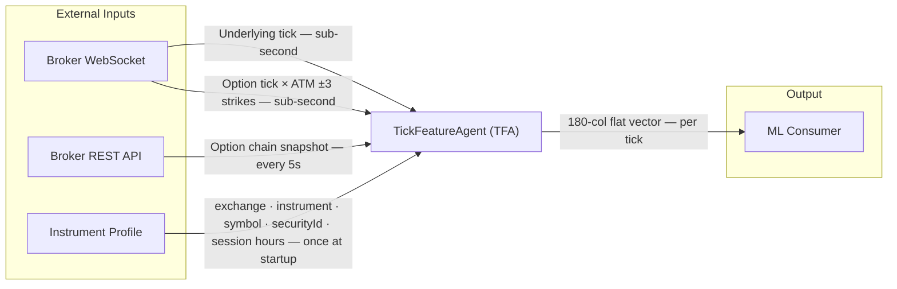
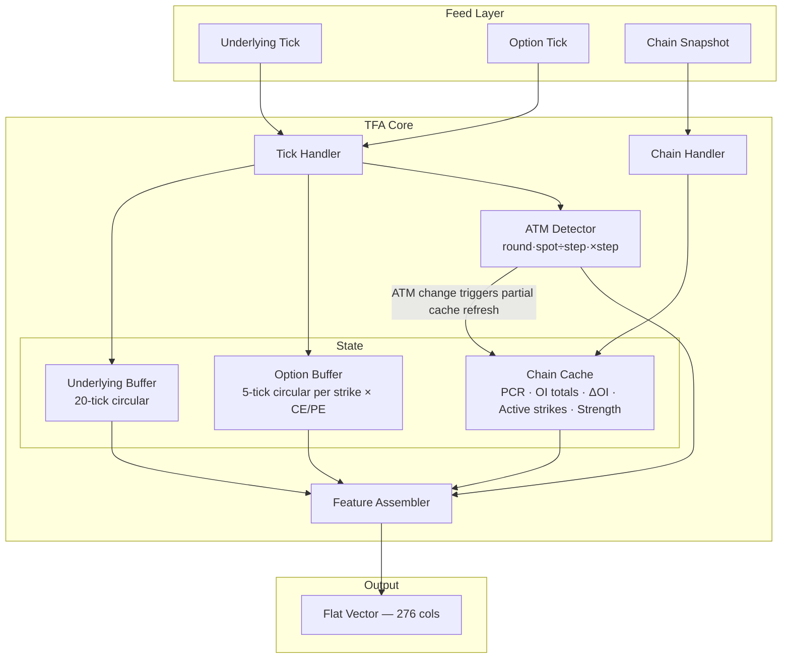
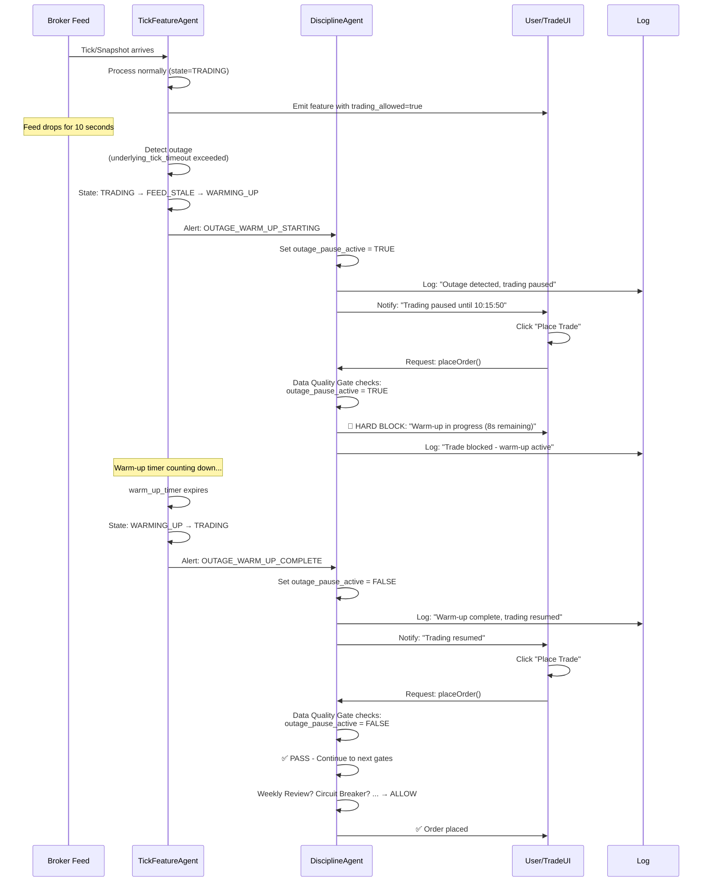

# TickFeatureAgent (TFA)
## Specification Document — Tick + Option Chain Feature Engineering System

---

## 0. Pre-Requisite Data

### 0.1 Real-Time Feed Data *(must be live before system starts)*

| Feed | Fields Required | Frequency | Source |
|------|----------------|-----------|--------|
| NIFTY Futures tick | `timestamp`, `ltp`, `bid`, `ask`, `volume` | Per trade event | Broker WebSocket |
| Option tick (full current expiry chain) | `timestamp`, `strike`, `option_type`, `ltp`, `bid`, `ask`, `bid_size`, `ask_size`, `volume` | Per trade event | Broker WebSocket |
| Option chain snapshot | `chain_timestamp` + per-strike: `strike`, `call_oi`, `put_oi`, `call_volume`, `put_volume`, `call_delta_oi`, `put_delta_oi` | Every 5 seconds | NSE / Broker REST API |

### 0.2 Reference / Static Data *(loaded once at startup)*

| Data | Used For |
|------|----------|
| NSE market holidays calendar | `is_market_open` flag |
| Market session hours (from Instrument Profile `session_start` / `session_end`) | `is_market_open` flag |

### 0.3 Runtime State *(maintained in-memory during session)*

| State | Size | Used For |
|-------|------|----------|
| Underlying tick history buffer | Last 20 ticks (price + timestamp) | `return_5ticks`, `return_20ticks`, `momentum`, `velocity`, tick count features |
| Option tick history buffer (per strike) | Last 5 ticks per strike × CE/PE — maintained for **all subscribed chain strikes** | `premium_momentum` per strike — buffers grow from session open, no resets |
| Current option chain snapshot | Full chain (all strikes) | PCR, OI features, active strike selection, strength normalization |
| Previous option chain snapshot | Full chain (all strikes) | `call_vol_diff`, `put_vol_diff` computation |
| Current ATM state | `atm_strike`, `atm_window_strikes`, `strike_step` | Feature window calculation only — does not drive subscriptions |
| Full chain subscription set | All strikes × CE+PE for current expiry | Subscribed once at startup; updated on expiry rollover or mid-session new strike detection |
| Buffer retention | All subscribed chain strikes | Buffers never cleared mid-session — accumulate from session open until expiry rollover |
| `chain_available` flag | Boolean | Quality flag — `false` until first snapshot received |
| `vol_diff_available` flag | Boolean | Quality flag — `false` until second snapshot received |

### 0.4 Infrastructure Prerequisites

| Requirement | Detail |
|-------------|--------|
| Broker API credentials | API key + access token for WebSocket and REST |
| WebSocket connection | Real-time tick subscriptions (underlying + options) |
| REST / HTTP connection | Option chain polling every 5 seconds |
| Timezone | IST (UTC+5:30) — all timestamps and session logic |
| Clock synchronization | System clock must be accurate for `chain_timestamp <= tick_time` |

### 0.5 Startup Validation Checklist

Before the first tick is processed:

- [ ] Broker API connected and authenticated
- [ ] Instrument profile loaded (`exchange`, `instrument_name`, `underlying_symbol`, `underlying_security_id`, `session_start`, `session_end`)
- [ ] Current near-month futures contract symbol resolved and confirmed active
- [ ] Option chain endpoint accessible and returning all required fields
- [ ] `bid_size` / `ask_size` confirmed available in option tick feed
- [ ] `call_delta_oi` / `put_delta_oi` confirmed in chain snapshot response
- [ ] Full current expiry chain fetched — all strikes × CE+PE subscribed on WebSocket
- [ ] Strike count confirmed (log: `subscribed N instruments for expiry YYYY-MM-DD`)
- [ ] System clock timezone set to IST (UTC+5:30)

---

## 0.6 Instrument Profile

Loaded once at startup. Parametrizes all exchange-specific and instrument-specific values.

| Parameter | Type | Description | Example (NIFTY) | Example (CRUDEOIL) | Example (NATURALGAS) |
|-----------|------|-------------|-----------------|---------------------|----------------------|
| `exchange` | string | Exchange name | `NSE` | `MCX` | `MCX` |
| `instrument_name` | string | Instrument identifier | `NIFTY` | `CRUDEOIL` | `NATURALGAS` |
| `underlying_symbol` | string | Active futures contract symbol | `NIFTY25MAYFUT` | `CRUDEOIL25MAYFUT` | `NATURALGAS25MAYFUT` |
| `underlying_security_id` | string | Broker-assigned security ID for underlying | `26000` | `234230` | `234235` |
| `session_start` | string | Market open time (IST, HH:MM) | `09:15` | `09:00` | `09:00` |
| `session_end` | string | Market close time (IST, HH:MM) | `15:30` | `23:30` | `23:30` |
| `underlying_tick_timeout_sec` | int | Max gap in underlying ticks before quality flag fires | `5` | `30` | `30` |
| `option_tick_timeout_sec` | int | Max gap in ATM-zone option ticks before quality flag fires | `30` | `120` | `120` |
| `momentum_staleness_threshold_sec` | int | Max time span of 5-tick buffer for valid `premium_momentum` | `60` | `120` | `120` |
| `warm_up_duration_sec` | int | Duration (seconds) to wait after feed recovery before resuming trades — allows buffers to refill | `15` | `20` | `30` |

> **Profile is read-only at runtime.** Changes take effect on next session startup. If a mismatch is detected mid-session (symbol, security ID, or session hours), TFA emits an `INSTRUMENT_PROFILE_MISMATCH` alert (WARN) and sets `data_quality_flag = 0`.

---

## 1. Purpose

Build a real-time data processing system that:

- Combines tick data and option chain data
- Extracts price, order flow, and positioning signals
- Generates structured feature output per tick

**Objective:** Create a high-quality feature dataset for:
- Short-term trading analysis
- Machine learning model input

**Target instruments:** NIFTY 50 options (NSE), Crude Oil options (MCX), Natural Gas options (MCX)

---

## 2. Design Principles

| Use | Avoid |
|-----|-------|
| Real market price data | Greeks |
| Order flow (bid/ask, volume) | Implied volatility models |
| OI / volume data | |

---

## 3. Scope

**Included:**
- Data ingestion
- Data synchronization
- ATM detection
- Active strike detection
- Feature engineering
- JSON output generation

**Excluded:**
- Model training
- Trade execution
- Risk management

---

## 4. Data Requirements

### 4.1 Underlying Tick Data (near-month futures contract)

> **Note:** The underlying feed is the near-month futures contract for the configured instrument (from `underlying_symbol` in the Instrument Profile), not the spot index. Futures LTP is used as the spot price proxy for ATM calculation.
>
> **Rollover:** Managed externally by the feed/subscription layer. The feature engine always processes whichever futures symbol is currently active. TFA validates each incoming underlying tick's `security_id` against `underlying_security_id` in the Instrument Profile. On mismatch, TFA emits an `UNDERLYING_SYMBOL_MISMATCH` alert (WARN) and sets `data_quality_flag = 0` for that tick. Stale-symbol filtering is the feed layer's responsibility.

| Field | Description |
|-------|-------------|
| `timestamp` | Event time |
| `ltp` | Last traded price (used as spot price proxy) |
| `bid` | Best bid price |
| `ask` | Best ask price |
| `volume` | Per-tick traded quantity (quantity of this specific trade event) |

### 4.2 Option Tick Data (full current expiry chain)

> **Subscription strategy:** Subscribe all strikes × CE+PE for the current expiry at startup. This eliminates subscription churn on ATM shifts, ensures all buffers are warm regardless of spot movement, and provides tick data for active strikes anywhere in the chain.
>
> **Feature window:** Only ATM ±3 strikes (7 strikes) are included in option tick feature output. All other subscribed strikes maintain live 5-tick buffers but do not appear in ATM tick feature columns.
>
> **Active strikes:** Any active strike identified from the chain snapshot has its tick buffer already warm — no warm-up delay regardless of strike position.
>
> **Mid-session new strikes:** If the exchange adds new strikes during the session (detected via chain snapshot diff): (1) subscribe new strikes × CE+PE, (2) initialise empty tick buffers, (3) emit `NEW_STRIKES_DETECTED` alert.
>
> **Tick Atomicity & No Aggregation:** TFA treats each WebSocket tick event as a distinct, atomic unit. Each tick produces exactly **one feature row** in the output. No tick merging, batching, or aggregation occurs — even if the broker sends multiple ticks with the same timestamp.
>>
>> **Volume (`volume` field):** Reflects the quantity of this specific trade event as reported by broker. If broker sends 3 ticks at the same millisecond with volumes [5, 3, 7], TFA emits 3 rows with volumes [5, 3, 7] — no summing.
>>
>> **Burst handling:** During high-frequency bursts (e.g., 100+ ticks/sec), TFA emits one row per tick. This preserves market microstructure (burst patterns, volume distribution) for model training. Consumers can downsample post-hoc if needed (e.g., take every Nth row).
>
> **Expiry rollover:** Unsubscribe all current expiry strikes, subscribe all next expiry strikes, clear all option tick buffers. Emit `EXPIRY_ROLLOVER` alert.

| Field | Description |
|-------|-------------|
| `timestamp` | Event time |
| `strike` | Strike price |
| `option_type` | `CE` or `PE` |
| `ltp` | Last traded price |
| `bid` | Best bid price |
| `ask` | Best ask price |
| `bid_size` | Quantity available at best bid |
| `ask_size` | Quantity available at best ask |
| `volume` | Per-tick traded quantity (quantity of this specific trade event) |

### 4.3 Option Chain Snapshot (Every 5 Seconds)

**Expiry rule:** Use the **nearest weekly expiry**. Expiry date is read directly from the broker's chain snapshot (per-instrument expiry date field) — no separate calendar required.

**Rollover detection algorithm:**
> On each chain snapshot arrival:
> ```
> if today == snapshot.expiry_date AND snapshot_time >= 14:30:00 IST:
>     if not rolled_over_flag:
>         trigger_expiry_rollover()
>         rolled_over_flag = True   ← guard: fires once per session
> ```
> `rolled_over_flag` resets to `False` at each session open. All timestamps normalised to IST (UTC+5:30) on receipt.

Must include **all strikes** for the current expiry.

**Snapshot-level field** (applies to the whole snapshot, not per-strike):

| Field | Description |
|-------|-------------|
| `chain_timestamp` | Timestamp of this option chain snapshot |

**Per-strike fields:**

| Field | Description |
|-------|-------------|
| `strike` | Strike price |
| `call_oi` | Call open interest |
| `put_oi` | Put open interest |
| `call_volume` | Cumulative daily call volume (use snapshot diff for activity signal) |
| `put_volume` | Cumulative daily put volume (use snapshot diff for activity signal) |
| `call_delta_oi` | Change in call OI per strike from **start of day** (intraday ΔOI, provided by NSE feed) |
| `put_delta_oi` | Change in put OI per strike from **start of day** (intraday ΔOI, provided by NSE feed) |

---

## 5. Data Synchronization

**Rule:** For each tick, `chain_timestamp <= tick_time`

- Attach the latest available option chain snapshot to each tick
- Never use future data (no lookahead)

**Output per tick row:**
```
tick_data + option_chain_context (latest snapshot at or before tick_time)
```

---

## 6. Dynamic ATM Selection

**Strike step detection:** On option chain load, compute:
```
strike_step = min(diff between consecutive strikes in chain)
```
> **Fatal condition:** If chain has fewer than 2 strikes at startup, TFA halts with error. There is no safe fallback — a wrong `strike_step` silently corrupts all ATM-zone features.

**Logic:**
```
ATM = round(spot / strike_step) * strike_step
ATM window = ATM - 3×strike_step  to  ATM + 3×strike_step  (7 strikes total)
```

**Output:**
- `atm_strike`: the identified ATM strike
- `atm_window_strikes`: list of 7 computed strike prices (ATM ±3) — the **feature window**. This is a computed window, not a list of confirmed traded instruments. Whether each strike has data is indicated by `tick_available` and `NaN` chain features.
- `strike_step`: detected step value (for traceability)

> **ATM change does not trigger subscription changes.** Full chain is already subscribed. ATM change updates the feature window pointer and triggers a partial cache refresh (ATM-zone fields only). The output row always reflects the **new** ATM window.

---

## 7. Active Strike Identification

**Source:** Option chain snapshot

**Selection criteria:**
1. **Volume set:** Top 3 strikes by `(call_vol_diff + put_vol_diff)`, non-zero only
2. **ΔOI set:** Top 3 strikes by `abs(call_delta_oi) + abs(put_delta_oi)`, non-zero only
3. **Union + dedup** → max 6 strikes

**Tiebreaker** (identical combined score): ascending `abs(strike - spot_price)` (closer to ATM wins); if still equal, strike > spot preferred over strike < spot.

**Slot ordering:** Active strikes sorted by descending `(call_strength + put_strength) / 2` (combined strength), same tiebreaker as above. Slot 0 = highest combined strength.

**If zero strikes qualify for both criteria:** output `active_strikes = []` (valid market state, not a quality flag trigger)

**First snapshot edge case:** No `vol_prev` exists → `vol_diff_available = false`, set `call_vol_diff = put_vol_diff = 0` for all strikes. `data_quality_flag = 0`.

**Output:** `active_strikes` — list of up to **6** unique high-activity strikes (can be empty), each carrying independent `call` and `put` strength data

---

## 8. Feature Reference: Source & Calculation

### 8.1 Root

| Property | Source | Calculation |
|----------|--------|-------------|
| `timestamp` | Underlying tick | Direct value from tick |

### 8.2 Underlying Features

| Property | Source | Calculation |
|----------|--------|-------------|
| `ltp` | Underlying tick | Last traded price |
| `bid` | Underlying tick | Best bid |
| `ask` | Underlying tick | Best ask |
| `spread` | Underlying tick | `ask - bid` |
| `return_5ticks` | Tick history | `(price_now - price_5_ticks_ago) / price_5_ticks_ago` |
| `return_20ticks` | Tick history | `(price_now - price_20_ticks_ago) / price_20_ticks_ago` |
| `momentum` | Tick history | `price_now - price_5_ticks_ago` |
| `velocity` | Tick history | `(price_now - prev_price) / max(time_diff_seconds, 1.0)` — 1-second floor prevents extreme values from sub-millisecond ticks; `null` for tick 1; skip update if `time_diff <= 0` (duplicate/out-of-order timestamp) |
| `tick_up_count_20` | Tick history | Count of ticks where `price_now > price_prev` in last 20 |
| `tick_down_count_20` | Tick history | Count of ticks where `price_now < price_prev` in last 20 |
| `tick_flat_count_20` | Tick history | Count of ticks where `price_now == price_prev` in last 20 |
| `tick_imbalance_20` | Tick history | `(up - down) / (up + down)` — flat ticks excluded; `NaN` if `up + down = 0` (no directional activity) |

### 8.3 ATM Context

| Property | Source | Calculation |
|----------|--------|-------------|
| `spot_price` | Underlying tick | LTP |
| `atm_strike` | Calculated | `round(spot / strike_step) * strike_step` |
| `atm_window_strikes` | Calculated | ATM ±3 computed strike prices (7 total) — feature window, not guaranteed to exist in chain |
| `strike_step` | Detected | `min(diff between consecutive strikes)` — fatal if < 2 strikes |

### 8.4 Option Tick Features (ATM ±3 feature window, per strike)

> **Subscription vs feature window:** All chain strikes are subscribed and maintain live 5-tick buffers. Only the 7 strikes in the ATM ±3 feature window are included in this output group. Active strikes outside ATM ±3 have their tick features in Section 8.6.
>
> **`tick_age_sec` not tracked for ATM window strikes.** Use `tick_available` to detect unticked strikes and `time_since_chain_sec` for feed latency. ATM window strikes are the most liquid in the chain — staleness is better monitored at the feed level.

| Property | Source | Calculation |
|----------|--------|-------------|
| `tick_available` | System | `1` if this specific CE or PE instrument has received ≥1 tick since session open or last rollover; `0` if never ticked. Resets on expiry rollover. |
| `ltp` | Option tick | Last traded price; `NaN` if `tick_available = 0` |
| `bid` | Option tick | Best bid |
| `ask` | Option tick | Best ask |
| `spread` | Option tick | `ask - bid` |
| `volume` | Option tick | Direct |
| `bid_ask_imbalance` | Option tick | `(bid_size - ask_size) / (bid_size + ask_size)` — `NaN` if `bid_size + ask_size = 0` |
| `premium_momentum` | Option tick history | `current_ltp - ltp_5_ticks_ago`; `NaN` if strike buffer < 5 ticks OR time span between oldest and newest tick exceeds `momentum_staleness_threshold_sec` |

### 8.5 Option Chain Features

**Naming convention:** `{metric}_{type}_{scope}` — no scope suffix = global (all strikes), `_atm` = ATM ±3 zone only.

| Property | Scope | Source | Calculation |
|----------|-------|--------|-------------|
| `pcr_global` | Global | Option chain (all strikes) | `sum(put_oi) / sum(call_oi)` — `null` if `sum(call_oi) = 0` |
| `pcr_atm` | ATM zone | ATM ±3 strikes | `sum(put_oi) / sum(call_oi)` for ATM ±3 — `null` if `sum(call_oi) = 0` |
| `oi_total_call` | Global | Option chain | `sum(call_oi)` across all strikes |
| `oi_total_put` | Global | Option chain | `sum(put_oi)` across all strikes |
| `oi_change_call` | Global | Option chain | `sum(call_delta_oi)` across all strikes |
| `oi_change_put` | Global | Option chain | `sum(put_delta_oi)` across all strikes |
| `oi_change_call_atm` | ATM zone | ATM ±3 strikes | `sum(call_delta_oi)` for ATM ±3 only |
| `oi_change_put_atm` | ATM zone | ATM ±3 strikes | `sum(put_delta_oi)` for ATM ±3 only |
| `oi_imbalance_atm` | ATM zone | ATM ±3 strikes | `(sum(put_oi) - sum(call_oi)) / (sum(put_oi) + sum(call_oi))` — `null` if both are 0 |

### 8.6 Active Strike Features (per strike)

Each active strike carries independent `call` and `put` sides. A strike can act as both resistance and support simultaneously.

Since the full chain is subscribed, every active strike has a live 5-tick buffer — tick features are always available with no warm-up delay.

**Chain-derived features (from option chain snapshot):**

| Property | Source | Calculation |
|----------|--------|-------------|
| `strike` | Option chain | Selected top strike |
| `distance_from_spot` | Calculated | `strike - spot_price` |
| `call.level_type` | Derived | Always `resistance` |
| `call.strength_volume` | Option chain | `(call_vol_diff - min) / (max - min)` — min/max across **all strikes in full chain snapshot** |
| `call.strength_oi` | Option chain | `(abs(call_delta_oi) - min) / (max - min)` — min/max across **all strikes in full chain snapshot** |
| `call.strength` | Calculated | `0.5 × call.strength_volume + 0.5 × call.strength_oi` |
| `put.level_type` | Derived | Always `support` |
| `put.strength_volume` | Option chain | `(put_vol_diff - min) / (max - min)` — min/max across **all strikes in full chain snapshot** |
| `put.strength_oi` | Option chain | `(abs(put_delta_oi) - min) / (max - min)` — min/max across **all strikes in full chain snapshot** |
| `put.strength` | Calculated | `0.5 × put.strength_volume + 0.5 × put.strength_oi` |

**Tick-derived features (from live option tick feed):**

| Property | Source | Calculation |
|----------|--------|-------------|
| `call.ltp` | Option tick | Call last traded price |
| `call.bid` | Option tick | Call best bid |
| `call.ask` | Option tick | Call best ask |
| `call.spread` | Computed | `call.ask - call.bid` |
| `call.volume` | Option tick | Call per-tick traded quantity |
| `call.bid_ask_imbalance` | Computed | `(bid_size - ask_size) / (bid_size + ask_size)` — `null` if denominator = 0 |
| `call.premium_momentum` | Tick history | `call.ltp_now - call.ltp_5_ticks_ago` — `NaN` if strike buffer has < 5 ticks OR time span between oldest and newest tick in buffer exceeds `momentum_staleness_threshold_sec` (Instrument Profile) |
| `put.ltp` | Option tick | Put last traded price |
| `put.bid` | Option tick | Put best bid |
| `put.ask` | Option tick | Put best ask |
| `put.spread` | Computed | `put.ask - put.bid` |
| `put.volume` | Option tick | Put per-tick traded quantity |
| `put.bid_ask_imbalance` | Computed | `(bid_size - ask_size) / (bid_size + ask_size)` — `null` if denominator = 0 |
| `put.premium_momentum` | Tick history | `put.ltp_now - put.ltp_5_ticks_ago` — `NaN` if strike buffer has < 5 ticks OR time span exceeds `momentum_staleness_threshold_sec` |
| `tick_available` | System | `1` if strike has received ≥1 tick since session open or last expiry rollover; `0` if not yet ticked. Resets to `0` on expiry rollover. |
| `tick_age_sec` | System | Seconds since the most recent tick received for this strike (either side); `NaN` if `tick_available = 0`. Single value per strike — not split by call/put. |

**Normalization:** Min-max computed **per snapshot**, cross-sectional across **all strikes in the current snapshot**.

| Case | Behavior |
|------|----------|
| Normal (activity exists) | Min-max: `strength = (value - min) / (max - min)` → range [0, 1] |
| All zeros (no activity) | `strength_volume = 0.0`, `strength_oi = 0.0`, `strength = 0.0` for all strikes (NOT 0.5) |
| Zero-activity result | `active_strikes = []` (empty list, valid state) |

**Rationale:** Zero activity should signal "nothing happening" (0.0), not "neutral" (0.5). Clear distinction enables model to learn dead-market pattern.

**Strength interpretation:**
- `strength_volume` — current participation (activity, from snapshot vol diff)
- `strength_oi` — new position build-up (commitment, from abs ΔOI)
- `strength` — combined signal (activity + commitment)

**Null handling for tick features:** If `tick_available = 0` (strike has never ticked this session), all tick-derived fields for that strike = `null`.

---

### 8.7 Cross-Feature Intelligence — Call vs Put Dominance

**Purpose:** Encode structural imbalance between calls and puts — reveals directional bias and flow dominance.

**Computed per ATM snapshot:**

| Property | Source | Calculation |
|----------|--------|-------------|
| `call_put_strength_diff` | Active strikes + ATM chain | `Σ(call.strength for active_strikes) - Σ(put.strength for active_strikes)` — range [-1, 1] after min-max. **Positive** = call dominance (resistance bias), **negative** = put dominance (support bias) |
| `call_put_volume_diff` | ATM zone (chain) | `call_vol_diff_atm - put_vol_diff_atm` (from ATM ±3 snapshot diff) — **positive** = call activity, **negative** = put activity |
| `call_put_oi_diff` | ATM zone (chain) | `call_delta_oi_atm - put_delta_oi_atm` (from ATM ±3 delta OI) — **positive** = call building, **negative** = put building |
| `premium_divergence` | Option tick history | `Σ(call.premium_momentum for active_strikes) - Σ(put.premium_momentum for active_strikes)` — tracks if calls weakening while puts strengthening (or vice versa), signals trend exhaustion or breakout |

**Warm-up:** All features available once `vol_diff_available = 1` (after 2nd chain snapshot) and sufficient active strikes exist.

**Normalization:** 
- Strength diff: min-max normalize across full chain; if no active strikes, = 0.0
- Volume/OI diff: signed, no clipping (can exceed ±1.0 during imbalanced markets)
- Premium divergence: summed momentum, can be `NaN` if active strikes lack 5-tick buffers

---

### 8.8 Compression & Breakout Signals

**Purpose:** Encode low-volatility compression states that precede explosive moves — critical for entry timing.

**Computed from underlying tick buffer (last 20 ticks):**

| Property | Source | Calculation |
|----------|--------|-------------|
| `range_20ticks` | Underlying tick history | `max(price_20) - min(price_20)` — absolute price range over last 20 ticks |
| `range_percent_20ticks` | Underlying tick history | `range_20ticks / median(price_20)` — normalized range, % of mid-price. Identifies compression (small %) vs expansion (large %) |
| `volatility_compression` | Underlying tick history | Rolling std of last 20 ticks — compared to session median volatility: `compression = vol_rolling / vol_session_median`. **< 0.5** = extreme compression (BUY setup), **> 1.5** = regime expansion |
| `spread_tightening_atm` | Option tick (ATM ±3 calls) | `Σ(spread for ATM ±3 CE) / count_ce` (mean spread at ATM) — tracks liquidity tightness. **Tightening** = confidence building, **widening** = uncertainty or edge exhaustion |

**Warm-up:** 
- Available after 20th underlying tick (full 20-tick buffer)
- Spread tightening requires ≥1 ticked strike in ATM zone

**Interpretation:**
- `range_20ticks` low + `volatility_compression` < 0.5 = **breakout loading** (BUY bias)
- `range_percent_20ticks` trending down + `spread_tightening_atm` tightening = **momentum exhaustion** imminent
- `volatility_compression` > 1.5 = **regime shift** (exit range-bound trades)

---

### 8.9 Decay & Dead Market Detection

**Purpose:** Identify premium exhaustion, stagnation, and dead-market conditions — critical for SELL edge and trade exit.

**Computed from option chain + tick buffers:**

| Property | Source | Calculation |
|----------|--------|-------------|
| `total_premium_decay_atm` | Option chain (ATM ±3) | `Σ(ltp_prev - ltp_now for all ATM ±3 strikes, both sides) / count_strikes` — average absolute decay per strike. **Positive** = calls/puts declining. Measures time decay / reversion pressure |
| `momentum_decay_20ticks_atm` | Option tick history (ATM ±3) | `Σ(abs(premium_momentum) for ATM ±3) / 7` — mean momentum magnitude. **Declining over time** = stagnation. Compare to previous snapshot's value to detect trend reversal |
| `volume_drought_atm` | Option chain diff (ATM ±3) | `(call_vol_diff_atm + put_vol_diff_atm) / 2` — low = dead market. **< 5% of daily average** = strong SELL signal |
| `active_strike_count` | System | Count of strikes in `active_strikes` list (0–6). **= 0** = dead market (no activity on volume OR OI), valid SELL setup |
| `dead_market_score` | Computed | `(1 - min(active_strike_count / 6, 1.0)) × (1 - min(momentum_decay / historical_median_momentum, 1.0)) × (1 - min(volume_drought / 0.05, 1.0))` — ranges [0, 1]. **> 0.7** = high dead-market confidence, **< 0.2** = live market |

**Warm-up:** 
- `total_premium_decay_atm` requires 2 snapshots (current vs previous); until then = `null`
- Others available when active strikes exist

**Null handling:** If no ATM ±3 strikes have ticked or no active strikes exist, decay metrics = `null`.

---

### 8.10 Regime Classification

**Purpose:** Classify market mode (TREND, RANGE, DEAD) — prevents mixing BUY and SELL logic.

**Logic:**

```
Input signals (normalized 0–1):
  S_volatility = volatility_compression  ← high = expansion (TREND), low = compression (RANGE)
  S_imbalance = abs(underlying_tick_imbalance_20)  ← high = directional (TREND), low = oscillating (RANGE)
  S_momentum = abs(underlying_momentum) / rolling_std  ← high = directional, low = mean-reverting
  S_activity = min(active_strike_count / 4, 1.0)  ← high = live (TREND/RANGE), low = dead (DEAD)

Thresholds (tunable per instrument):
  TREND threshold:  S_volatility > 0.6 AND S_imbalance > 0.4 AND S_momentum > 0.5 AND S_activity > 0.3
  RANGE threshold:  S_volatility < 0.5 AND S_imbalance < 0.3 AND S_activity > 0.3
  DEAD threshold:   S_activity < 0.15 OR (vol_drought_atm < 0.02 AND active_strike_count = 0)

Regime assignment (priority order):
  IF DEAD threshold → regime = DEAD
  ELIF TREND threshold → regime = TREND  
  ELIF RANGE threshold → regime = RANGE
  ELSE → regime = NEUTRAL (transition state; use prior regime or RANGE as default)
```

**Output:**

| Property | Type | Values | Description |
|----------|------|--------|-------------|
| `regime` | string | `TREND` \| `RANGE` \| `DEAD` \| `NEUTRAL` | Current market mode |
| `regime_confidence` | float | [0, 1] | How strongly each signal aligns; = mean of qualifying signal scores |

**Interpretation:**
- **TREND:** Directional move in progress; favor long calls (calls > puts), breakout buys, directional spreads
- **RANGE:** Price oscillating between support/resistance; favor premium selling, strangles, iron condors
- **DEAD:** No structural activity; avoid trades, focus on exit and preservation
- **NEUTRAL:** Ambiguous signals; require additional confirmation before entry

**Warm-up:** Available after 20 underlying ticks + 2 chain snapshots + active strike selection.

---

### 8.11 Time-to-Move Signals

**Purpose:** Avoid late entries after moves complete; identify breakout readiness windows.

**Computed from underlying tick history + regime:**

| Property | Source | Calculation |
|----------|--------|-------------|
| `time_since_last_big_move` | Underlying tick history | Seconds since last tick where `abs(velocity) > 2 × median_velocity` (sudden acceleration). `null` if never occurred in session |
| `stagnation_duration_sec` | Underlying tick history | Seconds since last price change > 0.1% of LTP (micro-moves ignored). Low = active, high = stuck. Cap at 300 sec (session reset) |
| `momentum_persistence_ticks` | Underlying tick history | Count of consecutive ticks with same sign (all up or all down) in last 20. High = persistence, low = oscillation |
| `breakout_readiness` | Computed | `1.0 if (regime = RANGE AND volatility_compression < 0.4 AND stagnation > 10_sec AND momentum_persistence_ticks > 3) else 0.0` — binary flag. **= 1** = conditions ripe for breakout, use alert signals |

**Interpretation:**
- `time_since_last_big_move` < 5 sec = **too early**, move may continue, avoid re-entry
- `time_since_last_big_move` > 30 sec = **cold**, new setup developing
- `stagnation_duration_sec` > 60 sec AND `volatility_compression` < 0.4 = **compression loading**, ready to explode
- `breakout_readiness = 1` = **enter on next active strike strength spike**

---

### 8.12 Strike-Level Aggregation & Zone Pressure

**Purpose:** Model sees structural zone behavior, not just individual noise.

**Computed from ATM ±3 + active strikes:**

| Property | Source | Calculation |
|----------|--------|-------------|
| `atm_zone_call_pressure` | ATM ±3 chain | `Σ(call.strength for ATM ±3) / 7` — mean call strength in ATM zone. Range [0, 1]. High = strong resistance above |
| `atm_zone_put_pressure` | ATM ±3 chain | `Σ(put.strength for ATM ±3) / 7` — mean put strength in ATM zone. Range [0, 1]. High = strong support below |
| `atm_zone_net_pressure` | Computed | `call_pressure - put_pressure` — range [-1, 1]. **Positive** = bullish bias, **negative** = bearish bias |
| `active_zone_call_count` | Active strikes | Count of active strikes where `call.strength > put.strength` |
| `active_zone_put_count` | Active strikes | Count of active strikes where `put.strength > call.strength` |
| `active_zone_dominance` | Computed | `(call_count - put_count) / max(call_count + put_count, 1)` — range [-1, 1]. Structural flow direction |
| `zone_activity_score` | Computed | `(atm_zone_call_pressure + atm_zone_put_pressure) / 2` — mean absolute pressure. High = zone alive, low = quiet |

**Warm-up:** Available once ATM ±3 strikes have chain data and ≥1 active strike identified.

**Null handling:** If ATM ±3 has no chain data or zero active strikes, all zone features = `null`.

---

### 8.13 Target Variables — **CRITICAL FOR MODEL TRAINING**

**Purpose:** Connects raw features to profit → enables supervised learning.

> **No leakage rule:** Target variables are computed using ONLY data available at `tick_time` or earlier. Never use future tick/chain data. Enforce `chain_timestamp <= tick_time` strictly.

**Computation window:** For each tick at time `T`, look forward `X` seconds and compute targets. Windows typically: 5s, 10s, 30s, 60s (tunable per backtest).

#### 8.13.1 Upside Target (`max_upside_Xs` — e.g., `max_upside_30s`)

**Definition:** Maximum profit available if you bought calls at `tick_time` and held for `X` seconds.

**Calculation per active strike (CE only):**

```
future_prices = [price at T+1s, T+2s, ..., T+Xs]
max_upside = max(future_prices) - current_strike_ltp
```

**Aggregated target (for trade selection):**

| Property | Source | Calculation |
|----------|--------|-------------|
| `max_upside_30s` | Future ticks (30 sec ahead) | Maximum premium gain across all active strike calls in next 30 sec |
| `max_upside_60s` | Future ticks (60 sec ahead) | Maximum premium gain across all active strike calls in next 60 sec |
| `upside_percentile_30s` | Computed | Percentile of `max_upside_30s` vs session distribution — **high percentile** = exceptional setup |

**Warm-up:** Unavailable until tick `T` where `T + X ≤ session_end`. Typically available all session but **last X seconds produce `null`** (insufficient lookahead).

**Null handling:** If no active strikes with calls ticked, = `null`.

#### 8.13.2 Drawdown Target (`max_drawdown_Xs`)

**Definition:** Maximum loss (downside move) in next `X` seconds if position held.

**Calculation:**

```
future_prices = [price at T+1s, T+2s, ..., T+Xs]
max_drawdown = current_strike_ltp - min(future_prices)  ← positive = loss, negative = impossible (min < current)
```

**Aggregated:**

| Property | Source | Calculation |
|----------|--------|-------------|
| `max_drawdown_30s` | Future ticks (30 sec ahead) | Maximum downside move across all active strikes in next 30 sec |
| `max_drawdown_60s` | Future ticks (60 sec ahead) | Maximum downside move across all active strikes in next 60 sec |
| `risk_reward_ratio_30s` | Computed | `max_upside_30s / max(max_drawdown_30s, 0.01)` — **> 2.0** = favorable, **< 0.5** = unfavorable |

**Interpretation:** High upside + low drawdown = **green light**; low upside + high drawdown = **avoid**.

#### 8.13.3 Premium Decay Target (`premium_decay_Xs`)

**Definition:** How much premium expires in next `X` seconds across all active strikes.

**Calculation per strike:**

```
decay_per_strike = (call_ltp_now + put_ltp_now) - (call_ltp_T+X + put_ltp_T+X)
```

**Aggregated:**

| Property | Source | Calculation |
|----------|--------|-------------|
| `total_premium_decay_30s` | Future option ticks | Sum of premium decay across all active strikes in 30 sec |
| `total_premium_decay_60s` | Future option ticks | Sum of premium decay across all active strikes in 60 sec |
| `avg_decay_per_strike_30s` | Computed | `total_premium_decay_30s / active_strike_count` — per-strike average. **High decay** = time working for sellers |

**SELL Edge:** High `total_premium_decay_60s` + DEAD regime = **premium seller's paradise**.

#### 8.13.4 Directional Target (`direction_30s`)

**Definition:** Binary classification — did spot move up or down in next `X` seconds?

**Calculation:**

```
future_spot = underlying_ltp at T+Xs
direction = 1 if future_spot > current_spot, else 0  ← 1 = bullish move, 0 = bearish/flat
```

**Output:**

| Property | Source | Calculation |
|----------|--------|-------------|
| `direction_30s` | Future underlying ticks | 1 if future underlying > current, 0 otherwise |
| `direction_30s_magnitude` | Future underlying ticks | `abs(future_spot - current_spot) / current_spot` — how much it moved |

**Use case:** Train model to predict direction; use call/put dominance features as predictors.

---

### 8.14 Meta Features

| Property | Source | Calculation |
|----------|--------|-------------|
| `exchange` | Instrument Profile | Exchange name: `NSE` / `MCX` |
| `instrument` | Instrument Profile | Instrument name: `NIFTY` / `CRUDEOIL` / `NATURALGAS` |
| `underlying_symbol` | Instrument Profile | Active futures contract symbol e.g. `NIFTY25MAYFUT` |
| `underlying_security_id` | Instrument Profile | Broker-assigned security ID for the underlying |
| `chain_timestamp` | Option chain | Snapshot timestamp — `null` if `chain_available = false` |
| `time_since_chain_sec` | Calculated | `tick_time - chain_timestamp` — `null` if `chain_available = false` |
| `chain_available` | System | `false` until first snapshot received, then `true` |
| `data_quality_flag` | System | `1` = valid, `0` = invalid (see conditions below) |
| `is_market_open` | System | `1` during `session_start`–`session_end` IST (from Instrument Profile), else `0` |

**`data_quality_flag` 3-state progression:**

| State | `chain_available` | `vol_diff_available` | `data_quality_flag` |
|-------|------------------|---------------------|-------------------|
| Before first snapshot | `0` | `0` | `0` |
| After 1st snapshot, before 2nd | `1` | `0` | `0` |
| Normal operation (≥2 snapshots) | `1` | `1` | `1` (unless other condition fails) |

On expiry rollover, both flags reset to `0` — same progression as session startup.

**`data_quality_flag = 0` when any of the following:**
- `chain_available = 0` (no snapshot received yet, or post-rollover before first new-expiry snapshot)
- `vol_diff_available = 0` (first snapshot received, no previous snapshot to diff against)
- 5-tick buffer not yet full (first 4 ticks of session)
- 20-tick buffer not yet full (first 19 ticks of session)
- `time_since_chain_sec > 30` (chain snapshot is stale)
- No underlying tick received within `underlying_tick_timeout_sec` (from Instrument Profile)
- No ATM-zone option tick received within `option_tick_timeout_sec` (from Instrument Profile)
- `UNDERLYING_SYMBOL_MISMATCH` detected on incoming tick
- `INSTRUMENT_PROFILE_MISMATCH` detected mid-session

---

### 8.15 Implementation Notes — Derived Feature Computation

**New feature availability (warm-up):**

| Feature Group | Earliest Availability | Dependency |
|---|---|---|
| Cross-feature intelligence (call/put diffs) | After 2nd chain snapshot | `vol_diff_available = 1` + ≥1 active strike |
| Compression signals (range, volatility) | After 20th underlying tick | Full 20-tick buffer |
| Decay detection | After 2nd snapshot | Previous chain snapshot for delta calculation |
| Regime classification | After 20 ticks + 2 snapshots | All regime signals must be computable |
| Time-to-move signals | After 20 ticks + 2 snapshots | Full buffers + regime available |
| Zone aggregation (ATM pressure) | After ≥1 chain snapshot | ATM ±3 chain data + ≥1 active strike |
| Target variables (max_upside, decay) | All ticks except last X seconds | Future tick data; `null` during warm-up |

**Computation order per tick:**

```
1. Update tick buffers (underlying + option)
2. Compute ATM context
3. Compute base underlying features (ltp, spread, momentum, velocity)
4. Compute base option features (tick_available, bid_ask_imbalance, premium_momentum)
5. [On chain snapshot] Recompute all chain-derived features
6. [On chain snapshot] Compute compression signals (if 20-tick buffer full)
7. [On chain snapshot] Compute cross-feature intelligence (if vol_diff_available)
8. [On chain snapshot] Compute decay detection metrics
9. [After sufficient buffers] Compute regime classification
10. [After sufficient buffers] Compute time-to-move signals
11. [All buffers warm] Compute zone aggregation + dominance metrics
12. [If trained model available] Compute/include target variables in output
13. Assemble flat vector and emit
```

**Cache strategy:** Derived features are recomputed only on new chain snapshots (every ~5s) or when buffers become fully warm. Per-tick computation cost remains O(1) by reading from cache.

---

### 8.16 Implementation Notes — Original (Buffer Warm-up & Edge Cases)

| Note | Detail |
|------|--------|
| Rolling buffer warm-up (session start) | `velocity` → `null` for tick 1 only; `return_5ticks`, `momentum`, `premium_momentum` → `null` for ticks 1–4; `return_20ticks`, `tick_imbalance_20`, `tick_up_count_20`, `tick_down_count_20`, `tick_flat_count_20` → `null` for ticks 1–19 |
| Rolling buffer warm-up (option strikes) | Full chain subscribed from session open — all strike buffers warm by the time ATM shifts or a strike becomes active. Exception: deep OTM strikes that never trade may have `tick_available = 0` all session |
| No chain at startup | Output `null` for all chain features; set `data_quality_flag = 0`, `chain_available = false` |
| First chain snapshot | No `vol_prev` exists → `vol_diff = 0` for all strikes; active strike volume ranking unreliable; `data_quality_flag = 0` |
| Quality flag | Set `data_quality_flag = 0` when: `chain_available = false`, `vol_diff_available = false` (first snapshot), any buffer not full, or `time_since_chain_sec > 30` |
| Missing ATM strikes | `option_tick_features` always contains exactly 14 entries (7 `atm_window_strikes` × CE + PE). If a strike has never ticked, its entry is present with all tick fields = `null` and `tick_available = 0`. `atm_window_strikes` lists all 7 computed prices regardless of chain existence. |
| PCR / OI imbalance | `pcr_global`, `pcr_atm` → `null` if `sum(call_oi) = 0`; `oi_imbalance_atm` → `null` if both OI totals are 0 |
| Velocity unit | `time_diff` in seconds with 1-second floor; skip update on zero/negative delta (duplicate or out-of-order tick) |
| `time_since_chain_sec` as staleness indicator | When `time_since_chain_sec > 30`, chain features are stale. Model uses this column to learn staleness sensitivity. No separate stale column needed. |
| Volume signal | `call_vol_diff = call_volume_now - call_volume_prev`; `put_vol_diff = put_volume_now - put_volume_prev` (snapshot diff); raw `call_volume`/`put_volume` from feed is cumulative daily |
| ΔOI ranking | Use `abs(call_delta_oi) + abs(put_delta_oi)` for active strike selection (magnitude, not signed) |
| Strength normalization | Min-max across all strikes in full chain snapshot. **Zero-activity case:** If all strikes have zero volume AND zero ΔOI, set all strength values to 0.0 (not 0.5). Result: `active_strikes = []` (empty list). Model learns dead-market pattern. |
| Chain staleness | Threshold = 30 seconds; flag but still output chain-derived features |
| No leakage | Never use future tick or chain data — enforce `chain_timestamp <= tick_time` strictly. **Also applies to target variables:** Use only ticks at T and earlier; lookahead window [T+1, T+Xs] is separate computation for model training labels, not real-time feature output. |
| **Tick atomicity** | **Each WebSocket tick event = 1 output row, no aggregation.** If broker sends 3 ticks at same millisecond, TFA emits 3 rows. No merging, batching, or combining. Volume field passed as-is (per-tick quantity). High-frequency bursts (100+ ticks/sec) produce burst of rows — consumer can downsample post-hoc if needed. |

---

### 8.17 Computation Model

**Three independent triggers:**

| Trigger | Frequency | Action |
|---------|-----------|--------|
| **New tick** (underlying or option) | Sub-second | Update buffer · compute tick features · assemble output |
| **New chain snapshot** | Every ~5 seconds | Recompute all chain-derived features · update cache |
| **Subscription event** (startup / rollover / new strike) | Once or rarely | Manage WebSocket subscriptions · emit alerts |

**Subscription lifecycle:**

```
on_startup():
    retry_count = 0
    while retry_count < 12:          ← retry every 5s, up to 60s total
        snapshot = fetch_chain_snapshot()
        if snapshot is valid: break
        retry_count += 1
        sleep(5)
    if snapshot is None:
        emit alert: CHAIN_UNAVAILABLE (CRITICAL)
        halt()
    if len(snapshot.strikes) < 2:
        halt("Fatal: chain has fewer than 2 strikes — cannot detect strike_step")
    strike_step = detect_strike_step(snapshot)
    subscribe all strikes × CE+PE for current expiry    ← full chain
    log: "subscribed N instruments for expiry YYYY-MM-DD"

on_chain_snapshot(snapshot):
    new_strikes = snapshot.strikes - subscribed_strikes
    if new_strikes:
        subscribe(new_strikes)                          ← subscribe first
        initialise_buffers(new_strikes)                 ← then init buffers
        emit alert: NEW_STRIKES_DETECTED                ← then alert
    check_expiry_rollover(snapshot)

on_expiry_rollover():
    old_security_ids = current_subscribed_security_ids  ← retain for grace window
    unsubscribe all current expiry strikes
    clear all option tick buffers
    reset chain_available = False
    reset vol_diff_available = False
    reset tick_available = 0 for all strikes
    subscribe all next expiry strikes × CE+PE
    start_grace_timer(old_security_ids, duration=5s)    ← discard late old-expiry ticks
    emit alert: EXPIRY_ROLLOVER

on_grace_timer_expired(old_security_ids):
    release old_security_ids set from memory

on_option_tick(tick):
    if tick.security_id in grace_window_old_ids:
        discard silently                                ← late old-expiry tick
        return
```

**Chain cache:**

Chain-derived features are computed once on snapshot arrival. Every tick reads from cache — no chain recomputation per tick.

```
on_chain_snapshot(snapshot):
    chain_cache.pcr_global          = compute_pcr_global(snapshot)
    chain_cache.pcr_atm             = compute_pcr_atm(snapshot, atm_strike)
    chain_cache.oi_total_call       = sum(snapshot.call_oi)
    chain_cache.oi_total_put        = sum(snapshot.put_oi)
    chain_cache.oi_change_call      = sum(snapshot.call_delta_oi)
    chain_cache.oi_change_put       = sum(snapshot.put_delta_oi)
    chain_cache.oi_change_call_atm  = sum(snapshot.call_delta_oi for ATM ±3)
    chain_cache.oi_change_put_atm   = sum(snapshot.put_delta_oi for ATM ±3)
    chain_cache.oi_imbalance_atm    = compute_oi_imbalance_atm(snapshot, atm_strike)
    chain_cache.active_strikes      = select_active_strikes(snapshot)
    chain_cache.strength            = compute_strength(snapshot)
    chain_cache.timestamp           = snapshot.chain_timestamp

on_tick(tick):
    update_buffer(tick)                               ← O(1)
    atm_strike = compute_atm(tick.ltp)               ← O(1), no subscription change
    if atm_strike changed:
        ← partial refresh: re-derive ATM-zone fields from stored snapshot
        chain_cache.pcr_atm            = compute_pcr_atm(stored_snapshot, new_atm)
        chain_cache.oi_change_call_atm = sum(stored_snapshot.call_delta_oi for new ATM ±3)
        chain_cache.oi_change_put_atm  = sum(stored_snapshot.put_delta_oi for new ATM ±3)
        chain_cache.oi_imbalance_atm   = compute_oi_imbalance_atm(stored_snapshot, new_atm)
        chain_cache.active_strikes     = select_active_strikes(stored_snapshot)
        chain_cache.strength           = compute_strength(stored_snapshot)
        ← global fields unchanged: pcr_global, oi_total_call/put, oi_change_call/put
    tick_features = compute_tick_features(tick)      ← O(1)
    output = assemble_flat_vector(tick_features, chain_cache)
    emit(output)
```

**Buffer retention policy:**

Option tick buffers are maintained for all subscribed strikes. Buffers are never cleared mid-session except on expiry rollover. Deep OTM strikes that never trade retain empty buffers (`tick_available = 0`) — this is a valid state.

| Condition | Buffer action |
|-----------|--------------|
| Strike subscribed (session open) | Buffer initialised, accumulates from first tick |
| ATM shifts — strike exits feature window | Buffer retained — full chain still subscribed |
| Active strikes change | Buffer retained — full chain subscribed, no cleanup mid-session |
| Expiry rollover | All option tick buffers cleared |

**Performance budget per tick (Python):**

| Step | Cost |
|------|------|
| Buffer update (underlying + option) | ~10 µs |
| ATM detection | ~1 µs |
| Flat vector assembly from cache | ~10 µs |
| **Total per tick** | **~20 µs** |
| Chain cache recompute (every 5s) | ~200 µs (one-time) |
| Subscription management (startup) | ~500 ms (one-time) |

> **Budget is a design target, not a hard constraint.** TFA never drops ticks due to processing time. If rolling 1000-tick average latency exceeds the budget, emit `PERFORMANCE_DEGRADED` alert (WARN) with `{avg_tick_latency_ms, budget_ms}` payload. Measurement checked every 100 ticks.
>
> **Memory footprint:** All tick buffers are fixed-size circular — 20 ticks for underlying, 5 ticks per strike × CE/PE for options. For NIFTY (~200 strikes): `200 × 2 × 5 ticks × ~16 bytes ≈ 32 KB`. Memory is constant regardless of session duration or tick rate.

---

### 8.17.1 Feed Outage Recovery & Warm-up State Machine

**Problem:** If a feed (underlying ticks or chain snapshots) goes stale and recovers, buffers contain stale data or gaps. The system must wait for buffers to refill before resuming trading.

**Solution:** Implement a 4-state warm-up machine that signals DisciplineAgent to pause trades during recovery.

#### Warm-up State Machine

```
State Diagram:

┌─────────────┐
│   TRADING   │ ← Normal operation, buffers warm, quality flag = 1
└──────┬──────┘
       │ Feed stale detected
       │ (underlying_tick_timeout OR chain > 30s)
       ↓
┌─────────────────┐
│  FEED_STALE     │ ← Buffers going stale, emit OUTAGE_WARM_UP_STARTING
│ quality_flag=0  │ ← Signal DA: trading_allowed = FALSE
└────────┬────────┘
         │ Feed recovers (tick/snapshot arrives)
         ↓
┌──────────────────────────────────────┐
│  WARMING_UP                          │ ← Buffers refilling
│  warm_up_timer = warm_up_duration_sec│ ← Countdown timer running
│  quality_flag = 0                    │ ← Still NO trading
│  trading_allowed = FALSE             │ ← DA enforces block
└──────────┬───────────────────────────┘
           │ Timer expires
           ↓
┌─────────────┐
│   TRADING   │ ← Buffers fully warmed, emit OUTAGE_WARM_UP_COMPLETE
│ quality_flag=1
│ trading_allowed = TRUE
└─────────────┘
```

**State transitions with details:**

| From | To | Trigger | Action | DA Signal |
|------|----|----|--------|-----------|
| TRADING | FEED_STALE | `now - last_tick_time > underlying_tick_timeout_sec` OR `now - last_chain_time > 30s` | Set `trading_state = FEED_STALE`, emit `OUTAGE_WARM_UP_STARTING` alert | `trading_allowed = FALSE` |
| FEED_STALE | WARMING_UP | Tick or chain snapshot received | Start `warm_up_timer = warm_up_duration_sec` | Still `FALSE` |
| WARMING_UP | TRADING | `warm_up_timer <= 0` | Set `trading_state = TRADING`, emit `OUTAGE_WARM_UP_COMPLETE` alert, reset `data_quality_flag = 1` | `trading_allowed = TRUE` |

**Implementation pseudocode:**

```python
# State tracking
trading_state = "TRADING"  # TRADING | FEED_STALE | WARMING_UP
warm_up_timer_sec = 0
last_underlying_tick_time = None
last_chain_snapshot_time = None

on_tick(tick):
    # Update state machine
    now = current_time()
    
    # Check for feed staleness
    if trading_state == "TRADING":
        if tick.type == "UNDERLYING":
            last_underlying_tick_time = now
        elif tick.type == "OPTION":
            # Option ticks less critical, but update timer if ATM zone
            pass
        
        # Detect underlying stale
        if last_underlying_tick_time is not None:
            if now - last_underlying_tick_time > profile.underlying_tick_timeout_sec:
                enter_feed_stale("UNDERLYING_STALE")
        
        # Detect chain stale (already handled in snapshot handler)
        if last_chain_snapshot_time is not None:
            if now - last_chain_snapshot_time > 30:
                enter_feed_stale("CHAIN_STALE")
    
    # Handle WARMING_UP countdown
    if trading_state == "WARMING_UP":
        warm_up_timer_sec -= time_since_last_tick
        if warm_up_timer_sec <= 0:
            exit_warm_up()  # Transition to TRADING

def enter_feed_stale(reason):
    """Transition TRADING → FEED_STALE"""
    trading_state = "FEED_STALE"
    emit alert: OUTAGE_WARM_UP_STARTING {
        reason: reason,  # "UNDERLYING_STALE" or "CHAIN_STALE"
        warm_up_duration_sec: profile.warm_up_duration_sec,
        warm_up_end_time: now + profile.warm_up_duration_sec,
        instruction: "DA_PAUSE_TRADES"
    }
    # DisciplineAgent receives alert and sets outage_pause_active = TRUE

def on_feed_recovered():
    """Transition FEED_STALE → WARMING_UP"""
    if trading_state == "FEED_STALE":
        trading_state = "WARMING_UP"
        warm_up_timer_sec = profile.warm_up_duration_sec

def exit_warm_up():
    """Transition WARMING_UP → TRADING"""
    trading_state = "TRADING"
    data_quality_flag = 1
    emit alert: OUTAGE_WARM_UP_COMPLETE {
        instruction: "DA_RESUME_TRADES",
        buffers_ready: true,
        duration_sec: time_in_warming_up
    }
    # DisciplineAgent receives alert and sets outage_pause_active = FALSE
```

**Warm-up Duration Defaults (per Instrument Profile):**

| Instrument | warm_up_duration_sec | Rationale |
|------------|---|---|
| NIFTY | 15 | High frequency, 5-tick buffer warm in ~1s, 20-tick in ~4s |
| CRUDEOIL | 20 | Medium frequency, 20-tick buffer warm in ~8s |
| NATURALGAS | 30 | Lower frequency, 20-tick buffer warm in ~20s |

---

### 8.18 System Events & Alerts

TFA emits structured alert events alongside the feature stream. Alerts are not feature rows — they are operational notifications that the consumer or operator must handle.

#### Alert Schema

Every alert has the same envelope:

```json
{
  "event_type": "<string>",
  "severity":   "<INFO | WARN | CRITICAL>",
  "timestamp":  "<ISO8601>",
  "instrument": "<NIFTY | CRUDEOIL | NATURALGAS>",
  "exchange":   "<NSE | MCX>",
  "payload":    { }
}
```

#### Alert Events

**EXPIRY_ROLLOVER**

Emitted when TFA detects the active expiry has changed and executes rollover.

| Field | Severity | Trigger |
|-------|----------|---------|
| `EXPIRY_ROLLOVER` | `CRITICAL` | Current expiry date reached and rollover condition met (provided expiry list) |

```json
{
  "event_type": "EXPIRY_ROLLOVER",
  "severity":   "CRITICAL",
  "timestamp":  "2024-01-18T14:30:01.042Z",
  "instrument": "NIFTY",
  "exchange":   "NSE",
  "payload": {
    "old_expiry":          "2024-01-18",
    "new_expiry":          "2024-01-25",
    "unsubscribed_strikes": 98,
    "subscribed_strikes":   102,
    "buffers_cleared":      true
  }
}
```

> **Action required:** Operator must verify new expiry chain loaded correctly and `chain_available` returns to `true` before trusting feature output.

---

**OUTAGE_WARM_UP_STARTING**

Emitted when TFA detects a feed has gone stale (underlying ticks or chain snapshots). Signals DisciplineAgent to pause all trades during recovery period.

| Field | Severity | Trigger |
|-------|----------|---------|
| `OUTAGE_WARM_UP_STARTING` | `CRITICAL` | Feed stale detected: underlying tick gap > `underlying_tick_timeout_sec` OR chain snapshot gap > 30 seconds |

```json
{
  "event_type": "OUTAGE_WARM_UP_STARTING",
  "severity": "CRITICAL",
  "timestamp": "2024-01-15T10:15:35.000Z",
  "instrument": "NIFTY",
  "exchange": "NSE",
  "payload": {
    "reason": "UNDERLYING_STALE",
    "warm_up_duration_sec": 15,
    "warm_up_end_time": "2024-01-15T10:15:50.000Z",
    "instruction": "DA_PAUSE_TRADES",
    "last_tick_time": "2024-01-15T10:15:30.000Z"
  }
}
```

**Payload fields:**
- `reason`: `"UNDERLYING_STALE"` | `"CHAIN_STALE"` | `"BOTH"`
- `warm_up_duration_sec`: Integer from Instrument Profile
- `warm_up_end_time`: ISO8601 timestamp when warm-up completes
- `instruction`: **`"DA_PAUSE_TRADES"`** — mandatory instruction to DisciplineAgent
- `last_tick_time`: ISO8601 of last successful tick/snapshot

> **Action required — DisciplineAgent MUST:**
> 1. Receive this alert
> 2. Set flag: `outage_pause_active = TRUE`
> 3. Return HARD BLOCK for all trade attempts with reason: `"Data recovery warm-up in progress, trading paused until {warm_up_end_time}"`
> 4. Log this transition in trading_log

---

**OUTAGE_WARM_UP_COMPLETE**

Emitted when the warm-up period ends and buffers are fully refilled. Signals DisciplineAgent to resume normal trading.

| Field | Severity | Trigger |
|-------|----------|---------|
| `OUTAGE_WARM_UP_COMPLETE` | `CRITICAL` | Warm-up timer expired; all buffers ready |

```json
{
  "event_type": "OUTAGE_WARM_UP_COMPLETE",
  "severity": "CRITICAL",
  "timestamp": "2024-01-15T10:15:50.000Z",
  "instrument": "NIFTY",
  "exchange": "NSE",
  "payload": {
    "instruction": "DA_RESUME_TRADES",
    "duration_sec": 15,
    "buffers_status": {
      "underlying_buffer_ticks": 20,
      "option_buffers_warm": true,
      "chain_age_sec": 2.5
    }
  }
}
```

**Payload fields:**
- `instruction`: **`"DA_RESUME_TRADES"`** — mandatory instruction to DisciplineAgent
- `duration_sec`: Actual warm-up duration spent (may differ slightly from `warm_up_duration_sec` due to timing)
- `buffers_status`: Debug info — state of buffers after warm-up

> **Action required — DisciplineAgent MUST:**
> 1. Receive this alert
> 2. Set flag: `outage_pause_active = FALSE`
> 3. Resume normal discipline gates
> 4. Log this transition in trading_log: `"Data recovery complete, trading resumed"`

---

**NEW_STRIKES_DETECTED**

Emitted when a chain snapshot contains strikes not seen in previous snapshots — exchange added new strikes mid-session due to spot movement.

| Field | Severity | Trigger |
|-------|----------|---------|
| `NEW_STRIKES_DETECTED` | `WARN` | Chain snapshot contains strikes absent from current subscription set |

```json
{
  "event_type": "NEW_STRIKES_DETECTED",
  "severity":   "WARN",
  "timestamp":  "2024-01-15T11:42:03.210Z",
  "instrument": "NIFTY",
  "exchange":   "NSE",
  "payload": {
    "new_strikes":        [23100, 23150],
    "option_types":       ["CE", "PE"],
    "subscribed":         true,
    "chain_size_before":  98,
    "chain_size_after":   102
  }
}
```

> **Action required:** None mandatory — TFA auto-subscribes new strikes. Operator should note chain expansion for data pipeline awareness.

---

**CHAIN_STALE**

Emitted when no chain snapshot has been received within the staleness threshold (30 seconds).

| Field | Severity | Trigger |
|-------|----------|---------|
| `CHAIN_STALE` | `WARN` | `time_since_chain_sec > 30` |

```json
{
  "event_type": "CHAIN_STALE",
  "severity":   "WARN",
  "timestamp":  "2024-01-15T10:15:33.000Z",
  "instrument": "NIFTY",
  "exchange":   "NSE",
  "payload": {
    "last_chain_timestamp":  "2024-01-15T10:14:58.000Z",
    "time_since_chain_sec":  35.0,
    "data_quality_flag":     0
  }
}
```

---

**DATA_QUALITY_CHANGE**

Emitted when `data_quality_flag` transitions between `0` and `1`.

| Field | Severity | Trigger |
|-------|----------|---------|
| `DATA_QUALITY_CHANGE` | `INFO` (0→1) / `WARN` (1→0) | `data_quality_flag` value changes |

```json
{
  "event_type": "DATA_QUALITY_CHANGE",
  "severity":   "INFO",
  "timestamp":  "2024-01-15T09:15:45.120Z",
  "instrument": "NIFTY",
  "exchange":   "NSE",
  "payload": {
    "from": 0,
    "to":   1,
    "reason": "buffers_full"
  }
}
```

`reason` values: `buffers_full` · `chain_received` · `chain_stale` · `vol_diff_available` · `rollover_in_progress`

---

---

**UNDERLYING_SYMBOL_MISMATCH**

Emitted when an incoming underlying tick's `security_id` does not match `underlying_security_id` in the Instrument Profile.

| Field | Severity | Trigger |
|-------|----------|---------|
| `UNDERLYING_SYMBOL_MISMATCH` | `WARN` | Tick security ID ≠ Instrument Profile `underlying_security_id` |

> `data_quality_flag = 0` for the mismatched tick. Feed layer is responsible for filtering stale-symbol ticks.

---

**INSTRUMENT_PROFILE_MISMATCH**

Emitted when a runtime condition conflicts with the loaded Instrument Profile (e.g., session hours, symbol, or security ID discrepancy detected mid-session).

| Field | Severity | Trigger |
|-------|----------|---------|
| `INSTRUMENT_PROFILE_MISMATCH` | `WARN` | Runtime state conflicts with Instrument Profile values |

> `data_quality_flag = 0` until resolved. Profile changes require TFA restart.

---

**CHAIN_UNAVAILABLE**

Emitted when chain REST API fails to return a valid snapshot after all startup retries are exhausted.

| Field | Severity | Trigger |
|-------|----------|---------|
| `CHAIN_UNAVAILABLE` | `CRITICAL` | 12 consecutive snapshot fetch failures at startup (60 seconds) |

> TFA halts after emitting this alert. Operator must restore chain API connectivity and restart TFA.

---

**PERFORMANCE_DEGRADED**

Emitted when rolling 1000-tick average processing latency exceeds the per-tick budget.

| Field | Severity | Trigger |
|-------|----------|---------|
| `PERFORMANCE_DEGRADED` | `WARN` | Rolling avg tick latency > 20 µs (checked every 100 ticks) |

```json
{
  "event_type": "PERFORMANCE_DEGRADED",
  "severity":   "WARN",
  "timestamp":  "2024-01-15T10:30:00.000Z",
  "instrument": "NIFTY",
  "exchange":   "NSE",
  "payload": {
    "avg_tick_latency_ms": 0.045,
    "budget_ms": 0.020
  }
}
```

---

#### Alert Summary

| Event | Severity | Auto-handled by TFA | DA action needed | Operator action needed |
|-------|----------|--------------------|----|-----------|
| `OUTAGE_WARM_UP_STARTING` | CRITICAL | Yes — enters warm-up state | **MUST** set `outage_pause_active = TRUE`, block all trades | Monitor outage reason, check feed health |
| `OUTAGE_WARM_UP_COMPLETE` | CRITICAL | Yes — exits warm-up, resumes | **MUST** set `outage_pause_active = FALSE`, resume trading | Verify recovery complete |
| `EXPIRY_ROLLOVER` | CRITICAL | Yes — auto re-subscribes | None | Verify new chain loaded |
| `NEW_STRIKES_DETECTED` | WARN | Yes — auto subscribes new | None | Note chain expansion |
| `CHAIN_STALE` | WARN | No — continues with stale data | Monitor; may trigger warm-up if > 30s | Check REST API connectivity |
| `DATA_QUALITY_CHANGE` | INFO/WARN | Yes — flag set in output | None | Monitor transitions |
| `UNDERLYING_SYMBOL_MISMATCH` | WARN | Partial — sets quality flag | None | Check feed layer symbol config |
| `INSTRUMENT_PROFILE_MISMATCH` | WARN | Partial — sets quality flag | None | Restart TFA with corrected profile |
| `CHAIN_UNAVAILABLE` | CRITICAL | No — halts | None | Restore chain API, restart TFA |
| `PERFORMANCE_DEGRADED` | WARN | No — continues processing | None | Investigate tick processing bottleneck |

---

## 9. Output Format

Each tick produces one JSON object.

> **Note on `option_tick_features`:** Always contains exactly 14 entries — one per `atm_window_strikes` × CE + PE (7 strikes × 2). If a strike has never ticked, its entry is present with tick fields = `null` and `tick_available = 0`.

```json
{
  "timestamp": "2024-01-15T09:32:01.123Z",

  "underlying": {
    "ltp": 21850.5,
    "bid": 21849.0,
    "ask": 21852.0,
    "spread": 3.0,
    "return_5ticks": 0.0012,
    "return_20ticks": 0.0031,
    "momentum": 26.5,
    "velocity": 0.45,
    "tick_up_count_20": 13,
    "tick_down_count_20": 7,
    "tick_flat_count_20": 0,
    "tick_imbalance_20": 0.30
  },

  "atm_context": {
    "spot_price": 21850.5,
    "atm_strike": 21850,
    "strike_step": 50,
    "atm_window_strikes": [21700, 21750, 21800, 21850, 21900, 21950, 22000]
  },

  "option_tick_features": {
    "21700_CE": { "tick_available": 1, "ltp": 45.0,  "bid": 44.5,  "ask": 45.5,  "spread": 1.0, "volume": 12, "bid_ask_imbalance":  0.05, "premium_momentum": -0.2  },
    "21700_PE": { "tick_available": 1, "ltp": 310.0, "bid": 309.5, "ask": 310.5, "spread": 1.0, "volume": 8,  "bid_ask_imbalance": -0.03, "premium_momentum":  0.4  },
    "21750_CE": { "tick_available": 0, "ltp": null,  "bid": null,  "ask": null,  "spread": null, "volume": null, "bid_ask_imbalance": null, "premium_momentum": null },
    "21750_PE": { "tick_available": 0, "ltp": null,  "bid": null,  "ask": null,  "spread": null, "volume": null, "bid_ask_imbalance": null, "premium_momentum": null },
    "21800_CE": { "tick_available": 0, "ltp": null,  "bid": null,  "ask": null,  "spread": null, "volume": null, "bid_ask_imbalance": null, "premium_momentum": null },
    "21800_PE": { "tick_available": 0, "ltp": null,  "bid": null,  "ask": null,  "spread": null, "volume": null, "bid_ask_imbalance": null, "premium_momentum": null },
    "21850_CE": { "tick_available": 1, "ltp": 112.5, "bid": 112.0, "ask": 113.0, "spread": 1.0, "volume": 45, "bid_ask_imbalance":  0.15, "premium_momentum": -0.5  },
    "21850_PE": { "tick_available": 1, "ltp": 98.0,  "bid": 97.5,  "ask": 98.5,  "spread": 1.0, "volume": 30, "bid_ask_imbalance": -0.08, "premium_momentum":  0.8  },
    "21900_CE": { "tick_available": 0, "ltp": null,  "bid": null,  "ask": null,  "spread": null, "volume": null, "bid_ask_imbalance": null, "premium_momentum": null },
    "21900_PE": { "tick_available": 0, "ltp": null,  "bid": null,  "ask": null,  "spread": null, "volume": null, "bid_ask_imbalance": null, "premium_momentum": null },
    "21950_CE": { "tick_available": 0, "ltp": null,  "bid": null,  "ask": null,  "spread": null, "volume": null, "bid_ask_imbalance": null, "premium_momentum": null },
    "21950_PE": { "tick_available": 0, "ltp": null,  "bid": null,  "ask": null,  "spread": null, "volume": null, "bid_ask_imbalance": null, "premium_momentum": null },
    "22000_CE": { "tick_available": 1, "ltp": 38.0,  "bid": 37.5,  "ask": 38.5,  "spread": 1.0, "volume": 22, "bid_ask_imbalance":  0.10, "premium_momentum": -0.3  },
    "22000_PE": { "tick_available": 1, "ltp": 285.0, "bid": 284.5, "ask": 285.5, "spread": 1.0, "volume": 18, "bid_ask_imbalance": -0.06, "premium_momentum":  0.5  }
  },

  "option_chain_features": {
    "pcr_global": 1.05,
    "pcr_atm": 1.12,
    "oi_total_call": 4820000,
    "oi_total_put": 5061000,
    "oi_change_call": -12400,
    "oi_change_put": 8700,
    "oi_change_call_atm": -3200,
    "oi_change_put_atm": 2100,
    "oi_imbalance_atm": 0.06
  },

  "active_strikes": [
    {
      "strike": 21800,
      "distance_from_spot": -50.5,
      "tick_available": 1,
      "tick_age_sec": 0.4,
      "call": {
        "level_type": "resistance",
        "strength_volume": 0.71,
        "strength_oi": 0.65,
        "strength": 0.68,
        "ltp": 145.5,
        "bid": 145.0,
        "ask": 146.0,
        "spread": 1.0,
        "volume": 38,
        "bid_ask_imbalance": 0.12,
        "premium_momentum": -1.5
      },
      "put": {
        "level_type": "support",
        "strength_volume": 0.92,
        "strength_oi": 0.81,
        "strength": 0.87,
        "ltp": 210.0,
        "bid": 209.5,
        "ask": 210.5,
        "spread": 1.0,
        "volume": 52,
        "bid_ask_imbalance": -0.09,
        "premium_momentum": 2.0
      }
    },
    {
      "strike": 22000,
      "distance_from_spot": 149.5,
      "tick_available": 1,
      "tick_age_sec": 1.2,
      "call": {
        "level_type": "resistance",
        "strength_volume": 0.68,
        "strength_oi": 0.80,
        "strength": 0.74,
        "ltp": 38.0,
        "bid": 37.5,
        "ask": 38.5,
        "spread": 1.0,
        "volume": 22,
        "bid_ask_imbalance": 0.10,
        "premium_momentum": -0.5
      },
      "put": {
        "level_type": "support",
        "strength_volume": 0.45,
        "strength_oi": 0.38,
        "strength": 0.42,
        "ltp": 285.0,
        "bid": 284.5,
        "ask": 285.5,
        "spread": 1.0,
        "volume": 18,
        "bid_ask_imbalance": -0.06,
        "premium_momentum": 0.8
      }
    }
  ],

  "trading_state": {
    "state": "TRADING",
    "trading_allowed": true,
    "warm_up_remaining_sec": 0.0,
    "stale_reason": null
  },

  "metadata": {
    "exchange": "NSE",
    "instrument": "NIFTY",
    "underlying_symbol": "NIFTY25MAYFUT",
    "underlying_security_id": "26000",
    "chain_timestamp": "2024-01-15T09:31:55.000Z",
    "time_since_chain_sec": 6.1,
    "chain_available": true,
    "data_quality_flag": 1,
    "is_market_open": 1
  }
}
```

---

### 9.1 Flat Feature Vector (ML Row Format)

Each tick JSON is flattened into a single ordered row for ML model consumption.

#### Naming Convention

| Rule | Detail |
|------|--------|
| Group prefix | All fields prefixed by group: `underlying_`, `opt_`, `chain_`, `active_` |
| Option tick offset | ATM-relative: `m3`=ATM-3, `m2`=ATM-2, `m1`=ATM-1, `0`=ATM, `p1`=ATM+1, `p2`=ATM+2, `p3`=ATM+3 |
| Option type suffix | `ce` = Call, `pe` = Put |
| Active strike slot | Fixed 6 slots: `active_0` to `active_5`, ordered by descending `strength` |

#### Encoding Rules

| Case | Encoding |
|------|----------|
| `null` / missing value | `NaN` (float columns), `""` (string columns) |
| `bool` (`chain_available`) | `1` / `0` |
| `level_type` | Omitted — constant (`call` = always resistance, `put` = always support) |
| `atm_window_strikes` | Omitted — redundant (encoded implicitly by `opt_m3` → `opt_p3` columns) |
| Active strike slot unfilled | All fields for that slot = `NaN`. If `active_strikes = []` (empty list, zero-activity market), ALL 6 slots (active_0 through active_5) are `NaN`. Flat vector has consistent 294 columns; NULL encoding indicates empty slots. |

#### Complete Feature Vector — All 320 Columns (UPDATED)

> **Category key:** `feature` = fed to ML model · `filter` = used to filter rows before training, not fed to model · `identifier` = stored for traceability only, not fed to model · `target` = supervised learning labels only (future data)
> 
> **Major Update (Section 8.7–8.13):**
> 
> This specification now includes **7 new feature groups** addressing the 20% intelligence gap:
> - **Cross-Feature Intelligence (§8.7):** Call vs put dominance, premium divergence, OI/volume imbalance
> - **Compression & Breakout (§8.8):** Volatility compression, range tightening, liquidity tightness → breakout loading
> - **Decay & Dead Market (§8.9):** Premium decay, momentum stagnation, volume drought → SELL edge detection
> - **Regime Classification (§8.10):** TREND vs RANGE vs DEAD market mode → prevents logic mixing
> - **Time-to-Move (§8.11):** Time since last big move, stagnation duration, momentum persistence
> - **Zone Aggregation (§8.12):** ATM zone pressure (call+put), active zone dominance → structural behavior
> - **Target Variables (§8.13):** `max_upside_30s`, `max_drawdown_30s`, `premium_decay_60s`, `direction_30s` → supervised training labels
> 
> **Expanded from 290 → 320 columns.** All derived features follow strict no-leakage rules: computed only from data at tick_time or earlier (except target variables, which use [T+1, T+X] future window for training).


| No. | Source | Name | Type | Category | Description |
|-----|--------|------|------|----------|-------------|
| **— Index —** ||||||
| 1 | Tick | `timestamp` | datetime | identifier | Tick event timestamp |
| **— Underlying Base (12) —** ||||||
| 2 | Tick | `underlying_ltp` | float | feature | Last traded price of underlying futures |
| 3 | Tick | `underlying_bid` | float | feature | Best bid price of underlying futures |
| 4 | Tick | `underlying_ask` | float | feature | Best ask price of underlying futures |
| 5 | Computed | `underlying_spread` | float | feature | Ask − bid |
| 6 | Computed | `underlying_return_5ticks` | float | feature | (ltp_now − ltp_5ago) / ltp_5ago |
| 7 | Computed | `underlying_return_20ticks` | float | feature | (ltp_now − ltp_20ago) / ltp_20ago |
| 8 | Computed | `underlying_momentum` | float | feature | ltp_now − ltp_5ago (absolute price change) |
| 9 | Computed | `underlying_velocity` | float | feature | Price change per second over last 5 ticks |
| 10 | Computed | `underlying_tick_up_count_20` | int | feature | Up-tick count over last 20 ticks |
| 11 | Computed | `underlying_tick_down_count_20` | int | feature | Down-tick count over last 20 ticks |
| 12 | Computed | `underlying_tick_flat_count_20` | int | feature | Flat-tick count over last 20 ticks (= 20 − up − down; redundant for tree models) |
| 13 | Computed | `underlying_tick_imbalance_20` | float | feature | (up − down) / (up + down) over last 20 non-flat ticks; NaN if up + down = 0 |
| **— ATM Context (3) —** ||||||
| 14 | Tick | `spot_price` | float | feature | Futures LTP used as spot proxy for ATM calculation |
| 15 | Computed | `atm_strike` | float | feature | Nearest ATM strike: round(spot / strike_step) × strike_step |
| 16 | Computed | `strike_step` | float | feature | Auto-detected minimum interval between strikes in chain |
| **— Compression & Breakout Signals (5) —** ||||||
| 17 | Computed | `range_20ticks` | float | feature | Max − min of underlying over last 20 ticks (absolute price range) |
| 18 | Computed | `range_percent_20ticks` | float | feature | range_20ticks / median(price_20) — normalized compression indicator |
| 19 | Computed | `volatility_compression` | float | feature | rolling_std / session_median_vol — < 0.5 = compression, > 1.5 = expansion |
| 20 | Computed | `spread_tightening_atm` | float | feature | Mean bid-ask spread of ATM ±3 calls — tracks liquidity & confidence |
| 21 | Computed | `breakout_readiness` | int (0/1) | feature | Binary flag: 1 if conditions ripe for breakout (compression + range + momentum stagnation) |
| **— Time-to-Move Signals (4) —** ||||||
| 22 | Computed | `time_since_last_big_move` | float | feature | Seconds since last tick where abs(velocity) > 2× median_velocity |
| 23 | Computed | `stagnation_duration_sec` | float | feature | Seconds since last price change > 0.1% of LTP (max 300s) |
| 24 | Computed | `momentum_persistence_ticks` | int | feature | Count of consecutive up/down ticks in last 20 (high = persistence) |
| 25 | Computed | `breakout_readiness_extended` | int (0/1) | feature | Enhanced breakout flag: combines volatility, range, stagnation thresholds |
| **— Option Tick — ATM-3 (16) —** ||||||
| 17 | System | `opt_m3_ce_tick_available` | int (0/1) | feature | 1 if ATM-3 call has received ≥1 tick this session; 0 if never ticked |
| 18 | Option Tick | `opt_m3_ce_ltp` | float | feature | Call LTP at ATM-3 strike |
| 19 | Option Tick | `opt_m3_ce_bid` | float | feature | Call best bid at ATM-3 |
| 20 | Option Tick | `opt_m3_ce_ask` | float | feature | Call best ask at ATM-3 |
| 21 | Computed | `opt_m3_ce_spread` | float | feature | Call bid-ask spread at ATM-3 |
| 22 | Option Tick | `opt_m3_ce_volume` | int | feature | Call per-tick traded quantity at ATM-3 |
| 23 | Computed | `opt_m3_ce_bid_ask_imbalance` | float | feature | (bid_size − ask_size) / (bid_size + ask_size) at ATM-3 call |
| 24 | Computed | `opt_m3_ce_premium_momentum` | float | feature | Call LTP change over last 5 ticks at ATM-3; NaN if buffer < 5 or span > threshold |
| 25 | System | `opt_m3_pe_tick_available` | int (0/1) | feature | 1 if ATM-3 put has received ≥1 tick this session; 0 if never ticked |
| 26 | Option Tick | `opt_m3_pe_ltp` | float | feature | Put LTP at ATM-3 strike |
| 27 | Option Tick | `opt_m3_pe_bid` | float | feature | Put best bid at ATM-3 |
| 28 | Option Tick | `opt_m3_pe_ask` | float | feature | Put best ask at ATM-3 |
| 29 | Computed | `opt_m3_pe_spread` | float | feature | Put bid-ask spread at ATM-3 |
| 30 | Option Tick | `opt_m3_pe_volume` | int | feature | Put per-tick traded quantity at ATM-3 |
| 31 | Computed | `opt_m3_pe_bid_ask_imbalance` | float | feature | (bid_size − ask_size) / (bid_size + ask_size) at ATM-3 put |
| 32 | Computed | `opt_m3_pe_premium_momentum` | float | feature | Put LTP change over last 5 ticks at ATM-3; NaN if buffer < 5 or span > threshold |
| **— Option Tick — ATM-2 (16) —** ||||||
| 33 | System | `opt_m2_ce_tick_available` | int (0/1) | feature | 1 if ATM-2 call has received ≥1 tick this session; 0 if never ticked |
| 34 | Option Tick | `opt_m2_ce_ltp` | float | feature | Call LTP at ATM-2 strike |
| 35 | Option Tick | `opt_m2_ce_bid` | float | feature | Call best bid at ATM-2 |
| 36 | Option Tick | `opt_m2_ce_ask` | float | feature | Call best ask at ATM-2 |
| 37 | Computed | `opt_m2_ce_spread` | float | feature | Call bid-ask spread at ATM-2 |
| 38 | Option Tick | `opt_m2_ce_volume` | int | feature | Call per-tick traded quantity at ATM-2 |
| 39 | Computed | `opt_m2_ce_bid_ask_imbalance` | float | feature | (bid_size − ask_size) / (bid_size + ask_size) at ATM-2 call |
| 40 | Computed | `opt_m2_ce_premium_momentum` | float | feature | Call LTP change over last 5 ticks at ATM-2; NaN if buffer < 5 or span > threshold |
| 41 | System | `opt_m2_pe_tick_available` | int (0/1) | feature | 1 if ATM-2 put has received ≥1 tick this session; 0 if never ticked |
| 42 | Option Tick | `opt_m2_pe_ltp` | float | feature | Put LTP at ATM-2 strike |
| 43 | Option Tick | `opt_m2_pe_bid` | float | feature | Put best bid at ATM-2 |
| 44 | Option Tick | `opt_m2_pe_ask` | float | feature | Put best ask at ATM-2 |
| 45 | Computed | `opt_m2_pe_spread` | float | feature | Put bid-ask spread at ATM-2 |
| 46 | Option Tick | `opt_m2_pe_volume` | int | feature | Put per-tick traded quantity at ATM-2 |
| 47 | Computed | `opt_m2_pe_bid_ask_imbalance` | float | feature | (bid_size − ask_size) / (bid_size + ask_size) at ATM-2 put |
| 48 | Computed | `opt_m2_pe_premium_momentum` | float | feature | Put LTP change over last 5 ticks at ATM-2; NaN if buffer < 5 or span > threshold |
| **— Option Tick — ATM-1 (16) —** ||||||
| 49 | System | `opt_m1_ce_tick_available` | int (0/1) | feature | 1 if ATM-1 call has received ≥1 tick this session; 0 if never ticked |
| 50 | Option Tick | `opt_m1_ce_ltp` | float | feature | Call LTP at ATM-1 strike |
| 51 | Option Tick | `opt_m1_ce_bid` | float | feature | Call best bid at ATM-1 |
| 52 | Option Tick | `opt_m1_ce_ask` | float | feature | Call best ask at ATM-1 |
| 53 | Computed | `opt_m1_ce_spread` | float | feature | Call bid-ask spread at ATM-1 |
| 54 | Option Tick | `opt_m1_ce_volume` | int | feature | Call per-tick traded quantity at ATM-1 |
| 55 | Computed | `opt_m1_ce_bid_ask_imbalance` | float | feature | (bid_size − ask_size) / (bid_size + ask_size) at ATM-1 call |
| 56 | Computed | `opt_m1_ce_premium_momentum` | float | feature | Call LTP change over last 5 ticks at ATM-1; NaN if buffer < 5 or span > threshold |
| 57 | System | `opt_m1_pe_tick_available` | int (0/1) | feature | 1 if ATM-1 put has received ≥1 tick this session; 0 if never ticked |
| 58 | Option Tick | `opt_m1_pe_ltp` | float | feature | Put LTP at ATM-1 strike |
| 59 | Option Tick | `opt_m1_pe_bid` | float | feature | Put best bid at ATM-1 |
| 60 | Option Tick | `opt_m1_pe_ask` | float | feature | Put best ask at ATM-1 |
| 61 | Computed | `opt_m1_pe_spread` | float | feature | Put bid-ask spread at ATM-1 |
| 62 | Option Tick | `opt_m1_pe_volume` | int | feature | Put per-tick traded quantity at ATM-1 |
| 63 | Computed | `opt_m1_pe_bid_ask_imbalance` | float | feature | (bid_size − ask_size) / (bid_size + ask_size) at ATM-1 put |
| 64 | Computed | `opt_m1_pe_premium_momentum` | float | feature | Put LTP change over last 5 ticks at ATM-1; NaN if buffer < 5 or span > threshold |
| **— Option Tick — ATM (16) —** ||||||
| 65 | System | `opt_0_ce_tick_available` | int (0/1) | feature | 1 if ATM call has received ≥1 tick this session; 0 if never ticked |
| 66 | Option Tick | `opt_0_ce_ltp` | float | feature | Call LTP at ATM strike |
| 67 | Option Tick | `opt_0_ce_bid` | float | feature | Call best bid at ATM |
| 68 | Option Tick | `opt_0_ce_ask` | float | feature | Call best ask at ATM |
| 69 | Computed | `opt_0_ce_spread` | float | feature | Call bid-ask spread at ATM |
| 70 | Option Tick | `opt_0_ce_volume` | int | feature | Call per-tick traded quantity at ATM |
| 71 | Computed | `opt_0_ce_bid_ask_imbalance` | float | feature | (bid_size − ask_size) / (bid_size + ask_size) at ATM call |
| 72 | Computed | `opt_0_ce_premium_momentum` | float | feature | Call LTP change over last 5 ticks at ATM; NaN if buffer < 5 or span > threshold |
| 73 | System | `opt_0_pe_tick_available` | int (0/1) | feature | 1 if ATM put has received ≥1 tick this session; 0 if never ticked |
| 74 | Option Tick | `opt_0_pe_ltp` | float | feature | Put LTP at ATM strike |
| 75 | Option Tick | `opt_0_pe_bid` | float | feature | Put best bid at ATM |
| 76 | Option Tick | `opt_0_pe_ask` | float | feature | Put best ask at ATM |
| 77 | Computed | `opt_0_pe_spread` | float | feature | Put bid-ask spread at ATM |
| 78 | Option Tick | `opt_0_pe_volume` | int | feature | Put per-tick traded quantity at ATM |
| 79 | Computed | `opt_0_pe_bid_ask_imbalance` | float | feature | (bid_size − ask_size) / (bid_size + ask_size) at ATM put |
| 80 | Computed | `opt_0_pe_premium_momentum` | float | feature | Put LTP change over last 5 ticks at ATM; NaN if buffer < 5 or span > threshold |
| **— Option Tick — ATM+1 (16) —** ||||||
| 81 | System | `opt_p1_ce_tick_available` | int (0/1) | feature | 1 if ATM+1 call has received ≥1 tick this session; 0 if never ticked |
| 82 | Option Tick | `opt_p1_ce_ltp` | float | feature | Call LTP at ATM+1 strike |
| 83 | Option Tick | `opt_p1_ce_bid` | float | feature | Call best bid at ATM+1 |
| 84 | Option Tick | `opt_p1_ce_ask` | float | feature | Call best ask at ATM+1 |
| 85 | Computed | `opt_p1_ce_spread` | float | feature | Call bid-ask spread at ATM+1 |
| 86 | Option Tick | `opt_p1_ce_volume` | int | feature | Call per-tick traded quantity at ATM+1 |
| 87 | Computed | `opt_p1_ce_bid_ask_imbalance` | float | feature | (bid_size − ask_size) / (bid_size + ask_size) at ATM+1 call |
| 88 | Computed | `opt_p1_ce_premium_momentum` | float | feature | Call LTP change over last 5 ticks at ATM+1; NaN if buffer < 5 or span > threshold |
| 89 | System | `opt_p1_pe_tick_available` | int (0/1) | feature | 1 if ATM+1 put has received ≥1 tick this session; 0 if never ticked |
| 90 | Option Tick | `opt_p1_pe_ltp` | float | feature | Put LTP at ATM+1 strike |
| 91 | Option Tick | `opt_p1_pe_bid` | float | feature | Put best bid at ATM+1 |
| 92 | Option Tick | `opt_p1_pe_ask` | float | feature | Put best ask at ATM+1 |
| 93 | Computed | `opt_p1_pe_spread` | float | feature | Put bid-ask spread at ATM+1 |
| 94 | Option Tick | `opt_p1_pe_volume` | int | feature | Put per-tick traded quantity at ATM+1 |
| 95 | Computed | `opt_p1_pe_bid_ask_imbalance` | float | feature | (bid_size − ask_size) / (bid_size + ask_size) at ATM+1 put |
| 96 | Computed | `opt_p1_pe_premium_momentum` | float | feature | Put LTP change over last 5 ticks at ATM+1; NaN if buffer < 5 or span > threshold |
| **— Option Tick — ATM+2 (16) —** ||||||
| 97 | System | `opt_p2_ce_tick_available` | int (0/1) | feature | 1 if ATM+2 call has received ≥1 tick this session; 0 if never ticked |
| 98 | Option Tick | `opt_p2_ce_ltp` | float | feature | Call LTP at ATM+2 strike |
| 99 | Option Tick | `opt_p2_ce_bid` | float | feature | Call best bid at ATM+2 |
| 100 | Option Tick | `opt_p2_ce_ask` | float | feature | Call best ask at ATM+2 |
| 101 | Computed | `opt_p2_ce_spread` | float | feature | Call bid-ask spread at ATM+2 |
| 102 | Option Tick | `opt_p2_ce_volume` | int | feature | Call per-tick traded quantity at ATM+2 |
| 103 | Computed | `opt_p2_ce_bid_ask_imbalance` | float | feature | (bid_size − ask_size) / (bid_size + ask_size) at ATM+2 call |
| 104 | Computed | `opt_p2_ce_premium_momentum` | float | feature | Call LTP change over last 5 ticks at ATM+2; NaN if buffer < 5 or span > threshold |
| 105 | System | `opt_p2_pe_tick_available` | int (0/1) | feature | 1 if ATM+2 put has received ≥1 tick this session; 0 if never ticked |
| 106 | Option Tick | `opt_p2_pe_ltp` | float | feature | Put LTP at ATM+2 strike |
| 107 | Option Tick | `opt_p2_pe_bid` | float | feature | Put best bid at ATM+2 |
| 108 | Option Tick | `opt_p2_pe_ask` | float | feature | Put best ask at ATM+2 |
| 109 | Computed | `opt_p2_pe_spread` | float | feature | Put bid-ask spread at ATM+2 |
| 110 | Option Tick | `opt_p2_pe_volume` | int | feature | Put per-tick traded quantity at ATM+2 |
| 111 | Computed | `opt_p2_pe_bid_ask_imbalance` | float | feature | (bid_size − ask_size) / (bid_size + ask_size) at ATM+2 put |
| 112 | Computed | `opt_p2_pe_premium_momentum` | float | feature | Put LTP change over last 5 ticks at ATM+2; NaN if buffer < 5 or span > threshold |
| **— Option Tick — ATM+3 (16) —** ||||||
| 113 | System | `opt_p3_ce_tick_available` | int (0/1) | feature | 1 if ATM+3 call has received ≥1 tick this session; 0 if never ticked |
| 114 | Option Tick | `opt_p3_ce_ltp` | float | feature | Call LTP at ATM+3 strike |
| 115 | Option Tick | `opt_p3_ce_bid` | float | feature | Call best bid at ATM+3 |
| 116 | Option Tick | `opt_p3_ce_ask` | float | feature | Call best ask at ATM+3 |
| 117 | Computed | `opt_p3_ce_spread` | float | feature | Call bid-ask spread at ATM+3 |
| 118 | Option Tick | `opt_p3_ce_volume` | int | feature | Call per-tick traded quantity at ATM+3 |
| 119 | Computed | `opt_p3_ce_bid_ask_imbalance` | float | feature | (bid_size − ask_size) / (bid_size + ask_size) at ATM+3 call |
| 120 | Computed | `opt_p3_ce_premium_momentum` | float | feature | Call LTP change over last 5 ticks at ATM+3; NaN if buffer < 5 or span > threshold |
| 121 | System | `opt_p3_pe_tick_available` | int (0/1) | feature | 1 if ATM+3 put has received ≥1 tick this session; 0 if never ticked |
| 122 | Option Tick | `opt_p3_pe_ltp` | float | feature | Put LTP at ATM+3 strike |
| 123 | Option Tick | `opt_p3_pe_bid` | float | feature | Put best bid at ATM+3 |
| 124 | Option Tick | `opt_p3_pe_ask` | float | feature | Put best ask at ATM+3 |
| 125 | Computed | `opt_p3_pe_spread` | float | feature | Put bid-ask spread at ATM+3 |
| 126 | Option Tick | `opt_p3_pe_volume` | int | feature | Put per-tick traded quantity at ATM+3 |
| 127 | Computed | `opt_p3_pe_bid_ask_imbalance` | float | feature | (bid_size − ask_size) / (bid_size + ask_size) at ATM+3 put |
| 128 | Computed | `opt_p3_pe_premium_momentum` | float | feature | Put LTP change over last 5 ticks at ATM+3; NaN if buffer < 5 or span > threshold |
| **— Option Chain (9) —** ||||||
| 129 | Chain | `chain_pcr_global` | float | feature | Put/Call OI ratio across all strikes; null if total call OI = 0 |
| 130 | Chain | `chain_pcr_atm` | float | feature | Put/Call OI ratio for ATM ±3 zone; null if zone call OI = 0 |
| 131 | Chain | `chain_oi_total_call` | int | feature | Sum of call OI across all strikes |
| 132 | Chain | `chain_oi_total_put` | int | feature | Sum of put OI across all strikes |
| 133 | Computed | `chain_oi_change_call` | int | feature | Global intraday call ΔOI — sum(call_delta_oi) all strikes |
| 134 | Computed | `chain_oi_change_put` | int | feature | Global intraday put ΔOI — sum(put_delta_oi) all strikes |
| 135 | Computed | `chain_oi_change_call_atm` | int | feature | Call ΔOI for ATM ±3 zone only |
| 136 | Computed | `chain_oi_change_put_atm` | int | feature | Put ΔOI for ATM ±3 zone only |
| 137 | Computed | `chain_oi_imbalance_atm` | float | feature | (put_oi − call_oi) / (put_oi + call_oi) for ATM zone; null if both 0 |
| **— Active Strikes — Slot 0 (24) —** ||||||
| 138 | Computed | `active_0_strike` | float | feature | Strike price of strongest active level (slot 0) |
| 139 | Computed | `active_0_distance_from_spot` | float | feature | strike − spot_price (slot 0) |
| 140 | System | `active_0_tick_available` | int (0/1) | feature | 1 if strike has received ≥1 tick since session open or last rollover |
| 141 | Computed | `active_0_call_strength_volume` | float | feature | Min-max normalised call vol diff (slot 0) |
| 142 | Computed | `active_0_call_strength_oi` | float | feature | Min-max normalised abs(call ΔOI) (slot 0) |
| 143 | Computed | `active_0_call_strength` | float | feature | 0.5×strength_volume + 0.5×strength_oi, call side (slot 0) |
| 144 | Option Tick | `active_0_call_ltp` | float | feature | Call last traded price (slot 0); NaN if tick_available=0 |
| 145 | Option Tick | `active_0_call_bid` | float | feature | Call best bid (slot 0) |
| 146 | Option Tick | `active_0_call_ask` | float | feature | Call best ask (slot 0) |
| 147 | Computed | `active_0_call_spread` | float | feature | Call ask − bid (slot 0) |
| 148 | Option Tick | `active_0_call_volume` | int | feature | Call per-tick traded quantity (slot 0) |
| 149 | Computed | `active_0_call_bid_ask_imbalance` | float | feature | (bid_size − ask_size) / (bid_size + ask_size), call (slot 0) |
| 150 | Computed | `active_0_call_premium_momentum` | float | feature | Call LTP change over last 5 ticks (slot 0); NaN if buffer < 5 or span > threshold |
| 151 | Computed | `active_0_put_strength_volume` | float | feature | Min-max normalised put vol diff (slot 0) |
| 152 | Computed | `active_0_put_strength_oi` | float | feature | Min-max normalised abs(put ΔOI) (slot 0) |
| 153 | Computed | `active_0_put_strength` | float | feature | 0.5×strength_volume + 0.5×strength_oi, put side (slot 0) |
| 154 | Option Tick | `active_0_put_ltp` | float | feature | Put last traded price (slot 0) |
| 155 | Option Tick | `active_0_put_bid` | float | feature | Put best bid (slot 0) |
| 156 | Option Tick | `active_0_put_ask` | float | feature | Put best ask (slot 0) |
| 157 | Computed | `active_0_put_spread` | float | feature | Put ask − bid (slot 0) |
| 158 | Option Tick | `active_0_put_volume` | int | feature | Put per-tick traded quantity (slot 0) |
| 159 | Computed | `active_0_put_bid_ask_imbalance` | float | feature | (bid_size − ask_size) / (bid_size + ask_size), put (slot 0) |
| 160 | Computed | `active_0_put_premium_momentum` | float | feature | Put LTP change over last 5 ticks (slot 0); NaN if buffer < 5 or span > threshold |
| 161 | System | `active_0_tick_age_sec` | float | feature | Seconds since last tick received for this strike; NaN if tick_available=0 |
| **— Active Strikes — Slot 1 (24) —** ||||||
| 162 | Computed | `active_1_strike` | float | feature | Strike price (slot 1) |
| 163 | Computed | `active_1_distance_from_spot` | float | feature | strike − spot_price (slot 1) |
| 164 | System | `active_1_tick_available` | int (0/1) | feature | 1 if strike has received ≥1 tick since session open or last rollover (slot 1) |
| 165 | Computed | `active_1_call_strength_volume` | float | feature | Min-max normalised call vol diff (slot 1) |
| 166 | Computed | `active_1_call_strength_oi` | float | feature | Min-max normalised abs(call ΔOI) (slot 1) |
| 167 | Computed | `active_1_call_strength` | float | feature | Combined call strength (slot 1) |
| 168 | Option Tick | `active_1_call_ltp` | float | feature | Call LTP (slot 1) |
| 169 | Option Tick | `active_1_call_bid` | float | feature | Call best bid (slot 1) |
| 170 | Option Tick | `active_1_call_ask` | float | feature | Call best ask (slot 1) |
| 171 | Computed | `active_1_call_spread` | float | feature | Call ask − bid (slot 1) |
| 172 | Option Tick | `active_1_call_volume` | int | feature | Call per-tick volume (slot 1) |
| 173 | Computed | `active_1_call_bid_ask_imbalance` | float | feature | Call bid-ask imbalance (slot 1) |
| 174 | Computed | `active_1_call_premium_momentum` | float | feature | Call 5-tick LTP change (slot 1); NaN if buffer < 5 or span > threshold |
| 175 | Computed | `active_1_put_strength_volume` | float | feature | Min-max normalised put vol diff (slot 1) |
| 176 | Computed | `active_1_put_strength_oi` | float | feature | Min-max normalised abs(put ΔOI) (slot 1) |
| 177 | Computed | `active_1_put_strength` | float | feature | Combined put strength (slot 1) |
| 178 | Option Tick | `active_1_put_ltp` | float | feature | Put LTP (slot 1) |
| 179 | Option Tick | `active_1_put_bid` | float | feature | Put best bid (slot 1) |
| 180 | Option Tick | `active_1_put_ask` | float | feature | Put best ask (slot 1) |
| 181 | Computed | `active_1_put_spread` | float | feature | Put ask − bid (slot 1) |
| 182 | Option Tick | `active_1_put_volume` | int | feature | Put per-tick volume (slot 1) |
| 183 | Computed | `active_1_put_bid_ask_imbalance` | float | feature | Put bid-ask imbalance (slot 1) |
| 184 | Computed | `active_1_put_premium_momentum` | float | feature | Put 5-tick LTP change (slot 1); NaN if buffer < 5 or span > threshold |
| 185 | System | `active_1_tick_age_sec` | float | feature | Seconds since last tick received for this strike; NaN if tick_available=0 |
| **— Active Strikes — Slot 2 (24) —** ||||||
| 186 | Computed | `active_2_strike` | float | feature | Strike price (slot 2) |
| 187 | Computed | `active_2_distance_from_spot` | float | feature | strike − spot_price (slot 2) |
| 188 | System | `active_2_tick_available` | int (0/1) | feature | 1 if strike has received ≥1 tick since session open or last rollover (slot 2) |
| 189 | Computed | `active_2_call_strength_volume` | float | feature | Min-max normalised call vol diff (slot 2) |
| 190 | Computed | `active_2_call_strength_oi` | float | feature | Min-max normalised abs(call ΔOI) (slot 2) |
| 191 | Computed | `active_2_call_strength` | float | feature | Combined call strength (slot 2) |
| 192 | Option Tick | `active_2_call_ltp` | float | feature | Call LTP (slot 2) |
| 193 | Option Tick | `active_2_call_bid` | float | feature | Call best bid (slot 2) |
| 194 | Option Tick | `active_2_call_ask` | float | feature | Call best ask (slot 2) |
| 195 | Computed | `active_2_call_spread` | float | feature | Call ask − bid (slot 2) |
| 196 | Option Tick | `active_2_call_volume` | int | feature | Call per-tick volume (slot 2) |
| 197 | Computed | `active_2_call_bid_ask_imbalance` | float | feature | Call bid-ask imbalance (slot 2) |
| 198 | Computed | `active_2_call_premium_momentum` | float | feature | Call 5-tick LTP change (slot 2); NaN if buffer < 5 or span > threshold |
| 199 | Computed | `active_2_put_strength_volume` | float | feature | Min-max normalised put vol diff (slot 2) |
| 200 | Computed | `active_2_put_strength_oi` | float | feature | Min-max normalised abs(put ΔOI) (slot 2) |
| 201 | Computed | `active_2_put_strength` | float | feature | Combined put strength (slot 2) |
| 202 | Option Tick | `active_2_put_ltp` | float | feature | Put LTP (slot 2) |
| 203 | Option Tick | `active_2_put_bid` | float | feature | Put best bid (slot 2) |
| 204 | Option Tick | `active_2_put_ask` | float | feature | Put best ask (slot 2) |
| 205 | Computed | `active_2_put_spread` | float | feature | Put ask − bid (slot 2) |
| 206 | Option Tick | `active_2_put_volume` | int | feature | Put per-tick volume (slot 2) |
| 207 | Computed | `active_2_put_bid_ask_imbalance` | float | feature | Put bid-ask imbalance (slot 2) |
| 208 | Computed | `active_2_put_premium_momentum` | float | feature | Put 5-tick LTP change (slot 2); NaN if buffer < 5 or span > threshold |
| 209 | System | `active_2_tick_age_sec` | float | feature | Seconds since last tick received for this strike; NaN if tick_available=0 |
| **— Active Strikes — Slot 3 (24) —** ||||||
| 210 | Computed | `active_3_strike` | float | feature | Strike price (slot 3) |
| 211 | Computed | `active_3_distance_from_spot` | float | feature | strike − spot_price (slot 3) |
| 212 | System | `active_3_tick_available` | int (0/1) | feature | 1 if strike has received ≥1 tick since session open or last rollover (slot 3) |
| 213 | Computed | `active_3_call_strength_volume` | float | feature | Min-max normalised call vol diff (slot 3) |
| 214 | Computed | `active_3_call_strength_oi` | float | feature | Min-max normalised abs(call ΔOI) (slot 3) |
| 215 | Computed | `active_3_call_strength` | float | feature | Combined call strength (slot 3) |
| 216 | Option Tick | `active_3_call_ltp` | float | feature | Call LTP (slot 3) |
| 217 | Option Tick | `active_3_call_bid` | float | feature | Call best bid (slot 3) |
| 218 | Option Tick | `active_3_call_ask` | float | feature | Call best ask (slot 3) |
| 219 | Computed | `active_3_call_spread` | float | feature | Call ask − bid (slot 3) |
| 220 | Option Tick | `active_3_call_volume` | int | feature | Call per-tick volume (slot 3) |
| 221 | Computed | `active_3_call_bid_ask_imbalance` | float | feature | Call bid-ask imbalance (slot 3) |
| 222 | Computed | `active_3_call_premium_momentum` | float | feature | Call 5-tick LTP change (slot 3); NaN if buffer < 5 or span > threshold |
| 223 | Computed | `active_3_put_strength_volume` | float | feature | Min-max normalised put vol diff (slot 3) |
| 224 | Computed | `active_3_put_strength_oi` | float | feature | Min-max normalised abs(put ΔOI) (slot 3) |
| 225 | Computed | `active_3_put_strength` | float | feature | Combined put strength (slot 3) |
| 226 | Option Tick | `active_3_put_ltp` | float | feature | Put LTP (slot 3) |
| 227 | Option Tick | `active_3_put_bid` | float | feature | Put best bid (slot 3) |
| 228 | Option Tick | `active_3_put_ask` | float | feature | Put best ask (slot 3) |
| 229 | Computed | `active_3_put_spread` | float | feature | Put ask − bid (slot 3) |
| 230 | Option Tick | `active_3_put_volume` | int | feature | Put per-tick volume (slot 3) |
| 231 | Computed | `active_3_put_bid_ask_imbalance` | float | feature | Put bid-ask imbalance (slot 3) |
| 232 | Computed | `active_3_put_premium_momentum` | float | feature | Put 5-tick LTP change (slot 3); NaN if buffer < 5 or span > threshold |
| 233 | System | `active_3_tick_age_sec` | float | feature | Seconds since last tick received for this strike; NaN if tick_available=0 |
| **— Active Strikes — Slot 4 (24) —** ||||||
| 234 | Computed | `active_4_strike` | float | feature | Strike price (slot 4) |
| 235 | Computed | `active_4_distance_from_spot` | float | feature | strike − spot_price (slot 4) |
| 236 | System | `active_4_tick_available` | int (0/1) | feature | 1 if strike has received ≥1 tick since session open or last rollover (slot 4) |
| 237 | Computed | `active_4_call_strength_volume` | float | feature | Min-max normalised call vol diff (slot 4) |
| 238 | Computed | `active_4_call_strength_oi` | float | feature | Min-max normalised abs(call ΔOI) (slot 4) |
| 239 | Computed | `active_4_call_strength` | float | feature | Combined call strength (slot 4) |
| 240 | Option Tick | `active_4_call_ltp` | float | feature | Call LTP (slot 4) |
| 241 | Option Tick | `active_4_call_bid` | float | feature | Call best bid (slot 4) |
| 242 | Option Tick | `active_4_call_ask` | float | feature | Call best ask (slot 4) |
| 243 | Computed | `active_4_call_spread` | float | feature | Call ask − bid (slot 4) |
| 244 | Option Tick | `active_4_call_volume` | int | feature | Call per-tick volume (slot 4) |
| 245 | Computed | `active_4_call_bid_ask_imbalance` | float | feature | Call bid-ask imbalance (slot 4) |
| 246 | Computed | `active_4_call_premium_momentum` | float | feature | Call 5-tick LTP change (slot 4); NaN if buffer < 5 or span > threshold |
| 247 | Computed | `active_4_put_strength_volume` | float | feature | Min-max normalised put vol diff (slot 4) |
| 248 | Computed | `active_4_put_strength_oi` | float | feature | Min-max normalised abs(put ΔOI) (slot 4) |
| 249 | Computed | `active_4_put_strength` | float | feature | Combined put strength (slot 4) |
| 250 | Option Tick | `active_4_put_ltp` | float | feature | Put LTP (slot 4) |
| 251 | Option Tick | `active_4_put_bid` | float | feature | Put best bid (slot 4) |
| 252 | Option Tick | `active_4_put_ask` | float | feature | Put best ask (slot 4) |
| 253 | Computed | `active_4_put_spread` | float | feature | Put ask − bid (slot 4) |
| 254 | Option Tick | `active_4_put_volume` | int | feature | Put per-tick volume (slot 4) |
| 255 | Computed | `active_4_put_bid_ask_imbalance` | float | feature | Put bid-ask imbalance (slot 4) |
| 256 | Computed | `active_4_put_premium_momentum` | float | feature | Put 5-tick LTP change (slot 4); NaN if buffer < 5 or span > threshold |
| 257 | System | `active_4_tick_age_sec` | float | feature | Seconds since last tick received for this strike; NaN if tick_available=0 |
| **— Active Strikes — Slot 5 (24) —** ||||||
| 258 | Computed | `active_5_strike` | float | feature | Strike price (slot 5) |
| 259 | Computed | `active_5_distance_from_spot` | float | feature | strike − spot_price (slot 5) |
| 260 | System | `active_5_tick_available` | int (0/1) | feature | 1 if strike has received ≥1 tick since session open or last rollover (slot 5) |
| 261 | Computed | `active_5_call_strength_volume` | float | feature | Min-max normalised call vol diff (slot 5) |
| 262 | Computed | `active_5_call_strength_oi` | float | feature | Min-max normalised abs(call ΔOI) (slot 5) |
| 263 | Computed | `active_5_call_strength` | float | feature | Combined call strength (slot 5) |
| 264 | Option Tick | `active_5_call_ltp` | float | feature | Call LTP (slot 5) |
| 265 | Option Tick | `active_5_call_bid` | float | feature | Call best bid (slot 5) |
| 266 | Option Tick | `active_5_call_ask` | float | feature | Call best ask (slot 5) |
| 267 | Computed | `active_5_call_spread` | float | feature | Call ask − bid (slot 5) |
| 268 | Option Tick | `active_5_call_volume` | int | feature | Call per-tick volume (slot 5) |
| 269 | Computed | `active_5_call_bid_ask_imbalance` | float | feature | Call bid-ask imbalance (slot 5) |
| 270 | Computed | `active_5_call_premium_momentum` | float | feature | Call 5-tick LTP change (slot 5); NaN if buffer < 5 or span > threshold |
| 271 | Computed | `active_5_put_strength_volume` | float | feature | Min-max normalised put vol diff (slot 5) |
| 272 | Computed | `active_5_put_strength_oi` | float | feature | Min-max normalised abs(put ΔOI) (slot 5) |
| 273 | Computed | `active_5_put_strength` | float | feature | Combined put strength (slot 5) |
| 274 | Option Tick | `active_5_put_ltp` | float | feature | Put LTP (slot 5) |
| 275 | Option Tick | `active_5_put_bid` | float | feature | Put best bid (slot 5) |
| 276 | Option Tick | `active_5_put_ask` | float | feature | Put best ask (slot 5) |
| 277 | Computed | `active_5_put_spread` | float | feature | Put ask − bid (slot 5) |
| 278 | Option Tick | `active_5_put_volume` | int | feature | Put per-tick volume (slot 5) |
| 279 | Computed | `active_5_put_bid_ask_imbalance` | float | feature | Put bid-ask imbalance (slot 5) |
| 280 | Computed | `active_5_put_premium_momentum` | float | feature | Put 5-tick LTP change (slot 5); NaN if buffer < 5 or span > threshold |
| 281 | System | `active_5_tick_age_sec` | float | feature | Seconds since last tick received for this strike; NaN if tick_available=0 |
| **— Cross-Feature Intelligence (4) —** ||||||
| 282 | Computed | `call_put_strength_diff` | float | feature | Σ(call.strength) − Σ(put.strength) across active strikes; range [-1, 1]. Positive = call dominance (resistance bias), negative = put dominance (support bias) |
| 283 | Computed | `call_put_volume_diff` | float | feature | call_vol_diff_atm − put_vol_diff_atm; signed activity imbalance between calls and puts |
| 284 | Computed | `call_put_oi_diff` | float | feature | call_delta_oi_atm − put_delta_oi_atm; shows which side building new positions |
| 285 | Computed | `premium_divergence` | float | feature | Σ(call.premium_momentum) − Σ(put.premium_momentum) across active strikes; tracks if calls weakening while puts strengthening |
| **— Decay & Dead Market Detection (5) —** ||||||
| 286 | Computed | `total_premium_decay_atm` | float | feature | Average absolute premium decay (calls + puts combined) in ATM ±3; measures time decay / reversion pressure |
| 287 | Computed | `momentum_decay_20ticks_atm` | float | feature | Mean abs(premium_momentum) across ATM ±3; declining over time = stagnation. Compare snapshot-to-snapshot for trend reversal detection |
| 288 | Computed | `volume_drought_atm` | float | feature | (call_vol_diff_atm + put_vol_diff_atm) / 2; low = dead market. Measure of intraday ATM activity |
| 289 | Computed | `active_strike_count` | int | feature | Count of strikes in active_strikes list (0–6); 0 = dead market |
| 290 | Computed | `dead_market_score` | float | feature | Composite score [0, 1]: (1 − active_count/6) × (1 − momentum_decay/historical_median) × (1 − volume_drought/0.05). > 0.7 = high confidence dead market, < 0.2 = live market |
| **— Regime Classification (2) —** ||||||
| 291 | Computed | `regime` | string | feature | Market mode: `"TREND"` \| `"RANGE"` \| `"DEAD"` \| `"NEUTRAL"`. Prevents mixing BUY & SELL logic |
| 292 | Computed | `regime_confidence` | float | feature | [0, 1] — how strongly signals align with regime classification |
| **— Strike-Level Zone Aggregation (7) —** ||||||
| 293 | Computed | `atm_zone_call_pressure` | float | feature | Mean call.strength across ATM ±3 (7 strikes); range [0, 1]. High = strong resistance above |
| 294 | Computed | `atm_zone_put_pressure` | float | feature | Mean put.strength across ATM ±3 (7 strikes); range [0, 1]. High = strong support below |
| 295 | Computed | `atm_zone_net_pressure` | float | feature | call_pressure − put_pressure; range [-1, 1]. Positive = bullish zone bias, negative = bearish |
| 296 | Computed | `active_zone_call_count` | int | feature | Count of active strikes where call.strength > put.strength |
| 297 | Computed | `active_zone_put_count` | int | feature | Count of active strikes where put.strength > call.strength |
| 298 | Computed | `active_zone_dominance` | float | feature | (call_count − put_count) / max(call_count + put_count, 1); range [-1, 1]. Structural flow direction |
| 299 | Computed | `zone_activity_score` | float | feature | (atm_zone_call_pressure + atm_zone_put_pressure) / 2; mean absolute pressure. High = zone alive, low = quiet |
| **— Target Variables (8) —** ||||||
| 300 | Future | `max_upside_30s` | float | target | Maximum call premium gain available in next 30 seconds; computed from future ticks. `null` during last 30s of session (insufficient lookahead). Used for supervised learning only. |
| 301 | Future | `max_upside_60s` | float | target | Maximum call premium gain available in next 60 seconds |
| 302 | Future | `max_drawdown_30s` | float | target | Maximum downside move (premium loss) in next 30 seconds; measures risk. Positive = loss magnitude |
| 303 | Future | `max_drawdown_60s` | float | target | Maximum downside move in next 60 seconds |
| 304 | Future | `total_premium_decay_30s` | float | target | Sum of premium decay (time value erosion) across all active strikes in 30 sec. High decay = SELL advantage |
| 305 | Future | `total_premium_decay_60s` | float | target | Sum of premium decay across all active strikes in 60 sec |
| 306 | Future | `direction_30s` | int (0/1) | target | Binary: 1 if underlying moved up in next 30s, 0 if down/flat |
| 307 | Future | `direction_30s_magnitude` | float | target | Absolute % move in underlying over next 30 sec; measures magnitude regardless of direction |
| **— Trading State (4) —** ||||||
| 308 | System | `trading_state` | string | filter | Trading state: `"TRADING"` \| `"FEED_STALE"` \| `"WARMING_UP"`. Filter out non-TRADING before training. |
| 309 | System | `trading_allowed` | int (0/1) | filter | 1 if trading_allowed = TRUE, 0 if FALSE. Used by DisciplineAgent to enforce pause during outage recovery. |
| 310 | System | `warm_up_remaining_sec` | float | feature | Seconds remaining in warm-up period; 0.0 if not warming up. Useful for monitoring recovery progress. |
| 311 | System | `stale_reason` | string | identifier | Reason for stale state: `null` \| `"UNDERLYING_STALE"` \| `"CHAIN_STALE"` \| `"BOTH"`. For traceability only. |
| **— Metadata (9) —** ||||||
| 312 | Profile | `exchange` | string | identifier | Exchange name: `NSE` / `MCX` |
| 313 | Profile | `instrument` | string | identifier | Instrument name: `NIFTY` / `CRUDEOIL` / `NATURALGAS` |
| 314 | Profile | `underlying_symbol` | string | identifier | Active futures contract symbol e.g. `NIFTY25MAYFUT` |
| 315 | Profile | `underlying_security_id` | string | identifier | Broker-assigned security ID for underlying futures |
| 316 | Chain | `chain_timestamp` | datetime | identifier | Timestamp of latest option chain snapshot; null if no snapshot yet |
| 317 | Computed | `time_since_chain_sec` | float | feature | tick_time − chain_timestamp in seconds; null if no snapshot yet. Use as staleness signal — chain features are stale when > 30. |
| 318 | System | `chain_available` | int (0/1) | feature | 1 after first snapshot received, 0 before; resets to 0 on expiry rollover |
| 319 | System | `data_quality_flag` | int (0/1) | filter | Filter rows where = 0 before training; do not feed to model |
| 320 | System | `is_market_open` | int (0/1) | filter | Filter rows where = 0 before training; do not feed to model |

**Total: 320 columns — ~300 features + ~8 identifier + 8 filter + 4 metadata**

**Breakdown:**
- Raw market data: 128 columns (underlying 12 + ATM options 14×8 + chain 9 + active strikes 6×24)
- Compression & time-to-move: 9 columns
- Cross-feature intelligence: 4 columns
- Decay detection: 5 columns
- Regime classification: 2 columns
- Zone aggregation: 7 columns
- **Target variables: 8 columns (ML training only, not real-time features)**
- System/metadata: 21 columns (identifiers, filters, state)

**Recommended pre-processing:**
1. Filter rows: Keep only where `trading_state = "TRADING"` AND `data_quality_flag = 1` AND `is_market_open = 1`
2. Remove columns: All `identifier` category columns before feeding to ML model (reduce to ~295 actual features)
3. Handle NaN: Fill active strike slot NaNs with 0 or drop rows (model dependent); keep premium momentum NaNs as-is (information signal)
4. Target variables (columns 300–307): Used only for supervised learning, not real-time inference

---

## 10. Expected Outcome

The system provides:
- A clean, synchronized dataset with no lookahead bias
- Real-time market context per tick
- Structured feature output ready for model consumption

Future models will be able to:
- Detect short-term price pressure
- Identify support and resistance levels
- Capture alignment across price, order flow, and positioning

---

## 11. Success Criteria

| Criterion | Description |
|-----------|-------------|
| No future data leakage | `chain_timestamp <= tick_time` enforced at all times |
| Correct ATM tracking | ATM recalculated on every tick |
| Accurate active strike detection | Top volume + ΔOI strikes correctly identified; empty list when zero activity |
| Zero-activity normalization | When all strikes have zero volume & zero ΔOI, strength = 0.0 (not 0.5); `active_strikes = []` |
| Stable feature generation | No spurious NaN/inf values; NaN only for valid reasons (unfilled active slots, empty buffers) |
| Low-noise dataset | Clean, consistent field values across ticks; dead-market rows included for model robustness |

---

## 12. Future Development

### 12.1 Order Flow Imbalance (OFI)
- **Add:** Aggressive buy/sell detection (trade direction classification)
- **Improves:** Entry timing precision

### 12.2 Depth Features
- **Add:** Level 2 order book depth imbalance (beyond best bid/ask)
- **Note:** Bid/ask size at best level already implemented in current spec
- **Improves:** Strong move detection, fake breakout filtering

### 12.3 Regime Detection
- **Add:** Trending vs. sideways market classification
- **Improves:** Trade filtering quality

### 12.4 Volatility Awareness (Non-Greeks)
- **Add:** Realized volatility (historical, not implied)
- **Improves:** Stop-loss and target calibration

### 12.5 Multi-Horizon Features
- **Add:** Short vs. medium horizon signal comparison
- **Improves:** Signal confidence scoring

### 12.6 Micro Aggregation
- **Add:** 10-tick and 50-tick rolling aggregates
- **Improves:** Noise reduction, model stability

### Summary

| Feature | Benefit |
|---------|---------|
| OFI | Better entry precision |
| Depth | Stronger move detection |
| Regime filter | Avoids bad trades |
| Realized volatility | Improves risk control |
| Aggregation | Reduces noise |

---

## 13. System Identity

> **System = Price + Order Flow + Positioning Engine**
>
> This is not just a trading strategy — it is a **Market State Representation Engine**.

---

## 14. Architecture Diagrams

### 14.1 High Level — System Context

Shows TFA as a single unit with all external dependencies and outputs.



---

### 14.2 Mid Level — Internal Component Architecture

Shows internal components, state stores, and data flow between them.



---

### 14.3 Low Level — Computation Flow

Shows detailed processing steps for both triggers: tick arrival and chain snapshot arrival.


---

## 15. Integration with DisciplineAgent (DA)

TFA provides data quality signals that **DisciplineAgent must enforce at the discipline gate level**. This creates a multi-layer safety system where DA becomes the enforcer of data reliability.

### 15.1 Architecture: Multi-Layer Safety

```
Layer 1 (TFA):        Detect outage → Start warm-up → Set trading_state = PAUSED
                      ↓ Emit OUTAGE_WARM_UP_STARTING alert
                      
Layer 2 (DA):         Receive alert → Set outage_pause_active = TRUE → HARD BLOCK trades
                      ↓ Decision Engine attempts trade
                      
Layer 3 (Backend):    Trade request rejected at gate → No execution possible
```

**Rationale:** If TFA alone signals `trading_allowed = false`, a buggy Decision Engine could ignore it. By routing through DA (which already enforces discipline), we ensure **no trade can slip through**.

### 15.2 DA Data Quality Gate (FIRST Gate)

**Location in DA flow:** This gate runs **FIRST**, before Weekly Review or any other gate.

**Logic:**

```python
def data_quality_gate(trade_request, tfa_features):
    """
    Check if TFA reports any outage/warm-up condition.
    If YES → HARD BLOCK trade.
    If NO → Continue to next gate.
    """
    
    # Method 1: Check outage_pause_active flag (set by alerts)
    if outage_pause_active == True:
        reason = f"Data recovery warm-up in progress"
        eta = warm_up_end_time - now()
        return HARD_BLOCK(
            reason=reason,
            message=f"Trading paused due to feed outage recovery. "
                    f"Expected to resume in {eta:.1f} seconds",
            block_duration_sec=eta
        )
    
    # Method 2: Check TFA feature stream (real-time confirmation)
    if tfa_features["trading_state"]["trading_allowed"] == False:
        reason = tfa_features["trading_state"]["stale_reason"]
        warm_up_remaining = tfa_features["trading_state"]["warm_up_remaining_sec"]
        return HARD_BLOCK(
            reason=f"TFA reports: {reason}",
            message=f"Warm-up in progress ({warm_up_remaining:.1f}s remaining)",
            block_duration_sec=warm_up_remaining
        )
    
    # All good → continue to next gate
    return PASS
```

### 15.3 Alert Handling by DA

| TFA Alert Received | DA Action | Logging |
|---|---|---|
| `OUTAGE_WARM_UP_STARTING` with `instruction: "DA_PAUSE_TRADES"` | Immediately set `outage_pause_active = TRUE` | Log: `"[{timestamp}] OUTAGE DETECTED: {reason} — Trading paused for {warm_up_duration_sec}s (resume at {warm_up_end_time})"` |
| `OUTAGE_WARM_UP_COMPLETE` with `instruction: "DA_RESUME_TRADES"` | Immediately set `outage_pause_active = FALSE` | Log: `"[{timestamp}] DATA RECOVERY COMPLETE — Trading resumed"` |

### 15.4 Operator Notification

When warm-up starts, DA should alert the operator:

```
⚠️ CRITICAL — Data Outage Detected

Feed Outage Type: UNDERLYING_STALE
  Last successful tick: 2024-01-15T10:15:30Z
  Warm-up duration: 15 seconds
  Trading will resume at: 2024-01-15T10:15:50Z

Status: ❌ TRADING PAUSED
  All trade requests will be rejected with:
  "Data recovery warm-up in progress (X seconds remaining)"

Action: Monitor — No manual intervention needed.
          Normal trading will resume automatically.

Log entry: trading_log.txt
```

When warm-up completes:

```
✅ Data Recovery Complete

Warm-up duration: 15 seconds
Buffers status: READY
  • Underlying buffer: 20 ticks (full)
  • Option buffers: warm
  • Chain age: 2.5 seconds

Status: ✅ TRADING RESUMED
  Normal discipline gates active

Timestamp: 2024-01-15T10:15:50Z
```

### 15.5 Interaction Diagram



### 15.6 Success Criteria for Integration

| Criterion | Evidence |
|-----------|----------|
| DA receives and responds to OUTAGE_WARM_UP_STARTING | Trade attempt during warm-up returns HARD_BLOCK with correct reason |
| DA receives and responds to OUTAGE_WARM_UP_COMPLETE | Trade attempt after warm-up proceeds to next gate (does not auto-reject) |
| Data Quality Gate is FIRST gate | No other gate evaluated while outage_pause_active = TRUE |
| Operator gets clear notification | Outage event logged with start time, duration, resume time |
| trading_state in feature stream is accurate | `trading_allowed` flag matches `outage_pause_active` state |
| No trades executed during warm-up | Trading log shows zero trades during [warm_up_start, warm_up_end] window |
