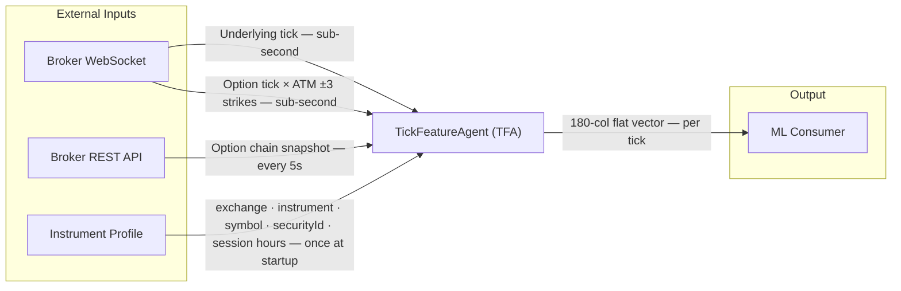
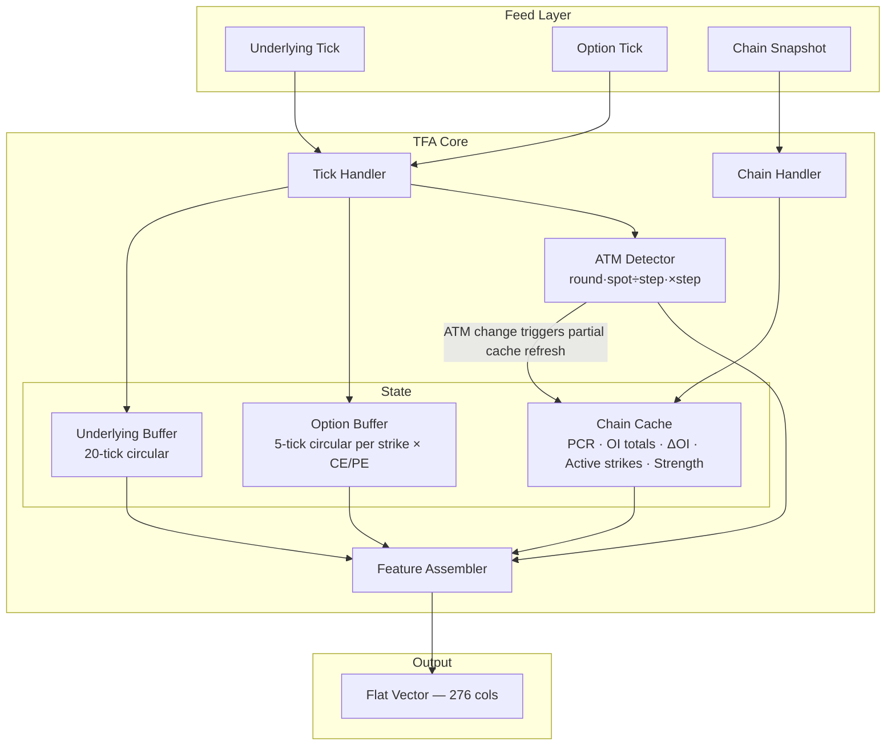
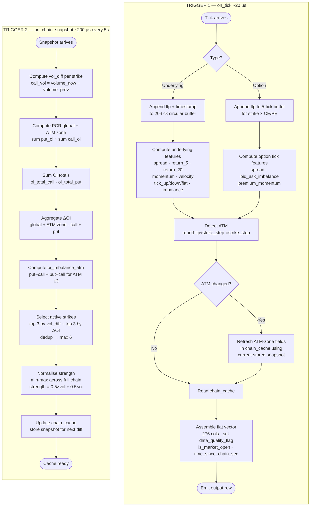

# TickFeatureAgent (TFA)
## Specification Document — Tick + Option Chain Feature Engineering System

---

## 0. Pre-Requisite Data

### 0.1 Real-Time Feed Data *(must be live before system starts)*

| Feed | Fields Required | Frequency | Source |
|------|----------------|-----------|--------|
| NIFTY Futures tick | `timestamp`, `ltp`, `bid`, `ask`, `volume` | Per trade event | Broker WebSocket |
| Option tick (full current expiry chain) | `timestamp`, `strike`, `option_type`, `ltp`, `bid`, `ask`, `bid_size`, `ask_size`, `volume` | Per trade event | Broker WebSocket |
| Option chain snapshot | `chain_timestamp` + per-strike: `strike`, `call_oi`, `put_oi`, `call_volume`, `put_volume`, `call_delta_oi`, `put_delta_oi` | Every 5 seconds | NSE / Broker REST API |

### 0.2 Reference / Static Data *(loaded once at startup)*

| Data | Used For |
|------|----------|
| NSE market holidays calendar | `is_market_open` flag |
| Market session hours (from Instrument Profile `session_start` / `session_end`) | `is_market_open` flag |

### 0.3 Runtime State *(maintained in-memory during session)*

| State | Size | Used For |
|-------|------|----------|
| Underlying tick history buffer | Last 20 ticks (price + timestamp) | `return_5ticks`, `return_20ticks`, `momentum`, `velocity`, tick count features |
| Option tick history buffer (per strike) | Last 5 ticks per strike × CE/PE — maintained for **all subscribed chain strikes** | `premium_momentum` per strike — buffers grow from session open, no resets |
| Current option chain snapshot | Full chain (all strikes) | PCR, OI features, active strike selection, strength normalization |
| Previous option chain snapshot | Full chain (all strikes) | `call_vol_diff`, `put_vol_diff` computation |
| Current ATM state | `atm_strike`, `atm_window_strikes`, `strike_step` | Feature window calculation only — does not drive subscriptions |
| Full chain subscription set | All strikes × CE+PE for current expiry | Subscribed once at startup; updated on expiry rollover or mid-session new strike detection |
| Buffer retention | All subscribed chain strikes | Buffers never cleared mid-session — accumulate from session open until expiry rollover |
| `chain_available` flag | Boolean | Quality flag — `false` until first snapshot received |
| `vol_diff_available` flag | Boolean | Quality flag — `false` until second snapshot received |

### 0.4 Infrastructure Prerequisites

| Requirement | Detail |
|-------------|--------|
| Broker API credentials | API key + access token for WebSocket and REST |
| WebSocket connection | Real-time tick subscriptions (underlying + options) |
| REST / HTTP connection | Option chain polling every 5 seconds |
| Timezone | IST (UTC+5:30) — all timestamps and session logic |
| Clock synchronization | System clock must be accurate for `chain_timestamp <= tick_time` |

### 0.5 Startup Validation Checklist

Before the first tick is processed:

- [ ] Broker API connected and authenticated
- [ ] Instrument profile loaded (`exchange`, `instrument_name`, `underlying_symbol`, `underlying_security_id`, `session_start`, `session_end`)
- [ ] Current near-month futures contract symbol resolved and confirmed active
- [ ] Option chain endpoint accessible and returning all required fields
- [ ] `bid_size` / `ask_size` confirmed available in option tick feed
- [ ] `call_delta_oi` / `put_delta_oi` confirmed in chain snapshot response
- [ ] Full current expiry chain fetched — all strikes × CE+PE subscribed on WebSocket
- [ ] Strike count confirmed (log: `subscribed N instruments for expiry YYYY-MM-DD`)
- [ ] System clock timezone set to IST (UTC+5:30)

---

## 0.6 Instrument Profile

Loaded once at startup. Parametrizes all exchange-specific and instrument-specific values.

| Parameter | Type | Description | Example (NIFTY) | Example (CRUDEOIL) | Example (NATURALGAS) |
|-----------|------|-------------|-----------------|---------------------|----------------------|
| `exchange` | string | Exchange name | `NSE` | `MCX` | `MCX` |
| `instrument_name` | string | Instrument identifier | `NIFTY` | `CRUDEOIL` | `NATURALGAS` |
| `underlying_symbol` | string | Active futures contract symbol | `NIFTY25MAYFUT` | `CRUDEOIL25MAYFUT` | `NATURALGAS25MAYFUT` |
| `underlying_security_id` | string | Broker-assigned security ID for underlying | `26000` | `234230` | `234235` |
| `session_start` | string | Market open time (IST, HH:MM) | `09:15` | `09:00` | `09:00` |
| `session_end` | string | Market close time (IST, HH:MM) | `15:30` | `23:30` | `23:30` |
| `underlying_tick_timeout_sec` | int | Max gap in underlying ticks before quality flag fires | `5` | `30` | `30` |
| `option_tick_timeout_sec` | int | Max gap in ATM-zone option ticks before quality flag fires | `30` | `120` | `120` |
| `momentum_staleness_threshold_sec` | int | Max time span of 5-tick buffer for valid `premium_momentum` | `60` | `120` | `120` |

> **Profile is read-only at runtime.** Changes take effect on next session startup. If a mismatch is detected mid-session (symbol, security ID, or session hours), TFA emits an `INSTRUMENT_PROFILE_MISMATCH` alert (WARN) and sets `data_quality_flag = 0`.

---

## 1. Purpose

Build a real-time data processing system that:

- Combines tick data and option chain data
- Extracts price, order flow, and positioning signals
- Generates structured feature output per tick

**Objective:** Create a high-quality feature dataset for:
- Short-term trading analysis
- Machine learning model input

**Target instruments:** NIFTY 50 options (NSE), Crude Oil options (MCX), Natural Gas options (MCX)

---

## 2. Design Principles

| Use | Avoid |
|-----|-------|
| Real market price data | Greeks |
| Order flow (bid/ask, volume) | Implied volatility models |
| OI / volume data | |

---

## 3. Scope

**Included:**
- Data ingestion
- Data synchronization
- ATM detection
- Active strike detection
- Feature engineering
- JSON output generation

**Excluded:**
- Model training
- Trade execution
- Risk management

---

## 4. Data Requirements

### 4.1 Underlying Tick Data (near-month futures contract)

> **Note:** The underlying feed is the near-month futures contract for the configured instrument (from `underlying_symbol` in the Instrument Profile), not the spot index. Futures LTP is used as the spot price proxy for ATM calculation.
>
> **Rollover:** Managed externally by the feed/subscription layer. The feature engine always processes whichever futures symbol is currently active. TFA validates each incoming underlying tick's `security_id` against `underlying_security_id` in the Instrument Profile. On mismatch, TFA emits an `UNDERLYING_SYMBOL_MISMATCH` alert (WARN) and sets `data_quality_flag = 0` for that tick. Stale-symbol filtering is the feed layer's responsibility.

| Field | Description |
|-------|-------------|
| `timestamp` | Event time |
| `ltp` | Last traded price (used as spot price proxy) |
| `bid` | Best bid price |
| `ask` | Best ask price |
| `volume` | Per-tick traded quantity (quantity of this specific trade event) |

### 4.2 Option Tick Data (full current expiry chain)

> **Subscription strategy:** Subscribe all strikes × CE+PE for the current expiry at startup. This eliminates subscription churn on ATM shifts, ensures all buffers are warm regardless of spot movement, and provides tick data for active strikes anywhere in the chain.
>
> **Feature window:** Only ATM ±3 strikes (7 strikes) are included in option tick feature output. All other subscribed strikes maintain live 5-tick buffers but do not appear in ATM tick feature columns.
>
> **Active strikes:** Any active strike identified from the chain snapshot has its tick buffer already warm — no warm-up delay regardless of strike position.
>
> **Mid-session new strikes:** If the exchange adds new strikes during the session (detected via chain snapshot diff): (1) subscribe new strikes × CE+PE, (2) initialise empty tick buffers, (3) emit `NEW_STRIKES_DETECTED` alert.
>
> **Volume (`volume` field):** TFA treats each WebSocket tick event as atomic. `volume` reflects the quantity field in that event as-is. Aggregation behaviour depends on the broker's feed implementation and is outside TFA's scope.
>
> **Expiry rollover:** Unsubscribe all current expiry strikes, subscribe all next expiry strikes, clear all option tick buffers. Emit `EXPIRY_ROLLOVER` alert.

| Field | Description |
|-------|-------------|
| `timestamp` | Event time |
| `strike` | Strike price |
| `option_type` | `CE` or `PE` |
| `ltp` | Last traded price |
| `bid` | Best bid price |
| `ask` | Best ask price |
| `bid_size` | Quantity available at best bid |
| `ask_size` | Quantity available at best ask |
| `volume` | Per-tick traded quantity (quantity of this specific trade event) |

### 4.3 Option Chain Snapshot (Every 5 Seconds)

**Expiry rule:** Use the **nearest weekly expiry**. Expiry date is read directly from the broker's chain snapshot (per-instrument expiry date field) — no separate calendar required.

**Rollover detection algorithm:**
> On each chain snapshot arrival:
> ```
> if today == snapshot.expiry_date AND snapshot_time >= 14:30:00 IST:
>     if not rolled_over_flag:
>         trigger_expiry_rollover()
>         rolled_over_flag = True   ← guard: fires once per session
> ```
> `rolled_over_flag` resets to `False` at each session open. All timestamps normalised to IST (UTC+5:30) on receipt.

Must include **all strikes** for the current expiry.

**Snapshot-level field** (applies to the whole snapshot, not per-strike):

| Field | Description |
|-------|-------------|
| `chain_timestamp` | Timestamp of this option chain snapshot |

**Per-strike fields:**

| Field | Description |
|-------|-------------|
| `strike` | Strike price |
| `call_oi` | Call open interest |
| `put_oi` | Put open interest |
| `call_volume` | Cumulative daily call volume (use snapshot diff for activity signal) |
| `put_volume` | Cumulative daily put volume (use snapshot diff for activity signal) |
| `call_delta_oi` | Change in call OI per strike from **start of day** (intraday ΔOI, provided by NSE feed) |
| `put_delta_oi` | Change in put OI per strike from **start of day** (intraday ΔOI, provided by NSE feed) |

---

## 5. Data Synchronization

**Rule:** For each tick, `chain_timestamp <= tick_time`

- Attach the latest available option chain snapshot to each tick
- Never use future data (no lookahead)

**Output per tick row:**
```
tick_data + option_chain_context (latest snapshot at or before tick_time)
```

---

## 6. Dynamic ATM Selection

**Strike step detection:** On option chain load, compute:
```
strike_step = min(diff between consecutive strikes in chain)
```
> **Fatal condition:** If chain has fewer than 2 strikes at startup, TFA halts with error. There is no safe fallback — a wrong `strike_step` silently corrupts all ATM-zone features.

**Logic:**
```
ATM = round(spot / strike_step) * strike_step
ATM window = ATM - 3×strike_step  to  ATM + 3×strike_step  (7 strikes total)
```

**Output:**
- `atm_strike`: the identified ATM strike
- `atm_window_strikes`: list of 7 computed strike prices (ATM ±3) — the **feature window**. This is a computed window, not a list of confirmed traded instruments. Whether each strike has data is indicated by `tick_available` and `NaN` chain features.
- `strike_step`: detected step value (for traceability)

> **ATM change does not trigger subscription changes.** Full chain is already subscribed. ATM change updates the feature window pointer and triggers a partial cache refresh (ATM-zone fields only). The output row always reflects the **new** ATM window.

---

## 7. Active Strike Identification

**Source:** Option chain snapshot

**Selection criteria:**
1. **Volume set:** Top 3 strikes by `(call_vol_diff + put_vol_diff)`, non-zero only
2. **ΔOI set:** Top 3 strikes by `abs(call_delta_oi) + abs(put_delta_oi)`, non-zero only
3. **Union + dedup** → max 6 strikes

**Tiebreaker** (identical combined score): ascending `abs(strike - spot_price)` (closer to ATM wins); if still equal, strike > spot preferred over strike < spot.

**Slot ordering:** Active strikes sorted by descending `(call_strength + put_strength) / 2` (combined strength), same tiebreaker as above. Slot 0 = highest combined strength.

**If zero strikes qualify for both criteria:** output `active_strikes = []` (valid market state, not a quality flag trigger)

**First snapshot edge case:** No `vol_prev` exists → `vol_diff_available = false`, set `call_vol_diff = put_vol_diff = 0` for all strikes. `data_quality_flag = 0`.

**Output:** `active_strikes` — list of up to **6** unique high-activity strikes (can be empty), each carrying independent `call` and `put` strength data

---

## 8. Feature Reference: Source & Calculation

### 8.1 Root

| Property | Source | Calculation |
|----------|--------|-------------|
| `timestamp` | Underlying tick | Direct value from tick |

### 8.2 Underlying Features

| Property | Source | Calculation |
|----------|--------|-------------|
| `ltp` | Underlying tick | Last traded price |
| `bid` | Underlying tick | Best bid |
| `ask` | Underlying tick | Best ask |
| `spread` | Underlying tick | `ask - bid` |
| `return_5ticks` | Tick history | `(price_now - price_5_ticks_ago) / price_5_ticks_ago` |
| `return_20ticks` | Tick history | `(price_now - price_20_ticks_ago) / price_20_ticks_ago` |
| `momentum` | Tick history | `price_now - price_5_ticks_ago` |
| `velocity` | Tick history | `(price_now - prev_price) / max(time_diff_seconds, 1.0)` — 1-second floor prevents extreme values from sub-millisecond ticks; `null` for tick 1; skip update if `time_diff <= 0` (duplicate/out-of-order timestamp) |
| `tick_up_count_20` | Tick history | Count of ticks where `price_now > price_prev` in last 20 |
| `tick_down_count_20` | Tick history | Count of ticks where `price_now < price_prev` in last 20 |
| `tick_flat_count_20` | Tick history | Count of ticks where `price_now == price_prev` in last 20 |
| `tick_imbalance_20` | Tick history | `(up - down) / (up + down)` — flat ticks excluded; `NaN` if `up + down = 0` (no directional activity) |

### 8.3 ATM Context

| Property | Source | Calculation |
|----------|--------|-------------|
| `spot_price` | Underlying tick | LTP |
| `atm_strike` | Calculated | `round(spot / strike_step) * strike_step` |
| `atm_window_strikes` | Calculated | ATM ±3 computed strike prices (7 total) — feature window, not guaranteed to exist in chain |
| `strike_step` | Detected | `min(diff between consecutive strikes)` — fatal if < 2 strikes |

### 8.4 Option Tick Features (ATM ±3 feature window, per strike)

> **Subscription vs feature window:** All chain strikes are subscribed and maintain live 5-tick buffers. Only the 7 strikes in the ATM ±3 feature window are included in this output group. Active strikes outside ATM ±3 have their tick features in Section 8.6.

| Property | Source | Calculation |
|----------|--------|-------------|
| `ltp` | Option tick | Last traded price |
| `bid` | Option tick | Best bid |
| `ask` | Option tick | Best ask |
| `spread` | Option tick | `ask - bid` |
| `volume` | Option tick | Direct |
| `bid_ask_imbalance` | Option tick | `(bid_size - ask_size) / (bid_size + ask_size)` — `null` if `bid_size + ask_size = 0` |
| `premium_momentum` | Option tick history | `current_ltp - ltp_5_ticks_ago` (null for first 4 ticks) |

### 8.5 Option Chain Features

**Naming convention:** `{metric}_{type}_{scope}` — no scope suffix = global (all strikes), `_atm` = ATM ±3 zone only.

| Property | Scope | Source | Calculation |
|----------|-------|--------|-------------|
| `pcr_global` | Global | Option chain (all strikes) | `sum(put_oi) / sum(call_oi)` — `null` if `sum(call_oi) = 0` |
| `pcr_atm` | ATM zone | ATM ±3 strikes | `sum(put_oi) / sum(call_oi)` for ATM ±3 — `null` if `sum(call_oi) = 0` |
| `oi_total_call` | Global | Option chain | `sum(call_oi)` across all strikes |
| `oi_total_put` | Global | Option chain | `sum(put_oi)` across all strikes |
| `oi_change_call` | Global | Option chain | `sum(call_delta_oi)` across all strikes |
| `oi_change_put` | Global | Option chain | `sum(put_delta_oi)` across all strikes |
| `oi_change_call_atm` | ATM zone | ATM ±3 strikes | `sum(call_delta_oi)` for ATM ±3 only |
| `oi_change_put_atm` | ATM zone | ATM ±3 strikes | `sum(put_delta_oi)` for ATM ±3 only |
| `oi_imbalance_atm` | ATM zone | ATM ±3 strikes | `(sum(put_oi) - sum(call_oi)) / (sum(put_oi) + sum(call_oi))` — `null` if both are 0 |

### 8.6 Active Strike Features (per strike)

Each active strike carries independent `call` and `put` sides. A strike can act as both resistance and support simultaneously.

Since the full chain is subscribed, every active strike has a live 5-tick buffer — tick features are always available with no warm-up delay.

**Chain-derived features (from option chain snapshot):**

| Property | Source | Calculation |
|----------|--------|-------------|
| `strike` | Option chain | Selected top strike |
| `distance_from_spot` | Calculated | `strike - spot_price` |
| `call.level_type` | Derived | Always `resistance` |
| `call.strength_volume` | Option chain | `(call_vol_diff - min) / (max - min)` — min/max across **all strikes in full chain snapshot** |
| `call.strength_oi` | Option chain | `(abs(call_delta_oi) - min) / (max - min)` — min/max across **all strikes in full chain snapshot** |
| `call.strength` | Calculated | `0.5 × call.strength_volume + 0.5 × call.strength_oi` |
| `put.level_type` | Derived | Always `support` |
| `put.strength_volume` | Option chain | `(put_vol_diff - min) / (max - min)` — min/max across **all strikes in full chain snapshot** |
| `put.strength_oi` | Option chain | `(abs(put_delta_oi) - min) / (max - min)` — min/max across **all strikes in full chain snapshot** |
| `put.strength` | Calculated | `0.5 × put.strength_volume + 0.5 × put.strength_oi` |

**Tick-derived features (from live option tick feed):**

| Property | Source | Calculation |
|----------|--------|-------------|
| `call.ltp` | Option tick | Call last traded price |
| `call.bid` | Option tick | Call best bid |
| `call.ask` | Option tick | Call best ask |
| `call.spread` | Computed | `call.ask - call.bid` |
| `call.volume` | Option tick | Call per-tick traded quantity |
| `call.bid_ask_imbalance` | Computed | `(bid_size - ask_size) / (bid_size + ask_size)` — `null` if denominator = 0 |
| `call.premium_momentum` | Tick history | `call.ltp_now - call.ltp_5_ticks_ago` — `NaN` if strike buffer has < 5 ticks OR time span between oldest and newest tick in buffer exceeds `momentum_staleness_threshold_sec` (Instrument Profile) |
| `call.tick_age_sec` | System | Seconds since last tick received for this strike (call side); `NaN` if `tick_available = 0` |
| `put.ltp` | Option tick | Put last traded price |
| `put.bid` | Option tick | Put best bid |
| `put.ask` | Option tick | Put best ask |
| `put.spread` | Computed | `put.ask - put.bid` |
| `put.volume` | Option tick | Put per-tick traded quantity |
| `put.bid_ask_imbalance` | Computed | `(bid_size - ask_size) / (bid_size + ask_size)` — `null` if denominator = 0 |
| `put.premium_momentum` | Tick history | `put.ltp_now - put.ltp_5_ticks_ago` — `NaN` if strike buffer has < 5 ticks OR time span exceeds `momentum_staleness_threshold_sec` |
| `put.tick_age_sec` | System | Seconds since last tick received for this strike (put side); `NaN` if `tick_available = 0` |
| `tick_available` | System | `1` if strike has received ≥1 tick since session open or last expiry rollover; `0` if not yet ticked. Resets to `0` on expiry rollover. |

**Normalization:** Min-max computed **per snapshot**, cross-sectional across **all strikes in the current snapshot** (including zero-activity strikes). If `max == min` (includes all-zero case), set all to `0.5`.

**Strength interpretation:**
- `strength_volume` — current participation (activity, from snapshot vol diff)
- `strength_oi` — new position build-up (commitment, from abs ΔOI)
- `strength` — combined signal (activity + commitment)

**Null handling for tick features:** If `tick_available = 0` (strike has never ticked this session), all tick-derived fields for that strike = `null`.

### 8.7 Meta Features

| Property | Source | Calculation |
|----------|--------|-------------|
| `exchange` | Instrument Profile | Exchange name: `NSE` / `MCX` |
| `instrument` | Instrument Profile | Instrument name: `NIFTY` / `CRUDEOIL` / `NATURALGAS` |
| `underlying_symbol` | Instrument Profile | Active futures contract symbol e.g. `NIFTY25MAYFUT` |
| `underlying_security_id` | Instrument Profile | Broker-assigned security ID for the underlying |
| `chain_timestamp` | Option chain | Snapshot timestamp — `null` if `chain_available = false` |
| `time_since_chain_sec` | Calculated | `tick_time - chain_timestamp` — `null` if `chain_available = false` |
| `chain_available` | System | `false` until first snapshot received, then `true` |
| `data_quality_flag` | System | `1` = valid, `0` = invalid (see conditions below) |
| `is_market_open` | System | `1` during `session_start`–`session_end` IST (from Instrument Profile), else `0` |

**`data_quality_flag` 3-state progression:**

| State | `chain_available` | `vol_diff_available` | `data_quality_flag` |
|-------|------------------|---------------------|-------------------|
| Before first snapshot | `0` | `0` | `0` |
| After 1st snapshot, before 2nd | `1` | `0` | `0` |
| Normal operation (≥2 snapshots) | `1` | `1` | `1` (unless other condition fails) |

On expiry rollover, both flags reset to `0` — same progression as session startup.

**`data_quality_flag = 0` when any of the following:**
- `chain_available = 0` (no snapshot received yet, or post-rollover before first new-expiry snapshot)
- `vol_diff_available = 0` (first snapshot received, no previous snapshot to diff against)
- 5-tick buffer not yet full (first 4 ticks of session)
- 20-tick buffer not yet full (first 19 ticks of session)
- `time_since_chain_sec > 30` (chain snapshot is stale)
- No underlying tick received within `underlying_tick_timeout_sec` (from Instrument Profile)
- No ATM-zone option tick received within `option_tick_timeout_sec` (from Instrument Profile)
- `UNDERLYING_SYMBOL_MISMATCH` detected on incoming tick
- `INSTRUMENT_PROFILE_MISMATCH` detected mid-session

### 8.8 Implementation Notes

| Note | Detail |
|------|--------|
| Rolling buffer warm-up (session start) | `velocity` → `null` for tick 1 only; `return_5ticks`, `momentum`, `premium_momentum` → `null` for ticks 1–4; `return_20ticks`, `tick_imbalance_20`, `tick_up_count_20`, `tick_down_count_20`, `tick_flat_count_20` → `null` for ticks 1–19 |
| Rolling buffer warm-up (option strikes) | Full chain subscribed from session open — all strike buffers warm by the time ATM shifts or a strike becomes active. Exception: deep OTM strikes that never trade may have `tick_available = 0` all session |
| No chain at startup | Output `null` for all chain features; set `data_quality_flag = 0`, `chain_available = false` |
| First chain snapshot | No `vol_prev` exists → `vol_diff = 0` for all strikes; active strike volume ranking unreliable; `data_quality_flag = 0` |
| Quality flag | Set `data_quality_flag = 0` when: `chain_available = false`, `vol_diff_available = false` (first snapshot), any buffer not full, or `time_since_chain_sec > 30` |
| Missing ATM strikes | `option_tick_features` always contains exactly 7 entries (one per `atm_window_strikes`). If a strike has never ticked, its entry is present with all tick fields = `null` and `tick_available = 0`. `atm_window_strikes` lists all 7 computed prices regardless of chain existence. |
| PCR / OI imbalance | `pcr_global`, `pcr_atm` → `null` if `sum(call_oi) = 0`; `oi_imbalance_atm` → `null` if both OI totals are 0 |
| Velocity unit | `time_diff` in seconds with 1-second floor; skip update on zero/negative delta (duplicate or out-of-order tick) |
| `time_since_chain_sec` as staleness indicator | When `time_since_chain_sec > 30`, chain features are stale. Model uses this column to learn staleness sensitivity. No separate stale column needed. |
| Volume signal | `call_vol_diff = call_volume_now - call_volume_prev`; `put_vol_diff = put_volume_now - put_volume_prev` (snapshot diff); raw `call_volume`/`put_volume` from feed is cumulative daily |
| ΔOI ranking | Use `abs(call_delta_oi) + abs(put_delta_oi)` for active strike selection (magnitude, not signed) |
| Strength normalization | Min-max across all strikes in the full chain snapshot (not just active strikes) |
| Chain staleness | Threshold = 30 seconds; flag but still output chain-derived features |
| No leakage | Never use future tick or chain data — enforce `chain_timestamp <= tick_time` strictly |

---

### 8.9 Computation Model

**Three independent triggers:**

| Trigger | Frequency | Action |
|---------|-----------|--------|
| **New tick** (underlying or option) | Sub-second | Update buffer · compute tick features · assemble output |
| **New chain snapshot** | Every ~5 seconds | Recompute all chain-derived features · update cache |
| **Subscription event** (startup / rollover / new strike) | Once or rarely | Manage WebSocket subscriptions · emit alerts |

**Subscription lifecycle:**

```
on_startup():
    retry_count = 0
    while retry_count < 12:          ← retry every 5s, up to 60s total
        snapshot = fetch_chain_snapshot()
        if snapshot is valid: break
        retry_count += 1
        sleep(5)
    if snapshot is None:
        emit alert: CHAIN_UNAVAILABLE (CRITICAL)
        halt()
    if len(snapshot.strikes) < 2:
        halt("Fatal: chain has fewer than 2 strikes — cannot detect strike_step")
    strike_step = detect_strike_step(snapshot)
    subscribe all strikes × CE+PE for current expiry    ← full chain
    log: "subscribed N instruments for expiry YYYY-MM-DD"

on_chain_snapshot(snapshot):
    new_strikes = snapshot.strikes - subscribed_strikes
    if new_strikes:
        subscribe(new_strikes)                          ← subscribe first
        initialise_buffers(new_strikes)                 ← then init buffers
        emit alert: NEW_STRIKES_DETECTED                ← then alert
    check_expiry_rollover(snapshot)

on_expiry_rollover():
    old_security_ids = current_subscribed_security_ids  ← retain for grace window
    unsubscribe all current expiry strikes
    clear all option tick buffers
    reset chain_available = False
    reset vol_diff_available = False
    reset tick_available = 0 for all strikes
    subscribe all next expiry strikes × CE+PE
    start_grace_timer(old_security_ids, duration=5s)    ← discard late old-expiry ticks
    emit alert: EXPIRY_ROLLOVER

on_grace_timer_expired(old_security_ids):
    release old_security_ids set from memory

on_option_tick(tick):
    if tick.security_id in grace_window_old_ids:
        discard silently                                ← late old-expiry tick
        return
```

**Chain cache:**

Chain-derived features are computed once on snapshot arrival. Every tick reads from cache — no chain recomputation per tick.

```
on_chain_snapshot(snapshot):
    chain_cache.pcr_global          = compute_pcr_global(snapshot)
    chain_cache.pcr_atm             = compute_pcr_atm(snapshot, atm_strike)
    chain_cache.oi_total_call       = sum(snapshot.call_oi)
    chain_cache.oi_total_put        = sum(snapshot.put_oi)
    chain_cache.oi_change_call      = sum(snapshot.call_delta_oi)
    chain_cache.oi_change_put       = sum(snapshot.put_delta_oi)
    chain_cache.oi_change_call_atm  = sum(snapshot.call_delta_oi for ATM ±3)
    chain_cache.oi_change_put_atm   = sum(snapshot.put_delta_oi for ATM ±3)
    chain_cache.oi_imbalance_atm    = compute_oi_imbalance_atm(snapshot, atm_strike)
    chain_cache.active_strikes      = select_active_strikes(snapshot)
    chain_cache.strength            = compute_strength(snapshot)
    chain_cache.timestamp           = snapshot.chain_timestamp

on_tick(tick):
    update_buffer(tick)                               ← O(1)
    atm_strike = compute_atm(tick.ltp)               ← O(1), no subscription change
    if atm_strike changed:
        ← partial refresh: re-derive ATM-zone fields from stored snapshot
        chain_cache.pcr_atm            = compute_pcr_atm(stored_snapshot, new_atm)
        chain_cache.oi_change_call_atm = sum(stored_snapshot.call_delta_oi for new ATM ±3)
        chain_cache.oi_change_put_atm  = sum(stored_snapshot.put_delta_oi for new ATM ±3)
        chain_cache.oi_imbalance_atm   = compute_oi_imbalance_atm(stored_snapshot, new_atm)
        chain_cache.active_strikes     = select_active_strikes(stored_snapshot)
        chain_cache.strength           = compute_strength(stored_snapshot)
        ← global fields unchanged: pcr_global, oi_total_call/put, oi_change_call/put
    tick_features = compute_tick_features(tick)      ← O(1)
    output = assemble_flat_vector(tick_features, chain_cache)
    emit(output)
```

**Buffer retention policy:**

Option tick buffers are maintained for all subscribed strikes. Buffers are never cleared mid-session except on expiry rollover. Deep OTM strikes that never trade retain empty buffers (`tick_available = 0`) — this is a valid state.

| Condition | Buffer action |
|-----------|--------------|
| Strike subscribed (session open) | Buffer initialised, accumulates from first tick |
| ATM shifts — strike exits feature window | Buffer retained — full chain still subscribed |
| Active strikes change | Buffer retained — full chain subscribed, no cleanup mid-session |
| Expiry rollover | All option tick buffers cleared |

**Performance budget per tick (Python):**

| Step | Cost |
|------|------|
| Buffer update (underlying + option) | ~10 µs |
| ATM detection | ~1 µs |
| Flat vector assembly from cache | ~10 µs |
| **Total per tick** | **~20 µs** |
| Chain cache recompute (every 5s) | ~200 µs (one-time) |
| Subscription management (startup) | ~500 ms (one-time) |

> **Budget is a design target, not a hard constraint.** TFA never drops ticks due to processing time. If rolling 1000-tick average latency exceeds the budget, emit `PERFORMANCE_DEGRADED` alert (WARN) with `{avg_tick_latency_ms, budget_ms}` payload. Measurement checked every 100 ticks.
>
> **Memory footprint:** All tick buffers are fixed-size circular — 20 ticks for underlying, 5 ticks per strike × CE/PE for options. For NIFTY (~200 strikes): `200 × 2 × 5 ticks × ~16 bytes ≈ 32 KB`. Memory is constant regardless of session duration or tick rate.

---

### 8.10 System Events & Alerts

TFA emits structured alert events alongside the feature stream. Alerts are not feature rows — they are operational notifications that the consumer or operator must handle.

#### Alert Schema

Every alert has the same envelope:

```json
{
  "event_type": "<string>",
  "severity":   "<INFO | WARN | CRITICAL>",
  "timestamp":  "<ISO8601>",
  "instrument": "<NIFTY | CRUDEOIL | NATURALGAS>",
  "exchange":   "<NSE | MCX>",
  "payload":    { }
}
```

#### Alert Events

**EXPIRY_ROLLOVER**

Emitted when TFA detects the active expiry has changed and executes rollover.

| Field | Severity | Trigger |
|-------|----------|---------|
| `EXPIRY_ROLLOVER` | `CRITICAL` | Current expiry date reached and rollover condition met (provided expiry list) |

```json
{
  "event_type": "EXPIRY_ROLLOVER",
  "severity":   "CRITICAL",
  "timestamp":  "2024-01-18T14:30:01.042Z",
  "instrument": "NIFTY",
  "exchange":   "NSE",
  "payload": {
    "old_expiry":          "2024-01-18",
    "new_expiry":          "2024-01-25",
    "unsubscribed_strikes": 98,
    "subscribed_strikes":   102,
    "buffers_cleared":      true
  }
}
```

> **Action required:** Operator must verify new expiry chain loaded correctly and `chain_available` returns to `true` before trusting feature output.

---

**NEW_STRIKES_DETECTED**

Emitted when a chain snapshot contains strikes not seen in previous snapshots — exchange added new strikes mid-session due to spot movement.

| Field | Severity | Trigger |
|-------|----------|---------|
| `NEW_STRIKES_DETECTED` | `WARN` | Chain snapshot contains strikes absent from current subscription set |

```json
{
  "event_type": "NEW_STRIKES_DETECTED",
  "severity":   "WARN",
  "timestamp":  "2024-01-15T11:42:03.210Z",
  "instrument": "NIFTY",
  "exchange":   "NSE",
  "payload": {
    "new_strikes":        [23100, 23150],
    "option_types":       ["CE", "PE"],
    "subscribed":         true,
    "chain_size_before":  98,
    "chain_size_after":   102
  }
}
```

> **Action required:** None mandatory — TFA auto-subscribes new strikes. Operator should note chain expansion for data pipeline awareness.

---

**CHAIN_STALE**

Emitted when no chain snapshot has been received within the staleness threshold (30 seconds).

| Field | Severity | Trigger |
|-------|----------|---------|
| `CHAIN_STALE` | `WARN` | `time_since_chain_sec > 30` |

```json
{
  "event_type": "CHAIN_STALE",
  "severity":   "WARN",
  "timestamp":  "2024-01-15T10:15:33.000Z",
  "instrument": "NIFTY",
  "exchange":   "NSE",
  "payload": {
    "last_chain_timestamp":  "2024-01-15T10:14:58.000Z",
    "time_since_chain_sec":  35.0,
    "data_quality_flag":     0
  }
}
```

---

**DATA_QUALITY_CHANGE**

Emitted when `data_quality_flag` transitions between `0` and `1`.

| Field | Severity | Trigger |
|-------|----------|---------|
| `DATA_QUALITY_CHANGE` | `INFO` (0→1) / `WARN` (1→0) | `data_quality_flag` value changes |

```json
{
  "event_type": "DATA_QUALITY_CHANGE",
  "severity":   "INFO",
  "timestamp":  "2024-01-15T09:15:45.120Z",
  "instrument": "NIFTY",
  "exchange":   "NSE",
  "payload": {
    "from": 0,
    "to":   1,
    "reason": "buffers_full"
  }
}
```

`reason` values: `buffers_full` · `chain_received` · `chain_stale` · `vol_diff_available` · `rollover_in_progress`

---

---

**UNDERLYING_SYMBOL_MISMATCH**

Emitted when an incoming underlying tick's `security_id` does not match `underlying_security_id` in the Instrument Profile.

| Field | Severity | Trigger |
|-------|----------|---------|
| `UNDERLYING_SYMBOL_MISMATCH` | `WARN` | Tick security ID ≠ Instrument Profile `underlying_security_id` |

> `data_quality_flag = 0` for the mismatched tick. Feed layer is responsible for filtering stale-symbol ticks.

---

**INSTRUMENT_PROFILE_MISMATCH**

Emitted when a runtime condition conflicts with the loaded Instrument Profile (e.g., session hours, symbol, or security ID discrepancy detected mid-session).

| Field | Severity | Trigger |
|-------|----------|---------|
| `INSTRUMENT_PROFILE_MISMATCH` | `WARN` | Runtime state conflicts with Instrument Profile values |

> `data_quality_flag = 0` until resolved. Profile changes require TFA restart.

---

**CHAIN_UNAVAILABLE**

Emitted when chain REST API fails to return a valid snapshot after all startup retries are exhausted.

| Field | Severity | Trigger |
|-------|----------|---------|
| `CHAIN_UNAVAILABLE` | `CRITICAL` | 12 consecutive snapshot fetch failures at startup (60 seconds) |

> TFA halts after emitting this alert. Operator must restore chain API connectivity and restart TFA.

---

**PERFORMANCE_DEGRADED**

Emitted when rolling 1000-tick average processing latency exceeds the per-tick budget.

| Field | Severity | Trigger |
|-------|----------|---------|
| `PERFORMANCE_DEGRADED` | `WARN` | Rolling avg tick latency > 20 µs (checked every 100 ticks) |

```json
{
  "event_type": "PERFORMANCE_DEGRADED",
  "severity":   "WARN",
  "timestamp":  "2024-01-15T10:30:00.000Z",
  "instrument": "NIFTY",
  "exchange":   "NSE",
  "payload": {
    "avg_tick_latency_ms": 0.045,
    "budget_ms": 0.020
  }
}
```

---

#### Alert Summary

| Event | Severity | Auto-handled by TFA | Operator action needed |
|-------|----------|--------------------|-----------------------|
| `EXPIRY_ROLLOVER` | CRITICAL | Yes — auto re-subscribes | Verify new chain loaded |
| `NEW_STRIKES_DETECTED` | WARN | Yes — auto subscribes new | Note chain expansion |
| `CHAIN_STALE` | WARN | No — continues with stale data | Check REST API connectivity |
| `DATA_QUALITY_CHANGE` | INFO/WARN | Yes — flag set in output | Monitor transitions |
| `UNDERLYING_SYMBOL_MISMATCH` | WARN | Partial — sets quality flag | Check feed layer symbol config |
| `INSTRUMENT_PROFILE_MISMATCH` | WARN | Partial — sets quality flag | Restart TFA with corrected profile |
| `CHAIN_UNAVAILABLE` | CRITICAL | No — halts | Restore chain API, restart TFA |
| `PERFORMANCE_DEGRADED` | WARN | No — continues processing | Investigate tick processing bottleneck |

---

## 9. Output Format

Each tick produces one JSON object.

> **Note on `option_tick_features`:** Always contains exactly 14 entries — one per `atm_window_strikes` × CE + PE (7 strikes × 2). If a strike has never ticked, its entry is present with tick fields = `null` and `tick_available = 0`.

```json
{
  "timestamp": "2024-01-15T09:32:01.123Z",

  "underlying": {
    "ltp": 21850.5,
    "bid": 21849.0,
    "ask": 21852.0,
    "spread": 3.0,
    "return_5ticks": 0.0012,
    "return_20ticks": 0.0031,
    "momentum": 26.5,
    "velocity": 0.45,
    "tick_up_count_20": 13,
    "tick_down_count_20": 7,
    "tick_flat_count_20": 0,
    "tick_imbalance_20": 0.30
  },

  "atm_context": {
    "spot_price": 21850.5,
    "atm_strike": 21850,
    "strike_step": 50,
    "atm_window_strikes": [21700, 21750, 21800, 21850, 21900, 21950, 22000]
  },

  "option_tick_features": {
    "21700_CE": { "ltp": 45.0, "bid": 44.5, "ask": 45.5, "spread": 1.0, "volume": 12, "bid_ask_imbalance": 0.05, "premium_momentum": -0.2 },
    "21700_PE": { "ltp": 310.0, "bid": 309.5, "ask": 310.5, "spread": 1.0, "volume": 8, "bid_ask_imbalance": -0.03, "premium_momentum": 0.4 },
    "21850_CE": { "ltp": 112.5, "bid": 112.0, "ask": 113.0, "spread": 1.0, "volume": 45, "bid_ask_imbalance": 0.15, "premium_momentum": -0.5 },
    "21850_PE": { "ltp": 98.0, "bid": 97.5, "ask": 98.5, "spread": 1.0, "volume": 30, "bid_ask_imbalance": -0.08, "premium_momentum": 0.8 },
    "22000_CE": { "ltp": 38.0, "bid": 37.5, "ask": 38.5, "spread": 1.0, "volume": 22, "bid_ask_imbalance": 0.10, "premium_momentum": -0.3 },
    "22000_PE": { "ltp": 285.0, "bid": 284.5, "ask": 285.5, "spread": 1.0, "volume": 18, "bid_ask_imbalance": -0.06, "premium_momentum": 0.5 }
  },

  "option_chain_features": {
    "pcr_global": 1.05,
    "pcr_atm": 1.12,
    "oi_total_call": 4820000,
    "oi_total_put": 5061000,
    "oi_change_call": -12400,
    "oi_change_put": 8700,
    "oi_change_call_atm": -3200,
    "oi_change_put_atm": 2100,
    "oi_imbalance_atm": 0.06
  },

  "active_strikes": [
    {
      "strike": 21800,
      "distance_from_spot": -50.5,
      "tick_available": 1,
      "call": {
        "level_type": "resistance",
        "strength_volume": 0.71,
        "strength_oi": 0.65,
        "strength": 0.68,
        "ltp": 145.5,
        "bid": 145.0,
        "ask": 146.0,
        "spread": 1.0,
        "volume": 38,
        "bid_ask_imbalance": 0.12,
        "premium_momentum": -1.5
      },
      "put": {
        "level_type": "support",
        "strength_volume": 0.92,
        "strength_oi": 0.81,
        "strength": 0.87,
        "ltp": 210.0,
        "bid": 209.5,
        "ask": 210.5,
        "spread": 1.0,
        "volume": 52,
        "bid_ask_imbalance": -0.09,
        "premium_momentum": 2.0
      }
    },
    {
      "strike": 22000,
      "distance_from_spot": 149.5,
      "tick_available": 1,
      "call": {
        "level_type": "resistance",
        "strength_volume": 0.68,
        "strength_oi": 0.80,
        "strength": 0.74,
        "ltp": 38.0,
        "bid": 37.5,
        "ask": 38.5,
        "spread": 1.0,
        "volume": 22,
        "bid_ask_imbalance": 0.10,
        "premium_momentum": -0.5
      },
      "put": {
        "level_type": "support",
        "strength_volume": 0.45,
        "strength_oi": 0.38,
        "strength": 0.42,
        "ltp": 285.0,
        "bid": 284.5,
        "ask": 285.5,
        "spread": 1.0,
        "volume": 18,
        "bid_ask_imbalance": -0.06,
        "premium_momentum": 0.8
      }
    }
  ],

  "metadata": {
    "exchange": "NSE",
    "instrument": "NIFTY",
    "underlying_symbol": "NIFTY25MAYFUT",
    "underlying_security_id": "26000",
    "chain_timestamp": "2024-01-15T09:31:55.000Z",
    "time_since_chain_sec": 6.1,
    "chain_available": true,
    "data_quality_flag": 1,
    "is_market_open": 1
  }
}
```

---

### 9.1 Flat Feature Vector (ML Row Format)

Each tick JSON is flattened into a single ordered row for ML model consumption.

#### Naming Convention

| Rule | Detail |
|------|--------|
| Group prefix | All fields prefixed by group: `underlying_`, `opt_`, `chain_`, `active_` |
| Option tick offset | ATM-relative: `m3`=ATM-3, `m2`=ATM-2, `m1`=ATM-1, `0`=ATM, `p1`=ATM+1, `p2`=ATM+2, `p3`=ATM+3 |
| Option type suffix | `ce` = Call, `pe` = Put |
| Active strike slot | Fixed 6 slots: `active_0` to `active_5`, ordered by descending `strength` |

#### Encoding Rules

| Case | Encoding |
|------|----------|
| `null` / missing value | `NaN` (float columns), `""` (string columns) |
| `bool` (`chain_available`) | `1` / `0` |
| `level_type` | Omitted — constant (`call` = always resistance, `put` = always support) |
| `atm_window_strikes` | Omitted — redundant (encoded implicitly by `opt_m3` → `opt_p3` columns) |
| Active strike slot unfilled | All fields for that slot = `NaN` |

#### Complete Feature Vector — All 276 Columns

> **Category key:** `feature` = fed to ML model · `filter` = used to filter rows before training, not fed to model · `identifier` = stored for traceability only, not fed to model

| No. | Source | Name | Type | Category | Description |
|-----|--------|------|------|----------|-------------|
| **— Index —** ||||||
| 1 | Tick | `timestamp` | datetime | identifier | Tick event timestamp |
| **— Underlying (12) —** ||||||
| 2 | Tick | `underlying_ltp` | float | feature | Last traded price of underlying futures |
| 3 | Tick | `underlying_bid` | float | feature | Best bid price of underlying futures |
| 4 | Tick | `underlying_ask` | float | feature | Best ask price of underlying futures |
| 5 | Computed | `underlying_spread` | float | feature | Ask − bid |
| 6 | Computed | `underlying_return_5ticks` | float | feature | (ltp_now − ltp_5ago) / ltp_5ago |
| 7 | Computed | `underlying_return_20ticks` | float | feature | (ltp_now − ltp_20ago) / ltp_20ago |
| 8 | Computed | `underlying_momentum` | float | feature | ltp_now − ltp_5ago (absolute price change) |
| 9 | Computed | `underlying_velocity` | float | feature | Price change per second over last 5 ticks |
| 10 | Computed | `underlying_tick_up_count_20` | int | feature | Up-tick count over last 20 ticks |
| 11 | Computed | `underlying_tick_down_count_20` | int | feature | Down-tick count over last 20 ticks |
| 12 | Computed | `underlying_tick_flat_count_20` | int | feature | Flat-tick count over last 20 ticks (= 20 − up − down; redundant for tree models) |
| 13 | Computed | `underlying_tick_imbalance_20` | float | feature | (up − down) / (up + down) over last 20 non-flat ticks; NaN if up + down = 0 |
| **— ATM Context (3) —** ||||||
| 14 | Tick | `spot_price` | float | feature | Futures LTP used as spot proxy for ATM calculation |
| 15 | Computed | `atm_strike` | float | feature | Nearest ATM strike: round(spot / strike_step) × strike_step |
| 16 | Computed | `strike_step` | float | feature | Auto-detected minimum interval between strikes in chain |
| **— Option Tick — ATM-3 (14) —** ||||||
| 17 | Option Tick | `opt_m3_ce_ltp` | float | feature | Call LTP at ATM-3 strike |
| 18 | Option Tick | `opt_m3_ce_bid` | float | feature | Call best bid at ATM-3 |
| 19 | Option Tick | `opt_m3_ce_ask` | float | feature | Call best ask at ATM-3 |
| 20 | Computed | `opt_m3_ce_spread` | float | feature | Call bid-ask spread at ATM-3 |
| 21 | Option Tick | `opt_m3_ce_volume` | int | feature | Call per-tick traded quantity at ATM-3 |
| 22 | Computed | `opt_m3_ce_bid_ask_imbalance` | float | feature | (bid_size − ask_size) / (bid_size + ask_size) at ATM-3 call |
| 23 | Computed | `opt_m3_ce_premium_momentum` | float | feature | Call LTP change over last 5 ticks at ATM-3 |
| 24 | Option Tick | `opt_m3_pe_ltp` | float | feature | Put LTP at ATM-3 strike |
| 25 | Option Tick | `opt_m3_pe_bid` | float | feature | Put best bid at ATM-3 |
| 26 | Option Tick | `opt_m3_pe_ask` | float | feature | Put best ask at ATM-3 |
| 27 | Computed | `opt_m3_pe_spread` | float | feature | Put bid-ask spread at ATM-3 |
| 28 | Option Tick | `opt_m3_pe_volume` | int | feature | Put per-tick traded quantity at ATM-3 |
| 29 | Computed | `opt_m3_pe_bid_ask_imbalance` | float | feature | (bid_size − ask_size) / (bid_size + ask_size) at ATM-3 put |
| 30 | Computed | `opt_m3_pe_premium_momentum` | float | feature | Put LTP change over last 5 ticks at ATM-3 |
| **— Option Tick — ATM-2 (14) —** ||||||
| 31 | Option Tick | `opt_m2_ce_ltp` | float | feature | Call LTP at ATM-2 strike |
| 32 | Option Tick | `opt_m2_ce_bid` | float | feature | Call best bid at ATM-2 |
| 33 | Option Tick | `opt_m2_ce_ask` | float | feature | Call best ask at ATM-2 |
| 34 | Computed | `opt_m2_ce_spread` | float | feature | Call bid-ask spread at ATM-2 |
| 35 | Option Tick | `opt_m2_ce_volume` | int | feature | Call per-tick traded quantity at ATM-2 |
| 36 | Computed | `opt_m2_ce_bid_ask_imbalance` | float | feature | (bid_size − ask_size) / (bid_size + ask_size) at ATM-2 call |
| 37 | Computed | `opt_m2_ce_premium_momentum` | float | feature | Call LTP change over last 5 ticks at ATM-2 |
| 38 | Option Tick | `opt_m2_pe_ltp` | float | feature | Put LTP at ATM-2 strike |
| 39 | Option Tick | `opt_m2_pe_bid` | float | feature | Put best bid at ATM-2 |
| 40 | Option Tick | `opt_m2_pe_ask` | float | feature | Put best ask at ATM-2 |
| 41 | Computed | `opt_m2_pe_spread` | float | feature | Put bid-ask spread at ATM-2 |
| 42 | Option Tick | `opt_m2_pe_volume` | int | feature | Put per-tick traded quantity at ATM-2 |
| 43 | Computed | `opt_m2_pe_bid_ask_imbalance` | float | feature | (bid_size − ask_size) / (bid_size + ask_size) at ATM-2 put |
| 44 | Computed | `opt_m2_pe_premium_momentum` | float | feature | Put LTP change over last 5 ticks at ATM-2 |
| **— Option Tick — ATM-1 (14) —** ||||||
| 45 | Option Tick | `opt_m1_ce_ltp` | float | feature | Call LTP at ATM-1 strike |
| 46 | Option Tick | `opt_m1_ce_bid` | float | feature | Call best bid at ATM-1 |
| 47 | Option Tick | `opt_m1_ce_ask` | float | feature | Call best ask at ATM-1 |
| 48 | Computed | `opt_m1_ce_spread` | float | feature | Call bid-ask spread at ATM-1 |
| 49 | Option Tick | `opt_m1_ce_volume` | int | feature | Call per-tick traded quantity at ATM-1 |
| 50 | Computed | `opt_m1_ce_bid_ask_imbalance` | float | feature | (bid_size − ask_size) / (bid_size + ask_size) at ATM-1 call |
| 51 | Computed | `opt_m1_ce_premium_momentum` | float | feature | Call LTP change over last 5 ticks at ATM-1 |
| 52 | Option Tick | `opt_m1_pe_ltp` | float | feature | Put LTP at ATM-1 strike |
| 53 | Option Tick | `opt_m1_pe_bid` | float | feature | Put best bid at ATM-1 |
| 54 | Option Tick | `opt_m1_pe_ask` | float | feature | Put best ask at ATM-1 |
| 55 | Computed | `opt_m1_pe_spread` | float | feature | Put bid-ask spread at ATM-1 |
| 56 | Option Tick | `opt_m1_pe_volume` | int | feature | Put per-tick traded quantity at ATM-1 |
| 57 | Computed | `opt_m1_pe_bid_ask_imbalance` | float | feature | (bid_size − ask_size) / (bid_size + ask_size) at ATM-1 put |
| 58 | Computed | `opt_m1_pe_premium_momentum` | float | feature | Put LTP change over last 5 ticks at ATM-1 |
| **— Option Tick — ATM (14) —** ||||||
| 59 | Option Tick | `opt_0_ce_ltp` | float | feature | Call LTP at ATM strike |
| 60 | Option Tick | `opt_0_ce_bid` | float | feature | Call best bid at ATM |
| 61 | Option Tick | `opt_0_ce_ask` | float | feature | Call best ask at ATM |
| 62 | Computed | `opt_0_ce_spread` | float | feature | Call bid-ask spread at ATM |
| 63 | Option Tick | `opt_0_ce_volume` | int | feature | Call per-tick traded quantity at ATM |
| 64 | Computed | `opt_0_ce_bid_ask_imbalance` | float | feature | (bid_size − ask_size) / (bid_size + ask_size) at ATM call |
| 65 | Computed | `opt_0_ce_premium_momentum` | float | feature | Call LTP change over last 5 ticks at ATM |
| 66 | Option Tick | `opt_0_pe_ltp` | float | feature | Put LTP at ATM strike |
| 67 | Option Tick | `opt_0_pe_bid` | float | feature | Put best bid at ATM |
| 68 | Option Tick | `opt_0_pe_ask` | float | feature | Put best ask at ATM |
| 69 | Computed | `opt_0_pe_spread` | float | feature | Put bid-ask spread at ATM |
| 70 | Option Tick | `opt_0_pe_volume` | int | feature | Put per-tick traded quantity at ATM |
| 71 | Computed | `opt_0_pe_bid_ask_imbalance` | float | feature | (bid_size − ask_size) / (bid_size + ask_size) at ATM put |
| 72 | Computed | `opt_0_pe_premium_momentum` | float | feature | Put LTP change over last 5 ticks at ATM |
| **— Option Tick — ATM+1 (14) —** ||||||
| 73 | Option Tick | `opt_p1_ce_ltp` | float | feature | Call LTP at ATM+1 strike |
| 74 | Option Tick | `opt_p1_ce_bid` | float | feature | Call best bid at ATM+1 |
| 75 | Option Tick | `opt_p1_ce_ask` | float | feature | Call best ask at ATM+1 |
| 76 | Computed | `opt_p1_ce_spread` | float | feature | Call bid-ask spread at ATM+1 |
| 77 | Option Tick | `opt_p1_ce_volume` | int | feature | Call per-tick traded quantity at ATM+1 |
| 78 | Computed | `opt_p1_ce_bid_ask_imbalance` | float | feature | (bid_size − ask_size) / (bid_size + ask_size) at ATM+1 call |
| 79 | Computed | `opt_p1_ce_premium_momentum` | float | feature | Call LTP change over last 5 ticks at ATM+1 |
| 80 | Option Tick | `opt_p1_pe_ltp` | float | feature | Put LTP at ATM+1 strike |
| 81 | Option Tick | `opt_p1_pe_bid` | float | feature | Put best bid at ATM+1 |
| 82 | Option Tick | `opt_p1_pe_ask` | float | feature | Put best ask at ATM+1 |
| 83 | Computed | `opt_p1_pe_spread` | float | feature | Put bid-ask spread at ATM+1 |
| 84 | Option Tick | `opt_p1_pe_volume` | int | feature | Put per-tick traded quantity at ATM+1 |
| 85 | Computed | `opt_p1_pe_bid_ask_imbalance` | float | feature | (bid_size − ask_size) / (bid_size + ask_size) at ATM+1 put |
| 86 | Computed | `opt_p1_pe_premium_momentum` | float | feature | Put LTP change over last 5 ticks at ATM+1 |
| **— Option Tick — ATM+2 (14) —** ||||||
| 87 | Option Tick | `opt_p2_ce_ltp` | float | feature | Call LTP at ATM+2 strike |
| 88 | Option Tick | `opt_p2_ce_bid` | float | feature | Call best bid at ATM+2 |
| 89 | Option Tick | `opt_p2_ce_ask` | float | feature | Call best ask at ATM+2 |
| 90 | Computed | `opt_p2_ce_spread` | float | feature | Call bid-ask spread at ATM+2 |
| 91 | Option Tick | `opt_p2_ce_volume` | int | feature | Call per-tick traded quantity at ATM+2 |
| 92 | Computed | `opt_p2_ce_bid_ask_imbalance` | float | feature | (bid_size − ask_size) / (bid_size + ask_size) at ATM+2 call |
| 93 | Computed | `opt_p2_ce_premium_momentum` | float | feature | Call LTP change over last 5 ticks at ATM+2 |
| 94 | Option Tick | `opt_p2_pe_ltp` | float | feature | Put LTP at ATM+2 strike |
| 95 | Option Tick | `opt_p2_pe_bid` | float | feature | Put best bid at ATM+2 |
| 96 | Option Tick | `opt_p2_pe_ask` | float | feature | Put best ask at ATM+2 |
| 97 | Computed | `opt_p2_pe_spread` | float | feature | Put bid-ask spread at ATM+2 |
| 98 | Option Tick | `opt_p2_pe_volume` | int | feature | Put per-tick traded quantity at ATM+2 |
| 99 | Computed | `opt_p2_pe_bid_ask_imbalance` | float | feature | (bid_size − ask_size) / (bid_size + ask_size) at ATM+2 put |
| 100 | Computed | `opt_p2_pe_premium_momentum` | float | feature | Put LTP change over last 5 ticks at ATM+2 |
| **— Option Tick — ATM+3 (14) —** ||||||
| 101 | Option Tick | `opt_p3_ce_ltp` | float | feature | Call LTP at ATM+3 strike |
| 102 | Option Tick | `opt_p3_ce_bid` | float | feature | Call best bid at ATM+3 |
| 103 | Option Tick | `opt_p3_ce_ask` | float | feature | Call best ask at ATM+3 |
| 104 | Computed | `opt_p3_ce_spread` | float | feature | Call bid-ask spread at ATM+3 |
| 105 | Option Tick | `opt_p3_ce_volume` | int | feature | Call per-tick traded quantity at ATM+3 |
| 106 | Computed | `opt_p3_ce_bid_ask_imbalance` | float | feature | (bid_size − ask_size) / (bid_size + ask_size) at ATM+3 call |
| 107 | Computed | `opt_p3_ce_premium_momentum` | float | feature | Call LTP change over last 5 ticks at ATM+3 |
| 108 | Option Tick | `opt_p3_pe_ltp` | float | feature | Put LTP at ATM+3 strike |
| 109 | Option Tick | `opt_p3_pe_bid` | float | feature | Put best bid at ATM+3 |
| 110 | Option Tick | `opt_p3_pe_ask` | float | feature | Put best ask at ATM+3 |
| 111 | Computed | `opt_p3_pe_spread` | float | feature | Put bid-ask spread at ATM+3 |
| 112 | Option Tick | `opt_p3_pe_volume` | int | feature | Put per-tick traded quantity at ATM+3 |
| 113 | Computed | `opt_p3_pe_bid_ask_imbalance` | float | feature | (bid_size − ask_size) / (bid_size + ask_size) at ATM+3 put |
| 114 | Computed | `opt_p3_pe_premium_momentum` | float | feature | Put LTP change over last 5 ticks at ATM+3 |
| **— Option Chain (9) —** ||||||
| 115 | Chain | `chain_pcr_global` | float | feature | Put/Call OI ratio across all strikes; null if total call OI = 0 |
| 116 | Chain | `chain_pcr_atm` | float | feature | Put/Call OI ratio for ATM ±3 zone; null if zone call OI = 0 |
| 117 | Chain | `chain_oi_total_call` | int | feature | Sum of call OI across all strikes |
| 118 | Chain | `chain_oi_total_put` | int | feature | Sum of put OI across all strikes |
| 119 | Computed | `chain_oi_change_call` | int | feature | Global intraday call ΔOI — sum(call_delta_oi) all strikes |
| 120 | Computed | `chain_oi_change_put` | int | feature | Global intraday put ΔOI — sum(put_delta_oi) all strikes |
| 121 | Computed | `chain_oi_change_call_atm` | int | feature | Call ΔOI for ATM ±3 zone only |
| 122 | Computed | `chain_oi_change_put_atm` | int | feature | Put ΔOI for ATM ±3 zone only |
| 123 | Computed | `chain_oi_imbalance_atm` | float | feature | (put_oi − call_oi) / (put_oi + call_oi) for ATM zone; null if both 0 |
| **— Active Strikes — Slot 0 (24) —** ||||||
| 124 | Computed | `active_0_strike` | float | feature | Strike price of strongest active level (slot 0) |
| 125 | Computed | `active_0_distance_from_spot` | float | feature | strike − spot_price (slot 0) |
| 126 | System | `active_0_tick_available` | int (0/1) | feature | 1 if strike has received ≥1 tick since session open or last rollover |
| 127 | Computed | `active_0_call_strength_volume` | float | feature | Min-max normalised call vol diff (slot 0) |
| 128 | Computed | `active_0_call_strength_oi` | float | feature | Min-max normalised abs(call ΔOI) (slot 0) |
| 129 | Computed | `active_0_call_strength` | float | feature | 0.5×strength_volume + 0.5×strength_oi, call side (slot 0) |
| 130 | Option Tick | `active_0_call_ltp` | float | feature | Call last traded price (slot 0); NaN if tick_available=0 |
| 131 | Option Tick | `active_0_call_bid` | float | feature | Call best bid (slot 0) |
| 132 | Option Tick | `active_0_call_ask` | float | feature | Call best ask (slot 0) |
| 133 | Computed | `active_0_call_spread` | float | feature | Call ask − bid (slot 0) |
| 134 | Option Tick | `active_0_call_volume` | int | feature | Call per-tick traded quantity (slot 0) |
| 135 | Computed | `active_0_call_bid_ask_imbalance` | float | feature | (bid_size − ask_size) / (bid_size + ask_size), call (slot 0) |
| 136 | Computed | `active_0_call_premium_momentum` | float | feature | Call LTP change over last 5 ticks (slot 0); NaN if buffer < 5 or span > threshold |
| 137 | Computed | `active_0_put_strength_volume` | float | feature | Min-max normalised put vol diff (slot 0) |
| 138 | Computed | `active_0_put_strength_oi` | float | feature | Min-max normalised abs(put ΔOI) (slot 0) |
| 139 | Computed | `active_0_put_strength` | float | feature | 0.5×strength_volume + 0.5×strength_oi, put side (slot 0) |
| 140 | Option Tick | `active_0_put_ltp` | float | feature | Put last traded price (slot 0) |
| 141 | Option Tick | `active_0_put_bid` | float | feature | Put best bid (slot 0) |
| 142 | Option Tick | `active_0_put_ask` | float | feature | Put best ask (slot 0) |
| 143 | Computed | `active_0_put_spread` | float | feature | Put ask − bid (slot 0) |
| 144 | Option Tick | `active_0_put_volume` | int | feature | Put per-tick traded quantity (slot 0) |
| 145 | Computed | `active_0_put_bid_ask_imbalance` | float | feature | (bid_size − ask_size) / (bid_size + ask_size), put (slot 0) |
| 146 | Computed | `active_0_put_premium_momentum` | float | feature | Put LTP change over last 5 ticks (slot 0); NaN if buffer < 5 or span > threshold |
| 147 | System | `active_0_tick_age_sec` | float | feature | Seconds since last tick received for this strike; NaN if tick_available=0 |
| **— Active Strikes — Slot 1 (24) —** ||||||
| 148 | Computed | `active_1_strike` | float | feature | Strike price (slot 1) |
| 149 | Computed | `active_1_distance_from_spot` | float | feature | strike − spot_price (slot 1) |
| 150 | System | `active_1_tick_available` | int (0/1) | feature | 1 if strike has received ≥1 tick since session open or last rollover (slot 1) |
| 151 | Computed | `active_1_call_strength_volume` | float | feature | Min-max normalised call vol diff (slot 1) |
| 152 | Computed | `active_1_call_strength_oi` | float | feature | Min-max normalised abs(call ΔOI) (slot 1) |
| 153 | Computed | `active_1_call_strength` | float | feature | Combined call strength (slot 1) |
| 154 | Option Tick | `active_1_call_ltp` | float | feature | Call LTP (slot 1) |
| 155 | Option Tick | `active_1_call_bid` | float | feature | Call best bid (slot 1) |
| 156 | Option Tick | `active_1_call_ask` | float | feature | Call best ask (slot 1) |
| 157 | Computed | `active_1_call_spread` | float | feature | Call ask − bid (slot 1) |
| 158 | Option Tick | `active_1_call_volume` | int | feature | Call per-tick volume (slot 1) |
| 159 | Computed | `active_1_call_bid_ask_imbalance` | float | feature | Call bid-ask imbalance (slot 1) |
| 160 | Computed | `active_1_call_premium_momentum` | float | feature | Call 5-tick LTP change (slot 1); NaN if buffer < 5 or span > threshold |
| 161 | Computed | `active_1_put_strength_volume` | float | feature | Min-max normalised put vol diff (slot 1) |
| 162 | Computed | `active_1_put_strength_oi` | float | feature | Min-max normalised abs(put ΔOI) (slot 1) |
| 163 | Computed | `active_1_put_strength` | float | feature | Combined put strength (slot 1) |
| 164 | Option Tick | `active_1_put_ltp` | float | feature | Put LTP (slot 1) |
| 165 | Option Tick | `active_1_put_bid` | float | feature | Put best bid (slot 1) |
| 166 | Option Tick | `active_1_put_ask` | float | feature | Put best ask (slot 1) |
| 167 | Computed | `active_1_put_spread` | float | feature | Put ask − bid (slot 1) |
| 168 | Option Tick | `active_1_put_volume` | int | feature | Put per-tick volume (slot 1) |
| 169 | Computed | `active_1_put_bid_ask_imbalance` | float | feature | Put bid-ask imbalance (slot 1) |
| 170 | Computed | `active_1_put_premium_momentum` | float | feature | Put 5-tick LTP change (slot 1); NaN if buffer < 5 or span > threshold |
| 171 | System | `active_1_tick_age_sec` | float | feature | Seconds since last tick received for this strike; NaN if tick_available=0 |
| **— Active Strikes — Slot 2 (24) —** ||||||
| 172 | Computed | `active_2_strike` | float | feature | Strike price (slot 2) |
| 173 | Computed | `active_2_distance_from_spot` | float | feature | strike − spot_price (slot 2) |
| 174 | System | `active_2_tick_available` | int (0/1) | feature | 1 if strike has received ≥1 tick since session open or last rollover (slot 2) |
| 175 | Computed | `active_2_call_strength_volume` | float | feature | Min-max normalised call vol diff (slot 2) |
| 176 | Computed | `active_2_call_strength_oi` | float | feature | Min-max normalised abs(call ΔOI) (slot 2) |
| 177 | Computed | `active_2_call_strength` | float | feature | Combined call strength (slot 2) |
| 178 | Option Tick | `active_2_call_ltp` | float | feature | Call LTP (slot 2) |
| 179 | Option Tick | `active_2_call_bid` | float | feature | Call best bid (slot 2) |
| 180 | Option Tick | `active_2_call_ask` | float | feature | Call best ask (slot 2) |
| 181 | Computed | `active_2_call_spread` | float | feature | Call ask − bid (slot 2) |
| 182 | Option Tick | `active_2_call_volume` | int | feature | Call per-tick volume (slot 2) |
| 183 | Computed | `active_2_call_bid_ask_imbalance` | float | feature | Call bid-ask imbalance (slot 2) |
| 184 | Computed | `active_2_call_premium_momentum` | float | feature | Call 5-tick LTP change (slot 2); NaN if buffer < 5 or span > threshold |
| 185 | Computed | `active_2_put_strength_volume` | float | feature | Min-max normalised put vol diff (slot 2) |
| 186 | Computed | `active_2_put_strength_oi` | float | feature | Min-max normalised abs(put ΔOI) (slot 2) |
| 187 | Computed | `active_2_put_strength` | float | feature | Combined put strength (slot 2) |
| 188 | Option Tick | `active_2_put_ltp` | float | feature | Put LTP (slot 2) |
| 189 | Option Tick | `active_2_put_bid` | float | feature | Put best bid (slot 2) |
| 190 | Option Tick | `active_2_put_ask` | float | feature | Put best ask (slot 2) |
| 191 | Computed | `active_2_put_spread` | float | feature | Put ask − bid (slot 2) |
| 192 | Option Tick | `active_2_put_volume` | int | feature | Put per-tick volume (slot 2) |
| 193 | Computed | `active_2_put_bid_ask_imbalance` | float | feature | Put bid-ask imbalance (slot 2) |
| 194 | Computed | `active_2_put_premium_momentum` | float | feature | Put 5-tick LTP change (slot 2); NaN if buffer < 5 or span > threshold |
| 195 | System | `active_2_tick_age_sec` | float | feature | Seconds since last tick received for this strike; NaN if tick_available=0 |
| **— Active Strikes — Slot 3 (24) —** ||||||
| 196 | Computed | `active_3_strike` | float | feature | Strike price (slot 3) |
| 197 | Computed | `active_3_distance_from_spot` | float | feature | strike − spot_price (slot 3) |
| 198 | System | `active_3_tick_available` | int (0/1) | feature | 1 if strike has received ≥1 tick since session open or last rollover (slot 3) |
| 199 | Computed | `active_3_call_strength_volume` | float | feature | Min-max normalised call vol diff (slot 3) |
| 200 | Computed | `active_3_call_strength_oi` | float | feature | Min-max normalised abs(call ΔOI) (slot 3) |
| 201 | Computed | `active_3_call_strength` | float | feature | Combined call strength (slot 3) |
| 202 | Option Tick | `active_3_call_ltp` | float | feature | Call LTP (slot 3) |
| 203 | Option Tick | `active_3_call_bid` | float | feature | Call best bid (slot 3) |
| 204 | Option Tick | `active_3_call_ask` | float | feature | Call best ask (slot 3) |
| 205 | Computed | `active_3_call_spread` | float | feature | Call ask − bid (slot 3) |
| 206 | Option Tick | `active_3_call_volume` | int | feature | Call per-tick volume (slot 3) |
| 207 | Computed | `active_3_call_bid_ask_imbalance` | float | feature | Call bid-ask imbalance (slot 3) |
| 208 | Computed | `active_3_call_premium_momentum` | float | feature | Call 5-tick LTP change (slot 3); NaN if buffer < 5 or span > threshold |
| 209 | Computed | `active_3_put_strength_volume` | float | feature | Min-max normalised put vol diff (slot 3) |
| 210 | Computed | `active_3_put_strength_oi` | float | feature | Min-max normalised abs(put ΔOI) (slot 3) |
| 211 | Computed | `active_3_put_strength` | float | feature | Combined put strength (slot 3) |
| 212 | Option Tick | `active_3_put_ltp` | float | feature | Put LTP (slot 3) |
| 213 | Option Tick | `active_3_put_bid` | float | feature | Put best bid (slot 3) |
| 214 | Option Tick | `active_3_put_ask` | float | feature | Put best ask (slot 3) |
| 215 | Computed | `active_3_put_spread` | float | feature | Put ask − bid (slot 3) |
| 216 | Option Tick | `active_3_put_volume` | int | feature | Put per-tick volume (slot 3) |
| 217 | Computed | `active_3_put_bid_ask_imbalance` | float | feature | Put bid-ask imbalance (slot 3) |
| 218 | Computed | `active_3_put_premium_momentum` | float | feature | Put 5-tick LTP change (slot 3); NaN if buffer < 5 or span > threshold |
| 219 | System | `active_3_tick_age_sec` | float | feature | Seconds since last tick received for this strike; NaN if tick_available=0 |
| **— Active Strikes — Slot 4 (24) —** ||||||
| 220 | Computed | `active_4_strike` | float | feature | Strike price (slot 4) |
| 221 | Computed | `active_4_distance_from_spot` | float | feature | strike − spot_price (slot 4) |
| 222 | System | `active_4_tick_available` | int (0/1) | feature | 1 if strike has received ≥1 tick since session open or last rollover (slot 4) |
| 223 | Computed | `active_4_call_strength_volume` | float | feature | Min-max normalised call vol diff (slot 4) |
| 224 | Computed | `active_4_call_strength_oi` | float | feature | Min-max normalised abs(call ΔOI) (slot 4) |
| 225 | Computed | `active_4_call_strength` | float | feature | Combined call strength (slot 4) |
| 226 | Option Tick | `active_4_call_ltp` | float | feature | Call LTP (slot 4) |
| 227 | Option Tick | `active_4_call_bid` | float | feature | Call best bid (slot 4) |
| 228 | Option Tick | `active_4_call_ask` | float | feature | Call best ask (slot 4) |
| 229 | Computed | `active_4_call_spread` | float | feature | Call ask − bid (slot 4) |
| 230 | Option Tick | `active_4_call_volume` | int | feature | Call per-tick volume (slot 4) |
| 231 | Computed | `active_4_call_bid_ask_imbalance` | float | feature | Call bid-ask imbalance (slot 4) |
| 232 | Computed | `active_4_call_premium_momentum` | float | feature | Call 5-tick LTP change (slot 4); NaN if buffer < 5 or span > threshold |
| 233 | Computed | `active_4_put_strength_volume` | float | feature | Min-max normalised put vol diff (slot 4) |
| 234 | Computed | `active_4_put_strength_oi` | float | feature | Min-max normalised abs(put ΔOI) (slot 4) |
| 235 | Computed | `active_4_put_strength` | float | feature | Combined put strength (slot 4) |
| 236 | Option Tick | `active_4_put_ltp` | float | feature | Put LTP (slot 4) |
| 237 | Option Tick | `active_4_put_bid` | float | feature | Put best bid (slot 4) |
| 238 | Option Tick | `active_4_put_ask` | float | feature | Put best ask (slot 4) |
| 239 | Computed | `active_4_put_spread` | float | feature | Put ask − bid (slot 4) |
| 240 | Option Tick | `active_4_put_volume` | int | feature | Put per-tick volume (slot 4) |
| 241 | Computed | `active_4_put_bid_ask_imbalance` | float | feature | Put bid-ask imbalance (slot 4) |
| 242 | Computed | `active_4_put_premium_momentum` | float | feature | Put 5-tick LTP change (slot 4); NaN if buffer < 5 or span > threshold |
| 243 | System | `active_4_tick_age_sec` | float | feature | Seconds since last tick received for this strike; NaN if tick_available=0 |
| **— Active Strikes — Slot 5 (24) —** ||||||
| 244 | Computed | `active_5_strike` | float | feature | Strike price (slot 5) |
| 245 | Computed | `active_5_distance_from_spot` | float | feature | strike − spot_price (slot 5) |
| 246 | System | `active_5_tick_available` | int (0/1) | feature | 1 if strike has received ≥1 tick since session open or last rollover (slot 5) |
| 247 | Computed | `active_5_call_strength_volume` | float | feature | Min-max normalised call vol diff (slot 5) |
| 248 | Computed | `active_5_call_strength_oi` | float | feature | Min-max normalised abs(call ΔOI) (slot 5) |
| 249 | Computed | `active_5_call_strength` | float | feature | Combined call strength (slot 5) |
| 250 | Option Tick | `active_5_call_ltp` | float | feature | Call LTP (slot 5) |
| 251 | Option Tick | `active_5_call_bid` | float | feature | Call best bid (slot 5) |
| 252 | Option Tick | `active_5_call_ask` | float | feature | Call best ask (slot 5) |
| 253 | Computed | `active_5_call_spread` | float | feature | Call ask − bid (slot 5) |
| 254 | Option Tick | `active_5_call_volume` | int | feature | Call per-tick volume (slot 5) |
| 255 | Computed | `active_5_call_bid_ask_imbalance` | float | feature | Call bid-ask imbalance (slot 5) |
| 256 | Computed | `active_5_call_premium_momentum` | float | feature | Call 5-tick LTP change (slot 5); NaN if buffer < 5 or span > threshold |
| 257 | Computed | `active_5_put_strength_volume` | float | feature | Min-max normalised put vol diff (slot 5) |
| 258 | Computed | `active_5_put_strength_oi` | float | feature | Min-max normalised abs(put ΔOI) (slot 5) |
| 259 | Computed | `active_5_put_strength` | float | feature | Combined put strength (slot 5) |
| 260 | Option Tick | `active_5_put_ltp` | float | feature | Put LTP (slot 5) |
| 261 | Option Tick | `active_5_put_bid` | float | feature | Put best bid (slot 5) |
| 262 | Option Tick | `active_5_put_ask` | float | feature | Put best ask (slot 5) |
| 263 | Computed | `active_5_put_spread` | float | feature | Put ask − bid (slot 5) |
| 264 | Option Tick | `active_5_put_volume` | int | feature | Put per-tick volume (slot 5) |
| 265 | Computed | `active_5_put_bid_ask_imbalance` | float | feature | Put bid-ask imbalance (slot 5) |
| 266 | Computed | `active_5_put_premium_momentum` | float | feature | Put 5-tick LTP change (slot 5); NaN if buffer < 5 or span > threshold |
| 267 | System | `active_5_tick_age_sec` | float | feature | Seconds since last tick received for this strike; NaN if tick_available=0 |
| **— Metadata (9) —** ||||||
| 268 | Profile | `exchange` | string | identifier | Exchange name: `NSE` / `MCX` |
| 269 | Profile | `instrument` | string | identifier | Instrument name: `NIFTY` / `CRUDEOIL` / `NATURALGAS` |
| 270 | Profile | `underlying_symbol` | string | identifier | Active futures contract symbol e.g. `NIFTY25MAYFUT` |
| 271 | Profile | `underlying_security_id` | string | identifier | Broker-assigned security ID for underlying futures |
| 272 | Chain | `chain_timestamp` | datetime | identifier | Timestamp of latest option chain snapshot; null if no snapshot yet |
| 273 | Computed | `time_since_chain_sec` | float | feature | tick_time − chain_timestamp in seconds; null if no snapshot yet. Use as staleness signal — chain features are stale when > 30. |
| 274 | System | `chain_available` | int (0/1) | feature | 1 after first snapshot received, 0 before; resets to 0 on expiry rollover |
| 275 | System | `data_quality_flag` | int (0/1) | filter | Filter rows where = 0 before training; do not feed to model |
| 276 | System | `is_market_open` | int (0/1) | filter | Filter rows where = 0 before training; do not feed to model |

**Total: 276 columns — 262 feature + 4 identifier + 2 filter (see category key above)**

---

## 10. Expected Outcome

The system provides:
- A clean, synchronized dataset with no lookahead bias
- Real-time market context per tick
- Structured feature output ready for model consumption

Future models will be able to:
- Detect short-term price pressure
- Identify support and resistance levels
- Capture alignment across price, order flow, and positioning

---

## 11. Success Criteria

| Criterion | Description |
|-----------|-------------|
| No future data leakage | `chain_timestamp <= tick_time` enforced at all times |
| Correct ATM tracking | ATM recalculated on every tick |
| Accurate active strike detection | Top volume + ΔOI strikes correctly identified |
| Stable feature generation | No NaN / inf values in output |
| Low-noise dataset | Clean, consistent field values across ticks |

---

## 12. Future Development

### 12.1 Order Flow Imbalance (OFI)
- **Add:** Aggressive buy/sell detection (trade direction classification)
- **Improves:** Entry timing precision

### 12.2 Depth Features
- **Add:** Level 2 order book depth imbalance (beyond best bid/ask)
- **Note:** Bid/ask size at best level already implemented in current spec
- **Improves:** Strong move detection, fake breakout filtering

### 12.3 Regime Detection
- **Add:** Trending vs. sideways market classification
- **Improves:** Trade filtering quality

### 12.4 Volatility Awareness (Non-Greeks)
- **Add:** Realized volatility (historical, not implied)
- **Improves:** Stop-loss and target calibration

### 12.5 Multi-Horizon Features
- **Add:** Short vs. medium horizon signal comparison
- **Improves:** Signal confidence scoring

### 12.6 Micro Aggregation
- **Add:** 10-tick and 50-tick rolling aggregates
- **Improves:** Noise reduction, model stability

### Summary

| Feature | Benefit |
|---------|---------|
| OFI | Better entry precision |
| Depth | Stronger move detection |
| Regime filter | Avoids bad trades |
| Realized volatility | Improves risk control |
| Aggregation | Reduces noise |

---

## 13. System Identity

> **System = Price + Order Flow + Positioning Engine**
>
> This is not just a trading strategy — it is a **Market State Representation Engine**.

---

## 14. Architecture Diagrams

### 14.1 High Level — System Context

Shows TFA as a single unit with all external dependencies and outputs.



---

### 14.2 Mid Level — Internal Component Architecture

Shows internal components, state stores, and data flow between them.



---

### 14.3 Low Level — Computation Flow

Shows detailed processing steps for both triggers: tick arrival and chain snapshot arrival.


